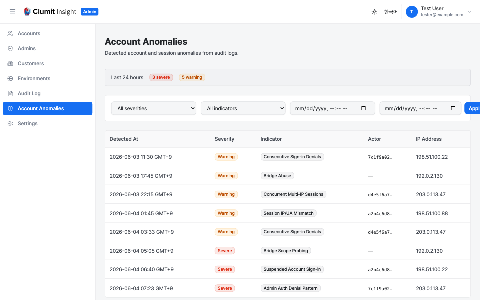
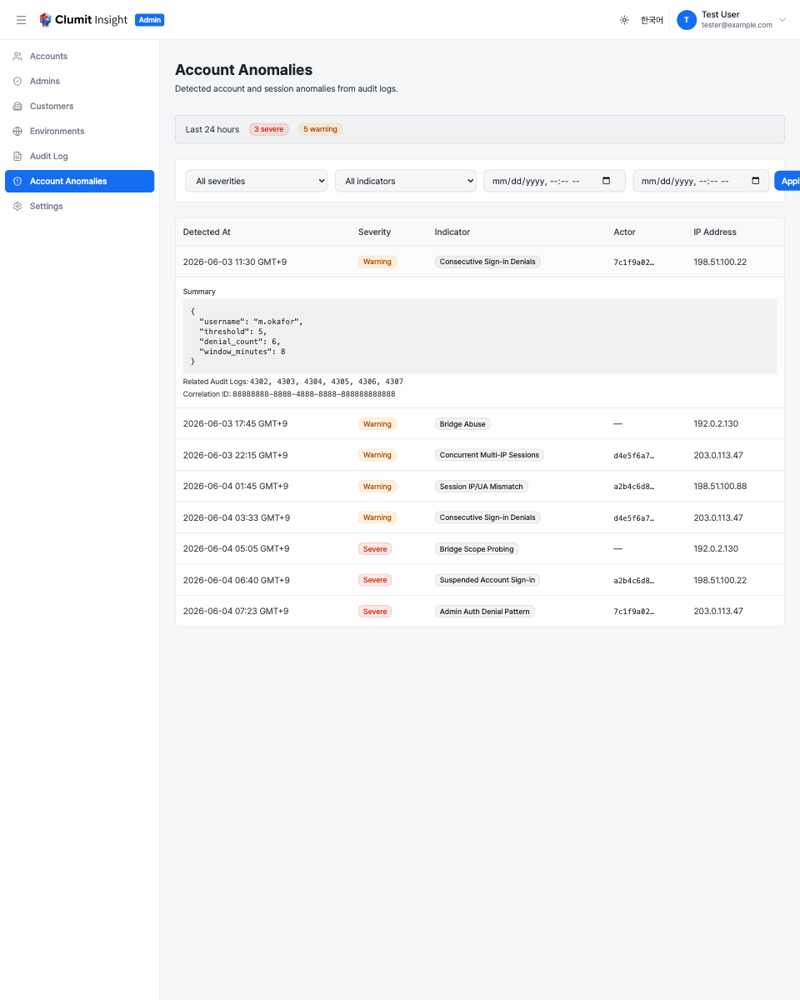

# Account Anomalies

The Account Anomalies page lets System Admins review suspicious account
and session activity that the platform detects from its audit log.
Navigate to **Account Anomalies** in the admin sidebar to open it.

Only System Admins with the `audit-logs:read` permission can view this
page. The page reads from the immutable audit store; it never modifies
account state — it is a monitoring surface, not an enforcement one.

## The alerts table

The table lists detected anomalies, most recent first. Each row shows:

- **Detected At** — when the anomaly was recorded, in your timezone.
- **Severity** — **Severe** (red) for high-confidence or high-impact
    indicators, or **Warning** (amber) for patterns that merit review.
- **Indicator** — which detection rule fired (see below).
- **Actor** — the account the activity is attributed to, shown as a
    shortened id, or `—` when the activity is not tied to a known
    account (for example an anonymous bridge probe).
- **IP Address** — the source IP the activity came from, when known.

The summary strip above the filters shows how many **Severe** and
**Warning** alerts were recorded in the **last 24 hours**, so a spike is
visible at a glance.

## Detection indicators

The platform raises an alert when any of these patterns is detected:

- **Consecutive sign-in denials** (Warning) — repeated failed sign-in
    attempts for one account within a short window.
- **Admin auth denial pattern** (Severe) — repeated authorization
    denials in the admin context, suggesting probing of admin-only
    actions.
- **Session IP mismatch** (Warning) — a session whose later requests
    arrive from a different IP than the one it was established from.
- **Concurrent multi-IP sessions** (Warning) — one account active from
    several distinct IPs at the same time.
- **Bridge abuse** (Warning) — a bridge source issuing requests at a
    rate well above the configured limit.
- **Bridge scope probing** (Severe) — a bridge request referencing
    customers outside the scope it was granted.
- **Suspended account sign-in** (Severe) — sign-in attempts against an
    account that is currently suspended.

## Filtering

Three controls narrow the table:

- **Severity** — All, Severe, or Warning.
- **Indicator** — any single indicator from the list above.
- **From / To** — a date-and-time range.

Set the controls and click **Apply**; **Reset** clears them. Results are
paginated — **Load more** fetches the next page when the list is long.

## Alert details and audit-log linkage

Click any row to expand it. The detail panel shows:

- **Summary** — the structured evidence for the alert (for example the
    denial count and window, the distinct IPs observed, or the bridge
    request rate), as JSON.
- **Audit log IDs** — the specific audit-log entries the detection
    correlated to raise this alert, so you can trace it back to the raw
    events.
- **Correlation ID** — a stable id grouping the audit entries and the
    alert, useful when cross-referencing other tooling.

## Relationship to the audit log

Account Anomalies is a derived, read-only view over the audit log: every
alert points back to the audit entries that produced it. To read those
raw entries directly — or to review any other recorded action — open the
[Audit Logs](audit-logs.md) page.
