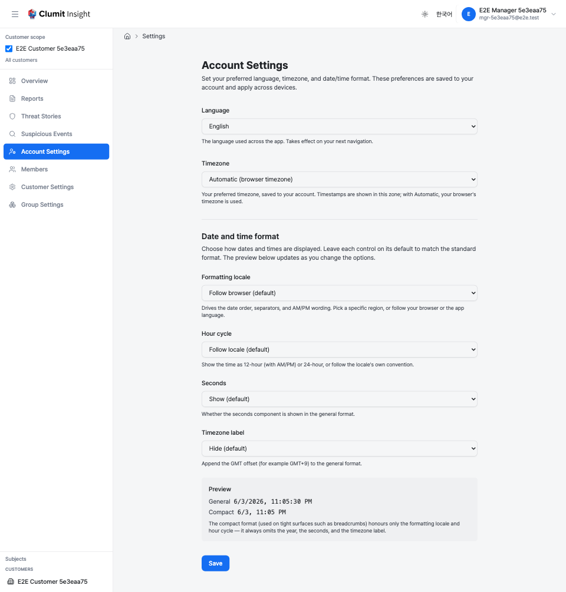

# Account Preferences

The **Account Settings** page lets you set your personal language,
timezone, and date/time format preferences. Open it from **Account
Settings** in the sidebar.

These preferences are saved to your account, so they follow you across
devices and browsers. The header
[language switcher](navigation.md#user-section) also saves your language
to your account while you are signed in (it only affects the current
browser when signed out); this page adds **Timezone** and **Date and
time format** controls, which the switcher does not provide.

## Language

The **Language** control sets the language used across the app
(English or Korean). Saving the preference writes it to your account
and updates the current page; it then applies to every future
navigation and on any device where you sign in.

### How the app decides which language to show

The active language is resolved in this order:

1. **An explicit language in the URL.** A page address that already
   carries a language prefix (for example `/en/...` or `/ko/...`)
   always wins for that page — the saved preference does not override an
   explicit link.
2. **Your saved account preference.** When the address has no language
   prefix, your saved **Language** is used.
3. **Your browser's language.** With no saved preference, the app picks
   the best match among the supported languages (English, Korean) from
   your browser settings.
4. **The system default.** If nothing matches, the deployment default
   language is used.

When you sign in, your saved language is applied to this browser. If you
had switched language in this browser before ever saving a preference,
that earlier choice is adopted as your saved preference at sign-in, so it
no longer silently overrides your browser language afterwards.

## Timezone

The **Timezone** control records your preferred timezone on your
account. Choose **Automatic** to store no specific zone, or pick a
specific IANA timezone (for example `Asia/Seoul`). Only valid IANA
timezones are accepted.

This preference controls the *zone* each user-facing timestamp is shown
in. By default the timestamp follows your browser's locale and date/time
conventions (for example `6/3/2026, 2:05:30 PM` in English) with no
timezone label; the [Date and time format](#date-and-time-format)
controls below let you change that. The underlying instant is always
stored in UTC; only the display is localized.

### How the app decides which timezone to show

The display timezone is resolved in this order:

1. **Your saved account timezone.** When you have picked a specific zone,
   timestamps are shown in it.
2. **Your browser's timezone.** With **Automatic** selected (no saved
   zone), the app uses the timezone reported by your browser.
3. **UTC.** If neither is available, timestamps fall back to UTC.

This mirrors the language resolution order (saved → browser → default).

The setting never changes report **bucketing boundaries**
(DAILY/WEEKLY/MONTHLY periods), which are defined per customer and are
independent of your personal preference — only the display of individual
timestamps follows your timezone.

## Date and time format

The **Date and time format** controls let you tailor how dates and times
are displayed. Leave every control on its **default** to keep the standard
format unchanged. A **live preview** below the controls shows a sample
instant rendered with your current selections (both the general and the
compact forms), updating as you change the options.

The format is built from four orthogonal options:

- **Formatting locale** — drives the date order, separators, and AM/PM
  wording. Choose **Follow browser** (default) to use your browser's
  region, **Follow app language** to track the app language you picked
  above, or a specific region from the list (for example `en-US`
  `6/3/2026, 2:05:30 PM`, `en-GB` `03/06/2026, 14:05:30`, `ko-KR`
  `2026. 6. 3. 오후 2:05:30`). Month names never appear — months are always
  numeric.
- **Hour cycle** — show the time as **12-hour** (with AM/PM) or
  **24-hour**, or **Follow locale** (default) to use the chosen locale's
  own convention.
- **Seconds** — **Show** (default) or **Hide** the seconds component.
- **Timezone label** — **Hide** (default) or **Show** the GMT offset (for
  example `GMT+9`) after the time.

The preferences are resolved like the timezone (saved choice, otherwise
the default) and applied wherever timestamps appear. The display is
client-side, so until the page finishes loading each timestamp reserves
its slot with a blank placeholder and then fills in — there is no layout
shift and no flash of a wrong value.

### Compact timestamps

Some tight surfaces (such as breadcrumbs and event rows) use a **compact**
timestamp. The compact form is purpose-built: it honours only your
**formatting locale** and **hour cycle**, and **always omits** the year,
the seconds, and the timezone label — regardless of your general-format
choices — so a long label can never break the compact layout.

## Saving

Click **Save** to store your changes. Saved date-and-time options take
effect across the current session right away — the timestamps already on
screen re-render with your new format, with no reload needed. Invalid
values (an unsupported language, an unknown timezone, a formatting locale
outside the offered list, or an unknown hour cycle) are rejected and not
saved.
