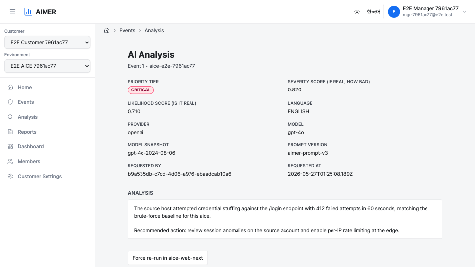
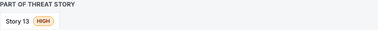

# Analysis Result Page

The analysis result page shows a single LLM analysis of one [suspicious
event](analysis/suspicious-events.md).
It is reached from aice-web-next by opening an event detail and following
the deep link to Clumit Insight, or directly via its customer-scoped URL.

## Priority and scores

The header section shows three score-related fields:

- **Priority tier** — one of `CRITICAL`, `HIGH`, `MEDIUM`, or `LOW`. The
  tier is rendered as a colored badge and is derived deterministically
  from the two scores below via a 4×4 matrix lookup; it is not a value
  returned by the LLM.
- **Severity score** — `0.000`–`1.000`, three decimal places. Answers
  "if this event turned out to be a real attack, how bad would it be"
  (impact, blast radius, asset criticality).
- **Likelihood score** — `0.000`–`1.000`, three decimal places. Answers
  "how likely is this actually malicious rather than noise or a false
  positive" (evidence quality, IoC matches, plausible benign
  explanations).

The two axes are kept separate everywhere so that a high-impact but
uncertain event (`severity≈1.0, likelihood≈0.5`) is not flattened into
the same priority as a confirmed but low-impact event
(`severity≈0.5, likelihood≈1.0`). The matrix translates this pair into
one of the four tiers used for triage and aggregation.

### Tier matrix

|              | L < 0.4 | 0.4 ≤ L < 0.6 | 0.6 ≤ L < 0.8 | L ≥ 0.8  |
|--------------|---------|---------------|---------------|----------|
| S ≥ 0.8      | MEDIUM  | HIGH          | CRITICAL      | CRITICAL |
| 0.6 ≤ S < 0.8 | LOW    | MEDIUM        | HIGH          | HIGH     |
| 0.4 ≤ S < 0.6 | LOW    | LOW           | MEDIUM        | MEDIUM   |
| S < 0.4      | LOW    | LOW           | LOW           | LOW      |

## Score factors

Below each score, the page renders up to five short noun phrases (chips)
the LLM produced to articulate that score. Each axis (severity,
likelihood) has its own row of chips.

- Phrases are LLM-generated, capped at five per axis, with a maximum
  length of ~80 characters each.
- When the LLM did not return any usable phrase for an axis — for
  example, because the input event was too thin to support an
  articulation — the chip row shows a single placeholder reading
  `insufficient evidence`. This sentinel value means "the score is
  recorded but no articulation is available", not that the LLM ran
  with no input.

## MITRE ATT&CK techniques

Next to the priority badge, the page renders a row of MITRE ATT&CK
technique chips (e.g. `T1078`, `T1110.001`) that the LLM associated with
the event. Each chip shows the technique ID; hovering reveals the
official technique name as a tooltip (e.g. `T1078` → "Valid Accounts").
A chip whose ID is not in the currently vendored MITRE knowledge base
renders without a tooltip — the underlying analysis row was written
against an older MITRE bundle and the technique ID alone is shown as a
fallback. The chip row is omitted when the LLM returned no techniques.

## Metadata fields

Below the score fields the page shows the analysis metadata in a
two-column grid:

- **Language** — `KOREAN` or `ENGLISH`. Matches the language the analysis
  text was generated in.

The remaining fields are **model/prompt provenance** — how the artifact
was produced — and are restricted to analysts (see [Analyst-only
fields](#analyst-only-fields) below):

- **Provider** — the LLM provider name (e.g. `openai`).
- **Model** — the model id requested (e.g. `gpt-4o`).
- **Model snapshot** — the provider-reported specific model version.
- **Prompt version** — the aimer prompt template version.
- **Requested by** — the account id that triggered the analysis, as
  stored on the analysis row.
- **Requested at** — when the analysis was requested, shown in your
  timezone with an explicit timezone label. See
  [Account Preferences → Timezone](account-preferences.md#timezone) for
  the resolution order (saved → browser → UTC).

### Analyst-only fields

The model/prompt provenance fields and the in-app **Regenerate** button
are shown only to analysts for the customer. A non-analyst viewer keeps
everything that carries analytical meaning — priority tier, MITRE ATT&CK
techniques, language, severity/likelihood scores, and the score factors —
but the provider, model, model snapshot, prompt version, requested-by, and
requested-at fields are hidden, and the in-app regenerate control is
absent.

The Regenerate button has one extra condition: it is shown only when you
are an analyst **and** not in a [bridge
session](cross-customer-overview.md). The in-app regenerate
endpoint authorizes a *write*, which a bridge session can never pass — so
a bridge-session analyst can still read the analysis (provenance fields
included) but does not see the Regenerate button.

<!-- Screenshot placeholder: the trimmed non-analyst event metadata grid
     (no model/prompt provenance fields, no Regenerate button). Capture
     from a non-analyst session once a real-data stack is available. -->

## Pinned evidence version

Opened directly, the page shows the latest analysis for the event. When
reached from a report's [Sources panel](analysis/reports.md#sources), the
link carries a pinned `generation` (plus the language, provider, and
model), and the page loads **exactly that version** — the evidence the
report was built from — rather than the latest re-analysis.

If the pinned version is no longer available — superseded by a newer
generation or removed by retention — the page shows a **"This evidence
version is no longer available"** notice instead of silently falling back
to the latest analysis, so a Sources link can never misrepresent a newer
version as the one the report cited.

## Analysis body

The body shows the LLM analysis text with PII tokens already restored
to their original values. The analysis is Markdown, and the page renders
it as formatted output — headings, bullet and numbered lists, and inline
code spans appear as styled elements rather than raw `#`, `-`, or
backtick characters. Raw HTML embedded in the text is never rendered as
live markup; it is treated as inert text, since the body is
LLM-generated.

Any `<<UNVERIFIED_IP_...>>` / `<<UNVERIFIED_EMAIL_...>>` /
`<<UNVERIFIED_MAC_...>>` markers — entities the LLM emitted that were
not present in the original event — are rendered as red pill badges so
they stand out from the rest of the analysis, even when they appear
inside a list item or heading.

## Part of threat stories

When this suspicious event is a member of one or more threat stories, the
page shows a **Part of threat story / stories** section near the top with
a link to each parent story (with its priority-tier badge). This is the
upward half of the trust drill-down: a reader who arrived at the event
can navigate back up to the correlation it belongs to. The membership is
resolved by a reverse lookup over each story's member list, so it stays
in sync as stories are re-analysed. Because a story's membership can
change from one re-analysis generation to the next, each backlink opens
the **exact story generation whose member list contains this event** — it
does not blindly jump to the latest generation, which might have
regrouped the event out. The section is omitted when the event is not a
member of any story.

## Cited by

If one or more periodic reports cite this event, the page shows a **Cited
by** trail listing those reports, newest first. Each entry links back up
to the **exact report generation** that consumed this event — the link is
generation-pinned, so it lands on the version the report was built from,
not the latest. The trail is also scoped to the **evidence generation you
are viewing**: it lists the reports that cited *this* generation of the
event, so arriving at an older pinned generation (via a report's Sources
link) shows the reports that cited that generation, not ones that cited a
different one. A single event may be cited by reports across several
periods; the trail lists one entry per report bucket. An event cited by
no report shows no trail (this is a normal state, not an error).

The trail is permission-gated: it only appears for viewers who can read
the customer's reports (`reports:read`). A viewer without that permission
sees no trail rather than links they could not open.

## Raw source event

The raw source event is the bottom of the trust chain. aimer-web does not
store raw event payloads — only the (tokenized) analysis — so this final
hop is an **external link to the aice-web-next source event**. When the
source event is still present, the page shows a **View source event in
aice-web-next** link alongside the force-re-run action.

When the source has been swept by retention (see the retention banner
below), the chain ends gracefully at the preserved analysis: the
raw-event link is **not** rendered, so a reader never follows a dead
link. The retention banner makes the end-of-chain state explicit.

## Retention banner

If the source `detection_events` row has been removed by retention but
the analysis row survives, the page shows a yellow banner reading
"Source event removed by retention; analysis result preserved." Both the
"View source event" hop and the "Force re-run" button are hidden in this
state: the raw event no longer exists to link to, and force re-run
requires the original event payload, which only aice-web-next holds.

## Regenerate this event (in-app)

When the source event is still present, an analyst sees a **Regenerate**
button alongside the raw-event hop (gated as described in [Analyst-only
fields](#analyst-only-fields)). Clicking it opens a confirmation modal
with a cost warning, then re-runs the AI analysis **inside Clumit Insight**
on the event that was already ingested.

This path holds redaction **constant**: it re-analyzes the same redacted
event already stored for this event (recovering its original event time),
so aimer never sees raw payload and aice-web-next is not contacted. It
regenerates the **variant you are currently viewing** — the language and
model in the page's URL — rather than a fixed default. When the new result
lands it supersedes the latest generation (the previous result row is
preserved with a `superseded_at` stamp), and the page navigates to the new
generation.

Event analysis is synchronous, so unlike the story/report Regenerate
(which queues a job), this returns as soon as the new generation is
written.

<!-- Screenshot placeholder: the in-app event Regenerate confirmation
     modal. Capture from an analyst session once a real-data stack is
     available. -->

## Force re-run

When the source event is still present, the page shows a "Force re-run
in aice-web-next" link. Clicking it opens aice-web-next at the original
event detail with a query parameter that tells aice-web-next to send
`force=true` on the next analyze click, bypassing the cached result.
Unlike the **View source event** hop above — a plain read-only link to
the source event — this link carries the re-run signal.

**Force re-run vs in-app Regenerate.** The two re-run paths are
complementary, not redundant. In-app **Regenerate** re-analyzes the
already-ingested redacted event entirely within aimer-web, with redaction
held constant. **Force re-run** hands the event back to aice-web-next,
which re-submits it from its original source with `force=true` to bypass
the cached analysis result — work that needs the raw payload, which only
aice-web-next holds.

Note the redaction boundary: `force=true` bypasses the *analysis-result*
cache, not aimer-web's *redaction* cache. While an event's
`detection_events` row is present, `ingestAndRedact()` (in
`run-analyze-flow.ts`) reuses the stored redacted form rather than
re-redacting. So Force re-run refreshes the redaction under the current
policy only when aice-web-next replaces that stored event as part of
re-ingesting from source — a cross-repo contract owned by aice-web-next
(aicers/aice-web-next#629), not a guarantee aimer-web makes on its own.
Use Force re-run when you need a fresh pull from the source system; use
Regenerate to re-run the model on the same redacted input.
