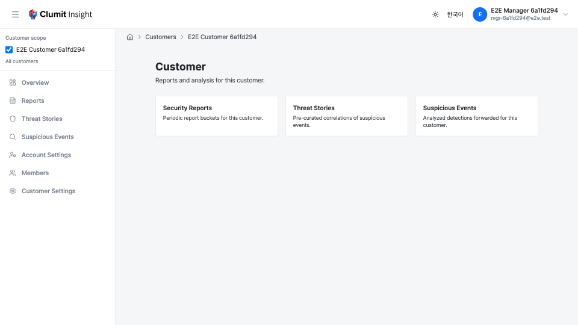

# Customer Hub

The customer hub is the entry point for a single customer's analysis
surfaces. It links to that customer's periodic reports, threat stories,
and suspicious events, so every individual analysis has a navigable home
rather than being reachable only by knowing its ID.

## Reaching the hub

Open the hub directly from the **Customers** section of the sidebar,
which lists every customer you can access and links each one straight to
its hub (`/subjects/<id>`). See
[Navigation](../navigation.md#customers-summary-subjects). You no longer
have to drill into a detail page and backtrack through the breadcrumb to
get here.

## Sections

The hub renders up to three section cards, each linking into a list:

- **Security Reports** — the periodic report index (see [Periodic
  Security Reports](reports.md)).
- **Threat Stories** — the customer-scoped [threat stories
  list](threat-stories.md).
- **Suspicious Events** — the customer-scoped [suspicious events
  list](suspicious-events.md), where each event is titled by its time and
  kind (`{event time} · {kind}`) rather than the raw `event_key`.

## Access control

The hub is **member-gated, section-by-section**:

- The **Security Reports** section renders only when the caller has
  `reports:read`.
- The **Threat Stories** and **Suspicious Events** sections render only
  when the caller has `analyses:read`.

A caller with only some of these permissions sees only the permitted
sections; the rest are hidden (not shown as disabled). A member with
none of them still reaches the hub — it shows an "no accessible
sections" notice rather than an error.

The hub itself returns `404` only when the caller is **not a member of
the customer at all** (existence-hiding, uniform with the report and
analysis pages). A rejected bridge session returns a real `403`: these
single-customer surfaces are not readable under a bridge.
