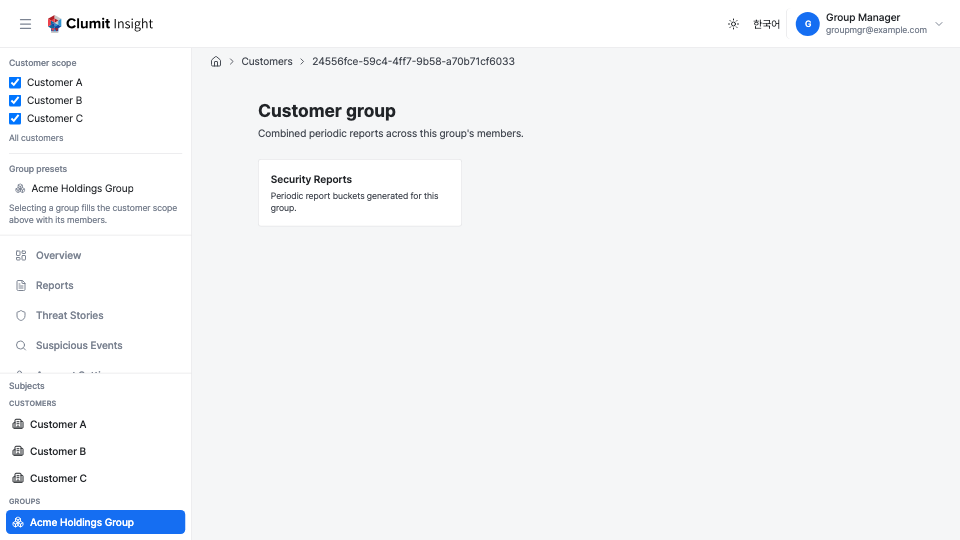
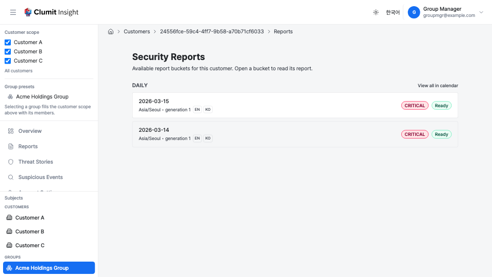
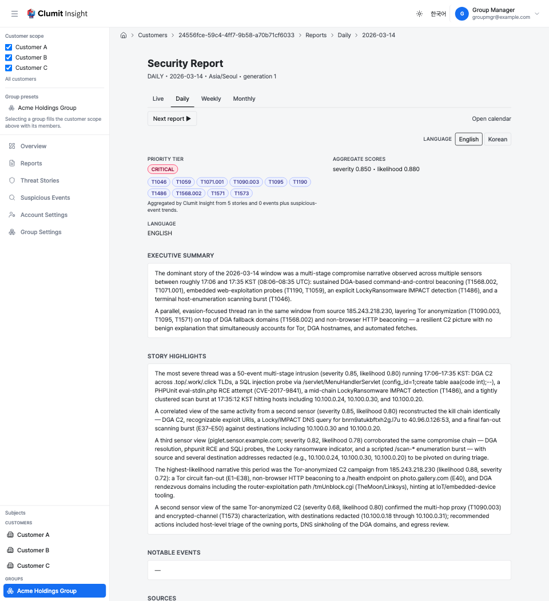

# Group Hub

The group hub is the entry point for a **customer group's** analysis
surface. A customer group bundles several member customers so their
periodic security reports can be generated and read together. In this
version the group hub surfaces **reports only**.

## Reaching the hub

Open the hub directly from the **Subjects → Groups** sub-section of the
sidebar, which lists every group you can access and links each one to its
hub (`/subjects/<id>`). See
[Navigation](../navigation.md#subjects-customers-and-groups).

A group also appears as a **scope preset** in the customer-scope
selector, but that is a different action: a preset fills the cross-customer
scope filter with the group's members, while the hub link opens the
group's own report surface. See [Group presets](../navigation.md#group-presets).

## Sections

The group hub renders a single section card:

- **Security Reports** — the group's periodic report index (see [Periodic
  Security Reports](reports.md)). The index, calendar, and detail pages all
  read the group's combined reports.

There are intentionally **no** Threat Stories or Suspicious Events cards: a
group owns periodic reports only. Group-level threat-story and
suspicious-event summary surfaces are **deferred** — they are not generated
in this version (v1), so the hub exposes only the combined report index.

## Reading a group report

A group report is generated across the group's members and reads the same as
a single-customer report. Open the group's **Security Reports** index to see
its report buckets, then open a bucket to read the report.

Two behaviors are group-specific:

- **Cited sources point at the owning member.** Each cited story or event
  in a report links to the **member customer's** detail page where that
  evidence lives — not to the group — so you can drill from a group report
  straight into the responsible member's analysis.
- **Generation actions are not offered.** The analyst-only **Regenerate**
  control and the on-demand language-job progress shown on single-customer
  reports are not rendered for a group report in this version; the report
  index, calendar, within-period navigation, and language switching over
  already-generated languages all work as usual.

The report **calendar** uses the group's own retention boundary —
`min(group retention, the shortest member retention)` — so the navigable
range never extends past what any member still retains.

## Access control

The group hub and its report surfaces are gated by the **all-member
`reports:read`** rule: you must hold `reports:read` on **every** member of
the group.

- A viewer missing `reports:read` on at least one member receives `403`.
- A viewer who is **not a member of every member customer** receives
  `404` (existence-hiding — a non-member cannot even learn the group
  exists).
- A bridge session is denied: group surfaces are not readable under a
  bridge (`403`), exactly like the single-customer report surfaces.
