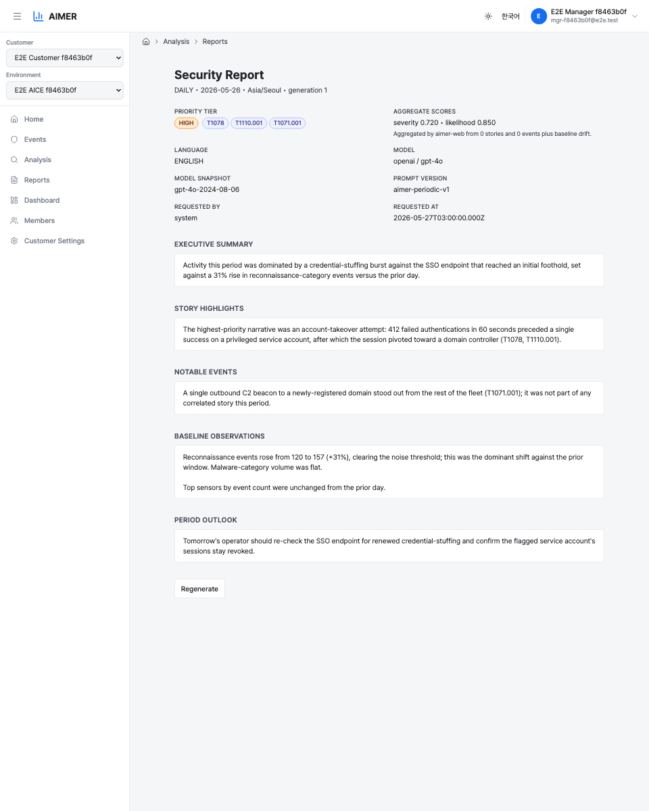

# Periodic Security Reports

A periodic security report is a single LLM-written synthesis across a
time window for one customer — it weaves together the stories and single
events already analysed in that window plus the statistical drift in the
baseline event stream. Unlike a story analysis (one LLM call about one
story), a report aggregates many leaf analyses into one narrative and
does **not** ask the LLM for scores: aimer-web computes the aggregate
scores itself from the included leaves and the baseline drift.

The page is reached from an aice-web-next dashboard card deep link, or
directly via the customer-scoped URL:

```
/customers/{customerId}/analysis/reports/{period}/{bucketDate}
```

`{period}` is **uppercase** — `LIVE`, `DAILY`, `WEEKLY`, or `MONTHLY`.
The customer
id appears in the path because a `(period, bucket_date)` pair is not
globally unique — bucket date `2026-05-26` exists for every customer.
A lowercase period in the URL returns `404` rather than redirecting, so
the UI route and the API path validation share one case convention. A
`{bucketDate}` that is shaped like a date but names an impossible
calendar day (for example `2026-02-31`) also returns `404`, matching the
API endpoints — it is rejected before any database lookup.

Access is existence-hiding and matches the summary and regenerate
endpoints: a caller who is not a member of the customer — or a request
for a report that does not exist — returns `404`, while a member without
the `reports:read` permission, or a rejected bridge session, returns a
real `403` (a permission notice, not a normal page).



## Report index

The customer-scoped reports root lists the report buckets that exist for
the customer and links into the detail page above:

```
/customers/{customerId}/analysis/reports
```

Before this index existed the bare path returned `404` — a report could
only be opened by navigating directly to a specific
`{period}/{bucketDate}` URL. The index groups the available buckets by
period (Live, Daily, Weekly, Monthly), showing the most recent bucket of
each period first, followed by a bounded recent list.


Bucket discovery reads the non-archived `periodic_report_state` rows
(`pending`, `ready`, or `dirty`) — the same source of truth the detail
page uses — so a bucket that is tracked but whose report has not been
produced yet still appears, marked **Being generated**. A bucket whose
latest default-variant result exists shows **Ready** with its priority
tier; a bucket awaiting a refresh after new source data shows
**Updating**.

Each entry links to the detail page with the bucket's timezone pinned on
the link (`?tz=`), so an older-timezone bucket (kept after a customer
timezone change) still resolves to the right report instead of being
re-resolved to the customer's current timezone and returning `404`.

The recent list is bounded per period (Live 1, Daily 14, Weekly 8,
Monthly 12 by default, each tunable via the matching
`ANALYSIS_REPORT_INDEX_CAP_*` environment variable) so the page never
renders an unbounded list. Access control matches the detail page: a
non-member or non-existent customer returns `404`, while a member
without `reports:read` or a rejected bridge session returns a real
`403`.

## Report periods

Four report periods are produced, each over a different window in the
customer's timezone:

- **LIVE** — a rolling snapshot covering the trailing 24 hours. LIVE
  rows use a synthetic bucket date (`1970-01-01`); the report is
  regenerated on a fixed cadence (`ANALYSIS_LIVE_REFRESH_MINUTES`,
  default 60 minutes) as long as the period's source data is not
  archived. Each refresh bumps the report generation, up to the
  automatic generation cap (`ANALYSIS_MAX_GENERATION`, default 50);
  once a LIVE report reaches the cap the cadence stops bumping it, and
  only a force regenerate (below) can produce a newer generation.
- **DAILY** — one report per calendar day. A DAILY bucket becomes
  eligible once the day has closed and the settle window has elapsed
  (shortened when a strict cursor watermark confirms ingest is
  complete). It is regenerated when new in-window source data arrives
  ("dirty" re-queue).
- **WEEKLY** — one report per 7-day window, anchored to the start of
  the week (Monday). The bucket becomes eligible roughly 6 hours after
  the week closes, giving late stories and events time to settle.
- **MONTHLY** — one report per calendar month, anchored to the first of
  the month. The bucket becomes eligible roughly 12 hours after the
  month closes.

`WEEKLY` and `MONTHLY` reports are built from the **same inputs** as a
daily report, selected over the longer window — they are not a
concatenation of the dailies underneath them. The week-over-week and
month-over-month comparative framing (whether the period is escalating,
easing, or steady, and how a monthly reads against the prior month) is
the LLM's job from the single window's evidence; aimer-web does not feed
prior-period data into the prompt. A weekly that simply re-lists each
day, or a monthly that never frames against the previous month, is the
signal that the prompt or the input builder needs attention.

No operator action is needed for any period: a background worker seeds,
schedules, and runs the LLM calls. The **Regenerate** button (below) is
for forcing an out-of-cadence refresh.

## Period tabs

The detail page shows a **Live / Daily / Weekly / Monthly** tab bar
above the report body. The tab for the period you are viewing is
highlighted; the others link to the report for the same stretch of time
at their own cadence — switching from a daily to **Weekly** opens the
week that contains the day you were reading, and **Monthly** opens that
day's month. The **Live** tab always opens the rolling snapshot. A tab
whose bucket is tracked but not yet generated opens the page in its
"being generated" state; a bucket with no source activity in that window
(no tracked state) returns `404`. The tab bar itself always renders, so
you can move between cadences freely. Any pinned variant
(`?tz=&lang=&model_name=&model=`) carries across the tabs.

## How a report is built

The worker pipeline runs without operator action:

1. The state worker tracks per-`(customer, period, bucket_date, tz)`
   readiness and seeds a real `periodic_report_job` row for the default
   `(tz, language, provider, model)` variant against every `ready` or
   `dirty` state row across all four periods. When a state turns `dirty`
   (new in-window
   source data), the re-queue bumps **every** existing variant job under
   it — not only the default — so a force-created Korean or alternate-model
   report is refreshed too rather than left serving a stale generation.
   LIVE variants are also re-queued when their per-variant `next_due_at`
   cadence elapses (skipping archived, timezone-superseded rows). Every
   automatic bump (dirty or cadence) honors `ANALYSIS_MAX_GENERATION`.
2. The dispatcher picks `queued` jobs with `FOR UPDATE SKIP LOCKED`,
   advisory-locked per `(customer_id, period, bucket_date, tz)`, with the
   same exponential-backoff predicate as story analysis.
3. The input builder deterministically selects the **top stories**
   (eligible only when the story's state is `ready` and a non-superseded
   result exists for the variant, and the canonical story window
   overlaps the bucket) and **top events** (variant-matched event
   analyses whose deduped baseline event time falls in the bucket,
   excluding events already covered by the chosen stories). It also
   computes the **baseline aggregates**: deduplicated event counts, a
   category distribution, and the per-category delta versus the previous
   period.
4. Every included leaf narrative is re-namespaced into a single
   report-scope token namespace (`<<REDACTED_*_R{j}_*>>`) so the same
   placeholder in two different leaves cannot collide, and the bundle is
   sent to aimer's `generatePeriodicSecurityReport` mutation under mTLS.
   The worker actor is `system:analysis-worker` with a stable
   `system:periodic-report` sentinel AICE id, because a report spans
   multiple AICE environments and has no single canonical one.
5. The returned narrative is scanned for residual tokens or plaintext
   PII (a hallucinated decode fails the job and is never stored), then
   written to `periodic_report_result`, followed by the auth-DB job
   finalize.

Retryable failures (5xx, transport, mTLS error) re-queue with backoff up
to `ANALYSIS_MAX_ATTEMPTS`. Fatal failures (4xx, hallucination detected,
missing or mismatched redaction policy versions across the included
leaves) mark the job `failed` immediately.

## Priority tier and aggregate scores

The header shows the report's priority and its two aggregate scores:

- **Priority tier** — `CRITICAL`, `HIGH`, `MEDIUM`, or `LOW`, rendered
  as a colored badge. The tier is the **maximum** over every included
  leaf's own priority tier and the tier that the baseline drift maps to
  through the same 4×4 matrix story analysis uses. Deriving it from the
  leaves directly (rather than from the aggregate scores) preserves
  "leaf monotonicity": a report is never tagged below the worst leaf it
  cites, even when that leaf's tier was raised by an IOC or member-count
  floor that the raw score does not reflect.
- **Aggregate severity / likelihood scores** — `0.000`–`1.000`. Each is
  the maximum, per axis independently, over the included leaves' scores
  and the baseline drift signal. They are **informational** display
  values (`score_kind: "aggregate"`), not the input to the tier.

### Baseline drift

The baseline-drift signal compares the window's event-category
distribution against the previous period of the same length (the prior
24 hours for LIVE, the prior calendar day for DAILY, the prior 7 days
for WEEKLY, the prior calendar month for MONTHLY):

- **drift severity** — the largest per-category count change versus the
  prior period, normalized and clamped to `[0, 1]`.
- **drift likelihood** — `1.0` when any per-category fractional change
  exceeds `ANALYSIS_BASELINE_DRIFT_NOISE_THRESHOLD` (default `0.3`),
  else `0.0`. Statistical drift past the noise floor is treated as a
  high-confidence signal.

When the previous period had no events (first bucket), both drift
signals are `0.0`. This drift signal feeds the priority tier and the
aggregate scores above; the LLM narrates any drift it can see in the
window's counts and ranks in the report's **Baseline observations**
section.

## MITRE ATT&CK techniques

Next to the priority badge, the page renders the report's
`aggregate_ttp_tags` — the deduplicated, sorted union of every included
leaf's MITRE ATT&CK technique IDs. Each chip shows the technique ID;
hovering reveals the official technique name (e.g. `T1078` → "Valid
Accounts") from the vendored ATT&CK bundle. The LLM is given this set
and is instructed to reference techniques by ID in the narrative, but
the stored union is computed deterministically from the leaves — the
LLM cannot add or drop a technique from the column.

## Report sections

The body renders the five narrative sections the LLM returns, each with
report-scope tokens restored to plaintext:

- **Executive summary** — the period-framed headline. This is the
  section the day-over-day near-duplicate check watches: two consecutive
  days that read as paraphrases of each other signal a dull prompt or an
  input-builder bug.
- **Story highlights** — the top-K analysed stories, one highlight each,
  with the strongest leaf factors quoted where precise.
- **Notable events** — single events not already covered by the story
  highlights, one highlight each.
- **Baseline observations** — short factual readings of the window's
  baseline aggregates (counts and ranks) and any drift visible against
  the top techniques and sensors.
- **Period outlook** — a short forward-looking note in the period's
  tone: for LIVE, what to watch in the next window; for DAILY, what
  tomorrow's operator should re-check; for WEEKLY / MONTHLY, the trend
  to carry into the next week or month.

Story highlights, notable events, and baseline observations are each a
list of entries; the page joins them into one block per section. Tokens
that cannot be restored (decrypt failure, a superseded leaf,
out-of-range index) are passed through unchanged so the page still
renders; hallucinated decodes are blocked at write time and never reach
this view.

## Metadata fields

Below the header the page shows the report metadata: language, provider
/ model, the provider-reported model snapshot, the prompt version, the
account that triggered the latest generation (or `system` for a regular
worker tick), and the request timestamp. The header line also names the
period, the bucket (or "now" for LIVE), the customer timezone, and the
generation.

## Force regenerate

Operators with `reports:create` can force an out-of-cadence rerun via
the **Regenerate** button at the bottom of the page.


The confirmation modal states that a fresh LLM call is issued across the
period's analysed stories, events, and baseline statistics, and that the
latest generation is superseded once the new result lands. The previous
result row is preserved with a `superseded_at` stamp; nothing is
overwritten in place.

Submitting the modal calls
`POST /api/customers/{customerId}/analysis/report/{period}/{bucketDate}/regenerate`
(optionally with `?tz=&lang=&model_name=&model=` to target a non-default
variant — unlike story analysis, `tz` is accepted because reports are
timezone-keyed). Behaviour:

- The job row's `generation` is bumped by one (or `1` if no prior row
  for the variant exists), `status` resets to `queued`, `attempts`
  resets to `0`, and the LLM call begins on the next worker tick. Force
  is allowed even past the automatic generation cap.
- Bridge sessions and members without `reports:create` are rejected with
  `403`. A caller that is not a member of the customer at all gets
  `404 report_state_not_found` (existence-hiding, uniform with the page
  and the summary endpoint).
- A missing state row returns `404 report_state_not_found`; a state row
  that has been archived by a timezone change returns
  `409 source_unavailable`. All four periods (`LIVE` / `DAILY` /
  `WEEKLY` / `MONTHLY`) are accepted.

While the regenerate is queued, the page shows a yellow status banner
naming the new generation number. Refresh once the worker has written
the new result.

## Cross-system deep link

aice-web-next dashboard cards consume the matching summary endpoint to
decide whether to surface a deep-link badge for a period:

```
GET /api/customers/{customerId}/analysis/report/{period}/{bucketDate}/summary
```

The endpoint returns either `{exists: false}` — no report yet, **or** the
report's parent state row is missing or archived (for example after a
timezone change, which archives the old-timezone state), so the badge is
never deep-linked to a report whose page would `404` — or a content-free
payload with `priority_tier`, the two aggregate scores,
`score_kind: "aggregate"`, and a `link` to this page. The `link` carries
the period as **uppercase** so following it lands on the page route
without a case-insensitive redirect, and is customer-scoped so it
resolves to the right report regardless of which customer the opening
tab has selected. When the summary was requested for a non-default
variant (`?tz=&lang=&model_name=&model=`), the `link` forwards those
same query params so following it opens that variant rather than the
default. The badge itself (priority tier and aggregate scores
only, no section content) is rendered by aice-web-next; see the
aice-web-next manual for its screenshot.

Section content, TTP tags, and factors are full-report-viewer concerns
and stay out of the summary, so the badge cannot leak report detail. The
summary applies the same existence-hiding policy as the page and the
regenerate route: a non-member gets `404 report_state_not_found`,
members without `reports:read` get `403 Forbidden`, and rejected bridge
sessions get `403 bridge_not_allowed`.
