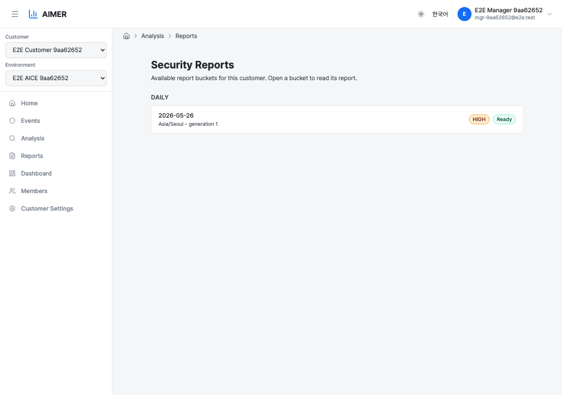
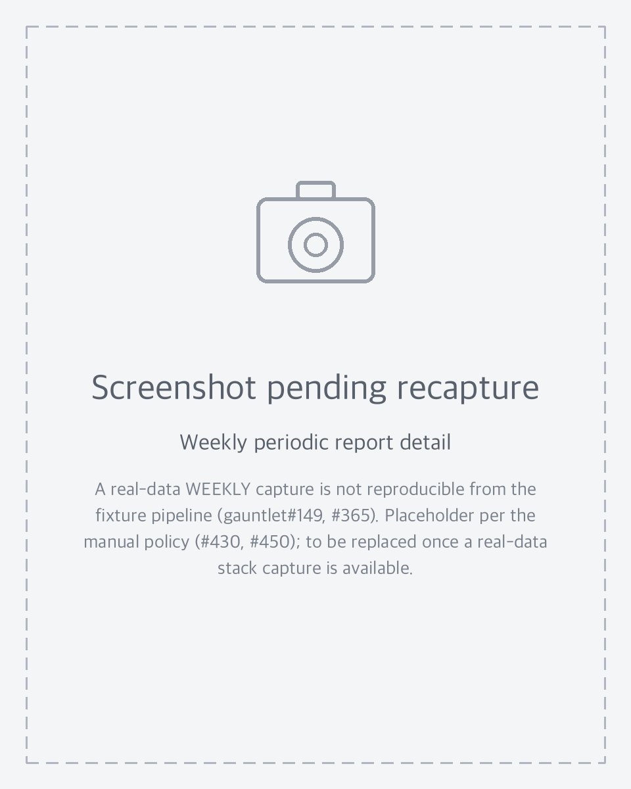
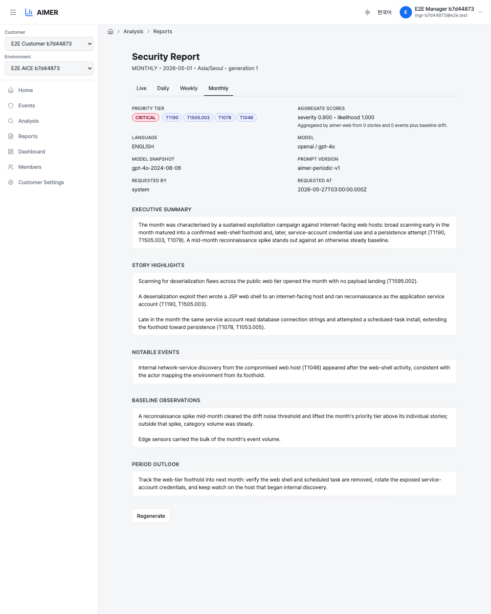
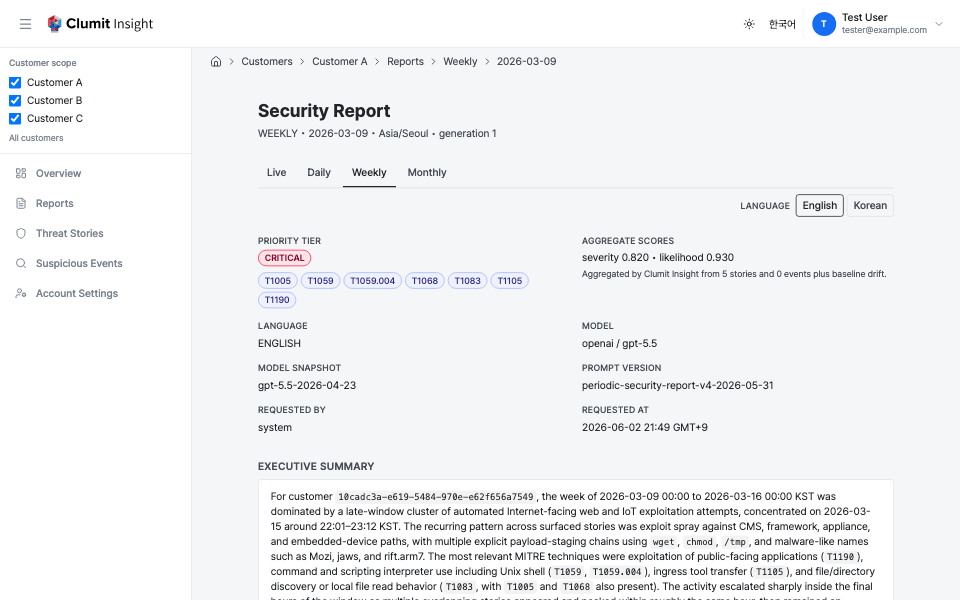
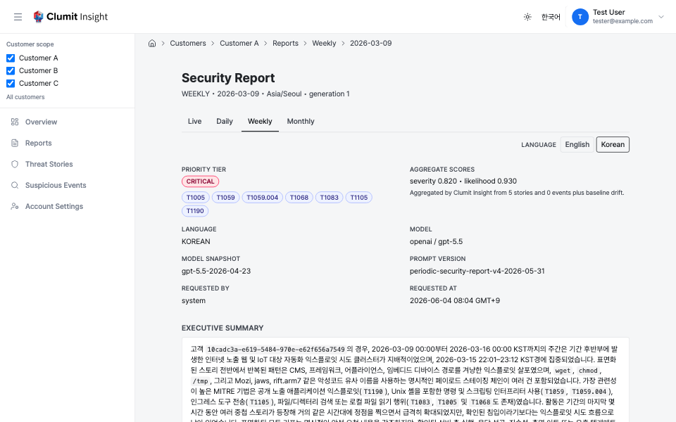
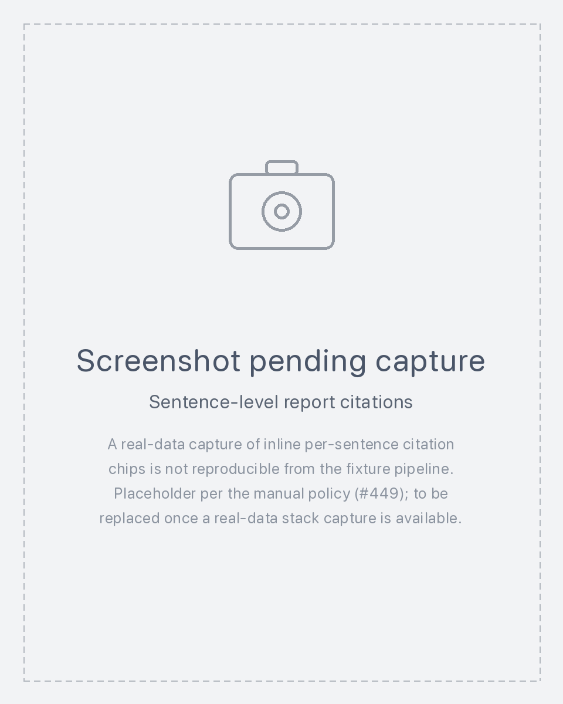
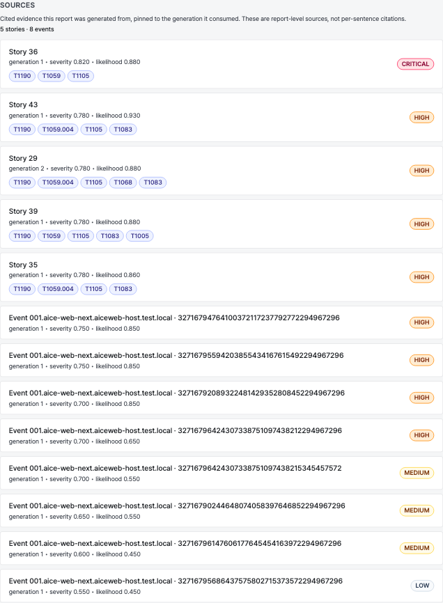
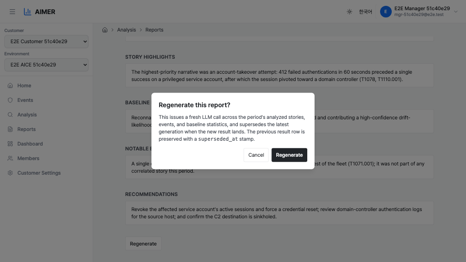

# Periodic Security Reports

A periodic security report is a single LLM-written synthesis across a
time window for one customer — it weaves together the threat stories and
[suspicious events](suspicious-events.md) already analysed in that window
plus the trends across the period's suspicious events. Unlike a story
analysis (one LLM call about one story), a report aggregates many
individual analyses into one
narrative and does **not** ask the LLM for scores: Clumit Insight derives
the report's priority itself from the included story and event analyses
and the suspicious-event trend.

The page is reached from an aice-web-next dashboard card deep link, or by
opening a specific report from the report index below.

Access is existence-hiding: a caller who is not a member of the customer —
or a request for a report that does not exist — sees a `404`, while a
member without the `reports:read` permission, or a rejected bridge
session, sees a permission notice rather than the report.

> **Weekly/monthly screenshots pending recapture (#430, #450).** The
> DAILY capture above is fixture-driven and current: it leads with the
> priority tier and its provenance hint and shows the aggregate severity
> and likelihood scores. The **weekly and monthly** variants below are
> currently placeholder graphics. Their real-data captures come from the
> gauntlet live pipeline (aicers/gauntlet#149, #365), which this fixture
> pipeline cannot reproduce; the pre-#450 captures still showed the old
> header (a separate aggregate-score row), so — per the manual policy that
> a stale or fabricated shot must not stand in for a real one — they have
> been replaced with placeholders until a fresh real-data stack capture
> (the shared constraint with #429) can be taken.

## Report index

The customer-scoped reports root lists the report buckets that exist for
the customer and links into the detail page above.

Before this index existed, a report could only be opened by navigating
directly to a specific report. The index groups the available buckets by
period (Live, Daily, Weekly, Monthly), showing the most recent bucket of
each period first, followed by a bounded recent list.

Bucket discovery reads the non-archived `periodic_report_state` rows
(`pending`, `ready`, or `dirty`) — the same source of truth the detail
page uses — so a bucket that is tracked but whose report has not been
produced yet still appears, marked **Being generated**. A bucket whose
latest default-variant result exists shows **Ready** with its priority
tier; a bucket awaiting a refresh after new source data shows
**Updating**.

Each entry links to the detail page with the bucket's timezone pinned on
the link (`?tz=`), so an older-timezone bucket (kept after a customer
timezone change) still resolves to the right report instead of being
re-resolved to the customer's current timezone and returning `404`.

The recent list is bounded per period (Live 1, Daily 14, Weekly 8,
Monthly 12 by default, each tunable via the matching
`ANALYSIS_REPORT_INDEX_CAP_*` environment variable) so the page never
renders an unbounded list. Access control matches the detail page: a
non-member or non-existent customer returns `404`, while a member
without `reports:read` or a rejected bridge session returns a real
`403`.

## Report periods

Four report periods are produced, each over a different window in the
customer's timezone:

- **LIVE** — a rolling snapshot covering the trailing 24 hours. LIVE
  rows use a synthetic bucket date (`1970-01-01`); the report is
  regenerated on a fixed cadence (`ANALYSIS_LIVE_REFRESH_MINUTES`,
  default 60 minutes) as long as the period's source data is not
  archived. Each refresh bumps the report generation, up to the
  automatic generation cap (`ANALYSIS_MAX_GENERATION`, default 50);
  once a LIVE report reaches the cap the cadence stops bumping it, and
  only a force regenerate (below) can produce a newer generation.
- **DAILY** — one report per calendar day. A DAILY bucket becomes
  eligible once the day has closed and the settle window has elapsed
  (shortened when a strict cursor watermark confirms ingest is
  complete). It is regenerated when new in-window source data arrives
  ("dirty" re-queue).
- **WEEKLY** — one report per 7-day window, anchored to the start of
  the week (Monday). The bucket becomes eligible roughly 6 hours after
  the week closes, giving late stories and events time to settle.
- **MONTHLY** — one report per calendar month, anchored to the first of
  the month. The bucket becomes eligible roughly 12 hours after the
  month closes.

`WEEKLY` and `MONTHLY` reports are built from the **same inputs** as a
daily report, selected over the longer window — they are not a
concatenation of the dailies underneath them. The week-over-week and
month-over-month comparative framing (whether the period is escalating,
easing, or steady, and how a monthly reads against the prior month) is
the LLM's job from the single window's evidence; Clumit Insight does not feed
prior-period data into the prompt. A weekly that simply re-lists each
day, or a monthly that never frames against the previous month, is the
signal that the prompt or the input builder needs attention.

No operator action is needed for any period: a background worker seeds,
schedules, and runs the LLM calls. The **Regenerate** button (below) is
for forcing an out-of-cadence refresh.

## Period tabs

The detail page shows a **Live / Daily / Weekly / Monthly** tab bar
above the report body. The tab for the period you are viewing is
highlighted; the others link to the report for the same stretch of time
at their own cadence — switching from a daily to **Weekly** opens the
week that contains the day you were reading, and **Monthly** opens that
day's month. The **Live** tab always opens the rolling snapshot. A tab
whose bucket is tracked but not yet generated opens the page in its
"being generated" state; a bucket with no source activity in that window
(no tracked state) returns `404`. The tab bar itself always renders, so
you can move between cadences freely. Any pinned variant
(`?tz=&lang=&model_name=&model=`) carries across the tabs.

## Report language

Each report exists per language variant (English / Korean). The detail
page defaults to **your own language** — the locale you are using the app
in — rather than a fixed deployment default. A **language switcher** next
to the period tabs lets you change the report language; the choice is
encoded in the URL as a locale code (`?lang=ko`) and, like the other
variant selectors, is preserved as you move across the period tabs.

When the language you ask for has not been generated yet, the report does
**not** error. It falls back along a fixed chain:

1. the requested language, when a result exists for it;
2. otherwise **English**, the guaranteed baseline, shown with a clear
   notice naming the language you asked for;
3. otherwise any available language for the bucket.

Asking for a not-yet-generated language also **requests it on demand**:
the page enqueues a generation job (the same job table the worker uses,
but without force-regenerate — repeated views simply coalesce onto the
in-flight job and never spend an extra generation) and shows its progress
below the notice. While the job is `queued`/`processing` the page polls
and refreshes itself automatically; when it finishes, the report reloads
in the requested language. A `failed` job surfaces a non-blocking error
instead of spinning forever, and a bucket that is still inside its settle
window (no job yet) shows the ordinary "being generated" pending state.

The language switcher only changes which language you read; it never
triggers a force regenerate, and it never changes the underlying source
selection. Restored values (IP addresses, emails, MAC addresses) are
language-neutral and stay correct across every language variant.

The report index resolves this fallback **per bucket**, so a Korean
viewer sees each bucket's Korean tier where it exists and the English
tier only where Korean has not been generated — never a silent mix. Each
bucket also shows which languages it already has available.

## How a report is built

The worker pipeline runs without operator action:

1. The state worker tracks per-`(customer, period, bucket_date, tz)`
   readiness and seeds a real `periodic_report_job` row for the default
   `(tz, language, provider, model)` variant against every `ready` or
   `dirty` state row across all four periods. When a state turns `dirty`
   (new in-window
   source data), the re-queue bumps **every** existing variant job under
   it — not only the default — so a force-created Korean or alternate-model
   report is refreshed too rather than left serving a stale generation.
   LIVE variants are also re-queued when their per-variant `next_due_at`
   cadence elapses (skipping archived, timezone-superseded rows). Every
   automatic bump (dirty or cadence) honors `ANALYSIS_MAX_GENERATION`.
2. The dispatcher picks `queued` jobs with `FOR UPDATE SKIP LOCKED`,
   advisory-locked per `(customer_id, period, bucket_date, tz)`, with the
   same exponential-backoff predicate as story analysis.
3. The input builder deterministically selects the **top stories**
   (eligible only when the story's state is `ready` and a non-superseded
   result exists for the variant, and the canonical story window
   overlaps the bucket) and **top events** (variant-matched event
   analyses whose deduped suspicious-event time falls in the bucket,
   excluding events already covered by the chosen stories). It also
   computes the window's **suspicious-event aggregates**: deduplicated
   event counts and a category distribution.
4. Every included analysis narrative is re-namespaced into a single
   report-scope token namespace (`<<REDACTED_*_R{j}_*>>`) so the same
   placeholder in two different analyses cannot collide, and the bundle is
   sent to aimer's `generatePeriodicSecurityReport` mutation under mTLS.
   The worker actor is `system:analysis-worker` with a stable
   `system:periodic-report` sentinel AICE id, because a report spans
   multiple AICE environments and has no single canonical one.
5. The returned narrative is scanned for any redaction token the scan
   cannot restore — residual lower-scope tokens, unmapped report-scope
   tokens, or a token of any unknown kind in any scope — or for
   plaintext PII (a hallucinated decode fails the job and is never
   stored), then written to `periodic_report_result`, followed by the
   auth-DB job finalize.

Retryable failures (5xx, transport, mTLS error) re-queue with backoff up
to `ANALYSIS_MAX_ATTEMPTS`. Fatal failures (4xx, hallucination detected,
missing or mismatched redaction policy versions across the included
analyses) mark the job `failed` immediately.

## Priority tier and aggregate scores

The header leads with the report's priority tier and its provenance, and
shows the two aggregate scores:

- **Priority tier** — `CRITICAL`, `HIGH`, `MEDIUM`, or `LOW`, rendered
  as a colored badge. The tier is the **maximum** over every included
  analysis's own priority tier and the tier the period's suspicious-event
  trend maps to. Deriving it from the individual analyses directly
  (rather than from an aggregate score) means a report is never tagged
  below the worst analysis it cites, even when that analysis's tier was
  raised by an IOC or member-count floor that the raw score does not
  reflect.
- **Provenance hint** — a muted "N stories · M events" line beneath the
  badge, recording how many cited analyses fed the report. It is the same
  count the Sources panel header shows.
- **Aggregate severity / likelihood scores** — `0.000`–`1.000`.
  Informational display values (`score_kind: "aggregate"`) that summarize
  the report's severity and likelihood; they are not the input to the
  tier.

The period's **suspicious-event trend** can raise the report's priority
when the window's activity deviates from the prior comparable period. The
trend itself is narrated in the report's **Suspicious-event trends**
section; only the resulting priority tier and aggregate scores surface in
the header.

## MITRE ATT&CK techniques

Next to the priority badge, the page renders the report's
`aggregate_ttp_tags` — the deduplicated, sorted union of every included
analysis's MITRE ATT&CK technique IDs. Each chip shows the technique ID;
hovering reveals the official technique name (e.g. `T1078` → "Valid
Accounts") from the vendored ATT&CK bundle. The LLM is given this set
and is instructed to reference techniques by ID in the narrative, but
the stored union is computed deterministically from the individual
analyses — the LLM cannot add or drop a technique from the column.

## Report sections

The body renders the five narrative sections the LLM returns as Markdown —
headings, bullet and numbered lists, and inline code spans appear as styled
elements rather than raw `#`, `-`, or backtick characters, matching the
event and story analysis pages. Raw HTML in a section is treated as inert
text and is never rendered as live markup. A section the LLM left empty
renders a `—` placeholder. Each section has report-scope tokens restored
to plaintext:

- **Executive summary** — the period-framed headline. This is the
  section the day-over-day near-duplicate check watches: two consecutive
  days that read as paraphrases of each other signal a dull prompt or an
  input-builder bug.
- **Story highlights** — the top-K analysed stories, one highlight each,
  with the strongest factors quoted where precise.
- **Notable events** — single events not already covered by the story
  highlights, one highlight each.
- **Suspicious-event trends** — short factual readings of the window's
  suspicious-event counts and ranks and any shift visible against the top
  techniques and sensors.
- **Period outlook** — a short forward-looking note in the period's
  tone: for LIVE, what to watch in the next window; for DAILY, what
  tomorrow's operator should re-check; for WEEKLY / MONTHLY, the trend
  to carry into the next week or month.

Suspicious-event trends is a list of entries the page joins into one
block. The three **leaf-derived** sections — executive summary, story
highlights, and notable events — are instead rendered as a sequence of
**citation units**, each carrying its own optional source link (see
[Sentence-level citations](#sentence-level-citations) below). Tokens that
cannot be restored (decrypt failure, a superseded analysis, out-of-range
index) are passed through unchanged so the page still renders;
hallucinated decodes are blocked at write time and never reach this view.

### Sentence-level citations

Within the three leaf-derived sections, each narrative unit (a sentence
or short, self-contained chunk for the executive summary, or a single
entry for story highlights and notable events) can carry an inline
citation linking it to the **one** analysis leaf it was derived from. The
link renders as a small **↗ Story {story_id}** or **↗ Event {aice_id} ·
{event_key}** chip after the unit's text. This deepens the trust chain
from the report-level [Sources](#sources) panel ("which analyses fed this
report") to the sentence level ("which analysis backs *this* claim"), so
verifying one statement no longer means scanning every cited source.

- A unit grounds in **exactly one** leaf. Prose that synthesises several
  leaves is split into separate units or left uncited, so a citation
  never points at a blend of sources.
- **Uncited units render plain**, with no dangling link — a
  forward-looking or cross-cutting sentence simply carries no chip.
- Each citation link is **generation-pinned** to the exact leaf variant
  the report consumed (generation + language + provider + model), exactly
  like the Sources cards, and resolves to the canonical-language leaf for
  a translated report.
- Citations apply **only** to the three leaf-derived sections.
  **Period outlook** (forward-looking) and **suspicious-event trends**
  (the drill-down's deliberate stopping point) are not leaf-derived and
  carry no sentence citations.
- The source identifier is validated against the report's recorded input
  leaves on both the native and translated generation paths: a fabricated
  citation is rejected before the report is stored, and any citation whose
  pinned leaf is no longer in the input list is dropped from the view
  rather than rendered as a broken link.

## Sources

Below the analysis-derived sections — executive summary, story
highlights, and notable events — the page shows a **Sources** panel
listing the cited threat-story and suspicious-event analyses the report
was generated from. These are the generation's recorded input list, so the panel is
**report-level cited sources**: it tells you which analyses the report
drew on, not which sentence cites which analysis. The panel does not imply
per-sentence or per-claim provenance.

The panel header shows an **N stories · M events** provenance count.
Each cited analysis renders as a card:

- **Threat-story cards** are labelled `Story {story_id}` and show the
  priority tier, severity and likelihood scores, and MITRE ATT&CK
  technique chips of the cited analysis.
- **Suspicious-event cards** are labelled `Event {aice_id} · {event_key}`
  and show the priority tier and the severity and likelihood scores.

There is no human-readable title for a story or event, so the cards are
labelled by ID — the same convention as the Threat Stories and
Suspicious Events lists. For a story, the technique chips double as the
human-readable descriptor.

Each card links to its detail page **pinned to the exact variant the
report consumed** — the cited `generation` together with the language,
provider, and model. Following a Sources link therefore opens the
evidence as it was at generation time, not the latest re-analysis. For a
report shown in a translated language, the links resolve to the
canonical-language analyses the translation preserved, so the pinned
evidence still exists.

When a cited analysis's pinned version is no longer available — it has been
superseded by a newer generation or removed by retention — its card
degrades to the stored ID and generation with an **"Evidence version no
longer available"** note, and the analysis detail page it links to shows
the same notice rather than silently substituting the latest version. The
card's link still carries the pinned generation, so the provenance trail
is preserved even when the underlying evidence version is gone.

**Suspicious-event trends has no Sources panel.** It is the deliberate
stopping point of the drill-down: the section reports only narrative trend
readings and is not traced back to individual analyses.

### Reverse trail (Cited by)

The Sources panel is the forward half of the link. The reverse half lives
on the analysis detail pages: a [story](story.md#cited-by) or
[event](../analysis-result.md#cited-by) cited by this report shows a
**Cited by** trail back up to it. Those reverse links are
**generation-pinned to this report**, so the report detail page accepts a
`generation` query parameter and opens **exactly that generation** rather
than the latest. When the pinned report generation is no longer available
— superseded or removed — the page shows a **"This report version is no
longer available"** notice instead of silently falling back to the latest,
mirroring the analysis pages' pinned-evidence behaviour.

## Metadata fields

Below the header the page shows the report metadata. The **language** is
visible to every viewer alongside the priority tier, MITRE ATT&CK tags,
and aggregate scores. The remaining fields are **model/prompt provenance**
— how the artifact was produced — and are restricted to analysts (see
[Analyst-only fields](#analyst-only-fields) below): the provider / model,
the provider-reported model snapshot, the prompt version, the account that
triggered the latest generation (or `system` for a regular worker tick),
and the request timestamp — shown in your timezone with an explicit
timezone label (see
[Account Preferences → Timezone](../account-preferences.md#timezone)).
The header line also names the period, the bucket (or "now" for LIVE),
the customer timezone, and the generation. The **customer timezone** in
the header is the report's bucketing timezone (report identity), which is
independent of your personal display timezone.

### Analyst-only fields

The model/prompt provenance fields and the **Regenerate** button are shown
only to analysts for the customer. A non-analyst viewer keeps everything
that carries analytical meaning — priority tier, MITRE ATT&CK tags,
language, aggregate scores, the suspicious-event-trends hint, and the
generated body sections — but the model provider/model, model snapshot,
prompt version, requested-by, and requested-at fields are hidden, and the
Regenerate control is absent. This matches the regenerate endpoint, which
already authorizes the analyst-only `reports:create` permission, so a
non-analyst never had a working button.

<!-- Screenshot placeholder: the trimmed non-analyst report header (no
     model/prompt provenance fields, no Regenerate button). Capture from a
     stack with real data per docs/AUTHORING.md. -->

## Force regenerate

Operators with `reports:create` (analysts for the customer) can force an
out-of-cadence rerun via the **Regenerate** button at the bottom of the
page. The button is shown only to analysts; non-analyst viewers do not see
it (see [Analyst-only fields](#analyst-only-fields)).

The confirmation modal states that a fresh LLM call is issued across the
period's analysed stories, events, and suspicious-event trends, and that
the latest generation is superseded once the new result lands. The
previous result row is preserved with a `superseded_at` stamp; nothing is
overwritten in place.

Submitting the modal queues a fresh generation. A non-default variant can
be targeted, and — unlike story analysis — the report's timezone can be
targeted too, because reports are timezone-keyed. Behaviour:

- The job row's `generation` is bumped by one (or `1` if no prior row
  for the variant exists), `status` resets to `queued`, `attempts`
  resets to `0`, and the LLM call begins on the next worker tick. Force
  is allowed even past the automatic generation cap.
- Bridge sessions and members without `reports:create` are rejected with
  `403`. A caller that is not a member of the customer at all gets
  `404 report_state_not_found` (existence-hiding, uniform with the page
  and the summary endpoint).
- A missing state row returns `404 report_state_not_found`; a state row
  that has been archived by a timezone change returns
  `409 source_unavailable`. All four periods (`LIVE` / `DAILY` /
  `WEEKLY` / `MONTHLY`) are accepted.

While the regenerate is queued, the page shows a yellow status banner
naming the new generation number. Refresh once the worker has written
the new result.

## Model selection and comparison

Analysts can evaluate report quality across LLM models — generate the same
report under a different model and compare the results. Both controls are
**analyst-only**: a non-analyst viewer never sees the model dropdown, the
**Compare with** selector, or the per-column provenance, consistent with
the [analyst-only fields](#analyst-only-fields) policy. The models offered
come from a configured catalog (`ANALYSIS_MODEL_CATALOG`), which always
includes the deployment's default model; it is a display/allow-list for
the picker only — the regenerate endpoint itself stays tolerant of its
existing inputs.

### Choosing a model on regenerate

The Regenerate modal includes a **model** dropdown, defaulting to the
model of the variant you are viewing. Submitting regenerates the report at
the chosen `(model_name, model)` (the report's timezone and language are
carried along). Each model is an independent immutable variant, so
regenerating under a new model does not supersede the current one — both
remain available to compare.

### Side-by-side comparison

The **Compare with** selector beside the language switcher lets you pick a
second model. The page then renders the open variant and the compared
variant in two columns, aligned across the five report sections —
executive summary, story highlights, notable events, suspicious-event
trends, and period outlook — with per-column provenance (model, snapshot,
prompt version, generation). On a narrow screen the columns stack
vertically. Selecting a model sets `?compareModelName=&compareModel=` on
the URL (shareable); **Exit comparison** clears it.

Comparison is **read-only over already-stored variants**: the compared
column is resolved by an exact lookup that never enqueues a generation
job, so entering compare mode cannot silently spend an LLM call. If the
model you pick has not been generated for this period yet, the page shows
a notice with a **Regenerate** action whose model dropdown is preselected
to that model (and which carries the surrounding timezone and language so
the new row lands on the variant you were comparing) — it never
auto-generates the missing variant.

One known interaction (see the cross-model aggregation discussion in
issue #379): a periodic report aggregates only same-`(model_name, model)`
leaves, so a report under a non-default model can show **empty** story
highlights / notable events until the underlying stories and events are
re-analysed under that model. The compare view renders those empty
leaf-derived sections with the usual em-dash fallback and surfaces a short
note that leaf coverage for that model may be incomplete; the synthesis
sections (executive summary, suspicious-event trends, period outlook)
compare normally.

<!-- Screenshot placeholder: the two-column report comparison (current vs
     compared model) aligned across the five sections, the per-column
     provenance, and the "variant not generated" notice with its
     preselected Regenerate action. A real-data capture needs a stack with
     two model variants of the same report loaded and is not yet
     available (docs/AUTHORING.md). -->

## Cross-system deep link

aice-web-next dashboard cards check whether a report exists for a period
to decide whether to surface a deep-link badge.

No badge is shown when there is no report yet, or when the report's parent
state row is missing or archived (for example after a timezone change,
which archives the old-timezone state) — so the badge is never deep-linked
to a report whose page would be unavailable. Otherwise the summary
endpoint returns the priority tier alongside the aggregate severity and
likelihood scores (`score_kind: "aggregate"`) and a deep link to this
page; following it opens the right report regardless of which customer the
opening tab has selected, and opens the same variant (timezone, language,
provider, model) the card was shown for. The badge itself is rendered by
aice-web-next, which leads with the priority tier; see the aice-web-next
manual for its screenshot. (The aggregate scores stay in the cross-system
contract for aice-web-next's own use — the tier-forward change in this
release is the aimer-web report-detail view, not this endpoint's payload.)

Section content, TTP tags, and factors are full-report-viewer concerns
and stay out of the badge, so it cannot leak report detail. The deep-link
check applies the same existence-hiding policy as the page and the
regenerate action: a non-member sees a `404`, members without
`reports:read` get a permission error, and rejected bridge sessions are
turned away.
