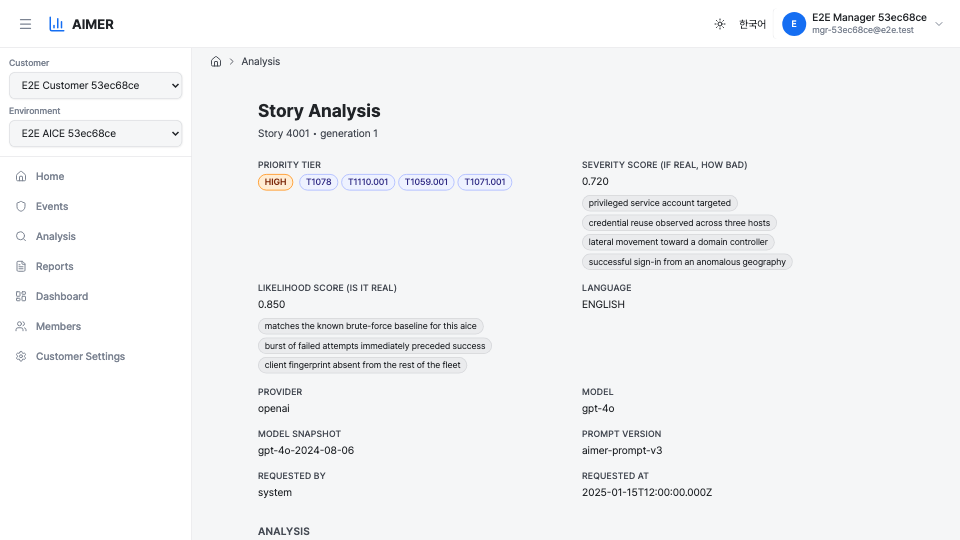
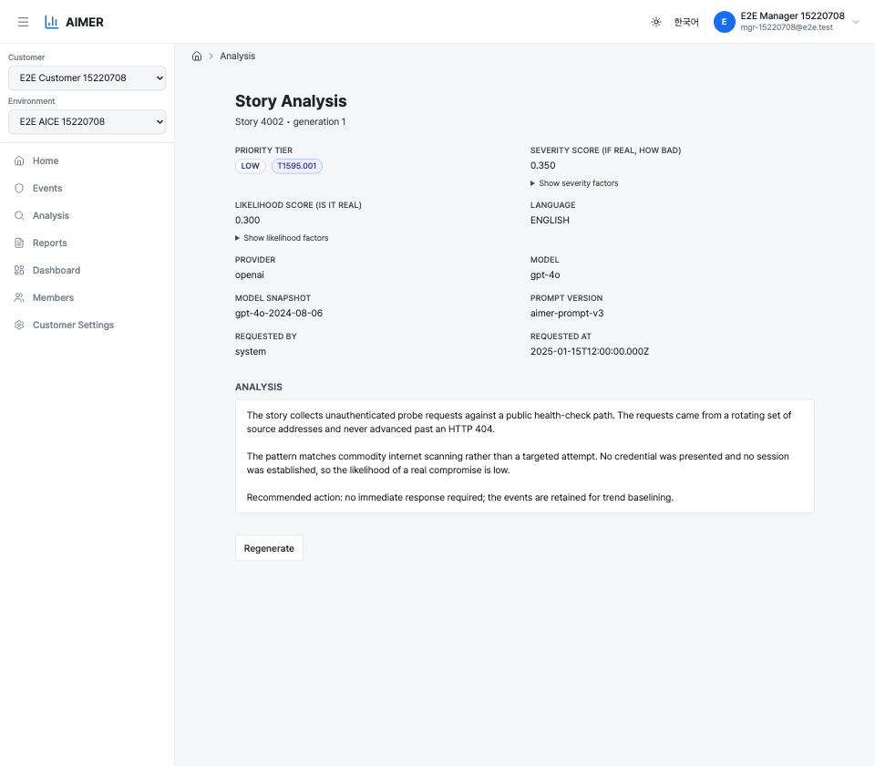
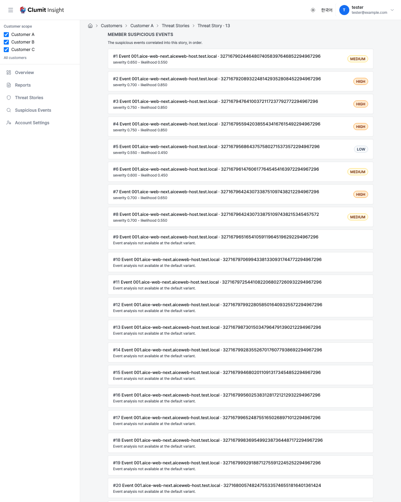
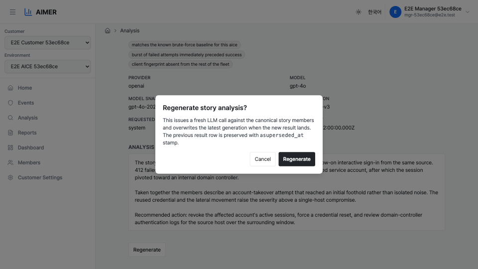

# Story Analysis Page

The story analysis page shows a single LLM analysis of a multi-event
story — the unit that aice-web-next groups related detection events into
before deeper review. Each story is analysed once per default
`(language, provider, model)` variant by a background worker; the page
renders the latest non-superseded result.

The page is reached from aice-web-next by opening a story detail and
following the deep link to Clumit Insight, or directly via its
customer-scoped URL.

The URL is customer-scoped because story ids are only unique within a
customer. A story-scoped URL without the customer would resolve to the
wrong story when the tab's selected customer differs from the story's
owner.

## How a story enters analysis

The worker pipeline runs the following stages without operator action:

1. As Phase 2 ingest writes story member events for a customer, the
   `story_analysis_state` row tracks readiness. It promotes from
   `pending` to `ready` once the story has been idle for the readiness
   quiet window or once the maximum wait has elapsed. Both windows
   default to `15` minutes (idle) and `6` hours (max wait) and are
   tunable per deployment via `ANALYSIS_STORY_IDLE_MINUTES` /
   `ANALYSIS_STORY_MAX_WAIT_HOURS` (read at tick time; see
   [Analysis Worker](../operations/analysis-worker.md)). Non-positive or
   non-numeric overrides fall back to the defaults.
2. The dispatcher seeds a real `story_analysis_job` row for the default
   variant against every `ready` or `dirty` state row that lacks one,
   then picks `queued` rows with `FOR UPDATE SKIP LOCKED`, advisory-
   locked per `(customer_id, story_id)`.
3. The worker reads the canonical story version's members (latest
   `received_at`), rewrites event-scope redaction tokens to
   story-scope tokens (`<<REDACTED_*_E{i}_*>>`), and calls aimer's
   `analyzeStory` mutation under mTLS as `system:analysis-worker`.
4. The response is validated (MITRE technique IDs filtered against the
   vendored ATT&CK set, factor chips shape-filtered and capped at five,
   hallucination scan against the LLM narrative) and written to
   `story_analysis_result`. The auth-DB job row is then finalized to
   `status='done'`.

Retryable failures (5xx, transport, mTLS error) re-queue with
exponential backoff up to `ANALYSIS_MAX_ATTEMPTS`. Fatal failures (4xx,
hallucination detected, mixed or missing redaction policy versions) mark
the job `failed` immediately.

A member whose event time cannot be resolved is also retryable:
`baseline_event` and `story_member` ingest through separate Phase 2
endpoints with no ordering guarantee, so a story job can run before its
referenced baseline rows have landed. Such a job re-queues with the same
backoff so a lagging baseline self-heals, becoming a terminal `failed`
only after `ANALYSIS_MAX_ATTEMPTS` — which then reflects a genuine
data-integrity defect.

Automatic dirty re-queues are bounded by `ANALYSIS_MAX_GENERATION`
(default `50`): once a story's current generation is at the cap, the
worker emits an `analysis.story_max_generation_reached` log line and
clears the dirty marker — the `story_analysis_state` row is flipped
back to `ready` so the seeding pass does not keep re-selecting it on
every tick. The existing analysis result row is retained; no new LLM
call is made. Force regenerate is exempt from this cap — operators
can always issue a fresh LLM call from the **Regenerate** button,
which is the supported way to advance a capped story.

## Priority and scores

The header section shows three score-related fields:

- **Priority tier** — one of `CRITICAL`, `HIGH`, `MEDIUM`, or `LOW`. The
  tier is rendered as a colored badge and is derived deterministically
  from the two scores below via a 4×4 matrix lookup, not returned by the
  LLM.
- **Severity score** — `0.000`–`1.000`, three decimal places. Answers
  "if this story turned out to be a real attack, how bad would it be".
- **Likelihood score** — `0.000`–`1.000`, three decimal places. Answers
  "how likely is this actually malicious rather than noise". The stored
  value is the raw LLM estimate; floors (e.g. five-or-more members
  raises effective likelihood to `≥ 0.7` before the matrix lookup; a
  `known_ioc_hit` on the story raises it to `≥ 0.95`) are applied at
  tier derivation only, so calibration data and the floor policy stay
  revisable without rewriting history. The `known_ioc_hit` signal is
  produced inside the platform by matching the story's observed
  indicators (IP / domain / URL / file hash) against Tier-1 local threat-
  intelligence feeds — curated known-bad lists imported and matched
  locally, so customer indicators never leave the host. Only a
  deterministic match from a license-cleared feed raises the floor; a
  match from an uncleared or non-deterministic source is recorded for
  context but does not.

### Tier matrix

|              | L < 0.4 | 0.4 ≤ L < 0.6 | 0.6 ≤ L < 0.8 | L ≥ 0.8  |
|--------------|---------|---------------|---------------|----------|
| S ≥ 0.8      | MEDIUM  | HIGH          | CRITICAL      | CRITICAL |
| 0.6 ≤ S < 0.8 | LOW    | MEDIUM        | HIGH          | HIGH     |
| 0.4 ≤ S < 0.6 | LOW    | LOW           | MEDIUM        | MEDIUM   |
| S < 0.4      | LOW    | LOW           | LOW           | LOW      |

## Score factors

Below each score, the page renders up to five short noun phrases (chips)
the LLM produced to articulate that score. Each axis has its own chip
row.

- Phrases are LLM-generated, capped at five per axis, with a maximum
  length of ~80 characters each.
- When the LLM did not return any usable phrase for an axis — for
  example, because the input members were too thin to support an
  articulation — the chip row shows a single placeholder reading
  `insufficient evidence`. This sentinel means "the score is recorded
  but no articulation is available", not that the LLM ran with no
  input.

For `LOW`-tier results the severity and likelihood factor chip rows
collapse behind a `Show severity factors` / `Show likelihood factors`
disclosure so the page leads with the tier badge, scores, and MITRE
chips rather than the chip detail. The disclosure is a native
`
` element — keyboard- and screen-reader-accessible — and
expands inline without navigating away. Tiers `MEDIUM` and above keep
the chip rows always visible because operators triaging those rows
generally want the rationale on screen by default.

## MITRE ATT&CK techniques

Next to the priority badge, the page renders a row of MITRE ATT&CK
technique chips (e.g. `T1078`, `T1110.001`) that the LLM associated
with the story. Each chip shows the technique ID; hovering reveals the
official technique name as a tooltip (e.g. `T1078` → "Valid
Accounts"). A chip whose ID is not in the currently vendored MITRE
knowledge base renders without a tooltip — the underlying analysis row
was written against an older MITRE bundle and the ID alone is shown as
a fallback. The chip row is omitted when the LLM returned no
techniques.

## Metadata fields

Below the score fields the page shows the analysis metadata in a
two-column grid:

- **Language** — `KOREAN` or `ENGLISH`. Visible to every viewer.

The remaining fields are **model/prompt provenance** — how the artifact
was produced — and are restricted to analysts (see
[Analyst-only fields](#analyst-only-fields) below):

- **Provider** — the LLM provider name (e.g. `openai`).
- **Model** — the model id requested (e.g. `gpt-4o`).
- **Model snapshot** — the provider-reported specific model version.
- **Prompt version** — the aimer prompt template version.
- **Requested by** — the account id that triggered the latest
  generation, or `system` if the analysis was produced by the regular
  worker tick rather than a force-regenerate.
- **Requested at** — when the analysis was requested, shown in your
  timezone with an explicit timezone label. See
  [Account Preferences → Timezone](../account-preferences.md#timezone)
  for the resolution order (saved → browser → UTC).

### Analyst-only fields

The model/prompt provenance fields and the **Regenerate** button are shown
only to analysts for the customer. A non-analyst viewer keeps everything
that carries analytical meaning — priority tier, MITRE ATT&CK tags,
language, scores, factors, and the narrative — but the provider, model,
model snapshot, prompt version, requested-by, and requested-at fields are
hidden, and the Regenerate control is absent.

The Regenerate button has one extra condition on this page: it is shown
only when you are an analyst **and** not in a [bridge
session](../cross-customer-overview.md). The regenerate endpoint authorizes a *write*,
which a bridge session can never perform, even when the underlying account
is an analyst — so a bridge-session analyst can still read the story
(provenance fields included) but does not see the Regenerate button.

<!-- Screenshot placeholder: the trimmed non-analyst story header (no
     model/prompt provenance fields, no Regenerate button). Capture from a
     stack with real data per docs/AUTHORING.md. -->

## Pinned evidence version

Opened directly, the page shows the latest analysis for the story. When
reached from a report's [Sources panel](reports.md#sources), the link
carries a pinned `generation` (plus the language, provider, and model),
and the page loads **exactly that version** — the evidence the report was
built from — rather than the latest re-analysis.

If the pinned version is no longer available — superseded by a newer
generation or removed by retention — the page shows a **"This evidence
version is no longer available"** notice instead of silently falling back
to the latest analysis, so a Sources link can never misrepresent a newer
version as the one the report cited.

## Analysis body

The body shows the LLM analysis narrative as rendered Markdown — headings,
bullet and numbered lists, and inline code spans appear as styled elements
rather than raw `#`, `-`, or backtick characters, matching the event
analysis page. Raw HTML in the narrative is treated as inert text and is
never rendered as live markup.

Every story-scope token (`<<REDACTED_*_E{i}_*>>`) is restored to its
original plaintext entity. The token namespacing prevents the LLM from
accidentally
merging entities across member events while the analysis is being
generated; on the rendering side, the loader parses each `E{i}`,
looks up `(aice_id, event_key)` in `input_event_refs`, decrypts the
referenced event's redaction map, and substitutes the original
value. Tokens that cannot be restored (decrypt failure, missing map
row, out-of-range index) are passed through unchanged so the page
still renders. Hallucinated decodes are blocked at write time and
never reach this view. This restoration — and the write-time leak
guard behind it — covers the score-factor chips above as well as the
narrative body, so a token (or a customer-asset value the model
decoded) embedded in a factor is handled exactly the same way.

The same threat-intelligence matching that produces the `known_ioc_hit`
floor signal (see [Priority and scores](#priority-and-scores)) also
contributes short narrative **enrichment facts** to the analysis input —
for example, "this indicator is listed by a known-bad feed as C2". Any
customer-asset value inside a fact — an indicator in your registered IP
ranges or owned domains — is redacted before the fact reaches the model
and carries a fact-scope token (`<<REDACTED_*_F{k}_*>>`); external
indicators (an attacker host, a public IP) are passed through unredacted.
On this page the fact-scope tokens are restored to their original
plaintext exactly as the `E{i}` tokens are — parsing each `F{k}`, looking
up the producing fact in `input_fact_refs`, decrypting that fact's map,
and substituting the value — under the same authorization. The
customer-asset plaintext only ever appears here, on the authorized render;
it is never sent to the report model (a periodic report re-masks any
fact-scope token before its own prompt). As with `E{i}`, a fact-scope
token that cannot be restored is passed through unchanged.

## Member suspicious events

Below the analysis body the page lists the **member suspicious events**
correlated into this story, in the story's member order (the member
ordinal embedded in the redaction token namespace). Each member is a card
linking down to that event's [Analysis Result page](../analysis-result.md),
carrying the default `(language, provider, model)` variant so the event
page resolves the same evidence the card describes. A card shows the
member's priority-tier badge and severity / likelihood scores when the
event has a result at that variant; a member whose event has no result
there (for example, swept by retention) still links by id, with a short
"Event analysis not available at the default variant" note instead of the
scores.

This is the downward half of the trust drill-down: a reader can move from
the story narrative into each cited event, then on to the raw source
event from the event page.

## Cited by

If one or more periodic reports cite this story, the page shows a **Cited
by** trail listing those reports, newest first. Each entry links back up
to the **exact report generation** that consumed the story — the link is
generation-pinned, so it opens the version the report was built from
rather than the latest. The trail is also scoped to the **evidence
generation you are viewing**: it lists the reports that cited *this*
generation of the story, so an older pinned generation shows the reports
that cited it rather than ones that cited a different generation. A story
may be cited across several periods; the trail lists one entry per report
bucket, and a story cited by no report shows no trail (a normal state, not
an error).

The trail is permission-gated on `reports:read`: a viewer who cannot read
the customer's reports sees no trail rather than links they could not
open.

## Force regenerate

Operators with `analyses:configure` (analysts for the customer) can rerun
the analysis manually via the **Regenerate** button at the bottom of the
page. The button is shown only to analysts who are not in a bridge session
(see [Analyst-only fields](#analyst-only-fields)).

The confirmation modal explicitly mentions that a fresh LLM call is
issued and the latest generation is superseded once the new result
lands. The previous result row is preserved with a `superseded_at`
stamp; nothing is overwritten in place.

Submitting the modal queues a fresh analysis (optionally targeting a
non-default variant). Behaviour:

- The job row's `generation` is bumped by one (or `1` if no prior row
  for the variant exists), `status` resets to `queued`, `attempts` resets
  to `0`, and the LLM call begins on the next worker tick.
- Bridge sessions (`bridge_write_blocked`, `bridge_not_allowed`) and
  members without `analyses:configure` are rejected with `403` and the
  reason in the response body. A caller that is not a member of the
  customer at all gets `404 story_not_found` instead, so the endpoint
  cannot be used to probe whether a story id exists in a customer the
  caller has no access to (existence-hiding policy uniform with the
  story page and the summary endpoint).
- An archived state row or a story without a surviving canonical
  version returns `409 source_unavailable`; an unknown story returns
  `404 story_not_found`. The endpoint rejects `?tz=…` with `400
  invalid_param` because story analysis is timezone-independent, and
  rejects any `lang` other than `KOREAN` / `ENGLISH` with the same
  error.

While the regenerate is queued, the page shows a yellow status banner
naming the new generation number. Refresh the page once the worker has
written the new result.

## Cross-system deep link

aice-web-next checks whether an analysis exists for a story to decide
whether to expose a deep-link badge. No badge is shown until an analysis
has been produced; otherwise the badge carries only the priority tier and
the two scores and links to this page. TTP tags and factors are content,
not surface metadata, and stay out of the badge so it cannot leak details
of the analysis. To filter stories by TTP, use the Clumit Insight overview
list rather than the badge.

The deep-link check applies the same existence-hiding policy as the page
and the regenerate action: a caller that is not a member of the customer
sees a `404` rather than a permission error, so the badge probe cannot
enumerate story ids across customers. Members without `analyses:read` get
a permission error, and bridge sessions the check rejects outright are
turned away.
