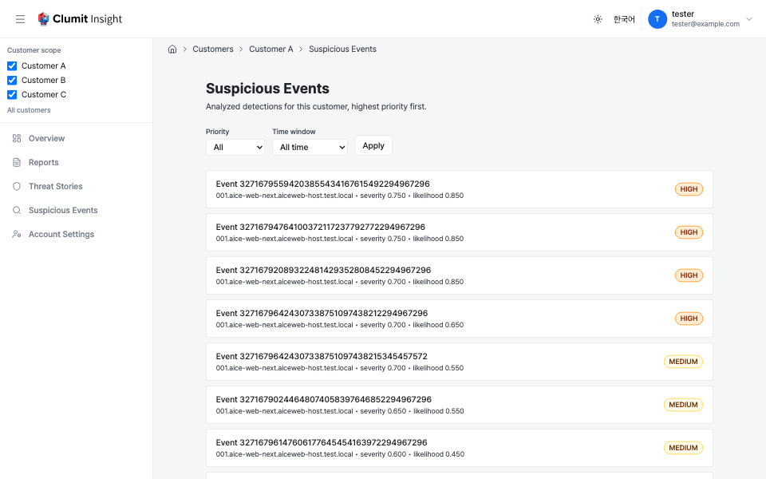

# Suspicious Events

The suspicious events Clumit Insight shows are events that Clumit Security
detected and passed basic triage, then forwarded from aice-web-next — in
other words, suspected threats. This is the single place that states this
provenance; the other analysis pages refer back here.

The suspicious events list is the customer-scoped index of the
**analyzed** subset — events that already have an analysis result —
linking into the existing [event analysis detail
page](../analysis-result.md). It is not the full population of forwarded
events.

This is a **new customer-level segment**. The event detail route is
scoped to a single AICE environment, but a customer-wide list spans many
AICE environments, so the list cannot live under a single per-environment
path.

## What it lists

The list shows **analyzed** events only — those that have an analysis
result (`event_key`, priority tier, and scores). Raw, un-analyzed
detections have no `event_key` or priority and are out of scope for this
list.

Each row resolves to a single canonical variant per event: the latest
generation of the default language/model that is not superseded, so an
event never appears twice.

### Detail links carry the variant

Each row links to the **canonical analyzed variant** of the event (its
language and model), so following a row always opens that specific
analysis result rather than an unanalyzed event.

## Ordering

Events are listed **highest risk first**, with every direction pinned:

1. **Priority tier** — `CRITICAL` > `HIGH` > `MEDIUM` > `LOW`, sorted by
   an explicit integer rank (never the raw `priority_tier` text).
2. **Severity score**, descending.
3. **Likelihood score**, descending.
4. **Requested-at** time, descending.
5. **AICE environment ID**, ascending — stable tiebreak.
6. **Event key**, ascending — stable tiebreak.

## Pagination

The list paginates server-side with a **keyset** cursor (not an offset),
default page size 25. A **Next page** link appears when more rows remain
and carries an opaque cursor encoding every ordering-key component, plus
the active filters. When a time window is active, its lower bound is
**frozen at the first page** and carried in the cursor, so every page of a
pagination session filters against the same instant — the window does not
slide forward as you page, which would otherwise drop rows near the
boundary.

## Filtering

- **Priority** — show only one tier, or all.
- **Time window** — limit to events requested within the last 24 hours,
  7 days, or 30 days, or show all time.

Changing a filter resets pagination to the first page.

## States

- **Empty** — a "no suspicious events match the current filters" notice.
- **Loading** — a loading placeholder while the page resolves.
- **Error** — an error notice with a **Try again** action.

## Access control

The list requires `analyses:read`. The denial mapping matches the report
index: a non-member or non-existent customer returns `404`
(existence-hiding); a member without `analyses:read`, or a rejected
bridge session, returns a real `403`.
