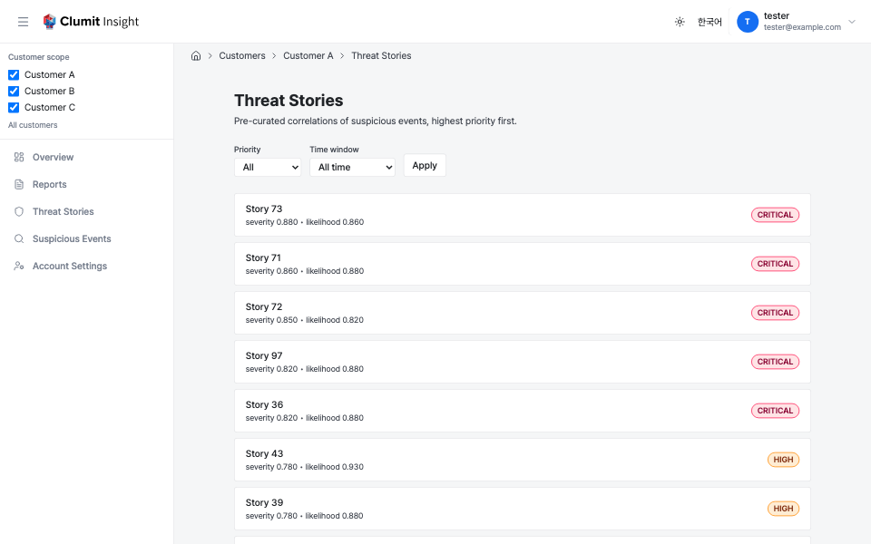

# Threat Stories

A threat story is a pre-curated correlation of multiple [suspicious
events](suspicious-events.md) into one kill-chain narrative. The threat
stories list is the customer-scoped index of those stories, sibling to
the existing [story detail page](story.md).

Each row links to the story detail page. Story detail takes no variant
query params — it resolves the default language/model from the
environment — so the list links carry none.

## Ordering

Stories are listed **highest risk first**. The order is, in full:

1. **Priority tier** — `CRITICAL` > `HIGH` > `MEDIUM` > `LOW`. The tier
   is sorted by an explicit integer rank, **not** by the raw
   `priority_tier` text: PostgreSQL string ordering would put `CRITICAL`
   below `HIGH` and `MEDIUM`, the opposite of intent.
2. **Severity score**, descending.
3. **Likelihood score**, descending.
4. **Recency**, descending — the story's last-ready time, falling back to
   its last update time.
5. **Story ID**, ascending — a stable, deterministic tiebreak.

Each row resolves to a single canonical variant (latest generation,
default language/model, not superseded), so a story never appears twice.

### How the priority is sourced

The list orders and paginates in a single query against the auth
database. Because a story's priority and scores are produced into the
customer database only after analysis, those values are **denormalized**
onto the story's auth-database state row when the analysis job finalizes
(for the canonical default variant). The list reads them from there.

The default list shows stories whose state is `ready` or `dirty` and that
have a denormalized result:

- A **`dirty`** story (new source data landed; a refresh is queued) keeps
  its last-known priority and shows an **Updating** hint until the
  refresh finalizes.
- A **`pending`** story (no result yet) has no priority and is excluded
  until its first analysis lands.
- An **archived** story (its source versions were all deleted) is
  excluded.

## Pagination

The list paginates server-side with a **keyset** cursor (not an offset),
so ordering stays stable across pages even as new stories are analyzed.
The default page size is 25; a **Next page** link appears when more rows
remain and carries an opaque cursor that encodes every ordering-key
component. The cursor also preserves the active filters. When a time
window is active, its lower bound is **frozen at the first page** and
carried in the cursor, so every page of a pagination session filters
against the same instant — the window does not slide forward as you page,
which would otherwise drop rows near the boundary.

## Filtering

Two filters are available in the filter bar:

- **Priority** — show only one tier (`CRITICAL` / `HIGH` / `MEDIUM` /
  `LOW`), or all.
- **Time window** — limit to stories whose recency falls within the last
  24 hours, 7 days, or 30 days, or show all time.

Changing a filter resets pagination to the first page.

## States

- **Empty** — when no stories match, the list shows a "no threat stories
  match the current filters" notice.
- **Loading** — while the page resolves, a loading placeholder is shown.
- **Error** — if the query fails, an error notice with a **Try again**
  action is shown.

## Access control

The list requires `analyses:read`. The denial mapping matches the report
index: a non-member or non-existent customer returns `404`
(existence-hiding); a member without `analyses:read`, or a rejected
bridge session, returns a real `403`.
