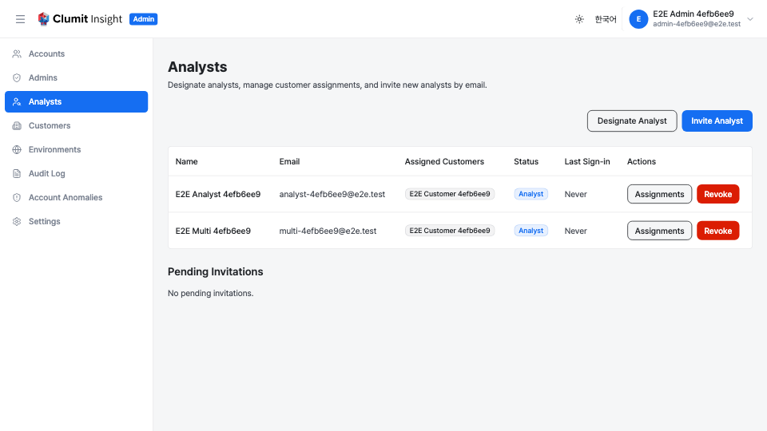
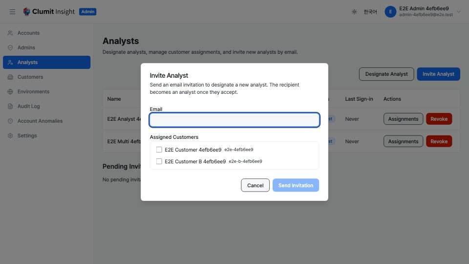
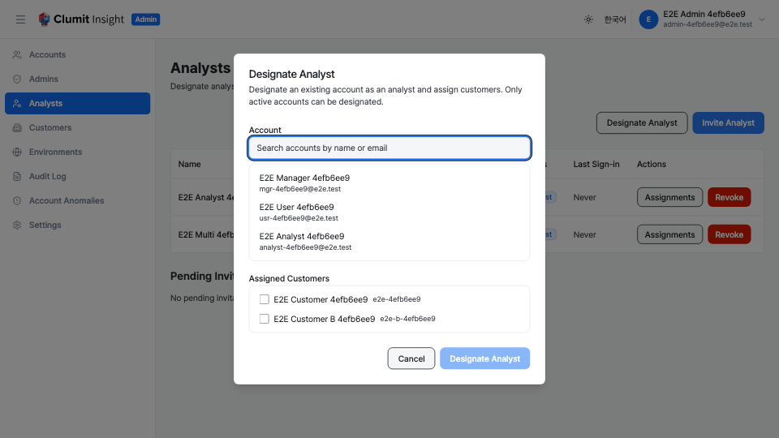
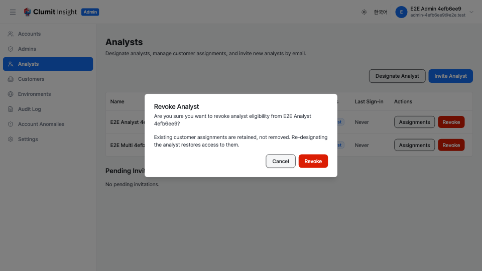
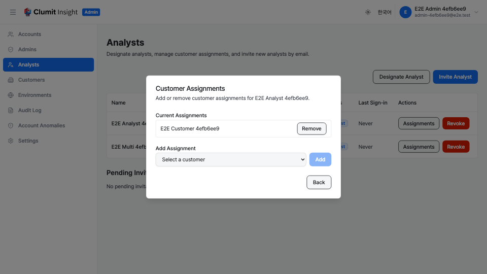

# Analyst Management

The Analysts page lets System Admins designate analysts, manage their
customer assignments, and invite new analysts by email. Navigate to
**Analysts** in the admin sidebar to open it.

## Permissions

This screen depends on more than the analyst permissions because its
customer and account pickers read other resources:

- `analysts:read` — view the analyst list and pending invitations.
- `analysts:write` — designate, revoke, invite, revoke invitations, and
    add or remove customer assignments.
- `customers:read` — load the customer list that backs the assignment
    chips and the customer pickers.
- `accounts:read` — load the account list used by the direct-designation
    search.

The System Administrator role holds all four. If the customer or account
list cannot be loaded (for example, a `403` from a missing permission),
the page shows a warning banner and disables the affected pickers; the
rest of the page keeps working.

## Analyst table

The table lists every account that is currently analyst-eligible or that
still has customer assignments (so revoked analysts with leftover
assignments remain visible for cleanup). Each row shows:

- **Name** — the analyst's display name.
- **Email** — the analyst's email address, or `—` when none is on file.
    Display name is always shown because email is optional.
- **Assigned Customers** — one chip per assigned customer. Chip names are
    resolved from a single customer lookup loaded once for the whole
    page, not from a per-row request.
- **Status** — **Analyst** when analyst-eligible, or **Revoked** when the
    flag is off but assignments remain.
- **Last Sign-in** — the most recent sign-in time, or **Never**.
- **Actions** — an **Assignments** button (opens the assignment editor)
    and a **Revoke** button (shown only while the analyst is eligible).

## Inviting an analyst

Use an invitation when the person does not yet have an account. They
become an analyst once they accept the emailed invitation.

1. Click **Invite Analyst** in the top-right corner.
2. Enter the recipient's **Email**.
3. Select one or more **Assigned Customers**. Only active customers are
    offered, because the API rejects non-active customers.
4. Click **Send Invitation**.

If a pending invitation already exists for that email, it is refreshed in
place rather than duplicated, and the page reports that the existing
invitation was refreshed. The form surfaces these errors:

- **Invalid email** — the address is not a valid email.
- **Invalid customers** — no active customer was selected.
- **Already assigned** — the email is already assigned to every selected
    customer.

## Designating an existing account

Use direct designation when the person already has an account.

1. Click **Designate Analyst**.
2. Search for the account by name or email. The search filters the full
    account list in the browser; only active accounts are selectable.
3. Select the account.
4. Select one or more **Assigned Customers** (active customers only).
5. Click **Designate Analyst**.

Designation sets `analyst_eligible` to `true` and adds the selected
customer assignments. Only active accounts can be designated.

## Revoking an analyst

1. Find the analyst in the table.
2. Click **Revoke** in the Actions column.
3. A confirmation dialog appears.
4. Click **Revoke** to confirm.

Revocation sets `analyst_eligible` to `false`. **Existing customer
assignments are retained, not removed** — re-designating the analyst
restores their access to those customers. The confirmation dialog notes
this so the retained assignments are not a surprise.

## Managing customer assignments

Customer assignments can be changed for any analyst without re-designating
them.

1. Click **Assignments** on the analyst's row.
2. The dialog lazily loads the analyst's current assignments when it
    opens (one request, only for the opened analyst).
3. To remove an assignment, click **Remove** next to a customer.
4. To add an assignment, pick an active customer from the dropdown (only
    customers not already assigned are listed) and click **Add**.

The list view's assignment chips and this editor stay in sync — both
refresh after each add or remove.

## Pending invitations

Below the analyst table, the **Pending Invitations** section lists
invitations that have not yet been accepted. Each row shows the invited
email, the customers the invitation will assign, and the expiry time.

- Click **Revoke** to cancel a pending invitation.

Revoking a pending invitation can report:

- **Already expired** — the invitation has already expired.
- **Already accepted** — the invitation was already consumed.
- **No longer exists** — the invitation was not found.

## Audit trail

Analyst management actions are recorded in the audit log:

- **account.analyst_eligible_changed** — when analyst eligibility is
    granted (designation) or revoked.
- **analyst.assignment.created** — when a customer assignment is added.
- **analyst.assignment.removed** — when a customer assignment is removed.
- **invitation.created** — when an analyst invitation is sent.
- **invitation.revoked** — when a pending invitation is revoked.

View these entries on the [Audit Logs](audit-logs.md) page.
