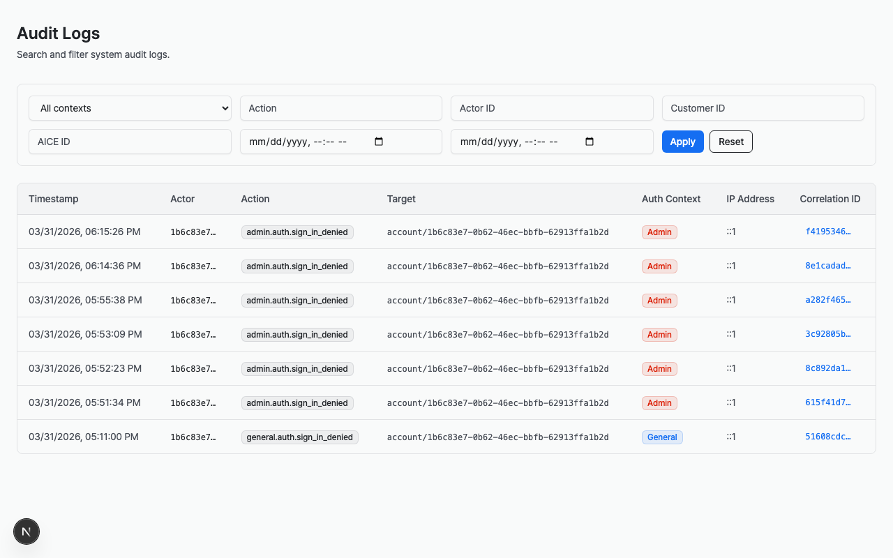
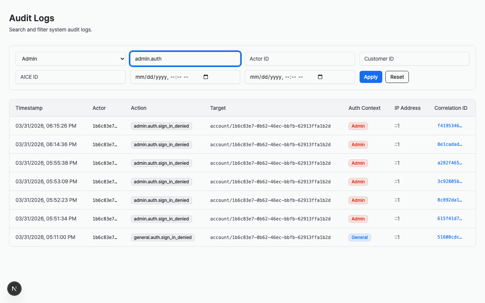
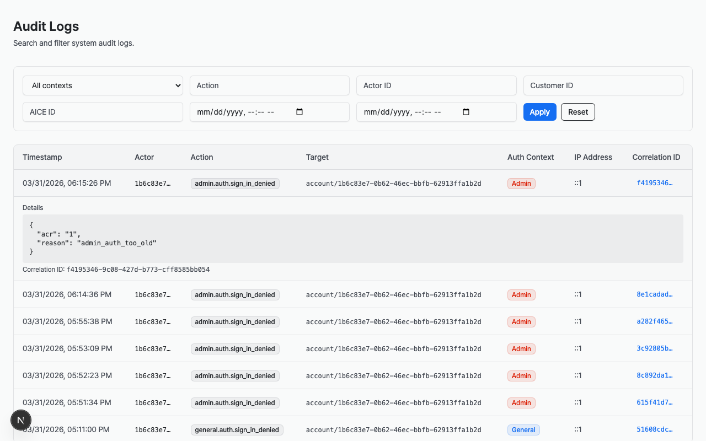

# Audit Logs

The audit log viewer provides a read-only, searchable view of all
system events recorded by Aimer Web. It is available to System
Administrators in the Admin dashboard.

## Accessing the audit log viewer

Navigate to **Admin > Audit Log** in the sidebar. The viewer loads
the most recent entries automatically.

## Filtering

Use the filter bar at the top of the page to narrow results.

- **Auth context** — filter by `General` or `Admin` context.
- **Action** — filter by a specific action name
  (e.g., `customer.created`).
- **Actor ID** — filter by a specific actor (account UUID).
- **Customer ID** — filter by a specific customer UUID.
- **AICE ID** — filter by a specific AICE environment identifier.
- **From / To** — filter by date range.

Click **Apply** to execute the search, or **Reset** to clear all
filters.

## Viewing entry details

Click any row to expand it and view additional details:

- **Details** — the full JSON payload associated with the event.
- **SID** — the session ID at the time of the event.
- **Customer** — the customer UUID, if applicable.
- **AICE environment** — the AICE environment ID, if applicable.
- **Correlation ID** — the full correlation UUID.

## Correlation ID grouping

Each request processed by Aimer Web is assigned a correlation ID.
Related events (e.g., an authentication check followed by a
resource creation) share the same correlation ID.

To view all events in a correlated group, click the correlation
ID link in any row. A banner appears at the top of the page
showing the active correlation filter. Click **Clear correlation
filter** to return to the normal view.

## Pagination

The viewer loads 50 entries at a time. If more entries are
available, a **Load More** button appears at the bottom of the
table. Click it to append the next page of results.
