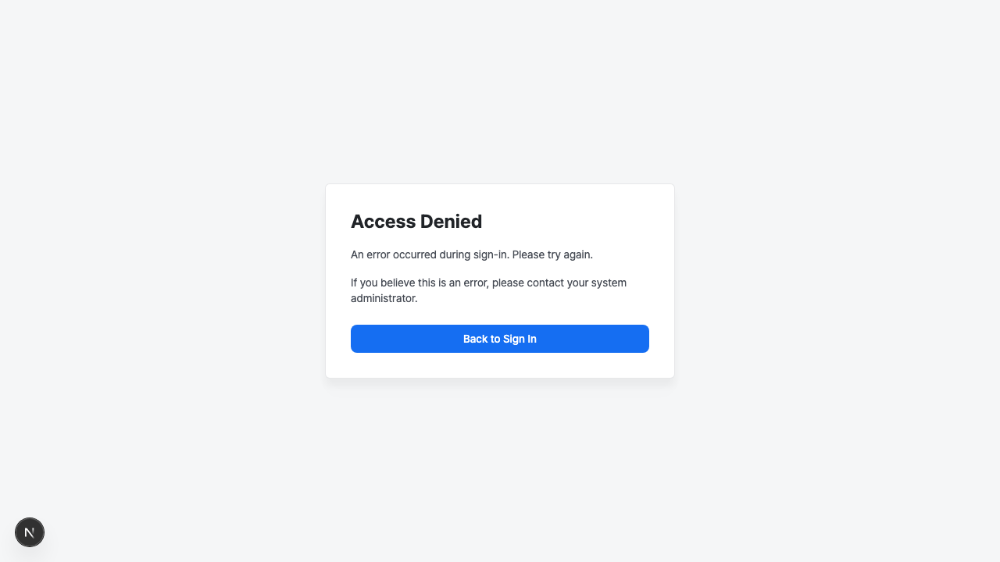
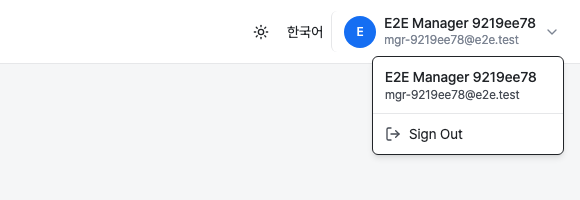
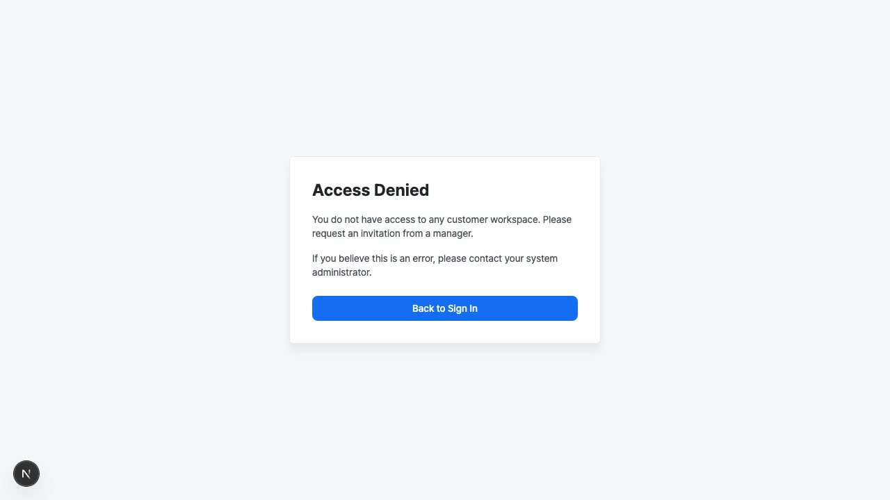

# Authentication

Aimer Web uses Keycloak as its identity provider. Users sign in
through an OpenID Connect (OIDC) redirect flow and are returned to
the dashboard after successful authentication.

## Signing in

Click **Sign In** or navigate to any protected page. The browser
redirects to the Keycloak login screen where you enter your
credentials. After authentication completes, you are returned to
the Aimer Web dashboard.

If your account belongs to multiple customer workspaces, the
dashboard opens with the first accessible customer selected. You
can switch customers using the sidebar selector (see
[Navigation](navigation.md)).

## Signing out

Click the profile dropdown on the right side of the header bar to
open the user menu, then click **Sign Out**. Signing out revokes
your Aimer Web session and redirects you to the Keycloak logout
page, which terminates your single sign-on (SSO) session.

## Admin authentication

System Administrators access the Admin dashboard through a
separate sign-in flow that requires multi-factor authentication
(MFA). Admin authentication must be completed within five minutes.
Having an active admin session does not affect your general
session.

## Bridge entry from Aimer Console

Aimer Web also accepts entry from Aimer Console (aice-web-next) via the
**Send to Aimer** action. When a Console operator clicks this button,
the browser performs a top-level multipart POST to Aimer Web's bridge
endpoint, which validates the request and then continues into the same
Keycloak sign-in screen described above.

<!-- TODO: screenshot - aimer-bridge batch -->

The bridge POST always carries a short-lived context token identifying
the operator, the source AICE, and the customer scope. It may
optionally carry a signed detection-event envelope plus the matching
event payload. For the initial release, the event payload is a small
UTF-8 JSON document, so Aimer Console submits it as a plain text form
field rather than a binary file upload — the bridge endpoint accepts
either form, and applies the same size cap and SHA-256 payload-hash
verification to both.

If the context token is missing, expired, or rejected, Aimer Web does
not start a sign-in flow. Instead, the bridge endpoint responds with a
JSON error (HTTP 400 for a missing token, HTTP 403 for a rejected or
expired token), which Aimer Console surfaces back to the operator. In
that case, return to Aimer Console and trigger **Send to Aimer** again
to obtain a fresh context token.

<!-- TODO: screenshot - aimer-bridge batch -->

## Access denied

When authentication or authorization fails, Aimer Web displays an
access denied page with a message explaining the reason.

Common reasons include:

- **Account inactive** — your account has been suspended or
    disabled by an administrator.
- **No access** — your account is not a member of any customer
    workspace. Contact a Manager to receive an invitation.
- **MFA required** — admin access requires multi-factor
    authentication. Configure a TOTP or WebAuthn device in
    Keycloak.
- **Admin session expired** — the admin authentication window
    (five minutes) has elapsed. Sign in again.
- **Invitation expired** — the invitation link is no longer valid.
    Ask the Manager to send a new invitation.
- **Email mismatch** — you signed in with a different email
    address than the one the invitation was sent to.
- **Email not verified** — your email address has not been verified
    in Keycloak. Verify it and try again.

Each error page includes a **Back to Sign In** link that returns
you to the general sign-in flow. For admin or bridge session
errors, you will need to re-initiate those flows separately.
