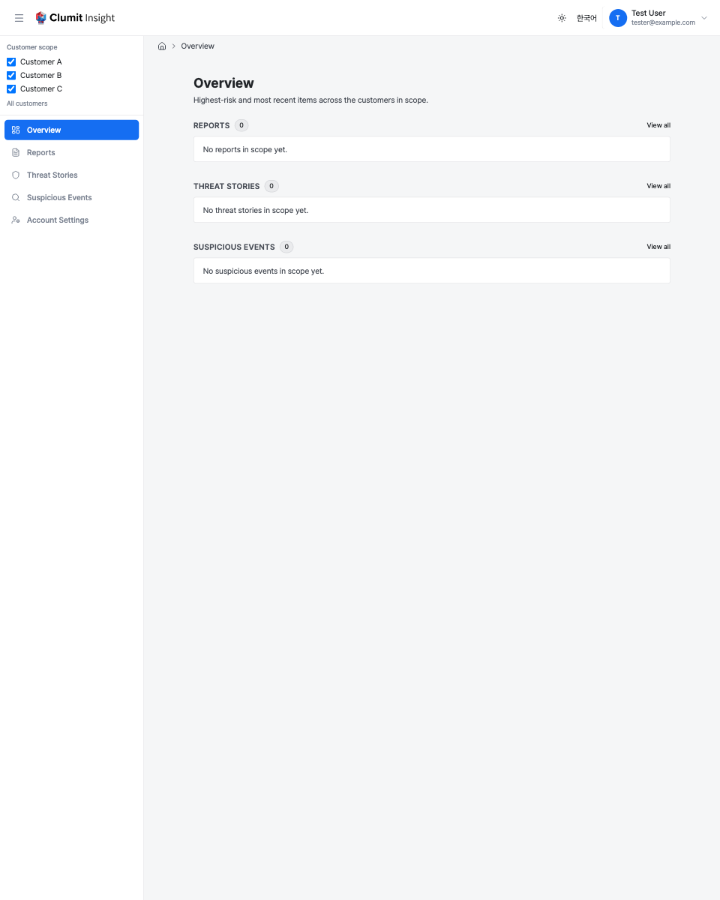

# Cross-Customer Overview

The top-level overview surfaces give you a single vantage across **every
customer you can access**, under the active customer scope. Instead of
opening each customer in turn, they merge the most recent and
highest-risk items from all in-scope customers into one ranked list.

There are four surfaces:

| Surface | Route | Shows |
| --- | --- | --- |
| **Overview** | `/overview` | A combined landing: the top items of each type plus per-type counts. |
| **Reports** | `/reports` | Recent and high-risk periodic security reports. |
| **Threat Stories** | `/threat-stories` | Recent and high-risk threat stories. |
| **Detections** | `/suspicious-events` | Recent and high-risk analyzed events. |

## Scope and permissions

These pages render under the **customer scope** selected in the sidebar
(see [Navigation](navigation.md)). `scope=all` (the default) covers every
customer you can access; narrowing the scope narrows the overview
accordingly.

Access alone is not enough to appear on a surface. Each surface only
counts and lists customers where you additionally hold its read
permission:

- **Reports** requires `reports:read`.
- **Threat Stories** and **Detections** require `analyses:read`.

A customer you can see but not read on a given surface contributes
neither rows **nor counts** to that surface — the count itself is treated
as sensitive information.

Bridge sessions are pinned to a single environment and cannot open these
cross-customer surfaces.

## Ordering

Every surface is **highest-risk first**. Rows are ordered by:

1. priority tier (`CRITICAL` → `HIGH` → `MEDIUM` → `LOW`),
2. then severity,
3. then likelihood,
4. then recency (most recent first).

Reports show the **priority tier only**; the numeric aggregate score that
participates in ordering is intentionally not displayed. Threat-story and
detection rows may show their severity and likelihood scores.

Detection rows are titled by the event's **time and kind** —
`{event time} · {kind}` (for example, `6/3, 2:05 PM · HTTP Threat`), shown
in your account timezone — falling back to the time alone when the kind is
unknown, or to a plain `Event` label when the time is unavailable. The kind
uses the same friendly names as aice-web-next (e.g. `HttpThreat` → "HTTP
Threat"). The opaque `event_key` is never shown as a title.

Archived and not-yet-analyzed threat stories are excluded from the Threat
Stories surface. The Reports surface likewise excludes archived and
not-yet-generated report buckets, so every listed row links to a report
that still exists (an archived bucket's detail page is gone).

## Drilling in

These overviews are a **capped, high-signal summary** (the top 25 items
per surface), not a full archive. Clicking any row opens that item in its
own customer's detail page. To page through the full history for one
customer, open that customer's dedicated list pages, which provide
complete pagination and filtering.

## States

- **Loading** — because a surface may open several customers' data stores
    in one request, each page shows a brief skeleton placeholder while the
    cross-customer data is gathered.
- **Empty** — when no items match the active scope and permissions, the
    surface shows a short empty notice.
- **Partial failure** — if one customer's data store is temporarily
    unreachable, the rest of the overview still renders. The unreachable
    customer is named in a notice and is excluded from the counts (its
    absence never silently zeroes the totals).

## Old links

The earlier placeholder routes redirect to their new homes, preserving
the active scope and any report parameters on the URL:

- `/dashboard` → `/overview`
- `/analysis` → `/overview`
- `/events` → `/suspicious-events`

