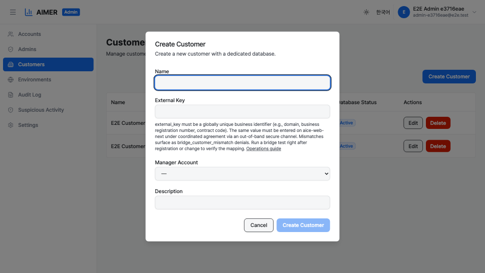

# Cross-System Customer Identification

This page is the canonical operations guide for how aimer-web and
aice-web-next agree on customer identity. It covers what
`external_key` is, how to choose its value, the out-of-band agreement
procedure, the bridge-test verification step, what mismatches look
like, and which changes must be coordinated.

## Why external_key exists

aimer-web and aice-web-next are two separate systems with two
separate identity namespaces. Each system auto-issues its own primary
key for a customer:

- aimer-web uses `customers.id` (UUID).
- aice-web-next uses its own `customers.id` (SERIAL integer).

These primary keys never travel across the bridge and are never
compared directly. The two systems agree on customer identity by
matching a third value that humans enter on both sides:
`customers.external_key`. This value is globally unique within
aimer-web (`UNIQUE NOT NULL`) and is the only customer identifier
shared across the bridge.

## Choosing an external_key

Use a stable business identifier that uniquely names the customer
across the operator's whole portfolio. Recommended choices, in
order of preference:

1. **Domain name** of the customer's primary tenant
    (e.g., `acme.example.com`).
2. **Business registration number** issued by the customer's
    jurisdiction (e.g., a corporate registry ID).
3. **Contract code** assigned by the operator's contract
    management process.

Whatever you choose, the value must:

- be globally unique across the aimer-web `customers` table;
- be stable across renames and rebranding wherever possible;
- be entered identically on both aimer-web and aice-web-next;
- contain no leading or trailing whitespace, and no control
    characters; and
- be no longer than 256 characters.

## Out-of-band agreement procedure

`external_key` cannot be exchanged through the bridge itself —
the bridge does not exist yet at the moment a customer is being
registered. Operators must agree on the value through a separate,
secure channel before either side is configured.

A typical procedure:

1. The operator who will register the customer on aimer-web
    proposes the `external_key` value over the agreed secure
    channel (e.g., an internal ticket, a signed email, a chat
    channel that has access controls).
2. The aice-web-next operator confirms the value back through the
    same channel.
3. Both operators register the customer on their side using the
    confirmed value.
4. The operators run a bridge test to verify the mapping (see
    next section).

Do not transmit `external_key` through public, unauthenticated, or
ephemeral channels.

## Bridge-test verification

After registration or after any change to `external_key`, run a
bridge test from aice-web-next to aimer-web. A successful bridge
connection request that resolves to the expected customer confirms
the mapping. If the bridge connection is denied with
`bridge_customer_mismatch`, the values do not match — return to
the agreement step before retrying.

## What mismatches look like

When the two systems disagree on `external_key`:

- The bridge connection from aice-web-next is denied with the
    `bridge_customer_mismatch` reason.
- The denial is recorded in the audit log on the aimer-web side.
- End users on aice-web-next see a denial page indicating the
    customer could not be matched.

A mismatch is not silently ignored — the bridge fails closed, but
the cause must be diagnosed by an operator who can see both
systems' configuration.

## Changes that must be coordinated

The following changes must be made on both systems in coordinated
order, with a bridge test immediately after the change:

- Changing the `external_key` value of an existing customer.
- Splitting one customer into two, or merging two customers into
    one (each split / merge step affects the `external_key`).
- Restoring a customer from backup if the backup predates an
    `external_key` change.

Other customer fields (name, description) are local to each system
and do not need to be coordinated. They may differ between systems
without breaking the bridge.

## Audit trail

External-key changes are recorded as `customer.updated` audit
entries whose `details.changedFields` array contains
`external_key`. The entry also carries the old and new values as
`details.previous.external_key` and `details.next.external_key`.
Use these fields to investigate any post-change bridge failure.

See [Audit Logs](audit-logs.md) for filtering and search.
