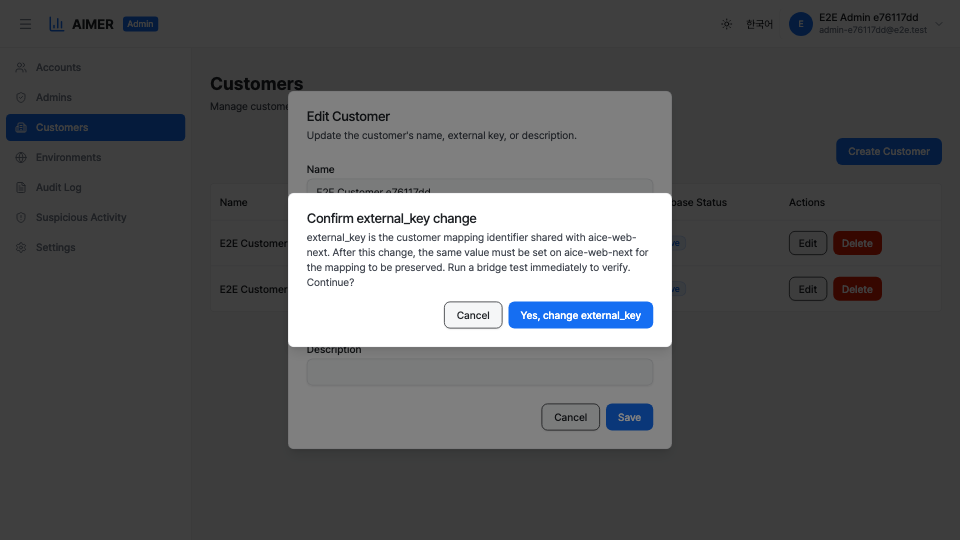

# Customer Management

The Customers page lets System Admins create, view, and delete
customers, and retry database provisioning for customers whose
initial setup failed. Navigate to **Customers** in the admin
sidebar to open it.

Only System Admins with the `customers:read` permission can
view this page. The `customers:write` permission is required
to create or delete customers and to retry provisioning.

## Customer table

The table lists all customers in the system. Each row shows:

- **Name** — the customer's display name.
- **External Key** — a unique identifier used for external
    integrations.
- **Status** — one of Active, Suspended, or Disabled.
- **Database Status** — one of Active, Provisioning, or
    Failed. Indicates whether the customer's dedicated database
    has been set up successfully.
- **Actions** — delete button, and a retry-provision button
    when the database status is Failed.

## Creating a customer

1. Click the **Create Customer** button in the top-right
    corner.
2. Fill in the required fields:
    - **Name** — a display name for the customer.
    - **External Key** — a unique key for external systems.
    - **Manager Account** — select the account that will
        become the initial Manager of this customer.
    - **Description** — an optional description.
3. Click **Create Customer** to submit.

A dedicated database is provisioned automatically after
creation. The Database Status column shows **Provisioning**
while this is in progress, then changes to **Active** on
success or **Failed** if an error occurs.

The **External Key** field carries an inline help note and a
link to the
[Cross-System Customer Identification](cross-system-customer-identification.md)
operations guide. Read that page before choosing a value — it
must be agreed with the aice-web-next operator over an
out-of-band secure channel.

## Editing a customer

1. Find the customer in the table.
2. Click the **Edit** button in the Actions column.
3. The Edit Customer dialog appears, pre-filled with the
    current name, external key, and description.
4. Adjust the fields you want to change.
5. Click **Save**.

If you change the **External Key** to a different value, a
non-dismissable confirmation dialog appears before the save
goes through. external_key is the customer mapping identifier
shared with aice-web-next, and any change must be mirrored on
that side. The confirmation reminds you to coordinate the
change and run a bridge test immediately afterwards. Click
**Cancel** to abandon the change, or the explicit confirm
button to proceed.

Edits are recorded as `customer.updated` audit entries whose
`details.changedFields` array names the fields that actually
changed, with old and new values in `details.previous` and
`details.next`.

## Deleting a customer

1. Find the customer you want to delete in the table.
2. Click the **Delete** button in the Actions column.
3. A confirmation dialog appears warning that the customer,
    its database, and all associated data will be permanently
    removed.
4. Click **Delete** to confirm.

Deletion removes the customer record, drops the dedicated
database, anonymizes related audit logs, and destroys the
encryption key. This action cannot be undone.

## Retrying database provisioning

If a customer's database provisioning fails (shown as a
**Failed** badge in the Database Status column), you can
retry:

1. Click the **Retry Provision** button in the Actions column.
2. A confirmation dialog appears.
3. Click **Retry Provision** to confirm.

The system reattempts provisioning from where it left off.
Each step is idempotent — if the database was already
created, it skips to the next step (granting privileges,
generating an encryption key, running migrations). If the
retry succeeds, the status changes to **Active**. If it
fails again, the status remains **Failed** and you can
retry as many times as needed.

## Audit trail

Customer management actions are recorded in the audit log:

- **customer.created** — when a customer is created.
- **customer.updated** — when a customer's name, description,
    or external key is updated. The `details.changedFields`
    array lists which fields changed, and
    `details.previous` / `details.next` carry the old and new
    values.
- **customer.deleted** — when a customer is deleted.
- **customer_db.provisioned** — when database provisioning
    succeeds on first attempt.
- **customer_db.provision_retried** — when a provisioning
    retry is attempted.
- **customer_db.provision_failed** — when provisioning fails.

View these entries on the [Audit Logs](audit-logs.md) page.
