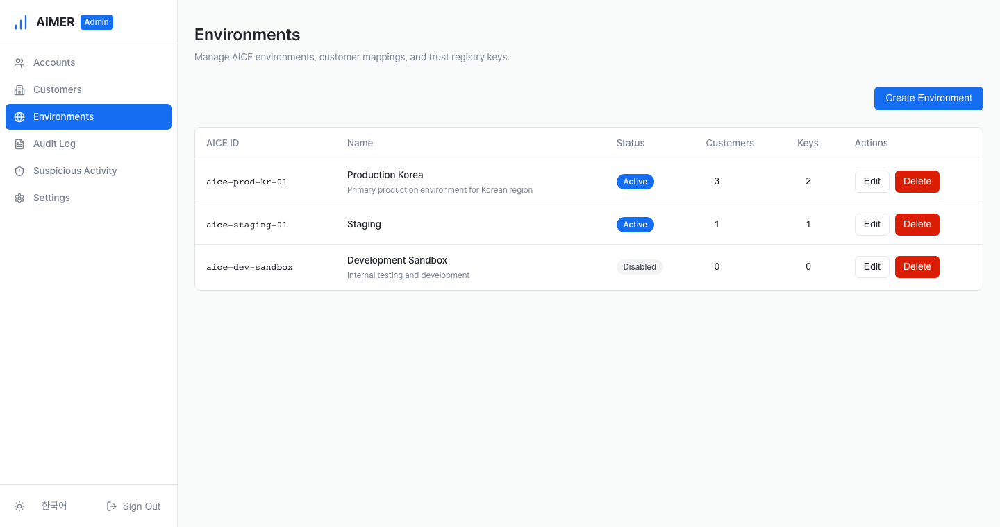
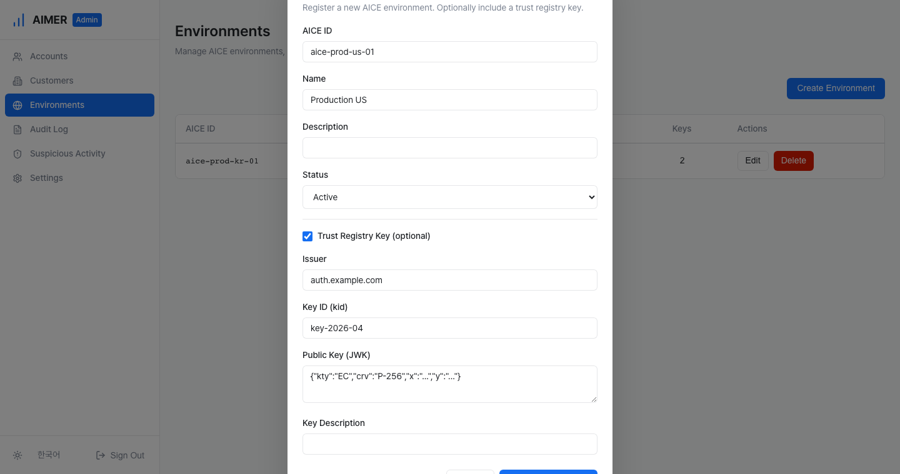
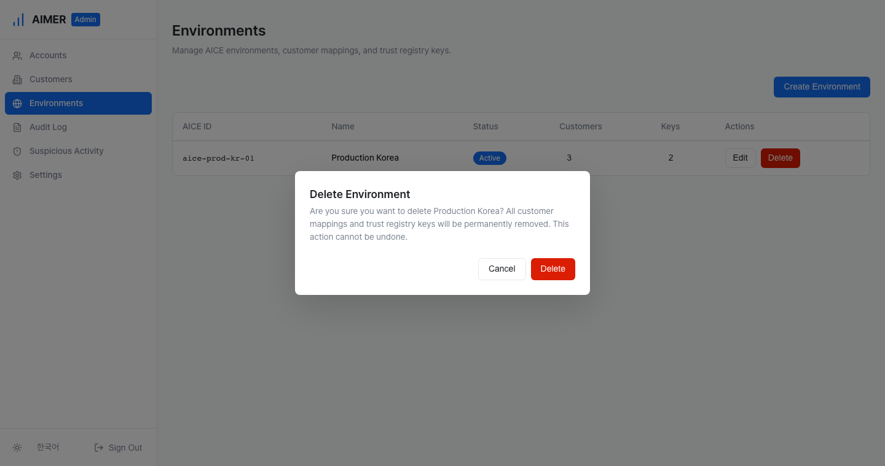

# Environment Management

The Environments page lets System Admins register, view, edit,
and delete AICE environments, manage customer-environment
mappings, and administer trust registry keys. Navigate to
**Environments** in the admin sidebar to open it.

Only System Admins with the `aice-environments:read` permission
can view this page. The `aice-environments:write` permission is
required to create, edit, or delete environments and manage
customer mappings. Trust registry operations require
`trust-registry:read` and `trust-registry:write`.

## Environment table

The table lists all AICE environments in the system. Each row
shows:

- **AICE ID** — the unique identifier for the environment.
- **Name** — the environment's display name, with an optional
    description shown below.
- **Status** — one of Active, Suspended, or Disabled.
- **Customers** — the number of customers linked to this
    environment. Click the count to manage mappings.
- **Keys** — the number of trust registry keys registered.
    Click the count to manage keys.
- **Actions** — edit and delete buttons.

## Creating an environment

1. Click the **Create Environment** button in the top-right
    corner.
2. Fill in the required fields:
    - **AICE ID** — a unique alphanumeric identifier (hyphens
        and underscores allowed).
    - **Name** — a display name for the environment.
    - **Description** — an optional description.
    - **Status** — the initial status (defaults to Active).
3. Optionally check **Trust Registry Key** to register a key
    alongside the environment:
    - **Issuer** — the token issuer identifier.
    - **Key ID (kid)** — the key identifier.
    - **Public Key (JWK)** — paste the JWK JSON.
    - **Key Description** — an optional description.
4. Click **Create Environment** to submit.

## Editing an environment

1. Click the **Edit** button in the Actions column.
2. Modify the name, description, or status as needed.
3. Click **Save** to apply changes.

## Deleting an environment

1. Click the **Delete** button in the Actions column.
2. A confirmation dialog appears warning that all customer
    mappings and trust registry keys will be permanently removed.
3. Click **Delete** to confirm.

Deletion removes the environment record, all associated customer
mappings, and all trust registry keys. This action cannot be
undone.

## Managing customer mappings

Click the customer count in the **Customers** column to open
the customer mapping panel.

### Linking a customer

1. Click the **Link Customer** button.
2. Select a customer from the dropdown. Only customers not
    already linked to this environment are shown.
3. Click **Link Customer** to confirm.

### Unlinking a customer

1. Click the **Delete** button next to the customer.
2. Confirm the removal in the dialog.

## Managing trust registry keys

Click the key count in the **Keys** column to open the trust
registry panel.

### Registering a key

1. Click the **Register Key** button.
2. Fill in the required fields:
    - **Issuer** — the token issuer identifier.
    - **Key ID (kid)** — the key identifier.
    - **Public Key (JWK)** — paste the JWK JSON.
    - **Key Description** — an optional description.
3. Click **Register Key** to submit.

### Enabling or disabling a key

Click **Disable** or **Enable** in the Actions column to toggle
a key's status. Disabled keys are not used for token
verification.

### Removing a key

1. Click the **Remove** button in the Actions column.
2. Confirm the removal in the dialog.

Removing a key is permanent and cannot be undone.

## Audit trail

Environment management actions are recorded in the audit log:

- **environment.created** — when an environment is registered.
- **environment.updated** — when environment details are
    changed.
- **environment.deleted** — when an environment is deleted.
- **environment.customer_linked** — when a customer is linked.
- **environment.customer_unlinked** — when a customer is
    unlinked.
- **trust_registry.key_registered** — when a key is registered.
- **trust_registry.key_disabled** — when a key is enabled or
    disabled.
- **trust_registry.key_removed** — when a key is removed.

View these entries on the [Audit Logs](audit-logs.md) page.
