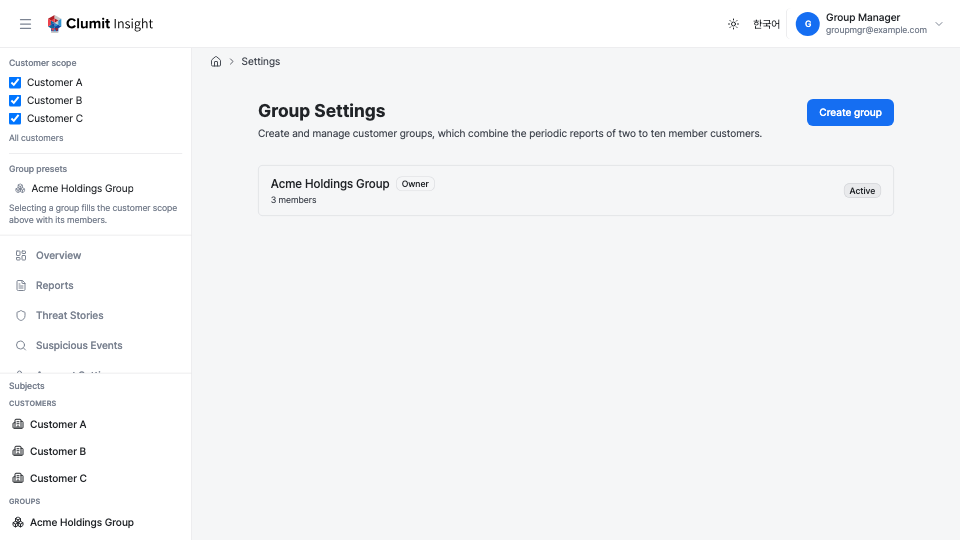
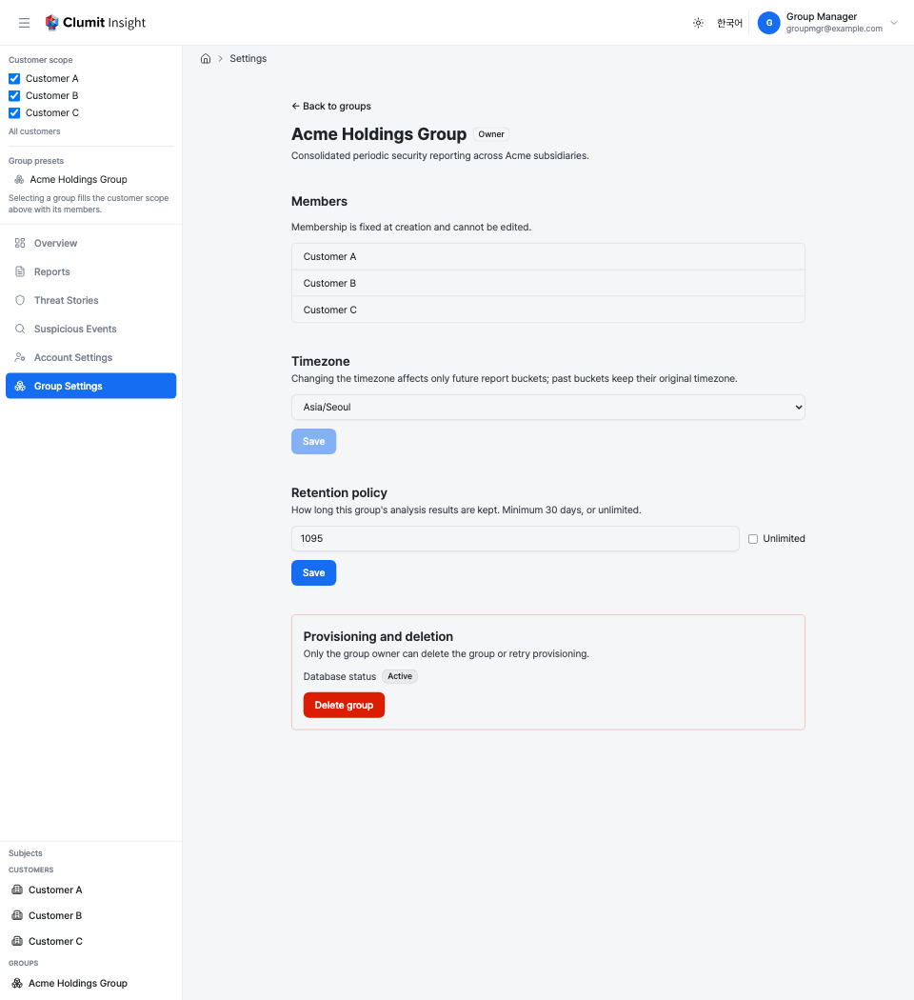

# Group Settings

The **Group Settings** page lets a qualifying manager define and delete
**customer groups** — collections of two to ten member customers whose
periodic security reports are generated and read together. Open it from
**Group Settings** in the sidebar.

This page is a *management* surface. It appears only for accounts that
manage at least one customer (a **Manager** membership role, or an
eligible **Analyst** assignment). Read-only discovery of groups lives on
the sidebar and the [Group Hub](analysis/group-hub.md) instead; this page
is the manage-only counterpart, and it is never offered in a bridged
session.

## What you can manage

- **Create** a group from your accessible, operational customers.
- **View** every group you qualify to manage, with its provisioning
  status and ownership.
- **Edit** a group's timezone and retention policy.
- **Delete** a group you own, and retry provisioning if its database
  failed to provision.

Membership is **fixed at creation** — there are no add/remove member
controls. To change membership, delete the group and create a new one.

## The group list

The list shows every group you qualify to manage: you hold **Manager** or
an eligible **Analyst** role on **every** member of the group. A group you
can merely view (but not manage) does not appear here.

Each row shows:

- **Name** — the group name. Groups you own carry an **Owner** tag.
- **Member count** — how many customers belong to the group.
- **Database status** — the group's dedicated database provisioning
  state: **Provisioning**, **Active**, or **Failed**.

Select a group to open its detail page.

## Creating a group

Click **Create group** to open the create dialog.

1. **Name** the group (and optionally add a description).
2. **Select members** — two to ten customers. The list is limited to your
   **accessible, operational** customers (a customer is operational when
   both its status and its database are active). The selected count is
   shown against the 2–10 range; selecting more than ten is flagged.
3. **Timezone** — the group's report bucket timezone:
    - When every selected member shares one timezone, it is **auto-filled**.
    - When members' timezones differ, the **recommended** timezone from
      the cost preview is pre-selected.
    - Either way, you can change it before confirming.
4. **Review the estimated cost** — once two to ten members are selected,
   the dialog shows the combined recent event volume and the estimated
   monthly tokens and cost. (No estimate is shown while the selection is
   over the ten-member cap.)
5. Click **Create group** to confirm.

The member, cap, operational-state, and permission checks are also
enforced on the server, so a stale selection is rejected with a clear
message rather than creating an invalid group.

## Editing a group

Open a group from the list to reach its detail page.

- **Members** are listed read-only; membership cannot be edited.
- **Timezone** — change the group's report bucket timezone. The change
  affects only **future** report buckets; past buckets keep their original
  timezone. Editable by any qualifying manager.
- **Retention policy** — how long the group's analysis results are kept,
  in days (minimum 30), or **Unlimited**. Editable by any qualifying
  manager.

## Deleting a group

Only the group **owner** can delete a group. On the detail page, the
**Delete group** button is shown to the owner only; it asks for
confirmation, then permanently tears down the group and its dedicated
database. This cannot be undone.

The owner is initially the group's creator and may transfer over the
group's lifecycle.

## Retrying provisioning

If a group's **Database status** is **Failed**, the owner sees a **Retry
provisioning** action on the detail page to re-run the provisioning of the
group's dedicated database.

## Lifecycle

Beyond the manual actions above, a group is kept consistent automatically. A
group must always have a **qualifying manager** — an operational account
that holds the Manager role (or an eligible Analyst assignment) on *every*
member. The platform reconciles each group when its members or their
managers change:

- **Suspend / resume.** If any member becomes non-operational — the member
  customer is suspended, or its database is no longer active — the group is
  automatically **suspended** and report generation pauses. When every member
  is operational again, the group **resumes** and generation continues; the
  reports for the affected period are picked up on the next cycle.
- **Owner transfer.** If the current owner stops qualifying as a manager
  (for example, loses the required role on one of the members) while other
  qualifying managers remain, ownership **transfers automatically** to one of
  them, so the group always has an owner who can manage it.
- **Auto-delete.** If no qualifying manager remains for the group, the group
  is **automatically and permanently deleted**, along with its dedicated
  database. This is immediate and cannot be undone.
