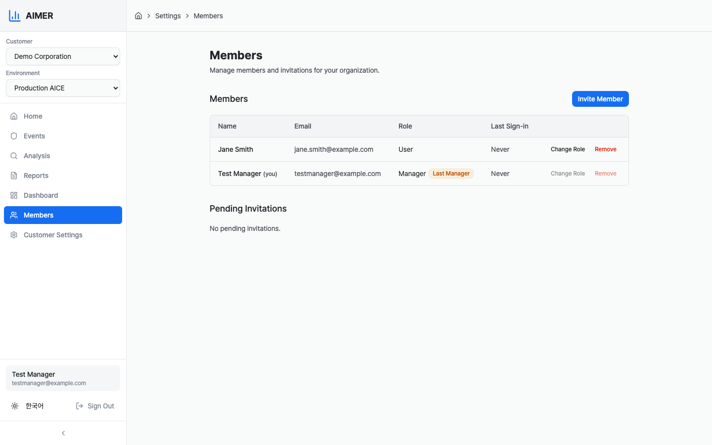
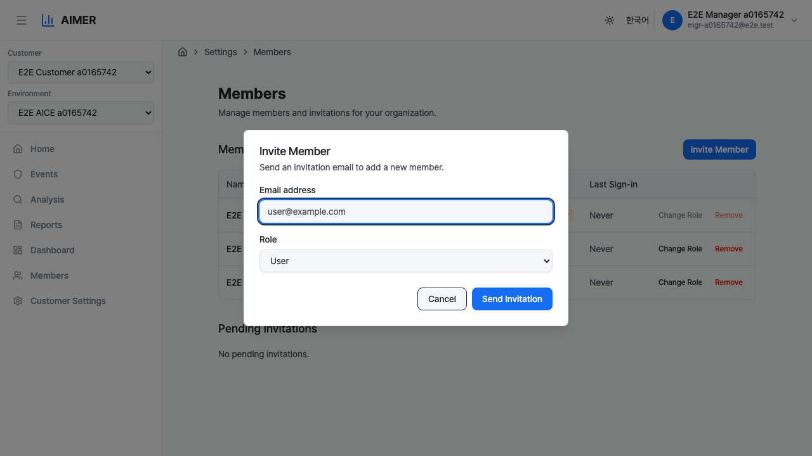
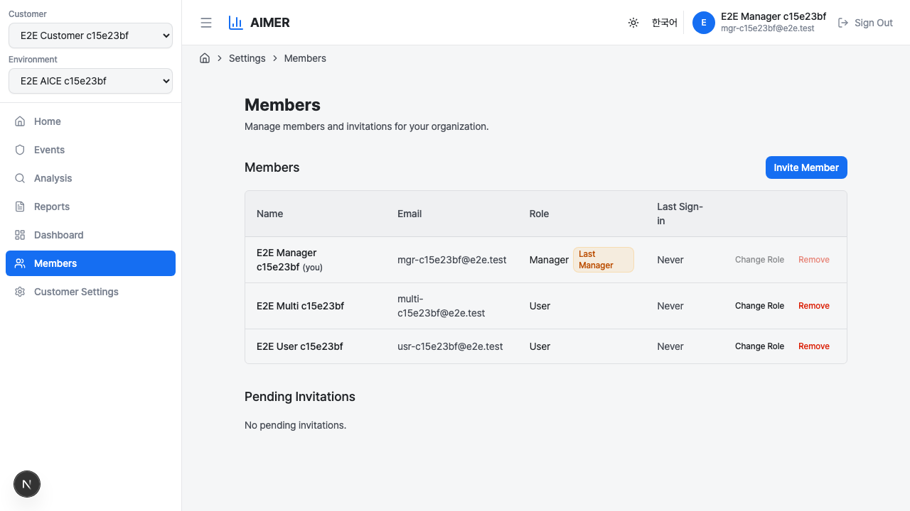

# Members

The Members page lets Managers view, invite, and manage the people
who have access to a customer workspace. Navigate to
**Members** in the sidebar to open it.

Only users with the **Manager** role can see the Members page and
perform management actions. Users with the **User** role do not
see this page in the sidebar.

## Member table

The table lists all current members of the selected customer
workspace. Each row shows:

- **Name** — the member's display name. Your own row is tagged
    with a "(You)" label.
- **Email** — the member's email address.
- **Role** — either User or Manager.
- **Last Sign-In** — the date and time of the member's most recent
    sign-in, or "Never" if they have not signed in.

## Roles

Each member is assigned one of two roles:

- **User** — can access the dashboard, view events, analysis,
    reports, and other standard features.
- **Manager** — has all User permissions plus the ability to
    invite and remove members, change member roles, and configure
    customer settings.

Every workspace must have at least one Manager. The last remaining
Manager cannot be removed or demoted. A warning badge is displayed
next to their name.

## Inviting a new member

1. Click the **Invite** button in the top-right corner of the
    Members section.
2. In the dialog that appears, enter the email address and select
    a role (User or Manager).
3. Click **Send Invitation**.

An invitation email is sent to the specified address. The
invitation is valid for seven days.

If the email address already belongs to a member of the workspace,
an error message is shown.

## Pending invitations

Below the member table, a **Pending Invitations** section shows
invitations that have been sent but not yet accepted. Each row
displays:

- **Email** — the invited email address.
- **Role** — the role assigned to the invitation.
- **Expires At** — when the invitation expires.

To cancel an invitation, click **Revoke** and confirm in the
dialog. The invitation link becomes invalid immediately.

## Accepting an invitation

When a user receives an invitation email, they click the acceptance
link. The flow works as follows:

1. The link redirects to the Clumit Insight sign-in page.
2. After signing in, Clumit Insight verifies that the sign-in email
    matches the invited email and that the email is verified in
    Keycloak.
3. If verification passes, the user is automatically added to the
    customer workspace with the assigned role.

If verification fails (email mismatch, unverified email, or
expired invitation), the user is redirected to the access denied
page with an appropriate error message
(see [Authentication](authentication.md#access-denied)).

Managers can re-invite the same email address. This generates a
new invitation link and resets the seven-day expiry.

## Changing a member's role

Click **Change Role** next to a member's name. A confirmation
dialog shows the new role. Click **Change Role** to confirm. The
change takes effect immediately.

The last Manager in a workspace cannot have their role changed.

## Removing a member

Click **Remove** next to a member's name. A confirmation dialog
asks you to verify the removal. Click **Remove** to confirm. The
member loses access to the workspace immediately.

The last Manager in a workspace cannot be removed.
