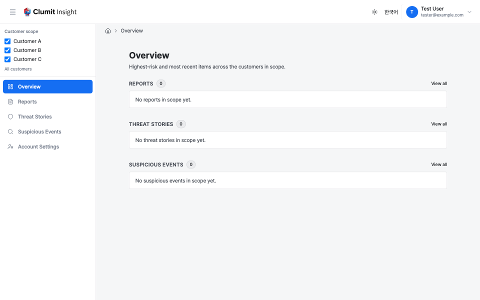

# Navigation

The Clumit Insight dashboard uses a top header bar for branding and
user controls, a sidebar for navigation and context switching, and
breadcrumbs for orientation.

## Header bar

A full-width header bar sits at the top of every authenticated
page. It contains:

- **Left side** — hamburger button (sidebar toggle), Clumit Insight logo,
    and context label (e.g., "Admin" when in the admin dashboard).
- **Right side** — theme toggle, language switcher, and a user
    profile dropdown (avatar, display name, email, and chevron)
    that opens a menu with **Sign Out**.

## Sidebar

The sidebar is displayed on the left side of every dashboard page.
It contains the customer scope selector and navigation links.

### Navigation items

The sidebar includes the following links, each pointing at a top-level
cross-customer surface (see [Cross-Customer Overview](cross-customer-overview.md)):

- **Overview** — the cross-customer vantage that merges the former Home
    and Dashboard; routes to `/overview`.
- **Reports** — report generation.
- **Threat Stories** — the highest-priority threat stories across the
    active scope.
- **Detections** — detections awaiting review across the
    active scope.

All users see a personal settings item:

- **Account Settings** — set your personal language and timezone
    preferences (see [Account Preferences](account-preferences.md)).

Two additional items appear **only when the active scope resolves to a
single customer** (see the customer scope selector below):

- **Members** — manage workspace members and invitations
    (see [Members](members.md)); visible to Managers.
- **Customer Settings** — customer workspace configuration.

These pages render against one customer, so under an "all customers" or
multi-customer scope their links are hidden and visiting them directly
shows a "select a single customer" notice.

### Subjects (customers and groups)

Below the navigation items, a **Subjects** section lists the analysis
subjects you can access, split into two visually-distinct sub-sections:

- **Customers** — every customer you can access. Each entry links to
    that customer's [analysis hub](analysis/customer-hub.md)
    (`/subjects/<id>`), which gathers the customer's reports, threat
    stories, and detection summaries in one place.
- **Groups** — every customer group you can access, marked with a group
    icon. Each entry links to that group's [analysis
    hub](analysis/group-hub.md). A group appears here only when you hold
    `reports:read` on **every** member; a group inaccessible on even one
    member is omitted.

The two sub-sections behave the same way:

- This is the **fastest path** to a subject's hub: open it straight
    from the sidebar rather than drilling into a detail page and
    backtracking through the breadcrumb.
- Clicking a subject **opens its hub**. It does **not** change the
    customer scope — these links carry no `?scope=` parameter and leave
    the cross-customer views untouched. (A group hub link is therefore
    different from a group **scope preset**, described under the scope
    selector below: the link opens the group hub, the preset fills the
    scope filter.)
- The section is **distinct** from the customer-scope selector below:
    the scope selector is an ephemeral filter for the cross-customer
    views, while this section is a set of persistent links into each
    subject's own analysis surface.
- The current subject's link is highlighted while you are anywhere
    under its hub, and the list scrolls on its own when you can access
    many subjects. In collapsed mode each entry shows an icon with the
    subject name; hover for a tooltip.

In a bridge session this section is hidden. Bridge sessions cannot read
a subject's analysis hub (the hub returns `403` under a bridge), and the
group list is empty under a bridge, so there are no reachable hubs to
list.

### Collapsed mode

Click the hamburger button in the header bar to switch between
expanded (256 px) and collapsed (64 px) views. In collapsed mode,
icons are shown with small text labels beneath them; hover over an
item to see a tooltip with the full label. The collapse state is
saved in the browser and persists across sessions.

## Customer scope selector

At the top of the sidebar, the **Customer scope** selector controls
which customers the cross-customer views cover. The default vantage is
**all customers you can access**; you can narrow it to a subset or to a
single customer by checking the customers you want.

- Every accessible customer is listed with a checkbox. When all are
    checked, the scope is **All customers** (the default).
- Unchecking customers narrows the scope to the remaining selection;
    the summary line shows how many of the total are selected.
- The active scope is encoded in the page URL (`?scope=…`), so a
    narrowed view is deep-linkable and shareable. Changing the scope
    preserves other query parameters already on the URL.
- The active scope follows you as you move between sidebar
    destinations, so a narrowed view stays narrowed across navigation.
- Cross-customer pages canonicalize the scope: a shared or hand-typed
    link with a non-canonical value (unsorted, duplicated, or
    inaccessible ids; a garbled or empty value; an explicit full set)
    is redirected to the sorted, deduped canonical form so shared links
    stay stable. Bridge sessions cannot open these cross-customer
    surfaces.

The selector is **customer-only**. There is no global AICE environment
selector: an environment (`aiceId`) is chosen only inside a specific
customer's deep routes, never as an app-wide control.

### Group presets

When you can access one or more customer groups, the scope selector also
lists each group as a **preset** below the customer checkboxes. Selecting
a preset **expands the group into its member customer ids** and applies
them to the scope filter above — a convenient way to browse the
cross-customer views over exactly a group's members.

A group preset is a **pure view filter**, and is deliberately distinct
from opening the group's hub (under **Subjects**):

- A preset **fills the customer multi-select** with the group's members
    and never navigates anywhere or produces any artifact.
- Opening the group hub **navigates** to the group's own analysis
    surface and never changes the scope filter.

Presets are hidden in a bridge session (no groups are listed under a
bridge).

### Bridge sessions

When you access Clumit Insight through a bridge session, the scope is
pinned to the bridge's fixed customer set and cannot be changed. The
scope selector is replaced by a lock icon and a "Locked to bridge
session" label.

## Cross-customer overview surfaces

The top-level **Overview**, **Reports**, **Threat Stories**, and
**Detections** pages merge the highest-risk and most recent items
from every customer in the active scope into one ranked list. See
[Cross-Customer Overview](cross-customer-overview.md) for how they work.
The earlier placeholder routes (`/dashboard`, `/analysis`, `/events`)
redirect to these pages while preserving the active scope.

## User section

The user section is located on the right side of the header bar.
Clicking the profile dropdown opens a menu with your name and
email. From this menu you can:

- **Sign Out** — end your session
    (see [Authentication](authentication.md)).

The header bar also provides:

- **Theme toggle** — switch between light and dark modes.
- **Language switcher** — switch between English and Korean. While you
    are signed in, your choice is also saved to your account, so it
    follows you across devices — the same as setting it in
    [Account Preferences](account-preferences.md), which additionally
    lets you set your timezone. When you are signed out, the switch only
    affects the current browser.

## Mobile menu

On screens narrower than 768 px, the sidebar is hidden and a
hamburger menu button appears in the header bar. Tapping the
button opens the sidebar as a slide-over panel. Navigating to a
page automatically closes the panel.

## Breadcrumbs

A breadcrumb bar appears at the top of the main content area,
showing the current page path. Segments with a destination are
links — click one to navigate to that level. Structural segments
that have no page of their own (for example the `Customers` group
or a report period) render as plain text rather than dead links.

Within a customer scope the breadcrumb shows readable labels
instead of raw identifiers: the customer's name, the report period
and date, and a terminology label with a short identifier for
threat-story and event-analysis pages (for example
`Threat Story · 1f3c9a2b…`).
