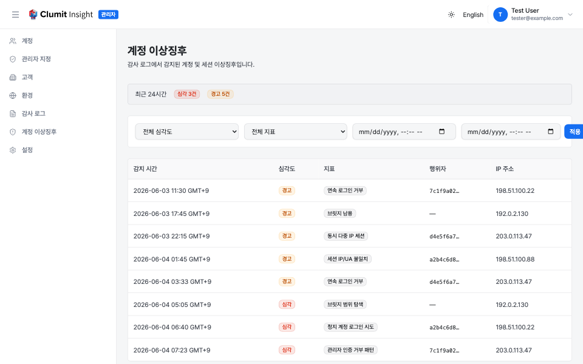
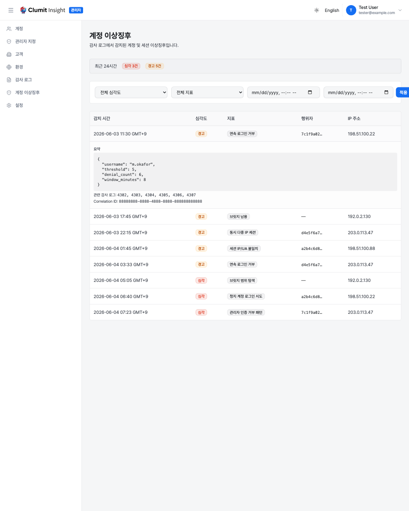

# 계정 이상징후

계정 이상징후 페이지에서 시스템 관리자는 플랫폼이 감사 로그에서 감지한
의심스러운 계정·세션 활동을 검토할 수 있습니다. 관리자 사이드바의
**계정 이상징후**에서 엽니다.

`audit-logs:read` 권한이 있는 시스템 관리자만 이 페이지를 볼 수
있습니다. 이 페이지는 변경 불가능한 감사 저장소를 읽기만 하며 계정
상태를 변경하지 않습니다 — 집행이 아니라 모니터링 화면입니다.

## 알림 표

표에는 감지된 이상징후가 최신순으로 표시됩니다. 각 행은 다음을
보여줍니다.

- **감지 시간** — 이상징후가 기록된 시각으로, 사용자의 시간대로 표시.
- **심각도** — 신뢰도나 영향이 높은 지표는 **심각**(빨강), 검토가
    필요한 패턴은 **경고**(주황).
- **지표** — 어떤 감지 규칙이 발동했는지(아래 참조).
- **행위자** — 활동이 귀속된 계정으로, 축약된 식별자로 표시되며,
    알려진 계정과 연결되지 않은 경우(예: 익명 브릿지 탐색) `—`로 표시.
- **IP 주소** — 알려진 경우 활동이 발생한 출발지 IP.

필터 위의 요약 줄은 **최근 24시간** 동안 기록된 **심각** 및 **경고**
알림 수를 보여주므로 급증을 한눈에 확인할 수 있습니다.

## 감지 지표

플랫폼은 다음 패턴 중 하나가 감지되면 알림을 발생시킵니다.

- **연속 로그인 거부**(경고) — 짧은 시간 동안 한 계정에 대한 반복적인
    로그인 실패.
- **관리자 인증 거부 패턴**(심각) — 관리자 컨텍스트에서의 반복적인
    권한 거부로, 관리자 전용 작업에 대한 탐색을 시사.
- **세션 IP/UA 불일치**(경고) — 세션이 수립된 IP와 다른 IP에서 이후
    요청이 도착.
- **동시 다중 IP 세션**(경고) — 한 계정이 동시에 여러 IP에서 활성.
- **브릿지 남용**(경고) — 브릿지 출처가 설정된 한도를 크게 초과하는
    속도로 요청.
- **브릿지 범위 탐색**(심각) — 브릿지 요청이 부여된 범위 밖의 고객을
    참조.
- **정지 계정 로그인 시도**(심각) — 현재 정지된 계정에 대한 로그인
    시도.

## 필터링

세 가지 컨트롤로 표를 좁힙니다.

- **심각도** — 전체, 심각, 경고.
- **지표** — 위 목록의 단일 지표.
- **시작 / 종료** — 날짜·시간 범위.

컨트롤을 설정하고 **적용**을 누릅니다. **재설정**은 필터를 비웁니다.
결과는 페이지네이션되며, 목록이 길면 **더 보기**로 다음 페이지를
가져옵니다.

## 알림 상세와 감사 로그 연결

행을 클릭하면 펼쳐집니다. 상세 패널은 다음을 보여줍니다.

- **요약** — 알림의 구조화된 근거(예: 거부 횟수와 창, 관찰된 고유 IP,
    브릿지 요청 속도)를 JSON으로 표시.
- **감사 로그 ID** — 이 알림을 발생시키기 위해 감지가 상관 분석한
    구체적인 감사 로그 항목으로, 원시 이벤트까지 추적 가능.
- **상관 ID** — 감사 항목과 알림을 묶는 안정적인 식별자로, 다른 도구와
    교차 참조할 때 유용.

## 감사 로그와의 관계

계정 이상징후는 감사 로그 위에서 파생된 읽기 전용 보기로, 모든 알림은
그것을 만든 감사 항목을 가리킵니다. 해당 원시 항목을 직접 읽거나 기록된
다른 작업을 검토하려면 [감사 로그](audit-logs.md) 페이지를 엽니다.
