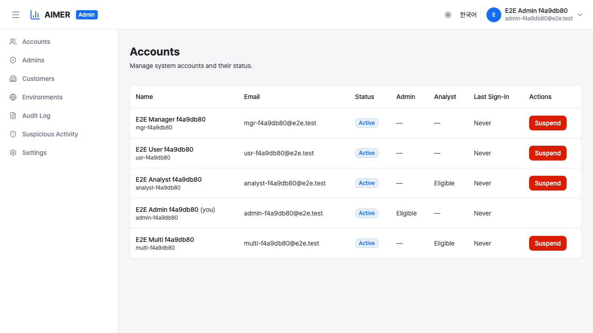
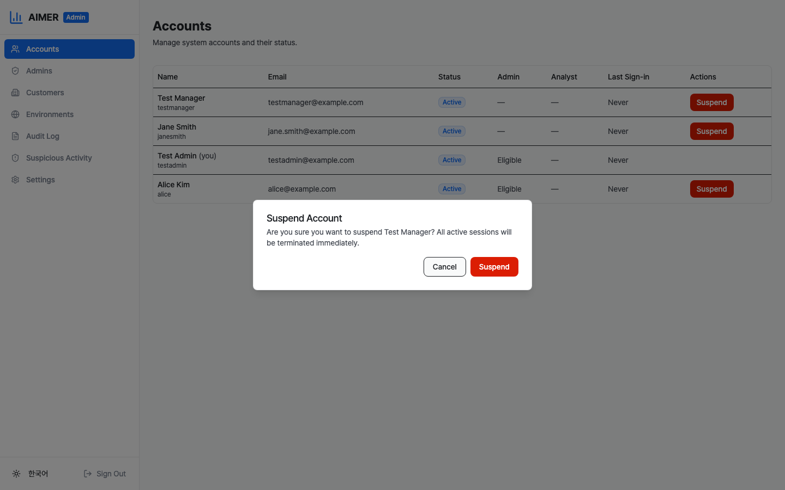

# 계정 관리

계정 페이지에서 시스템 관리자가 시스템의 모든 사용자 계정을
조회하고 관리할 수 있습니다. 관리자 사이드바에서 **계정**을
클릭하여 열 수 있습니다.

이 페이지를 조회하려면 `accounts:read` 권한이 있는 시스템
관리자여야 합니다. 계정을 정지하거나 정지 해제하려면
`accounts:write` 권한이 필요합니다.

## 계정 테이블

테이블에 시스템의 모든 계정이 표시됩니다. 각 행에는 다음 정보가
표시됩니다:

- **이름** — 계정의 표시 이름과 사용자명. 본인의 행에는
    "(나)" 라벨이 표시됩니다.
- **이메일** — 계정의 이메일 주소.
- **상태** — 활성, 정지, 비활성 중 하나.
- **관리자** — 시스템 관리자 접근 자격 여부.
- **분석가** — 분석가 역할 자격 여부.
- **마지막 로그인** — 가장 최근 로그인 일시. 로그인한 적이
    없으면 "없음"으로 표시됩니다.
- **작업** — 정지 또는 정지 해제 버튼 (본인의 계정에는
    표시되지 않음).

## 계정 정지

1. 테이블에서 정지할 계정을 찾습니다.
2. 작업 열의 **정지** 버튼을 클릭합니다.
3. 모든 활성 세션이 즉시 종료된다는 경고와 함께 확인
    대화상자가 나타납니다.
4. **정지**를 클릭하여 확인합니다.

계정이 정지되면:

- 모든 활성 세션(일반 및 관리자)이 즉시 철회됩니다.
- 계정의 토큰 버전이 증가하여 진행 중인 JWT 토큰이 즉시
    무효화됩니다.
- 정지가 해제될 때까지 해당 계정으로 로그인할 수 없습니다.
- 상태 배지가 **정지**(빨간색)로 변경됩니다.

관리자는 자신의 계정을 정지할 수 없습니다. 본인의 행에는
정지 버튼이 표시되지 않습니다.

## 계정 정지 해제

1. 테이블에서 정지된 계정을 찾습니다.
2. 작업 열의 **정지 해제** 버튼을 클릭합니다.
3. 확인 대화상자가 나타납니다.
4. **정지 해제**를 클릭하여 확인합니다.

계정이 **활성** 상태로 돌아가고 사용자가 다시 로그인할 수
있습니다.

## 감사 추적

모든 정지 및 정지 해제 작업은 감사 로그에 기록됩니다. 감사
항목에는 다음이 포함됩니다:

- **account.suspended** — 계정이 정지된 경우.
- **account.restored** — 정지된 계정이 정지 해제된 경우.

두 항목 모두 행위자, 대상 계정, 이전 상태, 새 상태를
기록합니다. [감사 로그](audit-logs.md) 페이지에서 이 항목들을
확인할 수 있습니다.
