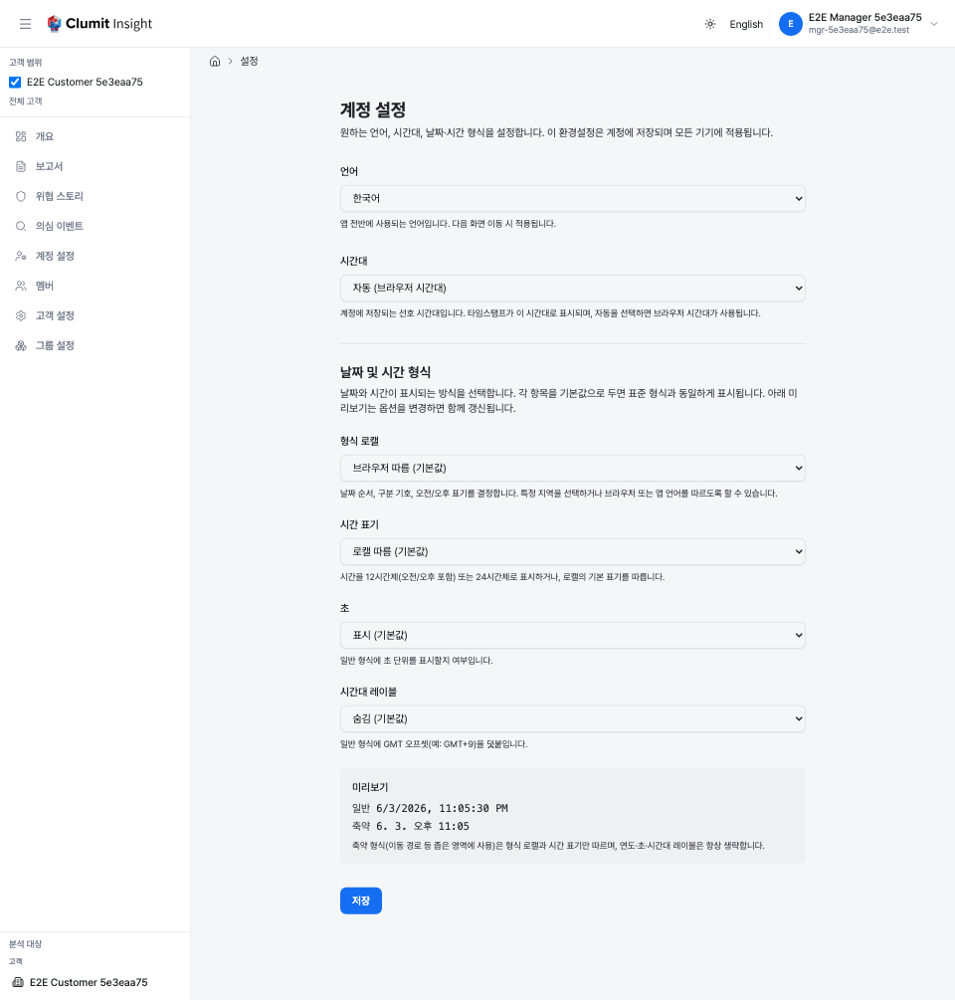

# 계정 환경설정

**계정 설정** 페이지에서 개인 언어, 시간대, 날짜·시간 형식 환경설정을
지정할 수 있습니다. 사이드바의 **계정 설정**에서 엽니다.

이 환경설정은 계정에 저장되므로 여러 기기와 브라우저에서 그대로
따라옵니다. 헤더의 [언어 전환기](navigation.md)도 로그인한 상태에서는
선택한 언어를 계정에 저장하며(로그아웃 상태에서는 현재 브라우저에만
적용됩니다), 이 페이지에서는 전환기에 없는 **시간대** 및 **날짜 및 시간
형식** 컨트롤을 추가로 제공합니다.

## 언어

**언어** 컨트롤은 앱 전반에 사용되는 언어(영어 또는 한국어)를
지정합니다. 환경설정을 저장하면 계정에 기록되고 현재 페이지가
갱신되며, 이후 모든 화면 이동과 로그인하는 모든 기기에 적용됩니다.

### 앱이 표시 언어를 결정하는 방식

활성 언어는 다음 순서로 결정됩니다.

1. **URL의 명시적 언어.** 주소에 이미 언어 접두사(예: `/en/...` 또는
   `/ko/...`)가 있으면 해당 페이지에서는 항상 그 언어가 우선합니다 —
   저장된 환경설정이 명시적 링크를 덮어쓰지 않습니다.
2. **저장된 계정 환경설정.** 주소에 언어 접두사가 없으면 저장된
   **언어**가 사용됩니다.
3. **브라우저 언어.** 저장된 환경설정이 없으면 브라우저 설정에서
   지원 언어(영어, 한국어) 중 가장 잘 맞는 것을 선택합니다.
4. **시스템 기본값.** 일치하는 것이 없으면 배포 기본 언어가
   사용됩니다.

로그인하면 저장된 언어가 이 브라우저에 적용됩니다. 환경설정을 저장한
적이 없는 상태에서 이전에 이 브라우저의 언어를 전환했다면, 그 선택이
로그인 시 저장된 환경설정으로 채택되어 이후에는 브라우저 언어를
조용히 덮어쓰지 않습니다.

## 시간대

**시간대** 컨트롤은 선호하는 시간대를 계정에 기록합니다. 특정
시간대를 저장하지 않으려면 **자동**을 선택하거나, 특정 IANA
시간대(예: `Asia/Seoul`)를 선택합니다. 유효한 IANA 시간대만
허용됩니다.

이 환경설정은 각 타임스탬프가 표시되는 *시간대*를 제어합니다. 기본적으로
타임스탬프는 선택한 시간대로, 브라우저의 로캘과 날짜·시간 표기 관례에
따라 표시되며(영어 예: `6/3/2026, 2:05:30 PM`) 시간대 레이블은 표시되지
않습니다. 아래의 [날짜 및 시간 형식](#날짜-및-시간-형식) 컨트롤로 이를
변경할 수 있습니다. 기준 시각은 항상 UTC로 저장되며 표시만
현지화됩니다.

### 앱이 표시 시간대를 결정하는 방식

표시 시간대는 다음 순서로 결정됩니다.

1. **저장된 계정 시간대.** 특정 시간대를 선택했다면 타임스탬프가
   해당 시간대로 표시됩니다.
2. **브라우저 시간대.** **자동**을 선택한 경우(저장된 시간대 없음)
   브라우저가 보고하는 시간대를 사용합니다.
3. **UTC.** 둘 다 사용할 수 없으면 타임스탬프는 UTC로 표시됩니다.

이는 언어 결정 순서(저장된 값 → 브라우저 → 기본값)와 동일합니다.

이 설정은 고객별로 정의되며 개인 환경설정과 무관한 리포트 **버킷
경계**(DAILY/WEEKLY/MONTHLY 기간)를 변경하지 않습니다 — 개별
타임스탬프의 표시만 시간대를 따릅니다.

## 날짜 및 시간 형식

**날짜 및 시간 형식** 컨트롤로 날짜와 시간이 표시되는 방식을 맞춤
설정할 수 있습니다. 모든 컨트롤을 **기본값**으로 두면 표준 형식이 그대로
유지됩니다. 컨트롤 아래의 **실시간 미리보기**는 현재 선택에 따라 표시되는
샘플 시각(일반 형식과 축약 형식 모두)을 보여주며, 옵션을 변경하면 함께
갱신됩니다.

형식은 네 가지 독립적인 옵션으로 구성됩니다.

- **형식 로캘** — 날짜 순서, 구분 기호, 오전/오후 표기를 결정합니다.
  **브라우저 따름**(기본값)을 선택하면 브라우저의 지역을, **앱 언어
  따름**을 선택하면 위에서 고른 앱 언어를 따르며, 목록에서 특정 지역을
  선택할 수도 있습니다(예: `en-US` `6/3/2026, 2:05:30 PM`, `en-GB`
  `03/06/2026, 14:05:30`, `ko-KR` `2026. 6. 3. 오후 2:05:30`). 월 이름은
  표시되지 않으며 월은 항상 숫자로 표기됩니다.
- **시간 표기** — 시간을 **12시간제**(오전/오후 포함) 또는
  **24시간제**로 표시하거나, **로캘 따름**(기본값)으로 선택한 로캘의
  기본 표기를 사용합니다.
- **초** — 초 단위를 **표시**(기본값)하거나 **숨김**니다.
- **시간대 레이블** — 시간 뒤에 GMT 오프셋(예: `GMT+9`)을
  **숨김**(기본값)하거나 **표시**합니다.

이 환경설정은 시간대와 동일하게(저장된 선택, 없으면 기본값) 결정되어
타임스탬프가 표시되는 모든 곳에 적용됩니다. 표시는 클라이언트에서
이루어지므로, 페이지가 로드될 때까지 각 타임스탬프는 빈 자리표시자로
공간을 확보한 뒤 값을 채웁니다 — 레이아웃 이동이나 잘못된 값의 깜박임이
없습니다.

### 축약 타임스탬프

이동 경로나 이벤트 행 등 일부 좁은 영역에서는 **축약** 타임스탬프를
사용합니다. 축약 형식은 전용 형식으로, **형식 로캘**과 **시간 표기**만
따르며 일반 형식의 선택과 무관하게 연도·초·시간대 레이블을 **항상
생략**합니다 — 긴 레이블이 축약 레이아웃을 깨뜨릴 수 없도록 하기
위함입니다.

## 저장

**저장**을 클릭하면 변경 내용이 저장됩니다. 유효하지 않은 값(지원하지
않는 언어, 알 수 없는 시간대, 제공 목록에 없는 형식 로캘, 또는 알 수 없는
시간 표기)은 거부되며 저장되지 않습니다.
