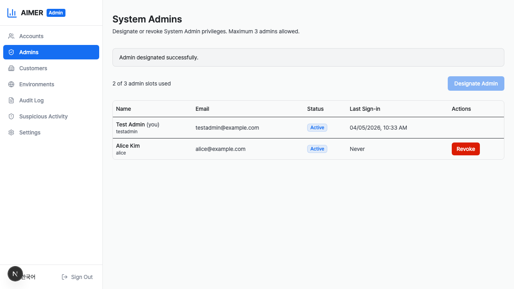
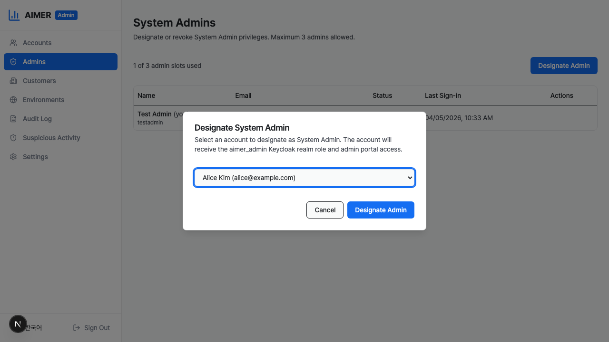
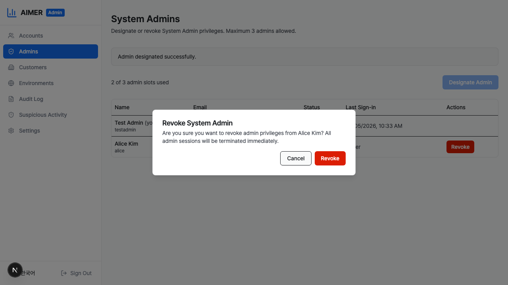

# 시스템 관리자 지정

관리자 지정 페이지에서 기존 시스템 관리자가 다른 시스템 관리자를
지정하거나 철회할 수 있습니다. 관리자 사이드바에서 **관리자 지정**을
클릭하여 페이지를 엽니다.

`accounts:write` 권한이 있는 시스템 관리자만 관리자를 지정하거나
철회할 수 있습니다. 현재 목록을 보려면 `accounts:read` 권한이
필요합니다.

시스템은 언제든지 최대 **3명의 시스템 관리자**를 허용합니다.

## 관리자 테이블

테이블에 현재 모든 시스템 관리자가 나열됩니다. 각 행에는 다음
정보가 표시됩니다:

- **이름** — 관리자의 표시 이름과 사용자명. 본인의 행에는
    "(나)" 라벨이 표시됩니다.
- **이메일** — 관리자의 이메일 주소.
- **상태** — 활성, 정지, 비활성 중 하나.
- **마지막 로그인** — 가장 최근 로그인 날짜와 시간.
    로그인한 적이 없으면 "없음"으로 표시됩니다.
- **작업** — 철회 버튼 (본인 계정에는 표시되지 않음).

테이블 위에 사용 중인 관리자 슬롯 수가 표시됩니다
(예: "관리자 2명 / 최대 3명").

## 새 관리자 지정

1. 테이블 위의 **관리자 지정** 버튼을 클릭합니다.
2. 지정 가능한 계정(활성 상태, 비관리자) 드롭다운이 있는
    대화상자가 나타납니다.
3. 지정할 계정을 선택합니다.
4. **관리자 지정**을 클릭하여 확인합니다.

계정이 시스템 관리자로 지정되면:

- 데이터베이스에서 `admin_eligible` 플래그가 `true`로
    설정됩니다.
- Keycloak에서 `aimer_admin` 영역 역할이 할당됩니다.
- 해당 계정은 MFA를 사용하여 관리자 포털에 로그인할 수
    있습니다.

관리자 지정 버튼은 다음 경우에 비활성화됩니다:

- 최대 3명의 관리자에 도달한 경우.
- 지정 가능한 계정이 없는 경우.

## 관리자 철회

1. 테이블에서 철회할 관리자를 찾습니다.
2. 작업 열의 **철회** 버튼을 클릭합니다.
3. 모든 관리자 세션이 즉시 종료된다는 확인 대화상자가
    나타납니다.
4. **철회**를 클릭하여 확인합니다.

관리자 권한이 철회되면:

- 데이터베이스에서 `admin_eligible` 플래그가 `false`로
    설정됩니다.
- 모든 활성 관리자 세션이 즉시 철회됩니다.
- `admin_eligible`이 `false`로 변경되어 진행 중인 관리자
    JWT가 거부됩니다(`verifyJwtFull`이 매 요청마다 확인).
- 일반(비관리자) 세션은 영향을 받지 않습니다.
- Keycloak에서 `aimer_admin` 영역 역할이 제거됩니다.
- 해당 계정은 더 이상 관리자 포털에 접근할 수 없습니다.

관리자는 자신의 관리자 권한을 철회할 수 없습니다. 본인의
행에는 철회 버튼이 표시되지 않습니다.

## 첫 번째 시스템 관리자 부트스트랩

UI를 통해 지정할 기존 관리자가 없으므로 첫 번째 시스템
관리자는 수동으로 부트스트랩해야 합니다.

1. **Keycloak 영역 역할 할당**: Keycloak 관리자 콘솔을 열고
    **Users**로 이동하여 대상 사용자를 찾은 후 **Role
    Mappings** 탭에서 `aimer_admin` 영역 역할을 할당합니다.

2. **데이터베이스 플래그 설정**: `auth_db` 데이터베이스에
    연결하여 다음을 실행합니다:

        UPDATE accounts
        SET admin_eligible = true, updated_at = NOW()
        WHERE username = '<대상-사용자명>';

두 단계를 모두 완료하면 해당 사용자는 MFA가 활성화된 상태로
`/admin`에서 관리자 포털에 로그인할 수 있습니다.

## Keycloak 서비스 계정 설정

관리자 지정 및 철회 엔드포인트는 Keycloak 서비스 계정을
사용하여 `aimer_admin` 영역 역할을 할당하거나 제거합니다.
이 서비스 계정은 사용자 인증에 사용되는 OIDC 클라이언트와
별개입니다.

1. Keycloak 관리자 콘솔에서 새 **confidential** 클라이언트를
    생성합니다(예: `aimer-admin-sa`).
2. 클라이언트에서 **Service Account Enabled**를 활성화합니다.
3. **Service Account Roles** 탭에서 `realm-management`
    클라이언트의 `realm-admin` 역할을 할당하여 서비스 계정이
    영역 역할 매핑을 관리할 수 있도록 합니다.
4. 클라이언트 ID와 시크릿을 환경에 복사합니다:

        KEYCLOAK_ADMIN_CLIENT_ID=aimer-admin-sa
        KEYCLOAK_ADMIN_CLIENT_SECRET=<생성된-시크릿>

내장 `admin-cli` 클라이언트는 기본적으로
`client_credentials` 부여를 지원하지 않으므로 사용하지
**마십시오**.

## 동시성 안전

3명 관리자 제한은 PostgreSQL 권고 잠금(`pg_advisory_xact_lock`)으로
모든 지정 요청을 직렬화하여 적용됩니다. 이는 두 관리자가
동시에 새 관리자를 지정하려 할 때 발생하는 경쟁 조건을
방지합니다.
