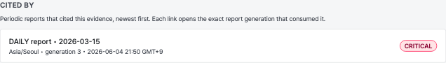

# 분석 결과 페이지

분석 결과 페이지는 하나의 [탐지 이벤트](analysis/suspicious-events.md)에 대한 LLM 분석을 보여줍니다. aice-web-next에서
이벤트 상세 화면을 열고 Clumit Insight 딥링크를 따라가거나, 고객 범위 URL로
직접 접근할 수 있습니다.

## 우선순위와 점수

상단 영역에는 점수 관련 세 가지 항목이 표시됩니다.

- **우선순위 등급(Priority tier)** — `CRITICAL`, `HIGH`, `MEDIUM`, `LOW` 중
  하나입니다. 색상 배지로 표시되며, 아래 두 점수로부터 4×4 매트릭스 룩업을
  통해 결정적으로 도출되는 값입니다. LLM이 직접 반환하는 값이 아닙니다.
- **심각도 점수(Severity score)** — `0.000`–`1.000` 범위, 소수점 세 자리.
  "이 이벤트가 실제 공격이라면 얼마나 심각한가" (영향 범위, 파급 효과,
  자산 중요도)를 나타냅니다.
- **신뢰도 점수(Likelihood score)** — `0.000`–`1.000` 범위, 소수점 세 자리.
  "이것이 노이즈나 오탐이 아닌 실제 위협일 가능성" (증거 품질, IoC 매치,
  합리적인 정상 설명 가능성)을 나타냅니다.

두 축은 어디서나 분리되어 유지되므로, 영향이 크지만 불확실한 이벤트
(`severity≈1.0, likelihood≈0.5`)가 영향이 작지만 확실한 이벤트
(`severity≈0.5, likelihood≈1.0`)와 같은 우선순위로 평탄화되지 않습니다.
매트릭스는 이 두 점수 쌍을 트리아지와 집계에 사용되는 네 등급 중 하나로
변환합니다.

### 등급 매트릭스

|              | L < 0.4 | 0.4 ≤ L < 0.6 | 0.6 ≤ L < 0.8 | L ≥ 0.8  |
|--------------|---------|---------------|---------------|----------|
| S ≥ 0.8      | MEDIUM  | HIGH          | CRITICAL      | CRITICAL |
| 0.6 ≤ S < 0.8 | LOW    | MEDIUM        | HIGH          | HIGH     |
| 0.4 ≤ S < 0.6 | LOW    | LOW           | MEDIUM        | MEDIUM   |
| S < 0.4      | LOW    | LOW           | LOW           | LOW      |

## 점수 근거(Score factors)

각 점수 아래에는 해당 점수를 설명하기 위해 LLM이 생성한 짧은 명사구
(최대 다섯 개)가 칩 형태로 표시됩니다. 각 축(심각도, 신뢰도)은 자체
칩 행을 갖습니다.

- 명사구는 LLM이 생성하며, 축별 최대 다섯 개, 항목당 최대 약 80자입니다.
- LLM이 해당 축에 대해 사용 가능한 명사구를 반환하지 못한 경우
  (예: 입력 이벤트가 설명을 지원하기에 너무 빈약한 경우),
  칩 행에는 `insufficient evidence`라는 단일 자리 표시자가 표시됩니다.
  이 값은 "점수는 기록되었지만 설명을 제공할 수 없음"을 의미하며,
  입력 없이 LLM이 실행되었다는 뜻은 아닙니다.

## MITRE ATT&CK 기법

우선순위 배지 옆에는 LLM이 이벤트와 연관시킨 MITRE ATT&CK 기법 칩
(예: `T1078`, `T1110.001`)이 행으로 표시됩니다. 각 칩에는 기법 ID가
표시되며, 마우스를 올리면 공식 기법 이름이 툴팁으로 나타납니다
(예: `T1078` → "Valid Accounts"). 현재 벤더링된 MITRE 지식 베이스에
존재하지 않는 ID를 가진 칩은 툴팁 없이 표시됩니다 — 해당 분석 행이
이전 MITRE 번들 기준으로 기록된 경우이며, ID만으로 대체 표시됩니다.
LLM이 어떤 기법도 반환하지 않은 경우 칩 행은 표시되지 않습니다.

## 메타데이터 항목

점수 영역 아래에는 분석 메타데이터가 두 열 그리드로 표시됩니다.

- **언어(Language)** — `KOREAN` 또는 `ENGLISH`. 화면에 표시된 분석
  텍스트의 언어입니다. 이벤트별 분석은 **이중 언어**로 제공됩니다. 영어가
  정본(canonical)이며 사용자 언어 행은 이를 번역한 것입니다. 서술과 점수
  근거(factor)는 번역되지만, 심각도·가능성 점수, 우선순위 등급, MITRE 기법
  ID는 영어 정본에서 그대로 복사되므로 두 언어에서 동일합니다. 페이지는 앱
  로캘에 맞는 언어를 표시하며, 링크의 `?lang=en` / `?lang=ko`로 고정할 수
  있습니다. 사용자 언어가 아직 생성되지 않은 경우 영어(그다음 가용한 임의
  언어)로 대체됩니다.

나머지 항목은 **모델/프롬프트 출처(provenance)** — 산출물이 어떻게
생성되었는지 — 이며 분석가에게만 표시됩니다(아래 [분석가 전용
항목](#분석가-전용-항목) 참고):

- **공급자(Provider)** — LLM 공급자 이름 (예: `openai`).
- **모델(Model)** — 요청한 모델 ID (예: `gpt-4o`).
- **모델 스냅샷(Model snapshot)** — 공급자가 보고한 구체적인 모델 버전.
- **프롬프트 버전(Prompt version)** — aimer 프롬프트 템플릿 버전.
- **요청자(Requested by)** — 분석을 요청한 계정 ID. 분석 행에 저장된
  값이 그대로 표시됩니다. 베이스라인 이벤트 자동 분석 워커가 생성한
  결과(사람 요청자가 없음)는 **system**으로 표시됩니다.
- **요청 시각(Requested at)** — 분석을 요청한 시각으로, 사용자의
  시간대에 맞춰 브라우저의 로캘 관례에 따라 표시됩니다. 결정 순서
  (저장된 값 → 브라우저 → UTC)는
  [계정 환경설정 → 시간대](account-preferences.md#시간대)를 참고하세요.

### 분석가 전용 항목

모델/프롬프트 출처 항목과 앱 내 **재생성** 버튼은 해당 고객의
분석가에게만 표시됩니다. 분석가가 아닌 사용자에게도 분석적으로 의미 있는
항목 — 우선순위 등급, MITRE ATT&CK 기법, 언어, 심각도/가능성 점수, 점수
근거 — 은 그대로 표시되지만, 공급자·모델·모델 스냅샷·프롬프트 버전·
요청자·요청 시각 항목은 숨겨지고 앱 내 재생성 컨트롤도 나타나지 않습니다.

재생성 버튼에는 한 가지 조건이 더 있습니다. 분석가이면서 **동시에**
[브리지 세션](cross-customer-overview.md)이 아닐 때만 표시됩니다. 앱 내
재생성 엔드포인트는 *쓰기*를 인가하는데 브리지 세션은 이를 결코 통과할 수
없으므로, 브리지 세션 분석가는 분석(출처 항목 포함)을 읽을 수는 있지만
재생성 버튼은 보지 못합니다.

<!-- 스크린샷 자리표시자: 분석가가 아닌 사용자의 축약된 이벤트 메타데이터
     그리드(모델/프롬프트 출처 항목 없음, 재생성 버튼 없음). 실제 데이터
     스택이 준비되면 비분석가 세션에서 캡처. -->

## 고정된 증거 버전

페이지를 직접 열면 해당 이벤트의 최신 분석이 표시됩니다. 리포트의
[출처 패널](analysis/reports.md#출처)에서 진입한 경우, 링크에는 고정된
`generation`(과 함께 언어·제공자·모델)이 담겨 있어, 페이지는 최신
재분석이 아니라 **리포트가 사용한 바로 그 버전**의 증거를 로드합니다.

고정된 버전을 더 이상 사용할 수 없는 경우 — 더 새로운 세대로
슈퍼시드되었거나 보존 정책으로 제거된 경우 — 페이지는 최신 분석으로
조용히 대체하지 않고 **"이 근거 버전은 더 이상 사용할 수 없습니다"**
안내를 표시합니다. 따라서 출처 링크가 더 새로운 버전을 리포트가 인용한
버전인 것처럼 잘못 나타내는 일은 없습니다.

## 분석 본문

본문에는 PII 토큰이 원래 값으로 복원된 LLM 분석 텍스트가 표시됩니다.
분석 텍스트는 Markdown이며, 페이지는 이를 서식이 적용된 형태로
렌더링합니다 — 제목, 글머리 기호 및 번호 매기기 목록, 인라인 코드
스팬이 원시 `#`, `-`, 백틱 문자가 아니라 스타일이 적용된 요소로
표시됩니다. 본문은 LLM이 생성한 텍스트이므로, 텍스트에 포함된 원시
HTML은 실제 마크업으로 렌더링되지 않고 비활성 텍스트로 처리됩니다.

원본 이벤트에 존재하지 않았지만 LLM이 생성한
`<<UNVERIFIED_IP_...>>` / `<<UNVERIFIED_EMAIL_...>>` /
`<<UNVERIFIED_MAC_...>>` 마커는 목록 항목이나 제목 안에 있더라도
분석의 나머지 부분과 구분되도록 빨간색 알약 배지로 렌더링됩니다.

## 소속 위협 스토리

이 탐지 이벤트가 하나 이상의 위협 스토리의 구성원인 경우, 페이지 상단에
각 상위 스토리로 연결되는 링크(우선순위 등급 배지 포함)를 담은 **소속
위협 스토리** 섹션이 표시됩니다. 이는 신뢰 드릴다운의 상향 절반으로,
이벤트에 도달한 사용자가 그 이벤트가 속한 상관관계로 다시 올라갈 수
있게 해 줍니다. 소속 관계는 각 스토리의 구성원 목록에 대한 역방향
조회로 산출되므로, 스토리가 재분석되어도 일관성이 유지됩니다. 스토리의
구성원 구성은 재분석 세대마다 달라질 수 있으므로, 각 백링크는 **이
이벤트를 구성원 목록에 포함한 바로 그 스토리 세대**를 엽니다 — 이벤트를
다시 묶어 낸 최신 세대로 무턱대고 이동하지 않습니다. 이벤트가 어떤
스토리의 구성원도 아닌 경우 이 섹션은 표시되지 않습니다.

## 인용한 보고서(Cited by)

하나 이상의 정기 리포트가 이 이벤트를 인용한 경우, 페이지에는 해당
리포트를 최신순으로 나열하는 **인용한 보고서** 추적이 표시됩니다. 각 항목은
이 이벤트를 사용한 **정확한 리포트 세대**로 다시 연결됩니다 — 링크는
세대 고정이므로 최신 버전이 아니라 리포트가 작성된 시점의 버전으로
이동합니다. 또한 추적은 **현재 보고 있는 증거 세대**를 기준으로
범위가 한정됩니다. 즉, *이* 세대의 이벤트를 인용한 리포트만 나열하므로,
(리포트의 출처 링크를 통해) 더 이전의 고정 세대로 도착하면 다른 세대가
아니라 그 세대를 인용한 리포트가 표시됩니다. 한 이벤트는 여러 구간의
리포트에 인용될 수 있으며, 추적은 리포트 버킷마다 한 항목을 나열합니다.
어떤 리포트에도 인용되지 않은 이벤트는 추적을 표시하지 않습니다(오류가
아닌 정상 상태입니다).

이 추적은 권한으로 게이트됩니다. 고객의 리포트를 읽을 수 있는
(`reports:read`) 사용자에게만 표시되며, 권한이 없는 사용자에게는 열 수
없는 링크 대신 추적이 표시되지 않습니다.

## 원본 이벤트

원본 이벤트는 신뢰 체인의 최하단입니다. aimer-web은 원본 이벤트
페이로드를 저장하지 않고 (토큰화된) 분석만 저장하므로, 이 마지막 단계는
**aice-web-next 원본 이벤트로의 외부 링크**입니다. 원본 이벤트가 여전히
존재하는 경우, 페이지에는 강제 재실행 동작과 함께 **aice-web-next에서 원본
이벤트 보기** 링크가 표시됩니다.

원본이 보존 정책으로 제거된 경우(아래 보존 배너 참조), 체인은 보존된
분석에서 자연스럽게 끝납니다. 원본 이벤트 링크는 **렌더링되지 않으므로**
사용자가 깨진 링크를 따라가지 않습니다. 보존 배너가 체인 종료 상태를
명시적으로 알려 줍니다.

## 보존 배너

원본 행이 보존 정책에 의해 제거되었지만 분석 행이 남아 있는 경우,
페이지에는 "원본 이벤트는 보존 정책에 따라 삭제되었으며, 분석 결과는
보존되었습니다."라는 노란색 배너가 표시됩니다. 이 상태에서는 "원본 이벤트
보기" 단계와 "강제 재실행" 버튼이 모두 숨겨집니다 — 링크할 원본 이벤트가
더 이상 존재하지 않으며, 강제 재실행에는 aice-web-next만 보관한 원본
이벤트 페이로드가 필요하기 때문입니다.

조회하는 원본 행은 결과 생성 방식에 따라 달라집니다. 수동 결과는
`detection_events`를, 베이스라인 이벤트 자동 분석 결과는 `baseline_event`를
조회합니다(자동 결과에는 `detection_events` 행이 없으므로, 베이스라인
이벤트가 남아 있는 한 보존 정책으로 삭제된 것으로 취급되지 않습니다).

## 이벤트 재생성(앱 내)

원본 이벤트가 여전히 존재하는 경우, 분석가에게는 원본 이벤트 링크 옆에
**재생성** 버튼이 표시됩니다([분석가 전용 항목](#분석가-전용-항목)에
설명된 조건으로 게이팅됨). 클릭하면 비용 경고가 포함된 확인 모달이 열린
뒤, 이미 수집된 이벤트에 대해 **Clumit Insight 내부에서** AI 분석을 다시
실행합니다.

이 경로는 레다크션을 **그대로 유지**합니다. 이 이벤트에 대해 이미 저장된
동일한 레다크션 이벤트를 다시 분석하므로(원래 이벤트 시각을 복원),
aimer는 원본 페이로드를 보지 않고 aice-web-next와도 통신하지 않습니다.
기본적으로는 **현재 보고 있는 변형** — 페이지 URL의 언어와 모델 — 을
재생성합니다. 새 결과가 도착하면 최신 세대를 대체하고(이전 결과 행은
`superseded_at` 스탬프와 함께 보존됨), 페이지는 새 세대로 이동합니다.

이벤트 분석은 동기식이므로, (작업을 대기열에 추가하는) 스토리/보고서
재생성과 달리 새 세대가 기록되는 즉시 반환됩니다.

<!-- 스크린샷 자리표시자: 앱 내 이벤트 재생성 확인 모달. 실제 데이터
     스택이 준비되면 분석가 세션에서 캡처. -->

## 모델 선택 및 비교

모델 관련 컨트롤은 분석가 전용입니다. 모델 선택과 두 모델 비교는 고객별
표준 기본 모델과 무관합니다 — 기본 모델을 변경하는 것이 아니라 이 산출물에
대한 일회성 재정의입니다.

### 재생성 시 모델 선택

재생성 확인 모달에는 **모델** 드롭다운이 포함되어 있으며, 구성된 모델
카탈로그를 나열하고 현재 보고 있는 모델을 기본값으로 합니다. 제출하면
선택한 `(제공자, 모델)`로 이벤트 분석을 재생성하고 — 저장된 동일한 레다크션
이벤트와 복원된 이벤트 시각은 그대로이며 모델만 달라집니다 — 페이지는
**해당** 모델 변형의 새 세대로 이동합니다(현재 언어와 로케일 유지). 기본이
아닌 모델은 자체적으로 저장되는 변형이므로, 드롭다운을 바꾸면 페이지를
벗어나지 않고 두 번째 변형을 생성할 수 있습니다.

### 나란히 비교

분석 본문 위에 **비교 대상** 선택기가 있습니다. 두 번째 모델을 고르면 열려
있는 변형과 비교 변형이 두 열로 렌더링되며, 항목별로 정렬됩니다: 분석
텍스트, 심각도 / 가능성 점수와 요인 칩, MITRE ATT&CK 기법, 우선순위 등급,
그리고 열별 출처 정보(제공자, 모델, 모델 스냅샷, 프롬프트 버전, 세대).
좁은 화면에서는 열이 세로로 쌓입니다. 선택은 URL에
저장되므로(`?compareModelName=…&compareModel=…`) 비교를 공유할 수 있으며,
**비교 종료**로 해제합니다.

비교는 이미 저장된 변형에 대한 **읽기 전용**입니다 — 비교 모드에 들어가도
아무것도 생성하지 않습니다. 기본 열은 고정된 세대를 따르고, 비교 열은 비교
모델의 동일 언어 최신 분석으로 해석됩니다. 비교 모델이 이 이벤트에 대해 아직
생성되지 않은 경우, 자동 생성 대신 해당 모델이 미리 선택된 **재생성** 동작이
포함된 알림이 표시됩니다 — 새 분석은 aimer 호출을 소비하므로 명시적 선택으로
남습니다. 원본 이벤트가 보존 정책에 따라 삭제된 경우 재생성이 불가능하므로,
그 알림은 동작하지 않는 재생성 컨트롤 없이 표시됩니다.

비교 선택기는 재생성할 수 없는
[브리지 세션](cross-customer-overview.md) 분석가를 포함하여 **모든**
분석가에게 제공됩니다. 2모델 비교를 읽는 것은 읽기 작업이므로 제한되지
않습니다. 쓰기 작업 — 재생성 모델 선택기와 미생성 변형 재생성 CTA — 만
브리지가 아닌 분석가 세션과 존재하는 원본 이벤트를 요구합니다.

<!-- 스크린샷 자리표시자: 두 모델 변형을 나란히 보여주는 분석가 이벤트 비교
     화면. 저장된 두 이벤트 변형을 보유한 실제 데이터 스택이 준비되면 캡처. -->

## 강제 재실행

원본 이벤트가 여전히 존재하는 경우, 페이지에는 "aice-web-next에서 강제
재실행" 링크가 표시됩니다. 이 링크를 클릭하면 aice-web-next의
원본 이벤트 상세 페이지가 열리며, 다음 분석 클릭 시 aice-web-next가
`force=true`로 호출하여 캐시된 결과를 우회하도록 지시하는 쿼리
파라미터가 전달됩니다. 위의 **원본 이벤트 보기** 단계(원본 이벤트로의
읽기 전용 링크)와 달리, 이 링크는 재실행 신호를 함께 전달합니다.

**강제 재실행과 앱 내 재생성의 차이.** 두 재실행 경로는 서로 중복이
아니라 상호 보완적입니다. 앱 내 **재생성**은 레다크션을 그대로 유지한 채
이미 수집된 레다크션 이벤트를 aimer-web 내에서 다시 분석합니다. **강제
재실행**은 이벤트를 aice-web-next로 넘겨 원본 소스에서 `force=true`로 다시
제출하여 캐시된 분석 결과를 우회합니다 — 이는 원본 페이로드가 필요한
작업이며, 그 페이로드는 aice-web-next만 보유합니다.

레다크션 경계에 유의하세요. `force=true`는 *분석 결과* 캐시를 우회할 뿐
aimer-web의 *레다크션* 캐시는 우회하지 않습니다. 이벤트의
`detection_events` 행이 존재하는 동안 `ingestAndRedact()`(`run-analyze-flow.ts`)는
다시 레다크션하지 않고 저장된 레다크션 형태를 재사용합니다. 따라서 강제
재실행이 현재 정책으로 레다크션을 갱신하는 것은 aice-web-next가 소스에서
다시 수집하면서 저장된 이벤트를 교체할 때뿐이며, 이는 aice-web-next가
소유하는 저장소 간 계약(aicers/aice-web-next#629)이지 aimer-web 단독의
보장이 아닙니다. 소스 시스템에서 새로 가져와야 할 때는 강제 재실행을,
동일한 레다크션 입력에 대해 모델을 다시 실행하려면 재생성을 사용하세요.
