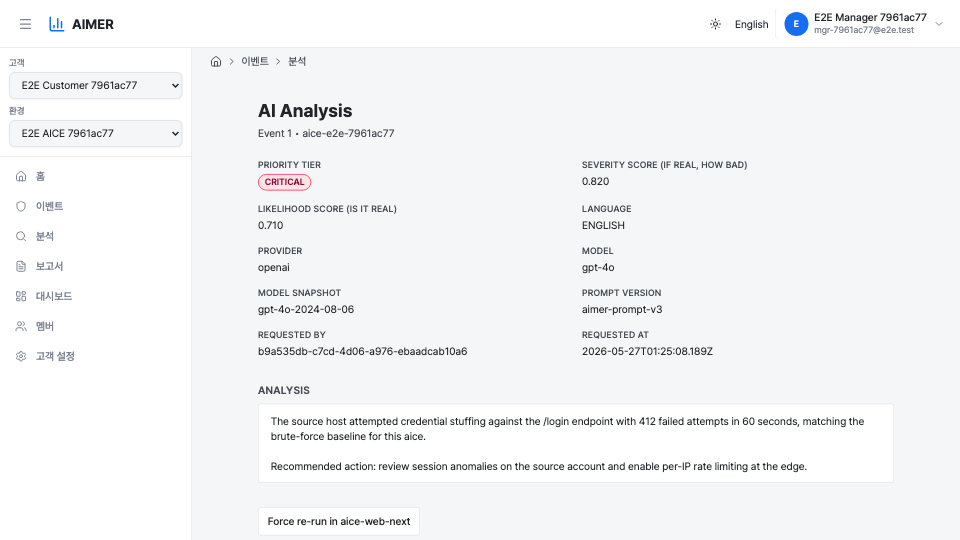

# 분석 결과 페이지

분석 결과 페이지는 단일 보안 이벤트에 대한 LLM 분석을 보여줍니다. aice-web-next에서
이벤트 상세 화면을 열고 aimer-web 딥링크를 따라가거나,
`/customers/{customerId}/aice/{aiceId}/events/{eventKey}/analysis` 경로로
직접 접근할 수 있습니다.

## 우선순위와 점수

상단 영역에는 점수 관련 세 가지 항목이 표시됩니다.

- **우선순위 등급(Priority tier)** — `CRITICAL`, `HIGH`, `MEDIUM`, `LOW` 중
  하나입니다. 색상 배지로 표시되며, 아래 두 점수로부터 4×4 매트릭스 룩업을
  통해 결정적으로 도출되는 값입니다. LLM이 직접 반환하는 값이 아닙니다.
- **심각도 점수(Severity score)** — `0.000`–`1.000` 범위, 소수점 세 자리.
  "이 이벤트가 실제 공격이라면 얼마나 심각한가" (영향 범위, 파급 효과,
  자산 중요도)를 나타냅니다.
- **신뢰도 점수(Likelihood score)** — `0.000`–`1.000` 범위, 소수점 세 자리.
  "이것이 노이즈나 오탐이 아닌 실제 위협일 가능성" (증거 품질, IoC 매치,
  합리적인 정상 설명 가능성)을 나타냅니다.

두 축은 어디서나 분리되어 유지되므로, 영향이 크지만 불확실한 이벤트
(`severity≈1.0, likelihood≈0.5`)가 영향이 작지만 확실한 이벤트
(`severity≈0.5, likelihood≈1.0`)와 같은 우선순위로 평탄화되지 않습니다.
매트릭스는 이 두 점수 쌍을 트리아지와 집계에 사용되는 네 등급 중 하나로
변환합니다.

### 등급 매트릭스

|              | L < 0.4 | 0.4 ≤ L < 0.6 | 0.6 ≤ L < 0.8 | L ≥ 0.8  |
|--------------|---------|---------------|---------------|----------|
| S ≥ 0.8      | MEDIUM  | HIGH          | CRITICAL      | CRITICAL |
| 0.6 ≤ S < 0.8 | LOW    | MEDIUM        | HIGH          | HIGH     |
| 0.4 ≤ S < 0.6 | LOW    | LOW           | MEDIUM        | MEDIUM   |
| S < 0.4      | LOW    | LOW           | LOW           | LOW      |

## 메타데이터 항목

점수 영역 아래에는 분석 메타데이터가 두 열 그리드로 표시됩니다.

- **언어(Language)** — `KOREAN` 또는 `ENGLISH`. 분석 텍스트가 생성된
  언어와 일치합니다.
- **공급자(Provider)** — LLM 공급자 이름 (예: `openai`).
- **모델(Model)** — 요청한 모델 ID (예: `gpt-4o`).
- **모델 스냅샷(Model snapshot)** — 공급자가 응답에서 보고한 구체적인
  모델 버전이 있는 경우 표시됩니다.
- **프롬프트 버전(Prompt version)** — aimer 프롬프트 템플릿 버전이
  보고된 경우 표시됩니다.
- **요청자(Requested by)** — 분석을 요청한 계정 ID. 분석 행에 저장된
  값이 그대로 표시됩니다.
- **요청 시각(Requested at)** — 요청의 ISO 8601 타임스탬프.

## 분석 본문

본문에는 PII 토큰이 원래 값으로 복원된 LLM 분석 텍스트가 표시됩니다.
원본 이벤트에 존재하지 않았지만 LLM이 생성한
`<<UNVERIFIED_IP_...>>` / `<<UNVERIFIED_EMAIL_...>>` /
`<<UNVERIFIED_MAC_...>>` 마커는 분석의 나머지 부분과 구분되도록
빨간색 알약 배지로 렌더링됩니다.

## 보존 배너

`detection_events` 원본 행이 보존 정책에 의해 제거되었지만 분석 행이
남아 있는 경우, 페이지에는 "Source event removed by retention; analysis
result preserved."라는 노란색 배너가 표시됩니다. 강제 재실행 버튼은 이
상태에서 숨겨집니다 — 강제 재실행에는 원본 이벤트 페이로드가 필요한데,
이는 aice-web-next만 보관하고 있기 때문입니다.

## 강제 재실행

원본 이벤트가 여전히 존재하는 경우, 페이지에는 "Force re-run in
aice-web-next" 링크가 표시됩니다. 이 링크를 클릭하면 aice-web-next의
원본 이벤트 상세 페이지가 열리며, 다음 분석 클릭 시 aice-web-next가
`force=true`로 호출하여 캐시된 결과를 우회하도록 지시하는 쿼리
파라미터가 전달됩니다.
