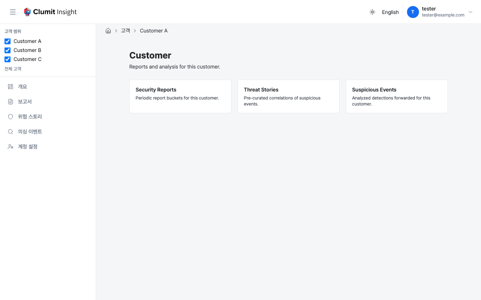

# 고객 허브

고객 허브는 단일 고객의 분석 화면으로 들어가는 진입점입니다. 해당
고객의 정기 리포트, 위협 스토리, 의심 이벤트로 연결되어, 모든 개별
분석이 ID를 알아야만 접근할 수 있는 고아 URL이 아니라 탐색 가능한
홈을 갖게 됩니다.

## 섹션

허브는 최대 세 개의 섹션 카드를 렌더링하며, 각 카드는 목록으로
연결됩니다.

- **보안 리포트** — 정기 리포트 인덱스([정기 보안 리포트](reports.md)
  참고).
- **위협 스토리** — 고객 범위 [위협 스토리 목록](threat-stories.md).
- **의심 이벤트** — 고객 범위 [의심 이벤트 목록](suspicious-events.md).

## 접근 제어

허브는 **섹션별로 멤버 권한을 확인**합니다.

- **보안 리포트** 섹션은 호출자가 `reports:read` 권한을 가질 때만
  렌더링됩니다.
- **위협 스토리**와 **의심 이벤트** 섹션은 호출자가 `analyses:read`
  권한을 가질 때만 렌더링됩니다.

일부 권한만 가진 호출자는 허용된 섹션만 보게 되며, 나머지는 비활성
상태로 표시되는 것이 아니라 숨겨집니다. 어떤 권한도 없는 멤버도 허브에는
접근할 수 있으며, 오류 대신 "접근 가능한 섹션 없음" 안내가 표시됩니다.

허브 자체는 호출자가 **해당 고객의 멤버가 전혀 아닐 때만** `404`를
반환합니다(존재 은닉, 리포트·분석 페이지와 동일). 거부된 브리지
세션은 실제 `403`을 반환합니다. 이 단일 고객 화면은 브리지에서 읽을
수 없습니다.
