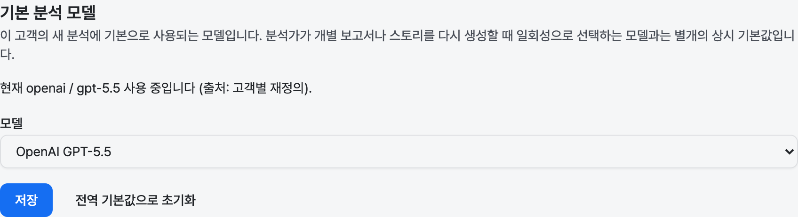
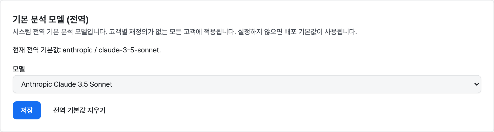

# 기본 분석 모델

**기본 분석 모델**은 고객의 새 분석에 기본으로 사용되는 모델입니다.
데이터베이스에 저장되는 상시 설정이며 세 단계로 해석되므로, 환경 재배포
없이도 고객마다 서로 다른 모델(비용·품질 절충)을 사용할 수 있습니다.

이 설정은 분석가가 개별 보고서나 스토리를 다시 생성할 때 일회성으로
선택하는 모델과는 별개의 계층입니다
([개별 산출물 모델 선택과의 관계](#개별-산출물-모델-선택과의-관계) 참고).

## 해석 순서

고객에 대해 기본 모델이 필요할 때 — 새 분석, 그리고 모델을 명시하지 않은
강제 재생성이나 요약/상세 보기 — 다음 순서로 해석됩니다.

1. **고객별 재정의** — 해당 고객에 대해 설정된 값.
2. **관리자 설정 전역 기본값** — 시스템 관리자가 설정한 시스템 전역
    기본값 하나.
3. **배포 기본값** — 환경 변수 기본값
    (`ANALYSIS_DEFAULT_MODEL_NAME` / `ANALYSIS_DEFAULT_MODEL`). 두 데이터
    베이스 계층이 모두 설정되지 않은 경우 기존 배포가 계속 동작하도록
    유지합니다.

사용 가능한 값이 있는 첫 번째 계층이 적용됩니다. 저장된 값이 더 이상
허용된 모델 목록에 없으면(예: 이후 목록에서 제거된 모델) 건너뛰고 다음
계층을 사용하므로, 오래된 설정이 페이지 로딩을 깨뜨리지 않습니다.

## 권한

| 설정 | 조회·변경 가능 대상 |
| --- | --- |
| **전역 기본값** | 시스템 관리자만. |
| **고객별 재정의** | 시스템 관리자(모든 고객) 및 해당 고객에 배정된 분석가. |

관리자(Manager)와 사용자(User)는 기본 분석 모델을 조회하거나 변경할 수
없습니다. 모든 변경에는 변경한 주체가 기록됩니다.

## 고객 기본 모델 설정

해당 고객에 배정된 분석가는 **고객 설정**의 **기본 분석 모델** 항목에서
고객별 기본값을 설정합니다. 단일 고객 범위로 고객 설정을 엽니다.

1. **모델** 드롭다운에서 모델을 선택합니다. 목록은 이 배포의 허용된 모델
    목록입니다.
2. **저장**을 클릭합니다.

이 항목에는 현재 적용 중인 모델과 그 출처(고객별 재정의, 전역 기본값,
배포 기본값)가 표시됩니다.

시스템 관리자는 분석가로 배정되지 않은 고객을 포함해 **모든** 고객의
재정의를 **관리자 → 설정** 페이지의 **기본 분석 모델 (고객별)** 항목에서
설정할 수 있습니다. 고객을 선택한 뒤 모델을 고르고 **저장**하거나,
**전역 기본값으로 초기화**로 재정의를 지웁니다. 이 관리자 화면과 분석가용
고객 설정 컨트롤은 동일한 설정을 다루며, 분석가 화면과 마찬가지로 두
화면 모두 변경이 성공하면 해당 고객의 기존 데이터를 다시 분석할지
안내합니다([변경이 미치는 영향](#변경이-미치는-영향) 참고).

### 재정의 지우기(전역으로 초기화)

고객별 재정의가 설정되어 있으면 **전역 기본값으로 초기화** 버튼이
나타납니다. 재정의를 지우면 고객별 값이 제거되고 고객은 전역 기본값(전역
기본값이 없으면 배포 기본값)으로 되돌아갑니다.

## 전역 기본값 설정

시스템 관리자는 **관리자 → 설정** 페이지의 **기본 분석 모델(전역)**
항목에서 시스템 전역 기본값을 설정합니다.

1. **모델** 드롭다운에서 모델을 선택합니다.
2. **저장**을 클릭합니다.

**전역 기본값 지우기**를 사용하면 전역 기본값이 제거되고 전역 해석이
배포 기본값으로 되돌아갑니다.

## 잘못된 값

설정기는 허용된 목록에 없는 모델을 차단합니다. 저장이 거부되고 사용할 수
없는 값을 저장하는 대신 오류가 표시됩니다. 두 번째 안전장치로, 저장된
값이 이후 목록에서 벗어나면 해석이 이를 건너뛰고 실패하지 않고 다음
계층으로 되돌아갑니다.

이 경우 **전역 기본값** 섹션은 오래된 값을 실제 적용 중인 것처럼 표시하지
않습니다. 무시되고 있는 저장된 값과 실제로 적용 중인 배포 기본값을 함께
보여주고, 관리자에게 유효한 모델을 선택하거나 전역 기본값을 지우도록
안내합니다. 따라서 설정 페이지는 항상 해석기가 실제로 사용하는 값과
일치합니다.

## 변경이 미치는 영향

고객의 기본 모델을 변경하면 **향후** 분석(및 모델을 명시하지 않은 강제
재생성)에만 영향을 줍니다. **기존 결과는 변경되지 않습니다.**

변경이 성공하면 — 고객 설정에서 변경하든 관리자 고객별 화면에서
변경하든 — 새 모델로 고객의 기존 데이터를 다시 분석할지 묻는 안내가
표시됩니다. 이 안내는 후속 작업의 **진입점**입니다. **기존 데이터 다시
분석** 버튼은 고객별 재분석 페이지(분석가 화면은 고객 설정 재분석 페이지,
관리자 화면은 선택한 고객에 대응하는 관리자 재분석 페이지)를 열고, **닫기**
버튼은 아무 작업 없이 안내를 닫습니다. 이는 **안내일 뿐** 아무것도 자동으로
다시 분석되지 않습니다. 모든 기존 데이터를 다시 분석하는 것은 운영자가
의도적으로 실행하는 비용 제한 작업이기 때문입니다.

재분석 페이지는 범위가 지정된 그 실행(고객의 스토리·이벤트 분석을 다시
실행한 뒤 보고서를 새로고침)을 위한 안정적인 인앱 진입점입니다. 해당
실행의 비용 미리보기와 실행 컨트롤은 별도로 제공되며, 그 전까지 이 페이지는
작업을 설명하고 새 기본 모델을 표시하며, 재분석을 의도적으로 시작하기
전까지 기존 결과가 그대로 유지됨을 다시 안내합니다.

## 기본 변형과 커버리지

보고서나 스토리의 모델이 고객의 해석된 기본값과 일치하면 **기본
변형**으로 취급됩니다. 상세 보기는 이 변형을 표시하고 2-모델 비교 보기에서
기준 "기본" 열로 사용하며, 커버리지 표시기도 이 변형을 기준으로
계산됩니다.

이제 기본값이 고객별이므로 이 "기본 변형" 판정도 다른 모든 것과 동일한 세
단계 해석을 따릅니다. 즉, 배포 전역의 단일 값이 아니라 고객의 실효
기본값을 추적합니다. 분석 워커가 기본으로 시드하는 변형과 커버리지 로직이
기본으로 취급하는 변형은 항상 동일하므로, 어느 열이 기본인지에 대해 서로
어긋나지 않습니다.

## 개별 산출물 모델 선택과의 관계

두 설정은 서로 다른 계층으로 공존합니다.

- **고객별 기본 모델(이 페이지)** — 고객의 새 분석이 기본으로 사용하는
    상시 모델.
- **개별 산출물 선택** — 분석가가 개별 보고서나 스토리를 다시 생성하거나
    2-모델 비교를 실행할 때의 일회성 재정의. 고객 기본값을 변경하지
    **않습니다**.
