# 정기 보안 리포트

정기 보안 리포트는 한 고객의 특정 시간 구간을 LLM이 하나의 서술로
종합한 결과입니다. 해당 구간에서 이미 분석된 위협 스토리와
[의심 이벤트](suspicious-events.md), 그리고 해당 구간의 의심 이벤트
동향을 함께 엮습니다. 스토리
분석(하나의 스토리에 대한 한 번의 LLM 호출)과 달리, 리포트는 여러 개별
분석을 하나의 서술로 집계하며 LLM에게 점수를 요청하지 **않습니다**. 리포트의
우선순위는 포함된 스토리·이벤트 분석과 의심 이벤트 동향으로부터 Clumit Insight가
직접 도출합니다.

페이지는 aice-web-next 대시보드 카드의 딥링크로 진입하거나, 아래 리포트
색인에서 특정 리포트를 열어 접근합니다.

접근 제어는 존재 은닉 방식입니다. 해당 고객의 멤버가 아닌 호출자 — 또는
존재하지 않는 리포트 요청 — 는 `404`를 보게 되고, `reports:read` 권한이
없는 멤버나 거부된 브리지 세션은 리포트 대신 권한 안내를 보게 됩니다.

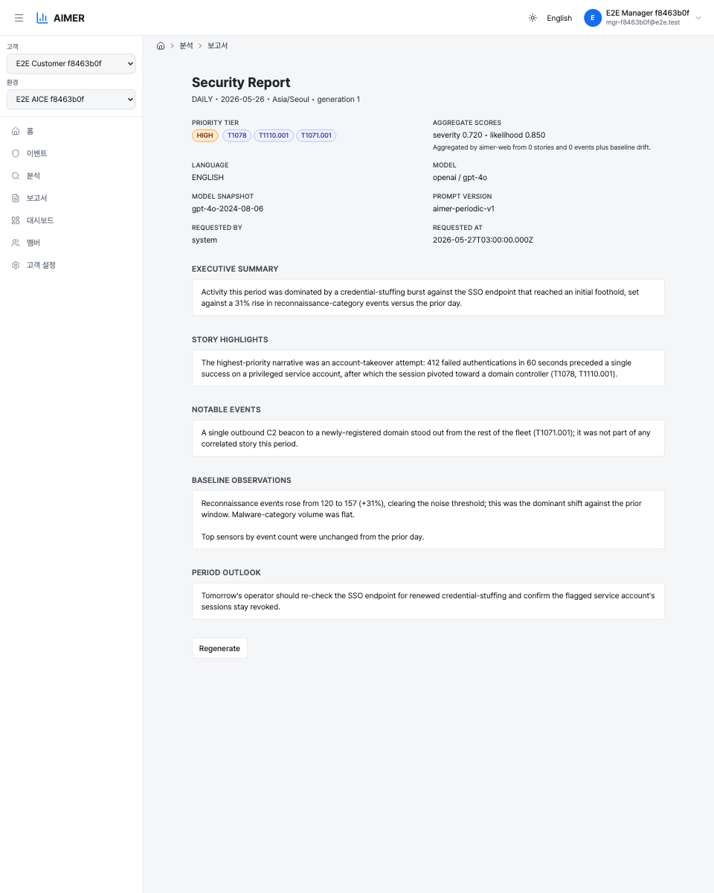

> **주간·월간 스크린샷 재촬영 대기(#430, #450).** 위의 일간 캡처는
> 픽스처 기반이라 최신 상태입니다. 우선순위 등급과 그 출처 안내를
> 앞세우며 집계 심각도·가능성 점수를 표시합니다. 아래의 **주간·월간**
> 변형은 현재 플레이스홀더 그래픽입니다. 실데이터 캡처는 이 픽스처
> 파이프라인으로 재현할 수 없는 gauntlet 실 파이프라인(aicers/gauntlet#149,
> #365)에서 나옵니다. #450 이전의 캡처는 아직 옛 헤더(별도의 집계 점수 행)를
> 보여 주었으므로, 오래되었거나 조작된 캡처가 실 캡처를 대신해서는 안
> 된다는 매뉴얼 정책에 따라 실데이터 스택에서 새로 촬영(#429와 공유하는
> 제약)할 수 있을 때까지 플레이스홀더로 교체했습니다.

## 리포트 색인

고객 범위의 리포트 루트는 해당 고객에 존재하는 리포트 버킷을 나열하고
위의 상세 페이지로 연결합니다.

이 색인이 생기기 전에는 특정 리포트로 직접 이동해야만 리포트를 열 수
있었습니다. 색인은
사용 가능한 버킷을 주기(실시간 / 일간 / 주간 / 월간)별로 묶어, 각 주기의
가장 최근 버킷을 먼저 보여주고 그 뒤에 한도가 정해진 최근 목록을
표시합니다.

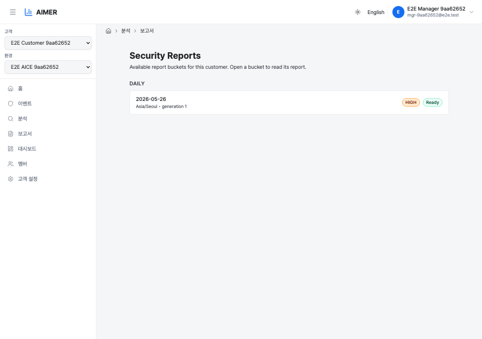

버킷 탐색은 아카이브되지 않은 `periodic_report_state` 행(`pending`,
`ready`, `dirty`)을 읽습니다 — 상세 페이지가 사용하는 것과 동일한 진실
공급원입니다. 따라서 추적 중이지만 아직 리포트가 생성되지 않은 버킷도
**생성 중**으로 표시되어 나타납니다. 최신 기본 변형 결과가
있는 버킷은 우선순위 등급과 함께 **준비됨**으로, 새 소스 데이터로
갱신을 기다리는 버킷은 **업데이트 중**으로 표시됩니다.

각 항목은 버킷의 시간대를 링크에 고정(`?tz=`)하여 상세 페이지로
연결하므로, (고객 시간대 변경 이후 보존된) 옛 시간대 버킷도 고객의 현재
시간대로 재해석되어 `404`가 되지 않고 올바른 리포트로 해석됩니다.

최근 목록은 주기별로 한도가 정해져 있어(기본값 Live 1, Daily 14,
Weekly 8, Monthly 12이며, 각각 대응하는 `ANALYSIS_REPORT_INDEX_CAP_*`
환경 변수로 조정 가능) 페이지가 무한 목록을 렌더링하지 않습니다. 접근
제어는 상세 페이지와 동일합니다. 비멤버나 존재하지 않는 고객은 `404`를,
`reports:read`가 없는 멤버나 거부된 브리지 세션은 실제 `403`을 반환합니다.

최근 목록은 전체 기록이 아니라 **미리보기**입니다. 각 주기 섹션(Live
제외)에는 아래의 주기별 달력으로 연결되는 **달력에서 모두 보기** 링크가
있으며, 달력은 보관된 모든 버킷에 도달합니다.

## 리포트 달력

색인의 최근 목록은 의도적으로 짧습니다. 더 오래된 리포트를 보려면 해당
주기의 **달력**을 엽니다(색인의 **달력에서 모두 보기** 링크, 또는 리포트의
이전/다음 컨트롤 옆 **달력 열기**). 달력은 기록으로 가는 선택적 경로이며,
서브젝트의 기본 진입 지점은 항상 가장 최근 리포트입니다.

달력의 단위는 주기에 맞춰집니다.

- **일간** → 월/일 그리드(`?month=YYYY-MM`).
- **주간** → 한 해의 주 목록(`?year=YYYY`).
- **월간** → 연/월 그리드(`?year=YYYY`).

**실시간(Live)**은 단일 롤링 버킷이므로 달력이 없습니다. 달력 상단의
이전/다음 컨트롤은 뷰포트를 한 달 또는 한 해 단위로 이동합니다.

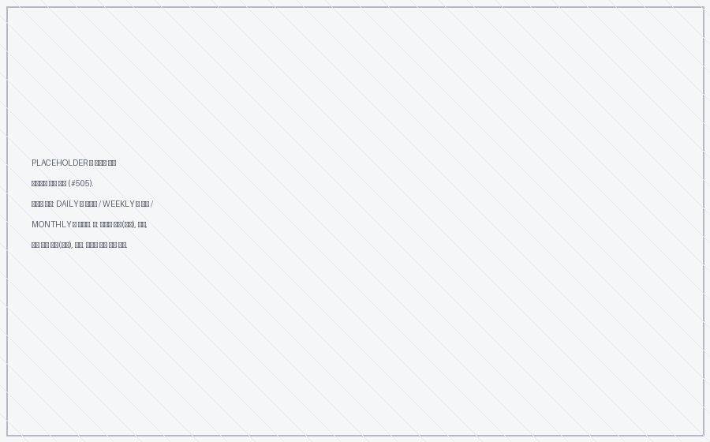

각 버킷은 네 가지 상태 중 하나로 표시되며, 시각적으로 구분되고 그중
하나만 이동 가능합니다.

- **보고서 있음** — 강조 표시되고 클릭 가능합니다. 버킷이 "보고서 있음"이
  되려면 기본 모델에 대한 대체되지 않은 실제 결과가 있어야 하고, 상세
  페이지가 사용하는 동일한 언어 폴백(사용자 언어 → 영어 → 임의)으로
  해석되어야 합니다. 추적만 된(`pending`) 버킷이나, `ready`/`dirty`
  상태이지만 아직 볼 수 있는 결과가 없는 버킷은 "보고서 있음"이
  **아닙니다** — 이전/다음 이동과 동일한 규칙이라, 달력에서는 준비된 것처럼
  보이는데 열어 보면 "생성 중" 페이지가 나오는 일이 없습니다.
- **보고서 없음** — 보관 기간 내이지만 결과가 없음. 회색이며 이동 불가.
- **보관 기간 지남** — 서브젝트의 보관 경계(아래)보다 오래됨. 회색이며 이동
  불가.
- **미래** — 서브젝트 시간대 기준 오늘 이후에 시작하는 버킷. 회색이며 이동
  불가.

달력 검색은 **두 가지**로 제한됩니다. 요청된 뷰포트만(한 번에 한 달 또는 한
해, 전체 기록은 절대 아님) 읽고, 보관 경계를 넘어선 것은 회색 처리합니다.
주기별 최근 한도(`ANALYSIS_REPORT_INDEX_CAP_*`)는 달력을 제한하지
**않으며**, 색인 미리보기에만 적용됩니다.

### 보관 경계

달력과 이전/다음이 얼마나 과거까지 이동하는지는 고정된 개수가 아니라
서브젝트의 **보관 정책**으로 결정됩니다. 이동 가능 범위는 보관 범위를
넘지 않습니다. 고객의 경우 경계는
`customer_retention_policy.analysis_days`에서 나옵니다.

- `경계 = 오늘(서브젝트 시간대) − analysis_days`.
- 버킷의 **시작일이 경계 이상**이면 이동 가능하며, 더 일찍 시작하는 버킷은
  창이 경계를 걸치더라도 보관 기간이 지난 것으로 봅니다.
- `analysis_days = NULL`은 **무제한** 보관을 의미합니다 — 하한이 없으므로
  요청된 뷰포트의 모든 과거 버킷이 이동 가능한 상태로 유지됩니다.

예를 들어 `analysis_days = 30`이고 오늘이 `2026-06-09`이면 경계는
`2026-05-10`입니다. 일간 버킷 `2026-05-10`은 이동 가능하지만 `2026-05-09`는
보관 기간이 지났고, 월요일이 `2026-05-04`인 주간 버킷은 이동 불가(시작이
경계보다 앞섬)이지만 `2026-05-11`에 시작하는 주는 가능하며, `2026-05` 월간
버킷은 이동 불가(`2026-05-01` 시작)이지만 `2026-06`은 가능합니다.

> 여기서의 보관 경계는 정책에서 파생된 **탐색** 경계입니다. 보관 스위퍼는
> 현재 리포트 행을 삭제하지 않으므로 보관 기간이 지난 버킷도 저장소에는
> 남아 있을 수 있습니다. 달력은 단지 그곳으로 이동하지 않을 뿐입니다.

## 리포트 주기

리포트 주기는 네 가지이며, 각각 고객 시간대 기준으로 서로 다른 구간을
다룹니다.

- **LIVE** — 최근 24시간을 다루는 롤링 스냅샷. LIVE 행은 합성 버킷
  날짜(`1970-01-01`)를 사용하며, 해당 구간의 소스 데이터가 아카이브되지
  않은 한 고정 주기(`ANALYSIS_LIVE_REFRESH_MINUTES`, 기본 60분)로 재생성
  됩니다. 매 갱신마다 리포트 세대가 자동 세대 상한
  (`ANALYSIS_MAX_GENERATION`, 기본 50)까지 증가합니다. LIVE 리포트가
  상한에 도달하면 주기 갱신은 더 이상 세대를 올리지 않으며, 이후로는
  강제 재실행(아래)만 새 세대를 생성할 수 있습니다.
- **DAILY** — 달력 하루당 하나의 리포트. DAILY 버킷은 해당 날짜가
  마감되고 정착 윈도가 경과하면 생성 대상이 됩니다(엄격한 커서
  워터마크로 인입 완료가 확인되면 단축됩니다). 구간 내 새 소스 데이터가
  도착하면 재생성됩니다("dirty" 재큐).
- **WEEKLY** — 7일 구간당 하나의 리포트로, 주의 시작(월요일)을 기준으로
  합니다. 늦게 도착하는 스토리·이벤트가 정착할 시간을 주기 위해 주가
  마감된 뒤 약 6시간 후에 생성 대상이 됩니다.
- **MONTHLY** — 달력 한 달당 하나의 리포트로, 월의 1일을 기준으로 합니다.
  월이 마감된 뒤 약 12시간 후에 생성 대상이 됩니다.

`WEEKLY`·`MONTHLY` 리포트는 일간 리포트와 **동일한 입력**을 더 긴 구간에
대해 선택해 작성됩니다 — 그 아래의 일간 리포트들을 이어 붙인 것이
아닙니다. 주간 대비(전주 대비)·월간 대비(전월 대비) 비교 서술(해당 구간이
악화·완화·정체 중인지, 월간이 전월과 비교해 어떻게 읽히는지)은 단일 구간의
근거만으로 LLM이 수행합니다. Clumit Insight는 이전 구간 데이터를 프롬프트에 넣지
않습니다. 매일을 단순 나열한 주간이나, 전월을 전혀 비교하지 않는 월간은
프롬프트 또는 입력 빌더에 손볼 점이 있다는 신호입니다.

모든 주기에서 운영자 조치가 필요 없습니다. 백그라운드 워커가 시드·
스케줄링·LLM 호출을 수행합니다. **재생성** 버튼은 주기 외 강제 갱신을
위한 것입니다.

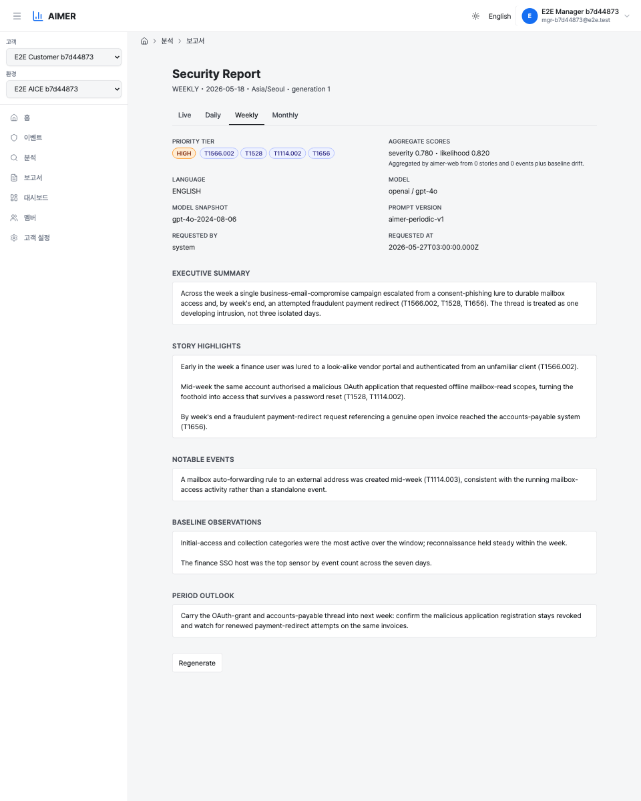

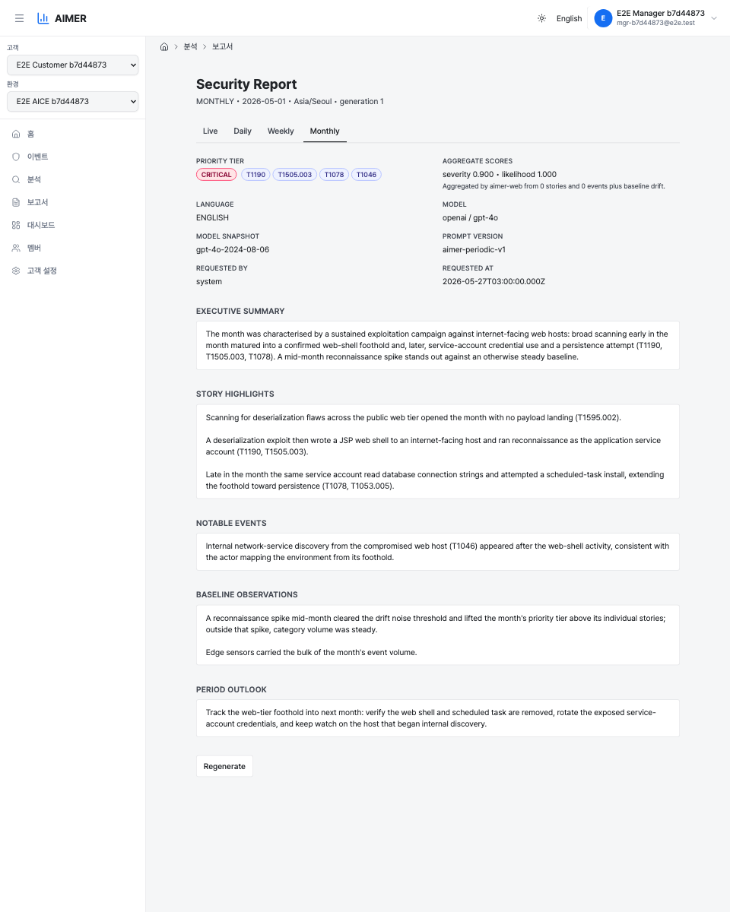

## 주기 탭

상세 페이지에는 리포트 본문 위에 **실시간 / 일간 / 주간 / 월간** 탭
바가 표시됩니다. 현재 보고 있는 주기 탭은 강조되며, 나머지는 같은 시간
구간을 각자의 주기로 보는 리포트로 연결됩니다 — 일간에서 **주간**으로
전환하면 보고 있던 날이 속한 주가 열리고, **월간**은 그 날의 달을 엽니다.
**실시간** 탭은 항상 롤링 스냅샷을 엽니다. 추적 중이지만 아직 생성되지 않은
버킷의 탭은 "생성 중" 상태로 페이지를 열며, 해당 구간에 소스 활동이 전혀
없는(추적 상태가 없는) 버킷은 `404`를 반환합니다. 탭 바 자체는 항상
렌더링되므로 주기 간 이동은 자유롭게 할 수 있습니다. 고정된
변형(`?tz=&lang=&model_name=&model=`)은 탭 사이에서 그대로 유지됩니다.

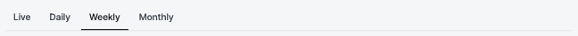

## 주기 내 탐색(이전/다음)

주기 탭 아래의 **◀ 이전 / 다음 ▶** 컨트롤은 **같은 주기 안에서** 시간을
이동합니다 — 어제의 일간, 지난주의 주간, 지난달의 월간 — 주기를 바꾸되
시간은 바꾸지 않는 탭을 보완합니다. 각 단계는 **보고서가 있는 가장 가까운
버킷**으로 이동하며, 빈 구간과 아직 생성되지 않은 버킷은 건너뛰므로 빈
페이지에 도달하지 않습니다.

양쪽 끝은 모두 명시적 상태이며, 끊긴 링크나 `404`가 아닙니다.

- **오래된 쪽** — 보관 경계 안에 더 오래된 리포트가 없으면 이전 컨트롤은
  링크 대신 비활성화된 **보관된 이전 보고서가 없습니다** 상태를
  표시합니다.
- **최신 쪽** — 가장 최근 리포트에서는 다음 컨트롤이 아예 표시되지
  않습니다.

날짜로 바로 이동하려는 경우를 위해 컨트롤 옆에 **달력 열기** 링크가
있습니다. **실시간(Live)**은 단일 롤링 버킷이므로 이전/다음이 없으며 거기서는
컨트롤이 표시되지 않습니다.

## 리포트 언어

각 리포트는 언어 변형(영어 / 한국어)별로 존재합니다. 상세 페이지는 고정된
배포 기본값이 아니라 **사용자 본인의 언어** — 앱을 사용 중인 로케일 —
을 기본으로 표시합니다. 주기 탭 옆의 **언어 전환기**로 리포트 언어를 바꿀
수 있으며, 선택은 URL에 로케일 코드(`?lang=ko`)로 인코딩되고 다른 변형
선택자와 마찬가지로 주기 탭 사이에서 그대로 유지됩니다.

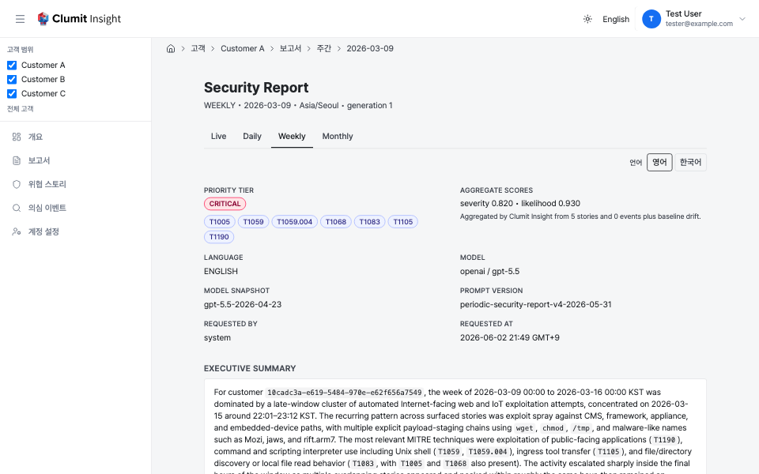

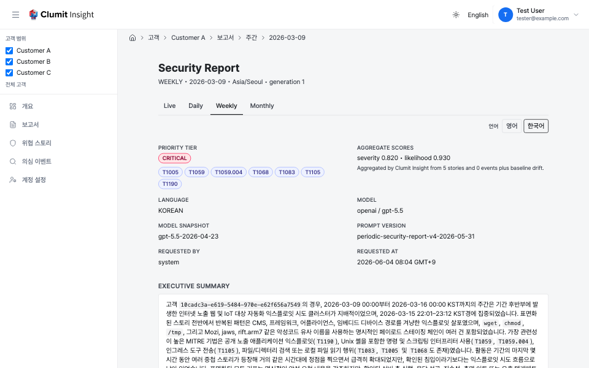

요청한 언어가 아직 생성되지 않았더라도 리포트는 **오류를 내지 않습니다**.
다음의 고정된 폴백 체인을 따릅니다.

1. 결과가 존재하면 요청한 언어;
2. 없으면 보장된 기준 언어인 **영어**를, 요청한 언어를 명시한 안내와 함께
   표시;
3. 그것도 없으면 해당 버킷에 존재하는 아무 언어.

아직 생성되지 않은 언어를 요청하면 **온디맨드 생성도 요청**됩니다. 페이지가
생성 작업을 큐에 넣고(워커가 쓰는 동일한 작업 테이블이지만 강제 재실행은
아님 — 반복 조회는 진행 중인 작업에 합쳐질 뿐 추가 세대를 소비하지
않습니다) 안내 아래에 진행 상태를 표시합니다. 작업이 `queued`/`processing`
인 동안 페이지는 자동으로 폴링하며 갱신되고, 완료되면 요청한 언어로 리포트가
다시 로드됩니다. `failed` 작업은 무한 스피너 대신 차단되지 않는 오류를
표시하며, 아직 정착 창 안에 있는(작업이 없는) 버킷은 일반적인 "생성 중"
대기 상태를 보여줍니다.

언어 전환기는 읽는 언어만 바꿀 뿐 강제 재실행을 일으키지 않으며, 기반 소스
선택도 바꾸지 않습니다. 복원된 값(IP 주소, 이메일, MAC 주소)은 언어 중립적
이며 모든 언어 변형에서 동일하게 정확합니다.

리포트 색인은 이 폴백을 **버킷별로** 해석하므로, 한국어 사용자는 각 버킷의
한국어 등급이 있으면 그것을, 한국어가 생성되지 않은 곳에서만 영어 등급을
보게 됩니다 — 조용한 혼합은 없습니다. 각 버킷에는 이미 사용 가능한 언어도
함께 표시됩니다.

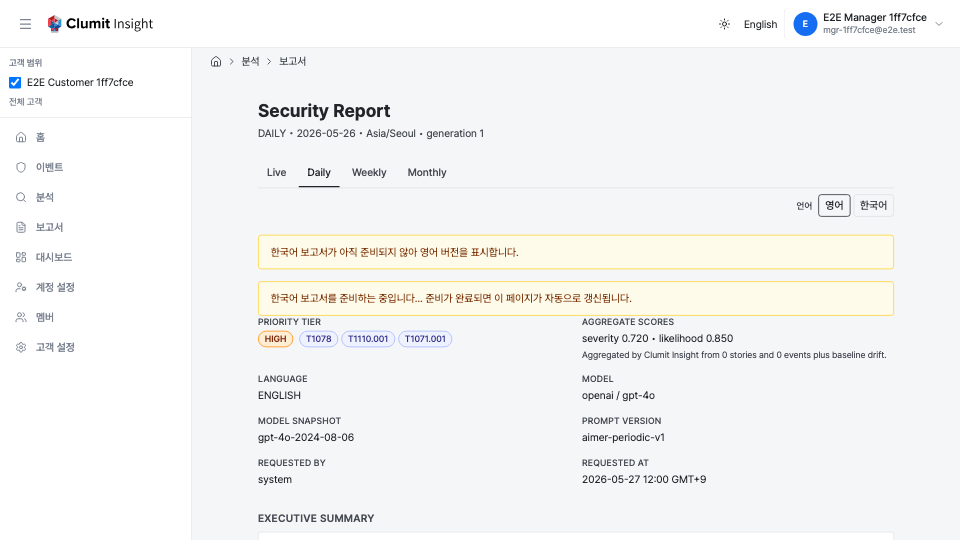

## 리포트 생성 과정

워커 파이프라인은 운영자 조치 없이 실행됩니다.

1. 상태 워커는 `(customer, period, bucket_date, tz)`별 준비 상태를 추적하고,
   네 주기 전체에 걸쳐 `ready` 또는 `dirty`인 모든 상태 행에 대해 기본
   `(tz, 언어, 제공자, 모델)` 변형의 실제 `periodic_report_job` 행을
   시드합니다. 상태가 `dirty`로 바뀌면(윈도 내 신규 소스 데이터) 기본
   변형뿐 아니라 그 아래 **모든** 기존 변형 작업의 세대를 올리므로, 강제
   생성된 한국어·대체 모델 리포트도 오래된 세대를 계속 제공하지 않고 함께
   갱신됩니다. LIVE 변형은 변형별 `next_due_at` 주기가 경과하면 재큐됩니다
   (시간대 교체로 아카이브된 행은 제외). 모든 자동 증가(dirty 또는 주기)는
   `ANALYSIS_MAX_GENERATION` 상한을 따릅니다.
2. 디스패처는 `FOR UPDATE SKIP LOCKED`로 `queued` 작업을 집어 들며,
   `(customer_id, period, bucket_date, tz)`별 어드바이저리 락을 사용하고,
   스토리 분석과 동일한 지수 백오프 술어를 적용합니다.
3. 입력 빌더는 **상위 스토리**(스토리 상태가 `ready`이고 슈퍼시드되지 않은
   결과가 있으며, 정규 스토리 윈도가 버킷과 겹칠 때만 적합)와 **상위
   이벤트**(디듀프된 의심 이벤트 시각이 버킷 안에 있으며, 선택된 스토리가 이미
   포함한 이벤트는 제외)를 결정론적으로 선택합니다. 이벤트 인용은 하드 상한
   아래에서 **등급 정책**을 따릅니다. 모든 `CRITICAL`·`HIGH` 이벤트는 상한까지
   개별 인용이 보장됩니다. 이들이 상한을 초과하면 순위 상위의 이벤트만 상한까지
   인용되며(나머지는 조용히 누락되지 않고 분석된 이벤트 기록에서 복원 가능하며,
   이후 구간 long-tail 집계 연동이 적용되면 반영됨), 상한에 못 미치면
   남은 자리를 동일 순위 기준의 `MEDIUM` 이벤트로 채웁니다. `LOW` 이벤트는
   개별 인용되지 않으므로, 조용한 구간에서는 **주요 이벤트**가 낮은 관심도의
   이벤트로 채워지지 않고 비어 있게 됩니다. **기본** 리포트의 경우
   각 스토리/이벤트 리프는 고정된 모델 선호 순서 — 리포트 자체 모델을 먼저,
   그다음 구성된 폴백 순서 — 로 선택되므로, 리포트의 현재 모델로 분석되지
   않은 리프라도 누락되지 않고 표시됩니다([모델 간 커버리지 및
   점수](#모델-간-커버리지-및-점수) 참고). 애널리스트가 비기본 모델로 생성한
   **대체 모델** 리포트는 엄격하게 동작하여 해당 모델의 리프만 선택합니다.
   언어는 항상 엄격하게 일치시킵니다. 또한 구간의 **의심 이벤트 집계**(중복
   제거된 이벤트 수와 카테고리 분포)를 계산합니다.
4. 포함된 모든 개별 분석 서술은 단일 리포트 범위 토큰 네임스페이스
   (`<<REDACTED_*_R{j}_*>>`)로 재네임스페이스됩니다. 서로 다른 두 분석의
   동일 플레이스홀더가 충돌하지 않도록 하기 위함이며, 번들은 mTLS로 aimer의
   `generatePeriodicSecurityReport` 뮤테이션에 전송됩니다. 워커 액터는
   `system:analysis-worker`이며, 리포트가 여러 AICE 환경을 가로지르므로 단일
   정규 AICE id가 없어 안정적인 `system:periodic-report` 센티넬 AICE id를
   사용합니다.
5. 반환된 서술은 스캔이 복원할 수 없는 모든 리댁션 토큰(하위 범위 잔여 토큰,
   매핑되지 않은 리포트 범위 토큰, 또는 모든 범위의 알 수 없는 종류 토큰) 또는
   평문 PII가 있는지 검사되고(환각 디코드는 작업을 실패시키고 저장되지 않음),
   `periodic_report_result`에 기록된 뒤 auth-DB 작업이 최종화됩니다.

재시도 가능한 실패(5xx, 전송, mTLS 오류)는 `ANALYSIS_MAX_ATTEMPTS`까지
백오프로 재큐됩니다. 치명적 실패(4xx, 환각 탐지, 포함된 분석 간 누락/불일치
리댁션 정책 버전)는 즉시 작업을 `failed`로 표시합니다.

## 우선순위 등급과 집계 점수

헤더는 리포트의 우선순위 등급과 그 출처를 앞세우며, 두 집계 점수를 표시합니다.

- **우선순위 등급** — `CRITICAL`, `HIGH`, `MEDIUM`, `LOW` 중 하나로,
  색상 배지로 렌더링됩니다. 등급은 포함된 각 개별 분석의 자체 우선순위 등급과
  구간의 의심 이벤트 동향이 매핑되는 등급 중 **최댓값**입니다. (집계 점수가
  아니라) 개별 분석에서 직접 도출하므로, 리포트는 인용한 가장 높은 분석보다
  낮게 태깅되지 않습니다. IOC나 멤버 수 플로어로 등급이 올라간 분석이 있어도
  마찬가지입니다.
- **출처 안내** — 배지 아래에 흐린 글씨로 표시되는 "스토리 N건 · 이벤트 M건"
  줄로, 몇 건의 인용 분석이 리포트를 구성했는지 기록합니다. 소스 패널 헤더에
  표시되는 것과 같은 개수입니다.
- **집계 심각도 / 가능성 점수** — `0.000`–`1.000`. 리포트의 심각도와
  가능성을 요약하는 **참고용** 표시 값(`score_kind: "aggregate"`)이며,
  등급의 입력이 아닙니다.

구간의 **의심 이벤트 동향**은 윈도의 활동이 직전 비교 구간에서 벗어날 때
리포트의 우선순위를 높일 수 있습니다. 동향 자체는 리포트의 **의심 이벤트
동향** 섹션에 서술되며, 그 결과인 우선순위 등급과 집계 점수만 헤더에
표시됩니다.

## 모델 간 커버리지 및 점수

리포트는 단일 모델에 종속됩니다. 배포의 기본 모델이 바뀌면 기존 스토리·이벤트
분석은 다시 분석되기 전까지 이전 모델에 머뭅니다. 그 사이에 기본 리포트의
**스토리 하이라이트**와 **주요 이벤트**가 갑자기 비어 보이지 않도록, 빌더는
표시할 수 있는 리프를 **절대 누락하지 않습니다**. 어떤 스토리나 이벤트가
리포트의 현재 모델로 분석된 결과가 없으면, 구성된 폴백 순서에서 가장 먼저
사용 가능한 모델로 채웁니다. 이렇게 채워진 리프도 본문에 정상적으로
서술됩니다.

리포트에 표시된 모델 기준으로 헤더 숫자가 의미를 갖도록, **우선순위 등급과
집계 심각도·가능성 점수는 리포트 자체 모델과 일치하는 리프**(및 의심 이벤트
동향)에서만 계산됩니다. 다른 모델로 채워진 리프는 서술에는 나타나지만 집계
점수나 등급을 움직이지 않습니다. 모델 변경 직후에는 표시된 전체 리프 대비
점수가 낮게 보일 수 있으며, 기반 분석이 새 모델로 다시 분석되면서 그 격차는
좁혀집니다.

이런 격차가 있을 때 집계 점수 행에는 짧은 커버리지 안내가 붙습니다 — 예: *"집계
점수는 인용된 리프 5건 중 이 리포트 모델로 분석된 3건을 반영합니다."* 이 안내는
**개수만** 알리며, 점수를 결합하는 방식은 설명하지 않습니다.

이는 기본 리포트에 적용됩니다. 애널리스트가 비기본 모델로 생성한 **대체 모델**
리포트는 해당 모델의 리프만 선택하므로, 그 리프가 생길 때까지 리프 기반 섹션은
정직하게 비어 있습니다. 이는 의도된 엄격한 동작이며, 모델 비교 뷰는 그러한
열을 그에 맞게 라벨링합니다.

## MITRE ATT&CK 기법

우선순위 배지 옆에 리포트의 `aggregate_ttp_tags`(포함된 각 개별 분석의 MITRE
ATT&CK 기법 ID의 중복 제거·정렬된 합집합)가 표시됩니다. 각 칩은 기법 ID를
보여주며, 마우스를 올리면 벤더링된 ATT&CK 번들의 공식 기법 이름(예: `T1078`
→ "Valid Accounts")이 표시됩니다. LLM에는 이 집합이 제공되고 서술에서 기법을
ID로 참조하도록 지시되지만, 저장되는 합집합은 개별 분석으로부터 결정론적으로
계산되므로 LLM이 컬럼에서 기법을 추가하거나 제거할 수 없습니다.

## 리포트 섹션

본문은 LLM이 반환한 다섯 개의 서술 섹션을 Markdown으로 렌더링합니다 —
제목, 글머리 기호 및 번호 매기기 목록, 인라인 코드 스팬이 원시 `#`, `-`,
백틱 문자가 아니라 스타일이 적용된 요소로 표시되며, 이벤트 및 스토리 분석
페이지와 동일합니다. 섹션에 포함된 원시 HTML은 비활성 텍스트로 처리되며
실제 마크업으로 렌더링되지 않습니다. LLM이 비워 둔 섹션은 `—` 자리표시자로
렌더링됩니다. 각 섹션의 리포트 범위 토큰은 평문으로 복원됩니다.

- **요약(Executive summary)** — 구간 단위의 헤드라인. 일자 간 근접 중복
  검사가 주시하는 섹션으로, 연속한 이틀이 서로의 의역처럼 읽히면 둔한
  프롬프트 또는 입력 빌더 버그의 신호입니다.
- **스토리 하이라이트(Story highlights)** — 상위 K개의 분석 스토리를 항목별로
  하나씩 다루며, 정확한 경우 가장 강한 근거를 인용합니다.
- **주요 이벤트(Notable events)** — 스토리 하이라이트에 이미 포함되지 않은
  단일 이벤트를 항목별로 하나씩 다룹니다. `CRITICAL`·`HIGH` 이벤트는 상한까지
  인용이 보장되고, 남는 자리는 `MEDIUM`으로 채워지며, `LOW` 이벤트는 여기에
  나열되지 않으므로 조용한 구간에서는 채워지지 않고 비어 있습니다.
- **의심 이벤트 동향(Suspicious-event trends)** — 구간의 의심 이벤트 카운트와
  순위, 그리고 상위 기법·센서 대비 관찰되는 변화에 대한 짧은 사실 서술.
- **기간 전망(Period outlook)** — 해당 구간 톤에 맞춘 짧은 전망. LIVE는 다음
  구간에서 주시할 점을, DAILY는 내일 운영자가 다시 확인할 점을, WEEKLY·
  MONTHLY는 다음 주·다음 달로 이어갈 추세를 다룹니다.

의심 이벤트 동향은 여러 항목의 목록이며 페이지는 이를 하나의 블록으로 합쳐
렌더링합니다. 반면 세 개의 **리프 유래(leaf-derived)** 섹션 — 요약, 스토리
하이라이트, 주요 이벤트 — 은 각각 고유한 선택적 출처 링크를 갖는 **인용
단위(citation unit)** 의 연속으로 렌더링됩니다(아래
[문장 단위 인용](#문장-단위-인용) 참고). 복원할 수 없는 토큰(복호화 실패,
슈퍼시드된 분석, 범위 밖 인덱스)은 페이지가 계속 렌더링되도록 그대로
통과됩니다. 환각 디코드는 기록 시점에 차단되어 이 뷰에 도달하지 않습니다.

### 문장 단위 인용

세 개의 리프 유래 섹션 안에서 각 서술 단위(요약은 문장 또는 짧고 독립적인
구절, 스토리 하이라이트·주요 이벤트는 단일 항목)는 그 단위가 유래한 **단
하나**의 분석 리프로 연결되는 인라인 인용을 가질 수 있습니다. 링크는 단위
텍스트 뒤에 작은 **↗ Story {story_id}** 또는 **↗ Event {aice_id} ·
{event_key}** 칩으로 표시됩니다. 이로써 신뢰 사슬이 리포트 수준
[출처](#출처) 패널("어떤 분석이 이 리포트에 기여했는가")에서 문장 수준
("어떤 분석이 *이* 주장을 뒷받침하는가")으로 깊어져, 한 문장을 검증할 때
인용된 모든 출처를 훑어볼 필요가 없습니다.

- 한 단위는 **정확히 하나**의 리프에 근거합니다. 여러 리프를 종합한 서술은
  별도 단위로 분리되거나 인용 없이 남으므로, 인용이 여러 출처가 섞인 곳을
  가리키는 일이 없습니다.
- **인용이 없는 단위는 끊긴 링크 없이 평문으로** 렌더링됩니다 — 전망성이거나
  횡단적인 문장은 칩을 달지 않습니다.
- 각 인용 링크는 리포트가 소비한 정확한 리프 변형(세대 + 언어 + 공급자 +
  모델)에 **세대 고정**되며, 출처 카드와 동일하게 동작하고 번역된 리포트에서는
  정규 언어 리프로 해석됩니다.
- 인용은 세 개의 리프 유래 섹션에만 적용됩니다. **기간 전망**(전망성)과
  **의심 이벤트 동향**(드릴다운의 의도된 종착점)은 리프 유래가 아니므로 문장
  인용을 갖지 않습니다.
- 출처 식별자는 네이티브·번역 생성 경로 모두에서 리포트의 기록된 입력
  리프와 대조 검증됩니다. 조작된 인용은 리포트 저장 전에 거부되며, 고정된
  리프가 더 이상 입력 목록에 없는 인용은 끊긴 링크로 렌더링되지 않고 뷰에서
  제외됩니다.

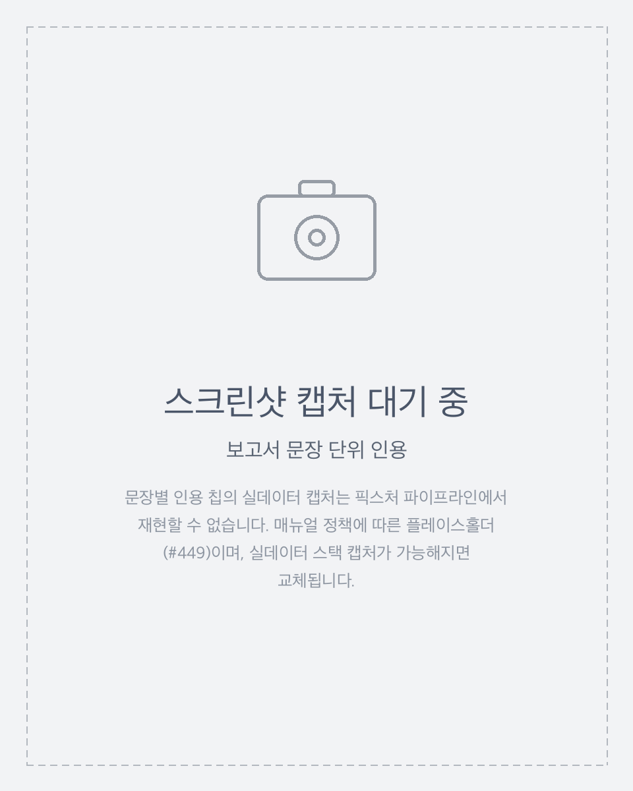

## 출처

개별 분석에서 파생된 섹션 — 요약·스토리 하이라이트·주요 이벤트 — 아래에는
리포트가 생성에 사용한 위협 스토리·의심 이벤트 분석을 나열하는 **출처**
패널이 표시됩니다. 이는 해당 세대가 기록한 입력 목록이므로, 패널은
**리포트 수준의 인용 출처**입니다. 즉 리포트가 어떤 분석을 근거로 했는지를
알려줄 뿐, 어떤 문장이 어떤 분석을 인용하는지는 나타내지 않습니다. 패널은
문장 단위·주장 단위의 출처를 의미하지 않습니다.

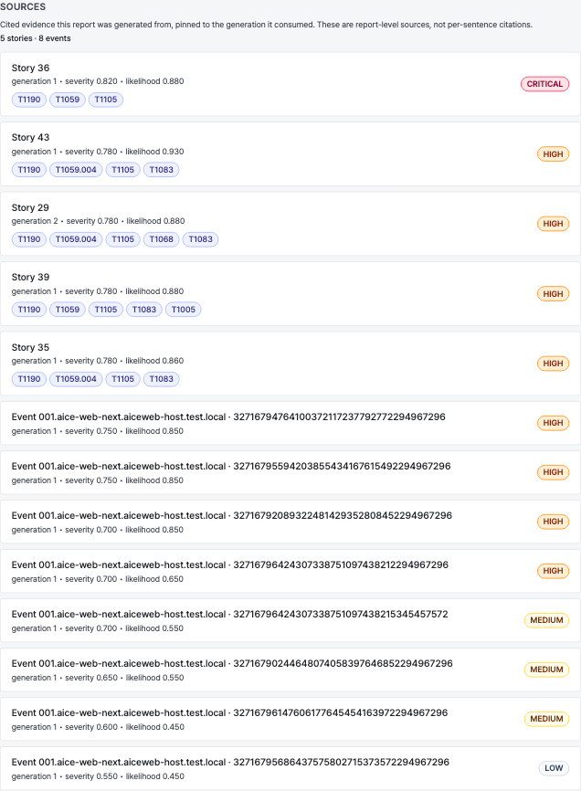

패널 헤더에는 **N stories · M events** 형태의 출처 개수가 표시됩니다.
각 인용 분석은 카드로 렌더링됩니다.

- **위협 스토리 카드**는 `Story {story_id}`로 표시되며, 인용된 분석의
  우선순위 등급, 심각도·가능성 점수, MITRE ATT&CK 기법 칩을 보여 줍니다.
- **의심 이벤트 카드**는 `Event {aice_id} · {event_key}`로 표시되며,
  우선순위 등급과 심각도·가능성 점수를 보여 줍니다.

스토리나 이벤트에는 사람이 읽을 수 있는 제목이 없으므로 카드는 ID로
표시되며, 이는 위협 스토리·의심 이벤트 목록과 동일한 방식입니다. 스토리의
경우 기법 칩이 사람이 읽을 수 있는 설명을 겸합니다.

각 카드는 **리포트가 사용한 정확한 변형에 고정된** 상세 페이지로
연결됩니다 — 인용된 `generation`과 함께 언어·제공자·모델이 고정됩니다.
따라서 출처 링크를 따라가면 최신 재분석이 아니라 생성 시점의 증거가
열립니다. 번역된 언어로 표시된 리포트의 경우, 링크는 번역이 보존한
원본 언어 분석으로 연결되어 고정된 증거가 계속 존재합니다.

인용된 분석의 고정 버전을 더 이상 사용할 수 없는 경우 — 더 새로운 세대로
슈퍼시드되었거나 보존 정책으로 제거된 경우 — 카드는 저장된 ID와 세대만
남기고 **"근거 버전을 더 이상 사용할 수 없습니다"** 안내로 축소되며, 카드가
연결하는 분석 상세 페이지도 최신 버전으로 조용히 대체하지 않고 동일한
안내를 표시합니다. 카드의 링크는 여전히 고정된 세대를 담고 있어, 기반
증거 버전이 사라지더라도 출처 추적 정보는 보존됩니다.

**의심 이벤트 동향에는 출처 패널이 없습니다.** 이는 드릴다운의 의도된
종착점으로, 해당 섹션은 서술형 동향 관찰만 보고하며 개별 분석으로
역추적되지 않습니다.

### 역방향 추적(Cited by)

출처 패널은 링크의 정방향 절반입니다. 역방향 절반은 분석 상세
페이지에 있습니다. 이 리포트가 인용한 [스토리](story.md#인용한-보고서cited-by)나
[이벤트](../analysis-result.md#인용한-보고서cited-by)에는 이 리포트로 다시
올라가는 **인용한 보고서** 추적이 표시됩니다. 이 역방향 링크는 **이 리포트의
세대로 고정**되므로, 리포트 상세 페이지는 `generation` 쿼리 파라미터를
받아들여 최신 버전이 아니라 **정확히 그 세대**를 엽니다. 고정된 리포트
세대가 더 이상 존재하지 않는 경우 — 슈퍼시드되었거나 제거됨 — 페이지는
최신 버전으로 조용히 대체하지 않고 **"이 보고서 버전은 더 이상 사용할 수
없습니다"** 안내를 표시하며, 이는 분석 페이지의 고정 증거 동작과
동일합니다.

## 메타데이터 항목

헤더 아래에는 리포트 메타데이터가 표시됩니다. **언어**는 우선순위 등급,
MITRE ATT&CK 태그, 집계 점수와 함께 모든 뷰어에게 표시됩니다. 나머지
항목은 산출물이 어떻게 생성되었는지에 대한 **모델/프롬프트 출처**이며
애널리스트로 제한됩니다(아래 [애널리스트 전용 항목](#애널리스트-전용-항목)
참고): 제공자/모델, 제공자가 보고한 모델 스냅샷, 프롬프트 버전, 최신 세대를
트리거한 계정(정규 워커 틱이면 `system`), 요청 타임스탬프 — 요청 타임스탬프는
사용자의 시간대에 맞춰 명시적 시간대 레이블과 함께 표시됩니다
([계정 환경설정 → 시간대](../account-preferences.md#시간대) 참고). 헤더 줄에는
주기, 버킷(LIVE는 "now"), 고객 시간대, 세대도 함께 표시됩니다. 헤더의 **고객
시간대**는 리포트 버킷 기준 시간대(리포트 식별자)로, 개인 표시 시간대와는
무관합니다.

### 애널리스트 전용 항목

모델/프롬프트 출처 항목과 **재생성** 버튼은 해당 고객의 애널리스트에게만
표시됩니다. 애널리스트가 아닌 뷰어에게도 분석적 의미가 있는 항목 — 우선순위
등급, MITRE ATT&CK 태그, 언어, 집계 점수, 의심 이벤트 동향 힌트, 생성된 본문
섹션 — 은 그대로 유지되지만, 모델 제공자/모델, 모델 스냅샷, 프롬프트 버전,
요청자, 요청 시각 항목은 숨겨지고 재생성 컨트롤도 표시되지 않습니다. 이는
재생성 엔드포인트가 이미 애널리스트 전용 `reports:create` 권한을 인가하므로,
애널리스트가 아닌 사용자에게는 애초에 동작하는 버튼이 없었던 것과 일치합니다.

<!-- 스크린샷 자리표시자: 애널리스트가 아닌 뷰어의 축소된 리포트 헤더(모델/
     프롬프트 출처 항목 없음, 재생성 버튼 없음). docs/AUTHORING.md에 따라 실제
     데이터가 적재된 스택에서 캡처할 것. -->

## 강제 재실행

`reports:create` 권한을 가진 운영자(해당 고객의 애널리스트)는 페이지 하단의
**재생성** 버튼으로 주기 외 재실행을 강제할 수 있습니다. 이 버튼은
애널리스트에게만 표시되며, 애널리스트가 아닌 뷰어에게는 보이지 않습니다(아래
[애널리스트 전용 항목](#애널리스트-전용-항목) 참고).

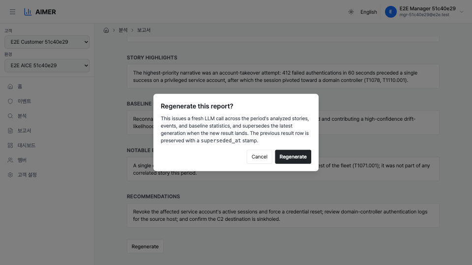

확인 모달은 구간의 분석된 스토리·이벤트·의심 이벤트 동향 전반에 새 LLM
호출이 발생하며, 새 결과가 도착하면 최신 세대가 슈퍼시드된다고 명시합니다.
이전 결과 행은 `superseded_at` 스탬프와 함께 보존되며 제자리에서 덮어쓰이지
않습니다.

모달을 제출하면 리포트의 새 생성이 큐에 들어갑니다. 비기본 변형을 대상으로
지정할 수 있으며, 스토리 분석과 달리 리포트는 시간대 키이므로 리포트의
시간대도 대상으로 지정할 수 있습니다. 동작은 다음과 같습니다.

- 작업 행의 `generation`이 1 증가하고(변형에 기존 행이 없으면 `1`),
  `status`가 `queued`로, `attempts`가 `0`으로 재설정되며, 다음 워커 틱에 LLM
  호출이 시작됩니다. 자동 세대 상한을 넘어선 강제도 허용됩니다.
- 브리지 세션과 `reports:create`가 없는 멤버는 `403`으로 거부됩니다. 해당
  고객의 멤버가 전혀 아닌 호출자는 `404 report_state_not_found`를 받습니다
  (존재 은닉, 페이지 및 요약 엔드포인트와 동일).
- 상태 행이 없으면 `404 report_state_not_found`, 시간대 변경으로 아카이브된
  상태 행은 `409 source_unavailable`을 반환합니다. 네 주기(`LIVE` / `DAILY` /
  `WEEKLY` / `MONTHLY`) 모두 허용됩니다.

재생성이 큐에 있는 동안 페이지에는 새 세대 번호를 알리는 노란색 상태 배너가
표시됩니다. 워커가 새 결과를 기록한 뒤 페이지를 새로고침하세요.

## 모델 선택 및 비교

애널리스트는 여러 LLM 모델에 걸쳐 리포트 품질을 평가할 수 있습니다 — 동일한
리포트를 다른 모델로 생성하여 결과를 비교합니다. 두 컨트롤 모두 **애널리스트
전용**입니다: 비애널리스트 뷰어에게는 모델 드롭다운, **비교 대상** 선택기,
열별 출처 정보가 보이지 않으며, 이는 [애널리스트 전용
항목](#애널리스트-전용-항목) 정책과 일치합니다. 제공되는 모델은 구성된
카탈로그(`ANALYSIS_MODEL_CATALOG`)에서 가져오며, 항상 배포의 기본 모델을
포함합니다. 이는 선택기용 표시/허용 목록일 뿐이며, 재생성 엔드포인트 자체는
기존 입력을 그대로 허용합니다.

### 재생성 시 모델 선택

재생성 모달에는 **모델** 드롭다운이 있으며, 현재 보고 있는 변형의 모델을
기본값으로 합니다. 제출하면 선택한 `(model_name, model)`로 리포트를
재생성합니다(리포트의 시간대와 언어가 함께 전달됩니다). 각 모델은 독립적인
불변 변형이므로, 새 모델로 재생성해도 현재 변형을 대체하지 않습니다 — 둘 다
비교할 수 있도록 유지됩니다.

### 나란히 비교

언어 전환기 옆의 **비교 대상** 선택기로 두 번째 모델을 고를 수 있습니다.
그러면 페이지가 열려 있는 변형과 비교 변형을 두 열로 렌더링하며, 다섯 개
리포트 섹션(요약, 스토리 하이라이트, 주목할 이벤트, 의심 이벤트 동향, 기간
전망)에 걸쳐 정렬하고 열별 출처 정보(모델, 스냅샷, 프롬프트 버전, 세대)를
표시합니다. 좁은 화면에서는 두 열이 세로로 쌓입니다. 모델을 선택하면 URL에
`?compareModelName=&compareModel=`이 설정되며(공유 가능), **비교 종료**가 이를
지웁니다.

비교는 **이미 저장된 변형에 대한 읽기 전용**입니다: 비교 열은 생성 작업을
큐에 넣지 않는 정확 조회로 해석되므로, 비교 모드에 진입해도 LLM 호출이 조용히
소비되지 않습니다. 선택한 모델이 이 기간에 대해 아직 생성되지 않았다면,
페이지는 해당 모델로 미리 선택된 모델 드롭다운을 가진 **재생성** 동작과 함께
안내를 표시하며(비교하던 변형에 새 행이 안착하도록 주변 시간대와 언어를 함께
전달), 누락된 변형을 자동으로 생성하지 않습니다.

알려진 상호작용 하나: **대체 모델** 리포트는 해당 모델의 리프만 선택하며,
기본 리포트의 누락 방지 폴백을 사용하지 않습니다([모델 간 커버리지 및
점수](#모델-간-커버리지-및-점수) 참고). 따라서 비기본 모델 열은 기반 스토리와
이벤트가 해당 모델로 재분석되기 전까지 스토리 하이라이트 / 주목할 이벤트가
**비어 있을** 수 있습니다. 이 빈 상태는 대체 모델 열의 의도된 엄격한 동작이며,
**기본** 리포트는 폴백이 해당 섹션을 채우므로 더 이상 비지 않습니다. 비교 뷰는
빈 리프 기반 섹션을 기존 엠대시 대체 표시로 렌더링하고, 표시된 열 중 비기본
모델인 쪽(열려 있는 변형이든 비교 대상이든)에 대해 짧은 안내를 표시합니다(기본
모델 열에는 나타나지 않음). 종합 섹션(요약, 의심 이벤트 동향, 기간 전망)은
정상적으로 비교됩니다.

<!-- 스크린샷 자리표시자: 다섯 섹션에 걸쳐 정렬된 2열 리포트 비교(현재 vs
     비교 모델), 열별 출처 정보, 그리고 미리 선택된 재생성 동작을 가진 "변형
     미생성" 안내. 실제 데이터 캡처에는 동일 리포트의 두 모델 변형이 적재된
     스택이 필요하며 아직 확보되지 않았습니다(docs/AUTHORING.md). -->

## 시스템 간 딥링크

aice-web-next 대시보드 카드는 해당 주기에 리포트가 존재하는지 확인하여
딥링크 배지를 노출할지 결정합니다.

아직 리포트가 없거나, 리포트의 상위 상태 행이 없거나 아카이브된 경우(예:
시간대 변경으로 기존 시간대 상태가 아카이브된 경우)에는 배지를 표시하지
않으므로, 페이지가 열리지 않는 리포트로 배지가 딥링크되지 않습니다. 그 외의
경우 요약 엔드포인트는 우선순위 등급과 함께 집계 심각도·가능성 점수
(`score_kind: "aggregate"`), 그리고 이 페이지로의 딥링크를 반환하며, 따라갈
때 여는 탭이 선택한 고객과 무관하게 올바른 리포트를 열고, 카드가 표시된 것과
동일한 변형(시간대·언어·제공자·모델)을 엽니다. 배지 자체는 aice-web-next가
렌더링하며 우선순위 등급을 앞세웁니다. 해당 스크린샷은 aice-web-next
매뉴얼을 참고하세요. (집계 점수는 aice-web-next의 자체 용도로 교차 시스템
계약에 남아 있습니다 — 이번 릴리스의 등급 우선 변경은 이 엔드포인트의
페이로드가 아니라 aimer-web 리포트 상세 화면입니다.)

섹션 콘텐츠, TTP 태그, 근거는 전체 리포트 뷰어의 영역이며 배지에서 제외되어
배지가 리포트 세부를 누설하지 않습니다. 딥링크 확인은 페이지 및 재생성
동작과 동일한 존재 은닉 정책을 적용합니다. 비멤버는 `404`를, `reports:read`가
없는 멤버는 권한 오류를, 거부된 브리지 세션은 거절을 받습니다.
