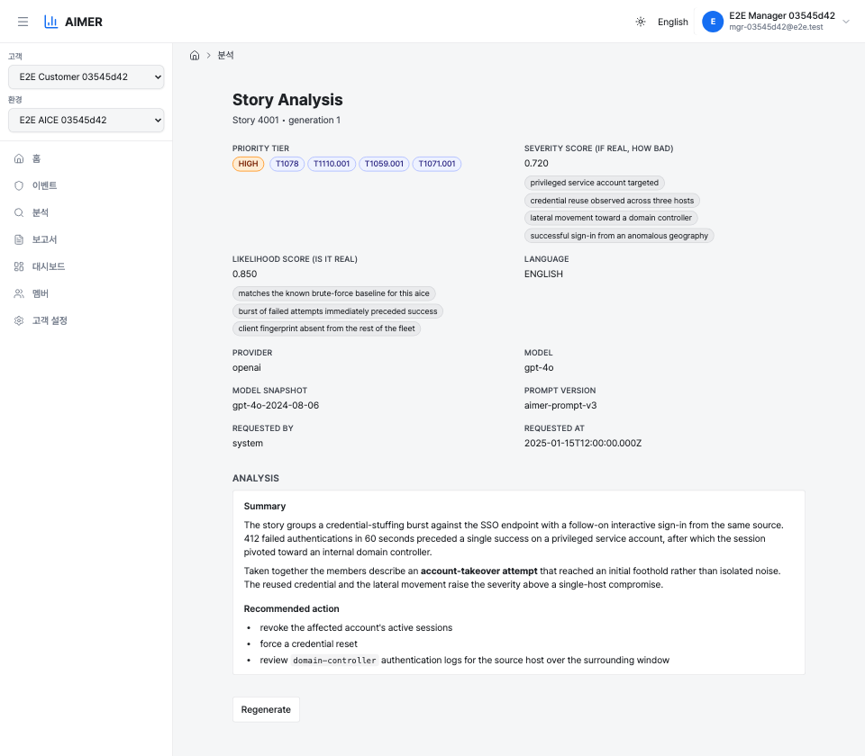
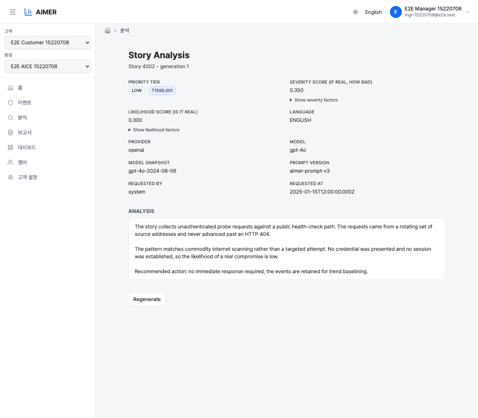
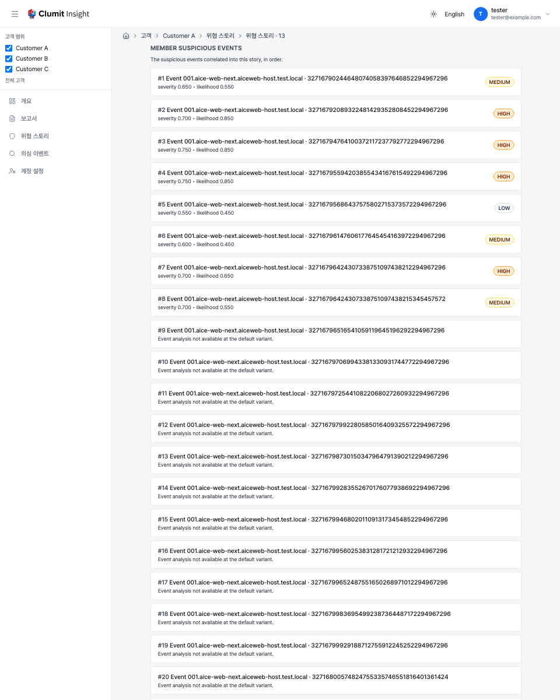
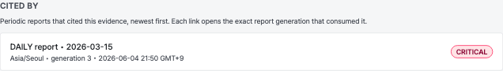
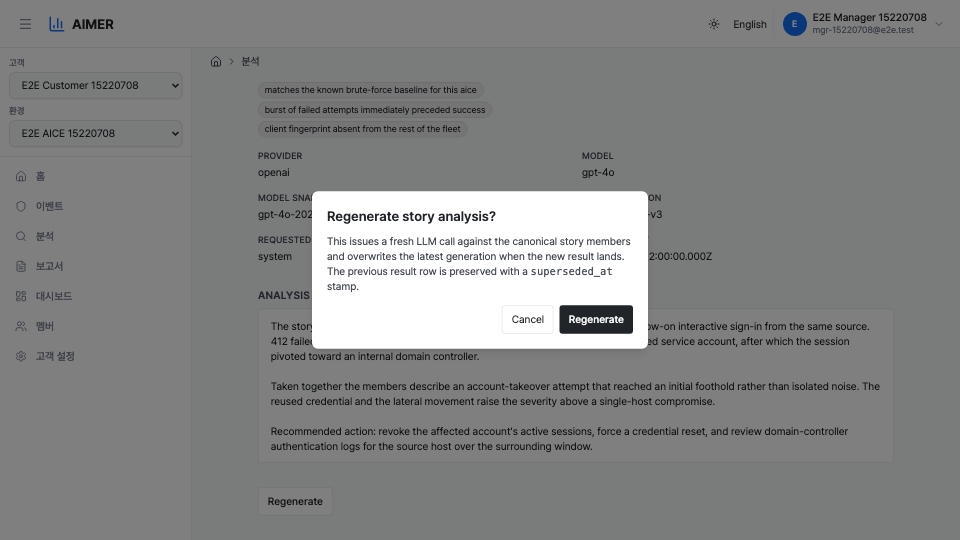

# 스토리 분석 페이지

스토리 분석 페이지는 다중 이벤트 스토리에 대한 단일 LLM 분석을 보여줍니다.
스토리는 aice-web-next가 관련 탐지 이벤트들을 묶어 심층 검토에 사용하는
단위입니다. 각 스토리는 기본 `(언어, 공급자, 모델)` 변형마다 한 번씩 백그라운드
워커에 의해 분석되며, 페이지는 가장 최신의 비-슈퍼시디드(latest non-superseded)
결과를 렌더링합니다.

이 페이지는 aice-web-next에서 스토리 상세 화면을 열고 Clumit Insight 딥링크를
따라가거나, 고객 범위 URL을 통해 직접 접근할 수 있습니다.

스토리 ID는 고객 단위로만 고유하기 때문에 URL이 고객 범위로 지정됩니다.
고객 범위 없이 스토리 URL을 열면, 탭에서 선택된 고객이 스토리 소유자와
다른 경우 잘못된 스토리로 해석될 수 있습니다.

> **스크린샷 재촬영 대기(#435).** 이 페이지의 한국어 캡처들은 분석 화면의
> UI 크롬을 `next-intl`로 지역화한 #435 이전에 촬영되어, 제목·필드 라벨·
> 섹션 머리글·재생성 모달 등 주변 UI가 아직 영어로 표시됩니다. 모두
> 데이터를 담은 화면이라 실데이터 aice-web-next 스택에서 다시 촬영해야
> 하며, 매뉴얼 정책(docs/AUTHORING.md)에 따라 조작하거나 손으로 편집하지
> 않고 별도 문서 패스에서 재촬영합니다. 영어 캡처는 영어 크롬이
> 그대로이므로 영향을 받지 않습니다.

## 스토리가 분석에 진입하는 방식

워커 파이프라인은 운영자 조작 없이 다음 단계를 실행합니다.

1. Phase 2 인제스트가 고객의 스토리 멤버 이벤트를 기록하면
   `story_analysis_state` 행이 준비 상태를 추적합니다. 준비 조용 기간
   동안 스토리가 유휴 상태이거나 최대 대기 시간이 경과하면 `pending`에서
   `ready`로 승격됩니다. 두 값은 기본적으로 `15`분(유휴)과 `6`시간(최대
   대기)이며, 배포별로 `ANALYSIS_STORY_IDLE_MINUTES` /
   `ANALYSIS_STORY_MAX_WAIT_HOURS`로 조정할 수 있습니다(틱 시점에 읽음;
   [분석 워커](../operations/analysis-worker.md) 참고). 양수가 아니거나
   숫자가 아닌 값은 기본값으로 폴백합니다.
2. 디스패처는 기본 변형의 실제 `story_analysis_job` 행을 비어 있는 모든
   `ready` 또는 `dirty` 상태 행에 대해 시드한 뒤, `FOR UPDATE SKIP
   LOCKED`로 `queued` 행을 선택하며 `(customer_id, story_id)` 단위 어드바이저리
   락을 적용합니다.
3. 워커는 정규(canonical) 스토리 버전(최신 `received_at`)의 멤버를 읽고,
   이벤트 범위 리댁션 토큰을 스토리 범위 토큰(`<<REDACTED_*_E{i}_*>>`)으로
   다시 작성한 다음, mTLS로 `system:analysis-worker` 신원으로 aimer의
   `analyzeStory` 뮤테이션을 호출합니다.
4. 응답은 검증(MITRE 기법 ID는 벤더링된 ATT&CK 세트로 필터링하고, 점수
   근거 칩은 형태 필터링 후 다섯 개로 제한하며, LLM 본문에 대해 환각 스캔을
   수행)된 뒤 `story_analysis_result`에 기록됩니다. 이후 auth-DB 작업 행이
   `status='done'`으로 확정됩니다.

재시도 가능한 실패(5xx, 전송 오류, mTLS 오류)는 지수 백오프와 함께
`ANALYSIS_MAX_ATTEMPTS`까지 다시 큐에 들어갑니다. 치명적 실패(4xx, 환각 감지,
리댁션 정책 버전 누락 또는 불일치)는 즉시 작업을 `failed`로 표시합니다.

멤버 이벤트 시각을 해석할 수 없는 경우도 재시도 대상입니다.
`baseline_event`와 `story_member`는 순서 보장 없이 별도의 Phase 2
엔드포인트로 수집되므로, 참조하는 baseline 행이 도착하기 전에 스토리 작업이
실행될 수 있습니다. 이러한 작업은 동일한 백오프로 다시 큐에 들어가 지연된
baseline이 스스로 복구되도록 하며, `ANALYSIS_MAX_ATTEMPTS`를 초과한 뒤에야
진정한 데이터 무결성 결함을 의미하는 터미널 `failed`가 됩니다.

자동 dirty 재큐잉은 `ANALYSIS_MAX_GENERATION`(기본 `50`)으로
제한됩니다. 스토리의 현재 세대가 상한에 도달하면 워커는
`analysis.story_max_generation_reached` 로그 라인을 남기고 dirty
표시를 정리합니다. `story_analysis_state` 행은 다시 `ready`로
되돌려져 시드 단계가 매 틱마다 같은 행을 재선택하지 않게 합니다.
기존 분석 결과 행은 그대로 유지되며 새 LLM 호출은 발생하지
않습니다. 강제 재실행은 이 상한에서 제외되므로, 운영자는 **재생성**
버튼으로 언제든지 새로운 LLM 호출을 발행할 수 있고 이 방법이 상한에
도달한 스토리를 진행시키는 정식 경로입니다.

## 우선순위와 점수

상단 영역에는 점수 관련 세 가지 항목이 표시됩니다.

- **우선순위 등급(Priority tier)** — `CRITICAL`, `HIGH`, `MEDIUM`, `LOW` 중
  하나입니다. 색상 배지로 표시되며, 아래 두 점수로부터 4×4 매트릭스 룩업을
  통해 결정적으로 도출됩니다. LLM이 직접 반환하는 값이 아닙니다.
- **심각도 점수(Severity score)** — `0.000`–`1.000` 범위, 소수점 세 자리.
  "이 스토리가 실제 공격이라면 얼마나 심각한가"를 나타냅니다.
- **신뢰도 점수(Likelihood score)** — `0.000`–`1.000` 범위, 소수점 세 자리.
  "이것이 노이즈가 아닌 실제 악성일 가능성"을 나타냅니다. 저장된 값은
  LLM의 원본 추정치이며, 등급 도출 시점에만 플로어가 적용됩니다 (예:
  멤버가 다섯 개 이상이면 매트릭스 룩업 직전에 신뢰도를 `≥ 0.7`로 상승;
  스토리에 `known_ioc_hit`이 있으면 `≥ 0.95`로 상승). 이 덕분에 보정
  데이터와 플로어 정책을 변경할 때 과거 데이터를 재기록할 필요가 없습니다.
  `known_ioc_hit` 신호는 스토리에서 관찰된 지표(IP / 도메인 / URL / 파일
  해시)를 Tier-1 로컬 위협 인텔리전스 피드와 대조하여 플랫폼 내부에서
  생성됩니다 — 알려진 악성 목록을 가져와 로컬에서 대조하므로 고객 지표는
  호스트를 벗어나지 않습니다. 라이선스가 확인된 피드의 결정적(deterministic)
  일치만 플로어를 상승시키며, 미확인 피드나 비결정적 소스의 일치는 맥락용으로
  기록될 뿐 플로어를 상승시키지 않습니다.

### 등급 매트릭스

|              | L < 0.4 | 0.4 ≤ L < 0.6 | 0.6 ≤ L < 0.8 | L ≥ 0.8  |
|--------------|---------|---------------|---------------|----------|
| S ≥ 0.8      | MEDIUM  | HIGH          | CRITICAL      | CRITICAL |
| 0.6 ≤ S < 0.8 | LOW    | MEDIUM        | HIGH          | HIGH     |
| 0.4 ≤ S < 0.6 | LOW    | LOW           | MEDIUM        | MEDIUM   |
| S < 0.4      | LOW    | LOW           | LOW           | LOW      |

## 위협 인텔리전스 커버리지(Threat-intel coverage)

`known_ioc_hit` 플로어 신호는 그것이 평가된 위협 인텔리전스 커버리지만큼만
신뢰할 수 있습니다. 스토리가 보강(enrichment)되는 시점에 신호를 산출하는
Tier-1 로컬 피드를 사용할 수 없거나 오래되었을 때, 플랫폼은 매칭이 없었다는
사실을 조용히 정상 결과로 취급하지 않고 검사가 **불완전한 커버리지**에서
수행되었음을 기록합니다. 무엇보다도 분석은 그대로 진행됩니다 — 피드가
중단되었거나 비어 있어도 `known_ioc_hit = false`가 되어 스토리가 차단되는 일은
없지만, `false`가 확인된 정상 결과로 오인되지 않도록 커버리지가 표시됩니다.

표준(canonical) 버전의 보강이 불완전한 커버리지에서 수행되었을 때, 페이지는
점수 항목 위에 **"위협 인텔리전스 커버리지 불완전"** 안내를 표시합니다. 이는
그렇지 않으면 동일하게 보이는 두 결과를 구분합니다.

- **안내 없음(완전한 커버리지)** — 지표가 Tier-1 피드와 완전히 대조되었고
  알려진 IOC가 일치하지 않았습니다. 진정한 정상 결과입니다.
- **안내 표시(불완전한 커버리지)** — 피드를 사용할 수 없거나 오래되었거나
  일부만 커버된 상태에서 검사가 수행되어, 여기서의 "알려진 IOC 없음"은 확인된
  정상 결과가 아니라 얕거나 저하된 신호를 반영한 것일 수 있습니다. 이 안내가
  있을 때는 `LOW`/`MEDIUM` 스토리의 IOC 차원을 신중하게 다루십시오.

이 안내는 스토리의 **현재 표준 버전**의 커버리지 상태를, 그 버전의 보강이
**완료된** 경우에만 반영합니다. 보강이 아직 끝나지 않았거나 표준 버전이
완료 전에 하드 실패한 스토리에는 안내가 표시되지 않습니다 — "아직 검사되지
않음"은 검사가 완료되었으나 저하된 상태와 다른 상태이기 때문입니다.
우선순위 등급, 점수, 근거는 커버리지에 의해 **변경되지 않습니다** — 플로어는
불리언 신호만 읽으며, 이 안내는 그 위에 얹힌 투명성 표시일 뿐 등급 산출의
입력이 아닙니다.

<!-- 스크린샷 자리표시자: 점수 항목 위에 "위협 인텔리전스 커버리지 불완전"
     안내가 표시된 스토리 헤더. 커버리지 데이터는 aice-web-next가 공급하는
     보강에서 비롯되므로, 보강 시점에 Tier-1 피드를 사용할 수 없었던 스택의
     실데이터 캡처가 필요합니다(docs/AUTHORING.md 참조). -->

## 점수 근거(Score factors)

각 점수 아래에는 해당 점수를 설명하기 위해 LLM이 생성한 짧은 명사구
(최대 다섯 개)가 칩 형태로 표시됩니다. 각 축은 자체 칩 행을 갖습니다.

- 명사구는 LLM이 생성하며, 축별 최대 다섯 개, 항목당 최대 약 80자입니다.
- LLM이 해당 축에 대해 사용 가능한 명사구를 반환하지 못한 경우 (예:
  입력 멤버가 설명을 지원하기에 너무 빈약한 경우), 칩 행에는
  `insufficient evidence`라는 단일 자리 표시자가 표시됩니다. 이 값은
  "점수는 기록되었지만 설명을 제공할 수 없음"을 의미하며, 입력 없이 LLM이
  실행되었다는 뜻은 아닙니다.

`LOW` 등급 결과에서는 심각도와 신뢰도 점수 근거 칩 행이 각각 **심각도
요인 보기** / **가능성 요인 보기** 디스클로저 안으로 접혀,
페이지가 칩 세부 대신 등급 배지, 점수, MITRE 칩을 먼저 보여줍니다.
디스클로저는 네이티브 `
` 요소로 구현되어 키보드와 스크린
리더 접근성을 그대로 따르며, 클릭 시 페이지를 떠나지 않고 인라인으로
펼쳐집니다. `MEDIUM` 이상 등급에서는 트리아지에 칩 근거가 곧바로
필요한 경우가 많으므로 칩 행을 항상 노출합니다.

## MITRE ATT&CK 기법

우선순위 배지 옆에는 LLM이 스토리와 연관시킨 MITRE ATT&CK 기법 칩
(예: `T1078`, `T1110.001`)이 행으로 표시됩니다. 각 칩에는 기법 ID가
표시되며, 마우스를 올리면 공식 기법 이름이 툴팁으로 나타납니다 (예:
`T1078` → "Valid Accounts"). 현재 벤더링된 MITRE 지식 베이스에 존재하지
않는 ID의 칩은 툴팁 없이 표시됩니다 — 해당 분석 행이 이전 MITRE 번들
기준으로 기록된 경우이며, ID만으로 대체 표시됩니다. LLM이 어떤 기법도
반환하지 않은 경우 칩 행은 표시되지 않습니다.

## 메타데이터 항목

점수 영역 아래에는 분석 메타데이터가 두 열 그리드로 표시됩니다.

- **언어(Language)** — `KOREAN` 또는 `ENGLISH`. 모든 뷰어에게 표시됩니다.

나머지 항목은 산출물이 어떻게 생성되었는지에 대한 **모델/프롬프트 출처**이며
애널리스트로 제한됩니다(아래 [애널리스트 전용 항목](#애널리스트-전용-항목)
참고):

- **공급자(Provider)** — LLM 공급자 이름 (예: `openai`).
- **모델(Model)** — 요청한 모델 ID (예: `gpt-4o`).
- **모델 스냅샷(Model snapshot)** — 공급자가 보고한 구체적인 모델 버전.
- **프롬프트 버전(Prompt version)** — aimer 프롬프트 템플릿 버전.
- **요청자(Requested by)** — 최신 세대를 트리거한 계정 ID. 정기 워커 틱이
  생성한 분석이라면 `system`으로 표시됩니다.
- **요청 시각(Requested at)** — 분석을 요청한 시각으로, 사용자의
  시간대에 맞춰 브라우저의 로캘 관례에 따라 표시됩니다. 결정 순서
  (저장된 값 → 브라우저 → UTC)는
  [계정 환경설정 → 시간대](../account-preferences.md#시간대)를
  참고하세요.

### 애널리스트 전용 항목

모델/프롬프트 출처 항목과 **재생성** 버튼은 해당 고객의 애널리스트에게만
표시됩니다. 애널리스트가 아닌 뷰어에게도 분석적 의미가 있는 항목 — 우선순위
등급, MITRE ATT&CK 태그, 언어, 점수, 요인, 서술 — 은 그대로 유지되지만, 공급자,
모델, 모델 스냅샷, 프롬프트 버전, 요청자, 요청 시각 항목은 숨겨지고 재생성
컨트롤도 표시되지 않습니다.

이 페이지의 재생성 버튼에는 조건이 하나 더 있습니다. 애널리스트이면서
**동시에** [브리지 세션](../cross-customer-overview.md)이 아닐 때만 표시됩니다.
재생성 엔드포인트는 *쓰기*를 인가하는데, 브리지 세션은 기반 계정이
애널리스트더라도 쓰기를 수행할 수 없습니다 — 따라서 브리지 세션의 애널리스트는
스토리를 읽을 수는 있어도(출처 항목 포함) 재생성 버튼은 보지 못합니다.

<!-- 스크린샷 자리표시자: 애널리스트가 아닌 뷰어의 축소된 스토리 헤더(모델/
     프롬프트 출처 항목 없음, 재생성 버튼 없음). docs/AUTHORING.md에 따라 실제
     데이터가 적재된 스택에서 캡처할 것. -->

## 고정된 증거 버전

페이지를 직접 열면 해당 스토리의 최신 분석이 표시됩니다. 리포트의
[출처 패널](reports.md#출처)에서 진입한 경우, 링크에는 고정된
`generation`(과 함께 언어·제공자·모델)이 담겨 있어, 페이지는 최신
재분석이 아니라 **리포트가 사용한 바로 그 버전**의 증거를 로드합니다.

고정된 버전을 더 이상 사용할 수 없는 경우 — 더 새로운 세대로
슈퍼시드되었거나 보존 정책으로 제거된 경우 — 페이지는 최신 분석으로
조용히 대체하지 않고 **"이 근거 버전은 더 이상 사용할 수 없습니다"**
안내를 표시합니다. 따라서 출처 링크가 더 새로운 버전을 리포트가 인용한
버전인 것처럼 잘못 나타내는 일은 없습니다.

## 분석 본문

본문은 LLM 분석 서술을 렌더링된 Markdown으로 표시합니다 — 제목, 글머리
기호 및 번호 매기기 목록, 인라인 코드 스팬이 원시 `#`, `-`, 백틱 문자가
아니라 스타일이 적용된 요소로 표시되며, 이벤트 분석 페이지와 동일합니다.
서술에 포함된 원시 HTML은 비활성 텍스트로 처리되며 실제 마크업으로
렌더링되지 않습니다.

본문에는 모든 스토리 범위 토큰(`<<REDACTED_*_E{i}_*>>`)이 원래의 평문
엔티티로 복원됩니다. 토큰 네임스페이싱은
분석을 생성하는 동안 LLM이 멤버 이벤트를 가로질러 엔티티를 잘못
병합하는 것을 방지합니다. 렌더링 시점에는 로더가 각 `E{i}`를
파싱하고 `input_event_refs`에서 `(aice_id, event_key)`를 조회한 뒤,
해당 이벤트의 redaction 맵을 복호화하여 원래 값을 치환합니다.
복원할 수 없는 토큰(복호화 실패, 맵 행 누락, 인덱스 범위 초과)은
페이지가 계속 렌더링되도록 그대로 통과합니다. 환각으로 판단된
디코딩은 기록 시점에 차단되며 이 화면에 도달하지 않습니다. 이 복원과
그 이면의 기록 시점 누출 가드는 서술 본문뿐 아니라 위의 점수 근거 칩에도
적용되므로, 근거에 포함된 토큰(또는 모델이 디코딩한 고객 자산 값)도
동일한 방식으로 처리됩니다.

`known_ioc_hit` 플로어 신호를 산출하는 동일한 위협 인텔리전스 매칭(see
[우선순위와 점수](#우선순위와-점수))은 분석 입력에 짧은 서술형
**보강 사실(enrichment fact)** 도 추가합니다 — 예를 들어 "이 지표가
악성 피드에 C2로 등재됨". 사실에 포함된 고객 자산 값 — 등록된 IP 대역
또는 보유 도메인에 속하는 지표 — 은 모델에 전달되기 전에 리댁션되어 사실
범위 토큰(`<<REDACTED_*_F{k}_*>>`)을 갖게 되며, 외부 지표(공격자 호스트,
공인 IP)는 리댁션 없이 그대로 전달됩니다. 이 페이지에서는 사실 범위
토큰이 `E{i}` 토큰과 똑같이 원래 평문으로 복원됩니다 — 각 `F{k}`를
파싱하고 `input_fact_refs`에서 해당 사실을 조회한 뒤 그 사실의 맵을
복호화하여 값을 치환하며, 동일한 권한 검증을 거칩니다. 고객 자산 평문은
권한이 확인된 이 렌더링 화면에만 나타나며, 보고서 모델에는 절대 전송되지
않습니다(정기 보고서는 자체 프롬프트 전에 사실 범위 토큰을 다시
마스킹합니다). `E{i}`와 마찬가지로 복원할 수 없는 사실 범위 토큰은 그대로
통과합니다.

## 구성원 탐지 이벤트

분석 본문 아래에는 이 스토리로 상관된 **구성원 탐지 이벤트**가 스토리의
구성원 순서(redaction 토큰 네임스페이스에 내장된 구성원 서수)대로
나열됩니다. 각 구성원은 해당 이벤트의
[분석 결과 페이지](../analysis-result.md)로 연결되는 카드이며, 기본
`(언어, 제공자, 모델)` 변형을 함께 전달하므로 이벤트 페이지가 카드가
설명하는 것과 동일한 증거를 해석합니다. 카드 제목은 이벤트의 시간과 종류 —
`{이벤트 시간} · {종류}`(예: `6/3, 2:05 PM · HTTP Threat`)로, 탐지 이벤트
목록과 동일한 레이블이며, 원본 `aice_id`는 제목 아래의 메타 줄에 표시됩니다.
불투명한 `event_key`는 제목으로 표시되지 않습니다. 이벤트에 해당 변형의
결과가 있는 경우 카드에는 구성원의 우선순위 등급 배지와 심각도·가능성 점수가
표시됩니다. 해당 변형에 결과가 없는 구성원(예: 보존 정책으로 제거됨)은
단순한 `이벤트` 제목으로 대체되고, 점수 대신 "기본 변형에서 이벤트 분석을
사용할 수 없음"이라는 짧은 안내를 메타 줄에 표시합니다.

이는 신뢰 드릴다운의 하향 절반입니다. 사용자는 스토리 서술에서 각 인용된
이벤트로 이동하고, 이어서 이벤트 페이지에서 원본 이벤트로 내려갈 수
있습니다.

## 인용한 보고서(Cited by)

하나 이상의 정기 리포트가 이 스토리를 인용한 경우, 페이지에는 해당
리포트를 최신순으로 나열하는 **인용한 보고서** 추적이 표시됩니다. 각 항목은
스토리를 사용한 **정확한 리포트 세대**로 다시 연결됩니다 — 링크는 세대
고정이므로 최신 버전이 아니라 리포트가 작성된 시점의 버전을 엽니다.
또한 추적은 **현재 보고 있는 증거 세대**를 기준으로 범위가 한정됩니다.
즉, *이* 세대의 스토리를 인용한 리포트만 나열하므로, 더 이전의 고정
세대에서는 다른 세대가 아니라 그 세대를 인용한 리포트가 표시됩니다.
스토리는 여러 구간에 인용될 수 있으며, 추적은 리포트 버킷마다 한 항목을
나열합니다. 어떤 리포트에도 인용되지 않은 스토리는 추적을 표시하지
않습니다(오류가 아닌 정상 상태입니다).

이 추적은 `reports:read` 권한으로 게이트됩니다. 고객의 리포트를 읽을 수
없는 사용자에게는 열 수 없는 링크 대신 추적이 표시되지 않습니다.

## 강제 재실행

`analyses:configure` 권한을 가진 운영자(해당 고객의 애널리스트)는 페이지
하단의 **재생성** 버튼으로 분석을 수동으로 다시 실행할 수 있습니다. 이 버튼은
브리지 세션이 아닌 애널리스트에게만 표시됩니다(아래
[애널리스트 전용 항목](#애널리스트-전용-항목) 참고).

확인 모달은 새 LLM 호출이 발생하며 새 결과가 도착하면 최신 세대가
슈퍼시드된다는 점을 명시합니다. 이전 결과 행은 `superseded_at`
타임스탬프와 함께 보존되며, 어떤 것도 제자리에서 덮어쓰지 않습니다.

모달을 제출하면 새 분석이 큐에 들어갑니다(기본이 아닌 변형을 대상으로
지정할 수도 있습니다).

동작:

- 작업 행의 `generation`이 1 증가합니다 (해당 변형의 이전 행이 없으면
  `1`로 시작). `status`는 `queued`, `attempts`는 `0`으로 초기화되며, 다음
  워커 틱부터 LLM 호출이 시작됩니다.
- 브리지 세션(`bridge_write_blocked`, `bridge_not_allowed`)과
  `analyses:configure` 권한이 없는 멤버 계정은 `403`으로 거부되며,
  거부 사유가 응답 본문에 포함됩니다. 해당 고객의 멤버가 아닌 호출자는
  `404 story_not_found`를 받습니다. 따라서 이 엔드포인트는 호출자가
  접근할 수 없는 고객에 대해 스토리 ID 존재 여부를 탐지하는 데
  사용할 수 없습니다 (스토리 페이지와 요약 엔드포인트와 동일한
  존재 은닉 정책).
- 아카이브된 상태 행이나 정규 버전이 남아 있지 않은 스토리는 `409
  source_unavailable`를 반환하고, 알 수 없는 스토리는 `404
  story_not_found`를 반환합니다. 스토리 분석은 시간대 독립적이므로
  `?tz=…`는 `400 invalid_param`으로 거부하며, `KOREAN`/`ENGLISH` 이외의
  `lang` 값도 동일한 오류로 거부합니다.

재생성이 큐에 들어간 동안 페이지에는 새 세대 번호를 표시하는 노란색 상태
배너가 나타납니다. 워커가 새 결과를 기록한 뒤 페이지를 새로 고치세요.

## 모델 선택 및 비교

애널리스트는 여러 LLM 모델에 걸쳐 분석 품질을 평가할 수 있습니다 — 동일한
스토리 분석을 다른 모델로 생성하여 결과를 비교합니다. 이 컨트롤들은 모두
**애널리스트 전용**입니다. 이들이 제공하는 모델 식별 정보는 구성된
카탈로그(`ANALYSIS_MODEL_CATALOG`)에서 가져오며, 항상 배포의 기본 모델을
포함합니다. 이는 선택기용 표시/허용 목록일 뿐이며, 재생성 엔드포인트는 기존
입력을 그대로 허용합니다. 카탈로그가 재생성 권한에 묶여 있으므로, 재생성
**모델** 드롭다운과 **비교 대상** 선택기는 모두 재생성 버튼과 동일한
조건(애널리스트 **이면서** [브리지 세션](#애널리스트-전용-항목)이 아님)을
따릅니다. 비교 뷰 자체와 열별 출처 정보는 해당 고객의 모든 애널리스트에게
렌더링되므로 공유된 `?compareModel` 링크는 여전히 동작합니다 — 다만 재생성이
가능한 애널리스트만 **비교 대상** 선택기로 새 비교를 만들 수 있습니다.

### 재생성 시 모델 선택

재생성 모달에는 **모델** 드롭다운이 있으며, 현재 보고 있는 변형의 모델을
기본값으로 합니다. 제출하면 선택한 `(model_name, model)`로 스토리를
재생성합니다(현재 언어가 함께 전달됩니다). 각 모델은 독립적인 불변 변형이므로,
새 모델로 재생성해도 현재 변형을 대체하지 않습니다 — 둘 다 비교할 수 있도록
유지됩니다.

### 나란히 비교

분석 옆의 **비교 대상** 선택기로 두 번째 모델을 고를 수 있습니다. 그러면
페이지가 열려 있는 변형과 비교 변형을 두 열로 렌더링합니다 — 분석 본문,
심각도 및 가능성 점수와 근거 칩, 그리고 열별 출처 정보(공급자, 모델, 스냅샷,
프롬프트 버전, 세대) — 를 섹션 단위로 정렬합니다. 좁은 화면에서는 두 열이
세로로 쌓입니다. 모델을 선택하면 URL에 `?compareModelName=&compareModel=`이
설정되며(공유 가능), **비교 종료**가 이를 지웁니다. 정기 리포트와 달리 스토리는
자체 구성원을 분석하므로, 비기본 모델 스토리에는 빈 섹션 관련 주의 사항이
없습니다.

비교는 **이미 저장된 변형에 대한 읽기 전용**입니다: 비교 열은 생성 작업을 큐에
넣지 않는, 세대 고정 없는 모델 전용 정확 조회로 해석되므로, 비교 모드에
진입해도 LLM 호출이 조용히 소비되지 않습니다. 선택한 모델이 이 스토리에 대해
아직 생성되지 않았다면, 페이지는 해당 모델로 미리 선택된 모델 드롭다운을 가진
**재생성** 동작과 함께 안내를 표시하며, 누락된 변형을 자동으로 생성하지
않습니다 — 새 LLM 호출에는 실제 비용이 들고 명시적 선택으로 남기 때문입니다.

<!-- 스크린샷 자리표시자: 2열 스토리 비교(현재 vs 비교 모델)와 미리 선택된
     재생성 동작을 가진 "변형 미생성" 안내. 실제 데이터 캡처에는 동일 스토리의
     두 모델 변형이 적재된 스택이 필요하며 아직 확보되지 않았습니다
     (docs/AUTHORING.md). -->

## 시스템 간 딥링크

aice-web-next는 스토리에 분석이 존재하는지 확인하여 딥링크 배지 노출
여부를 결정합니다. 분석이 생성되기 전에는 배지가 표시되지 않으며, 그 외의
경우 배지는 우선순위 등급과 두 점수만 담아 이 페이지로 연결됩니다. TTP
태그와 점수 근거는 콘텐츠이며 표면 메타데이터가 아니므로, 배지가 분석 세부
정보를 누설하지 못하도록 배지에서 제외됩니다. TTP로 스토리를 필터링하려면
배지가 아니라 Clumit Insight의 개요 목록을 사용하세요.

딥링크 확인은 페이지 및 재생성 동작과 동일한 존재 은닉 정책을 적용합니다.
고객의 멤버가 아닌 호출자는 권한 오류가 아니라 `404`를 받으므로 배지 탐지가
고객 간 스토리 ID 열거에 사용될 수 없습니다. `analyses:read` 권한이 없는
멤버는 권한 오류를, 확인이 즉시 거부한 브리지 세션은 거절을 받습니다.
