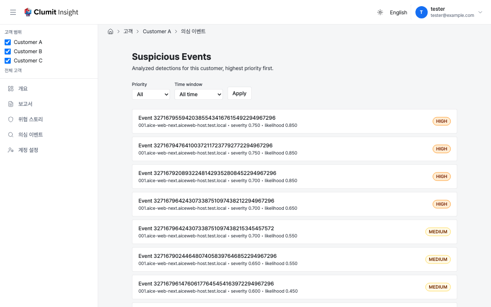

# 의심 이벤트

Clumit Insight가 보여 주는 의심 이벤트는 Clumit Security가 탐지하고 기본
트리아지를 통과한 뒤 aice-web-next에서 전달된 이벤트 — 즉 의심되는
위협입니다. 이 출처를 명시하는 곳은 이 페이지 한 곳이며, 다른 분석
페이지는 여기를 참조합니다.

의심 이벤트 목록은 한 고객에 대해 **분석된** 하위 집합 — 이미 분석
결과가 있는 이벤트 — 의 고객 범위 인덱스로, 기존 [이벤트 분석 상세
페이지](../analysis-result.md)로 연결됩니다. 전달된 이벤트 전체 모집단이
아닙니다.

> **스크린샷 재촬영 대기(#435).** 위 한국어 캡처는 분석 화면의 UI 크롬을
> `next-intl`로 지역화한 #435 이전에 촬영되어, 제목·부제·필터 바·페이지
> 이동 등 주변 UI가 아직 영어로 표시됩니다. 데이터를 담은 화면이라 실데이터
> aice-web-next 스택에서 다시 촬영해야 하며, 매뉴얼 정책
> (docs/AUTHORING.md)에 따라 조작하지 않고 별도 문서 패스에서 재촬영합니다.
> 영어 캡처는 영어 크롬이 그대로이므로 영향을 받지 않습니다.

이것은 **새로운 고객 수준 세그먼트**입니다. 이벤트 상세 경로는 단일 AICE
환경 범위이지만, 고객 전체 목록은 여러 AICE 환경에 걸쳐 있으므로 단일
환경별 경로 아래에 둘 수 없습니다.

## 무엇을 나열하는가

목록은 **분석된** 이벤트, 즉 분석 결과(`event_key`, 우선순위 등급,
점수)가 있는 이벤트만 보여줍니다. 분석되지 않은 원시 탐지에는
`event_key`나 우선순위가 없으며 이 목록의 범위 밖입니다.

각 행은 이벤트별 단일 정규 변형으로 해석됩니다. 즉 대체되지 않은 기본
언어/모델의 최신 세대이므로 이벤트가 두 번 나타나지 않습니다.

### 상세 링크는 변형을 포함한다

각 행은 이벤트의 **정규 분석 변형**(언어와 모델)으로 연결되므로, 행을
따라가면 분석되지 않은 이벤트가 아니라 해당 분석 결과가 열립니다.

## 정렬

이벤트는 **위험도가 높은 순서**로, 모든 방향을 고정하여 나열됩니다.

1. **우선순위 등급** — `CRITICAL` > `HIGH` > `MEDIUM` > `LOW`, 원시
   `priority_tier` 텍스트가 아니라 명시적 정수 순위로 정렬.
2. **심각도 점수**, 내림차순.
3. **가능성 점수**, 내림차순.
4. **요청 시각**, 내림차순.
5. **AICE 환경 ID**, 오름차순 — 안정적 동점 처리.
6. **이벤트 키**, 오름차순 — 안정적 동점 처리.

## 페이지네이션

목록은 오프셋이 아니라 **키셋** 커서로 서버 측 페이지네이션을 하며,
기본 페이지 크기는 25입니다. 더 많은 행이 남아 있을 때 **다음 페이지**
링크가 나타나고, 모든 정렬 키 구성 요소를 인코딩한 불투명 커서와 활성
필터를 담습니다. 시간 범위 필터가 활성화되면 그 하한 시각이 **첫
페이지에서 고정되어** 커서에 함께 실리므로, 한 번의 페이지네이션 세션의
모든 페이지가 동일한 시각을 기준으로 필터링됩니다. 페이지를 넘기는 동안
범위가 앞으로 밀려 경계 근처의 행이 누락되는 일이 없습니다.

## 필터

- **우선순위** — 한 등급만, 또는 전체.
- **기간** — 최근 24시간, 7일, 30일 이내에 요청된 이벤트로 제한하거나
  전체 기간.

필터를 변경하면 페이지네이션이 첫 페이지로 초기화됩니다.

## 상태

- **비어 있음** — "현재 필터와 일치하는 의심 이벤트가 없습니다" 안내.
- **로딩 중** — 페이지가 해석되는 동안 로딩 표시.
- **오류** — **다시 시도** 동작이 있는 오류 안내.

## 접근 제어

목록은 `analyses:read` 권한이 필요합니다. 거부 매핑은 리포트 인덱스와
동일합니다. 멤버가 아니거나 존재하지 않는 고객은 `404`(존재 은닉),
`analyses:read`가 없는 멤버나 거부된 브리지 세션은 실제 `403`을
반환합니다.
