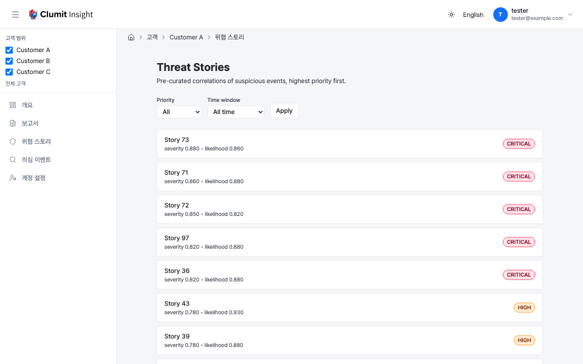

# 위협 스토리

위협 스토리는 여러 [의심 이벤트](suspicious-events.md)를 하나의 킬체인
내러티브로 미리 선별해 연관 지은 것입니다. 위협 스토리 목록은 그러한
스토리의 고객 범위 인덱스로, 기존 [스토리 상세 페이지](story.md)의 형제
화면입니다.

각 행은 스토리 상세 페이지로 연결됩니다. 스토리 상세는 변형 쿼리
파라미터를 받지 않고 환경 기본값에서 언어/모델을 해석하므로, 목록 링크에는
변형 파라미터가 없습니다.

## 정렬

스토리는 **위험도가 높은 순서**로 나열됩니다. 전체 정렬 순서는
다음과 같습니다.

1. **우선순위 등급** — `CRITICAL` > `HIGH` > `MEDIUM` > `LOW`. 이
   등급은 원시 `priority_tier` 텍스트가 아니라 명시적인 정수 순위로
   정렬됩니다. PostgreSQL 문자열 정렬은 `CRITICAL`을 `HIGH`와
   `MEDIUM`보다 아래에 두어 의도와 반대가 됩니다.
2. **심각도 점수**, 내림차순.
3. **가능성 점수**, 내림차순.
4. **최신성**, 내림차순 — 스토리의 마지막 준비 시각, 없으면 마지막
   업데이트 시각.
5. **스토리 ID**, 오름차순 — 안정적이고 결정적인 동점 처리.

각 행은 단일 정규 변형(최신 세대, 기본 언어/모델, 대체되지 않음)으로
해석되므로 스토리가 두 번 나타나지 않습니다.

### 우선순위 출처

목록은 인증 데이터베이스에 대한 단일 쿼리로 정렬과 페이지네이션을
수행합니다. 스토리의 우선순위와 점수는 분석 이후에야 고객
데이터베이스에 생성되므로, 분석 작업이 마무리될 때(정규 기본 변형에
대해) 그 값들이 스토리의 인증 데이터베이스 상태 행에 **비정규화**되어
저장됩니다. 목록은 그곳에서 값을 읽습니다.

기본 목록은 상태가 `ready` 또는 `dirty`이며 비정규화된 결과가 있는
스토리를 보여줍니다.

- **`dirty`** 스토리(새 소스 데이터가 도착해 갱신 대기 중)는 마지막으로
  알려진 우선순위를 유지하고, 갱신이 마무리될 때까지 **업데이트 중**
  표시를 보여줍니다.
- **`pending`** 스토리(아직 결과 없음)는 우선순위가 없어, 첫 분석이
  도착하기 전까지 제외됩니다.
- **보관됨(archived)** 스토리(소스 버전이 모두 삭제됨)는 제외됩니다.

## 페이지네이션

목록은 오프셋이 아니라 **키셋** 커서로 서버 측 페이지네이션을 하므로,
새 스토리가 분석되어도 페이지 간 정렬이 안정적으로 유지됩니다. 기본
페이지 크기는 25이며, 더 많은 행이 남아 있을 때 **다음 페이지** 링크가
나타나고 모든 정렬 키 구성 요소를 인코딩한 불투명 커서를 담습니다.
커서는 활성 필터도 함께 보존합니다. 시간 범위 필터가 활성화되면 그
하한 시각이 **첫 페이지에서 고정되어** 커서에 함께 실리므로, 한 번의
페이지네이션 세션의 모든 페이지가 동일한 시각을 기준으로 필터링됩니다.
페이지를 넘기는 동안 범위가 앞으로 밀려 경계 근처의 행이 누락되는 일이
없습니다.

## 필터

필터 바에서 두 가지 필터를 사용할 수 있습니다.

- **우선순위** — 한 등급(`CRITICAL` / `HIGH` / `MEDIUM` / `LOW`)만, 또는
  전체.
- **기간** — 최신성이 최근 24시간, 7일, 30일 이내인 스토리로 제한하거나
  전체 기간.

필터를 변경하면 페이지네이션이 첫 페이지로 초기화됩니다.

## 상태

- **비어 있음** — 일치하는 스토리가 없으면 "현재 필터와 일치하는 위협
  스토리가 없습니다" 안내가 표시됩니다.
- **로딩 중** — 페이지가 해석되는 동안 로딩 표시가 나타납니다.
- **오류** — 쿼리가 실패하면 **다시 시도** 동작이 있는 오류 안내가
  표시됩니다.

## 접근 제어

목록은 `analyses:read` 권한이 필요합니다. 거부 매핑은 리포트 인덱스와
동일합니다. 멤버가 아니거나 존재하지 않는 고객은 `404`(존재 은닉),
`analyses:read`가 없는 멤버나 거부된 브리지 세션은 실제 `403`을
반환합니다.
