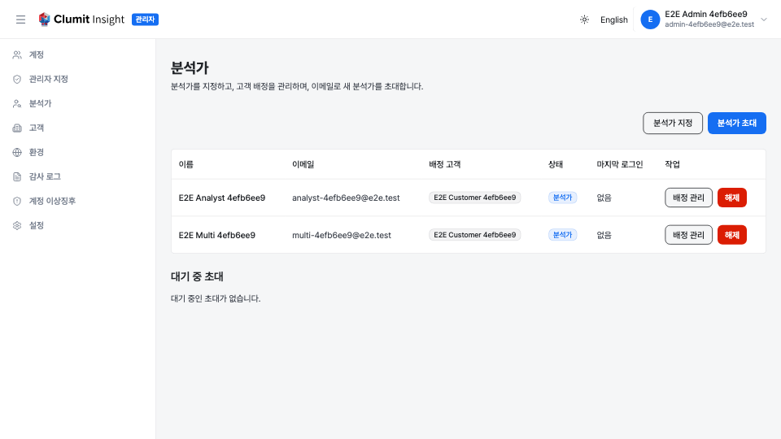
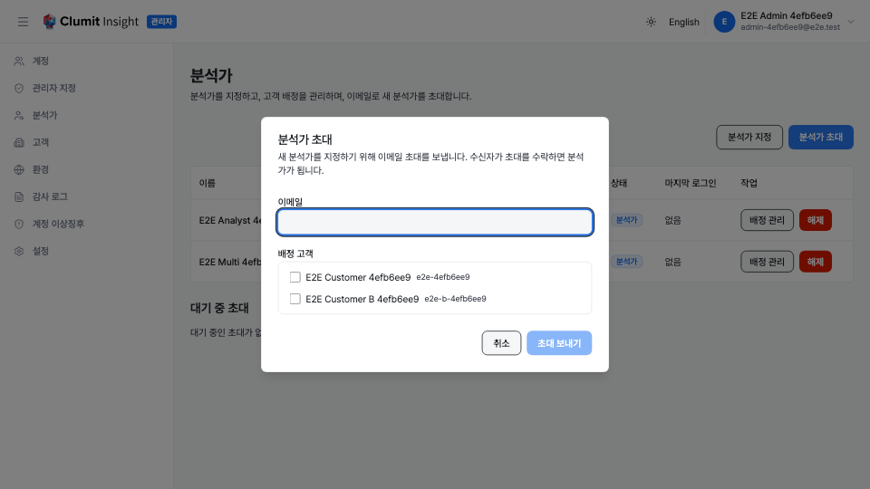
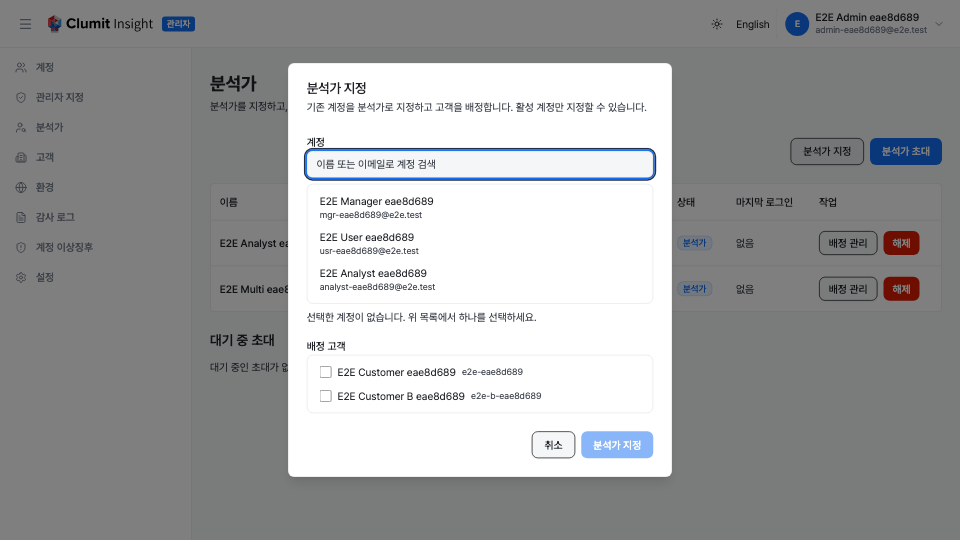
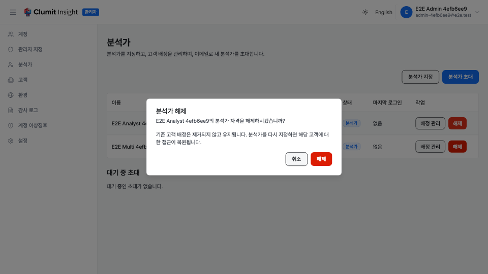
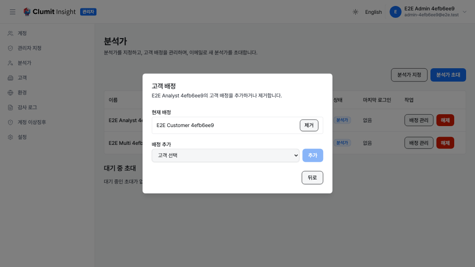

# 분석가 관리

분석가 페이지에서 시스템 관리자는 분석가를 지정하고, 고객 배정을 관리하며,
이메일로 새 분석가를 초대할 수 있습니다. 관리자 사이드바에서 **분석가**를
선택하여 엽니다.

## 권한

이 화면의 고객 및 계정 선택기는 다른 리소스를 읽기 때문에 분석가 권한만으로는
충분하지 않습니다.

- `analysts:read` — 분석가 목록과 대기 중 초대를 조회합니다.
- `analysts:write` — 지정, 해제, 초대, 초대 취소, 고객 배정 추가/제거를
    수행합니다.
- `customers:read` — 배정 칩과 고객 선택기를 채우는 고객 목록을 불러옵니다.
- `accounts:read` — 직접 지정 검색에 사용하는 계정 목록을 불러옵니다.

시스템 관리자 역할은 위 네 가지 권한을 모두 보유합니다. 고객 또는 계정 목록을
불러올 수 없으면 페이지에 경고 배너가 표시되고 해당 선택기가 비활성화되며,
나머지 기능은 계속 동작합니다. 배너는 권한 거부(`403`, 안정적인 설정 문제)와
일시적 로드 실패(예: `500` 또는 네트워크 오류로, 페이지를 새로고침해 다시
시도할 수 있음)를 구분하므로, 일시적 장애를 고객이 없는 상태로 오인하지
않습니다.

## 분석가 테이블

이 테이블에는 현재 분석가 자격이 있거나 여전히 고객 배정이 남아 있는 모든
계정이 표시됩니다(자격이 해제되었지만 배정이 남은 분석가도 정리를 위해 계속
표시됨). 각 행에는 다음이 표시됩니다.

- **이름** — 분석가의 표시 이름입니다.
- **이메일** — 분석가의 이메일 주소이며, 없으면 `—`로 표시됩니다. 이메일은
    선택 항목이므로 표시 이름이 항상 함께 표시됩니다.
- **배정 고객** — 배정된 고객마다 칩 하나가 표시됩니다. 칩 이름은 행마다
    별도 요청을 보내지 않고, 페이지 전체에 대해 한 번 불러온 고객 조회
    정보에서 해석됩니다.
- **상태** — 분석가 자격이 있으면 **분석가**, 자격이 꺼졌지만 배정이 남아
    있으면 **해제됨**으로 표시됩니다.
- **마지막 로그인** — 가장 최근 로그인 시각이며, 없으면 **없음**입니다.
- **작업** — **배정 관리** 버튼(배정 편집기 열기)과 **해제** 버튼(분석가
    자격이 있는 동안에만 표시).

## 분석가 초대

상대방에게 아직 계정이 없을 때 초대를 사용합니다. 초대를 수락하면 분석가가
됩니다.

1. 오른쪽 위의 **분석가 초대**를 클릭합니다.
2. 수신자의 **이메일**을 입력합니다.
3. 하나 이상의 **배정 고객**을 선택합니다. API가 비활성 고객을 거부하므로
    활성 고객만 제공됩니다.
4. **초대 보내기**를 클릭합니다.

해당 이메일에 대한 대기 중 초대가 이미 있으면, 중복으로 생성되지 않고 기존
초대가 갱신되며, 페이지는 기존 초대가 갱신되었음을 알립니다. 이 양식은 다음
오류를 표시합니다.

- **잘못된 이메일** — 유효한 이메일 주소가 아닙니다.
- **잘못된 고객** — 활성 고객이 선택되지 않았습니다.
- **이미 배정됨** — 선택한 모든 고객에 이미 해당 이메일이 배정되어 있습니다.

## 기존 계정 지정

상대방에게 이미 계정이 있을 때 직접 지정을 사용합니다.

1. **분석가 지정**을 클릭합니다.
2. 이름 또는 이메일로 계정을 검색합니다. 검색은 브라우저에서 전체 계정
    목록을 필터링하며, 활성 계정만 선택할 수 있습니다.
3. 계정을 선택합니다.
4. 하나 이상의 **배정 고객**을 선택합니다(활성 고객만).
5. **분석가 지정**을 클릭합니다.

지정하면 `analyst_eligible`이 `true`로 설정되고 선택한 고객 배정이
추가됩니다. 활성 계정만 지정할 수 있습니다.

## 분석가 해제

1. 테이블에서 분석가를 찾습니다.
2. 작업 열의 **해제**를 클릭합니다.
3. 확인 대화상자가 나타납니다.
4. **해제**를 클릭하여 확인합니다.

해제하면 `analyst_eligible`이 `false`로 설정됩니다. **기존 고객 배정은
제거되지 않고 유지됩니다** — 분석가를 다시 지정하면 해당 고객에 대한 접근이
복원됩니다. 확인 대화상자는 유지되는 배정이 예상 밖이 되지 않도록 이를
안내합니다.

## 고객 배정 관리

분석가를 다시 지정하지 않고도 고객 배정을 변경할 수 있습니다.

1. 분석가 행에서 **배정 관리**를 클릭합니다.
2. 대화상자가 열릴 때 해당 분석가의 현재 배정을 지연 로드합니다(열린 분석가에
    대해서만 요청 한 번).
3. 배정을 제거하려면 고객 옆의 **제거**를 클릭합니다.
4. 배정을 추가하려면 드롭다운에서 활성 고객을 선택하고(이미 배정되지 않은
    고객만 표시됨) **추가**를 클릭합니다.

목록 보기의 배정 칩과 이 편집기는 동기화 상태를 유지하며, 추가 또는 제거할
때마다 모두 새로 고쳐집니다.

## 대기 중 초대

분석가 테이블 아래의 **대기 중 초대** 섹션에는 아직 수락되지 않은 초대가
표시됩니다. 각 행에는 초대된 이메일, 초대가 배정할 고객, 만료 시각이
표시됩니다.

- **취소**를 클릭하여 대기 중 초대를 취소합니다.

대기 중 초대를 취소할 때 다음이 보고될 수 있습니다.

- **이미 만료됨** — 초대가 이미 만료되었습니다.
- **이미 수락됨** — 초대가 이미 사용되었습니다.
- **더 이상 존재하지 않음** — 초대를 찾을 수 없습니다.

## 감사 기록

분석가 관리 작업은 감사 로그에 기록됩니다.

- **account.analyst_eligible_changed** — 분석가 자격이 부여(지정)되거나
    해제될 때.
- **analyst.assignment.created** — 고객 배정이 추가될 때.
- **analyst.assignment.removed** — 고객 배정이 제거될 때.
- **invitation.created** — 분석가 초대가 전송될 때.
- **invitation.revoked** — 대기 중 초대가 취소될 때.

이 항목들은 [감사 로그](audit-logs.md) 페이지에서 확인할 수 있습니다.
