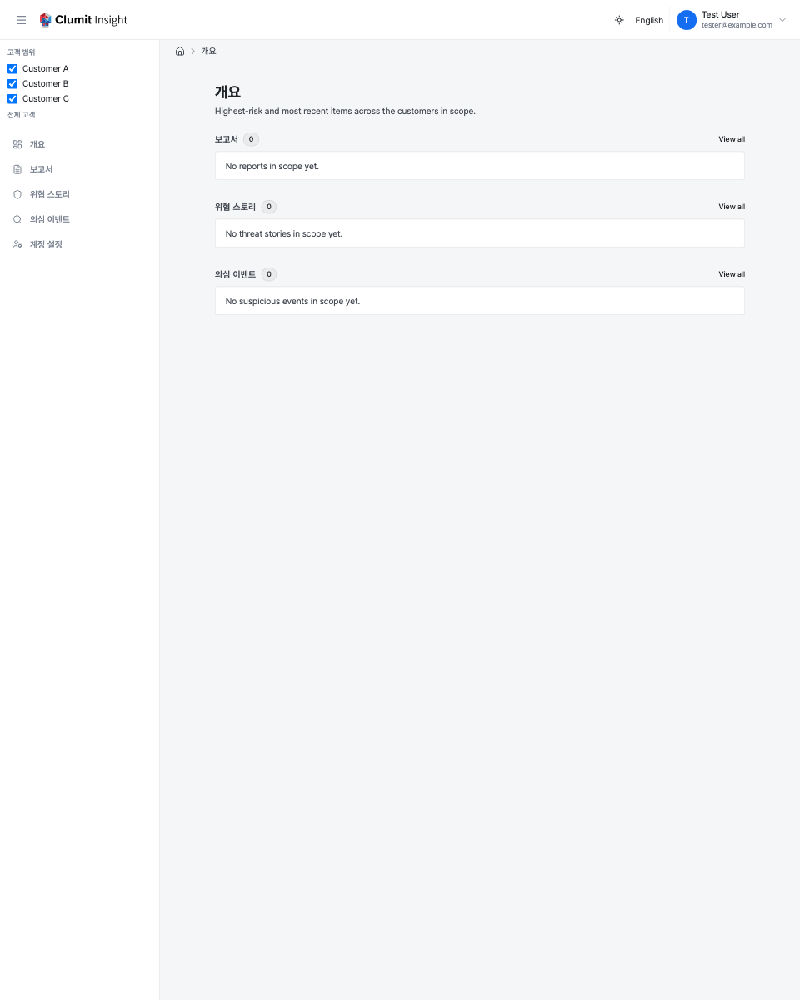

# 고객 통합 개요

최상위 개요 화면은 활성 고객 범위에 따라 **접근 가능한 모든 고객**을
하나의 시점에서 보여 줍니다. 고객을 하나씩 열어 보는 대신, 범위에 포함된
모든 고객에서 가장 최근이면서 위험도가 높은 항목을 하나의 정렬된 목록으로
병합합니다.

네 가지 화면이 있습니다.

| 화면 | 경로 | 표시 내용 |
| --- | --- | --- |
| **개요** | `/overview` | 통합 랜딩: 유형별 상위 항목과 유형별 개수. |
| **보고서** | `/reports` | 최근 및 고위험 주기 보안 보고서. |
| **위협 스토리** | `/threat-stories` | 최근 및 고위험 위협 스토리. |
| **의심 이벤트** | `/suspicious-events` | 최근 및 고위험 분석 이벤트. |

## 범위와 권한

이 화면들은 사이드바에서 선택한 **고객 범위**에 따라 렌더링됩니다
([내비게이션](navigation.md) 참고). 기본값인 `scope=all`은 접근 가능한
모든 고객을 포함하며, 범위를 좁히면 개요도 그에 맞게 좁혀집니다.

접근 권한만으로는 화면에 표시되지 않습니다. 각 화면은 해당 읽기 권한을
추가로 보유한 고객만 집계하고 나열합니다.

- **보고서**는 `reports:read`가 필요합니다.
- **위협 스토리**와 **의심 이벤트**는 `analyses:read`가 필요합니다.

볼 수는 있지만 특정 화면에서 읽을 수 없는 고객은 해당 화면의 행은 물론
**개수에도** 기여하지 않습니다. 개수 자체가 민감한 정보로 취급되기
때문입니다.

브리지 세션은 단일 환경에 고정되어 있어 이러한 고객 통합 화면을 열 수
없습니다.

## 정렬

모든 화면은 **위험도 높은 순**입니다. 행은 다음 순서로 정렬됩니다.

1. 우선순위 등급 (`CRITICAL` → `HIGH` → `MEDIUM` → `LOW`),
2. 그다음 심각도,
3. 그다음 가능성,
4. 그다음 최신순(가장 최근 항목 먼저).

보고서는 **우선순위 등급만** 표시하며, 정렬에 사용되는 집계 점수 수치는
의도적으로 표시하지 않습니다. 위협 스토리와 의심 이벤트 행은 심각도와
가능성 점수를 표시할 수 있습니다.

보관 처리되었거나 아직 분석되지 않은 위협 스토리는 위협 스토리 화면에서
제외됩니다. 보고서 화면도 마찬가지로 보관 처리되었거나 아직 생성되지 않은
보고서 버킷을 제외하므로, 목록의 모든 행은 여전히 존재하는 보고서로
연결됩니다(보관 처리된 버킷의 상세 페이지는 사라집니다).

## 상세 보기로 이동

이 개요는 전체 보관소가 아니라 **상한이 있는 고신호 요약**(화면당 상위
25개 항목)입니다. 행을 클릭하면 해당 항목이 속한 고객의 상세 페이지가
열립니다. 한 고객의 전체 이력을 넘겨 보려면 해당 고객의 전용 목록
페이지를 여세요. 그곳에서 완전한 페이지네이션과 필터링을 제공합니다.

## 상태

- **로딩 중** — 한 화면이 한 번의 요청에서 여러 고객의 데이터 저장소를
    열 수 있으므로, 교차 고객 데이터를 수집하는 동안 각 페이지에 잠시
    스켈레톤 자리표시자가 표시됩니다.
- **비어 있음** — 활성 범위와 권한에 해당하는 항목이 없으면 짧은 안내가
    표시됩니다.
- **부분 실패** — 한 고객의 데이터 저장소에 일시적으로 접근할 수 없어도
    나머지 개요는 정상적으로 렌더링됩니다. 접근할 수 없는 고객은 안내에
    이름이 표시되고 개수에서 제외됩니다(그 부재가 합계를 조용히 0으로
    만들지 않습니다).

## 이전 링크

이전 자리표시자 경로는 활성 범위와 URL의 보고서 매개변수를 보존하면서
새 위치로 리디렉션됩니다.

- `/dashboard` → `/overview`
- `/analysis` → `/overview`
- `/events` → `/suspicious-events`

