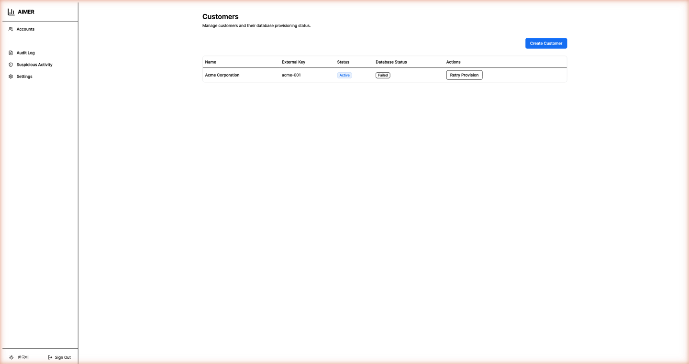
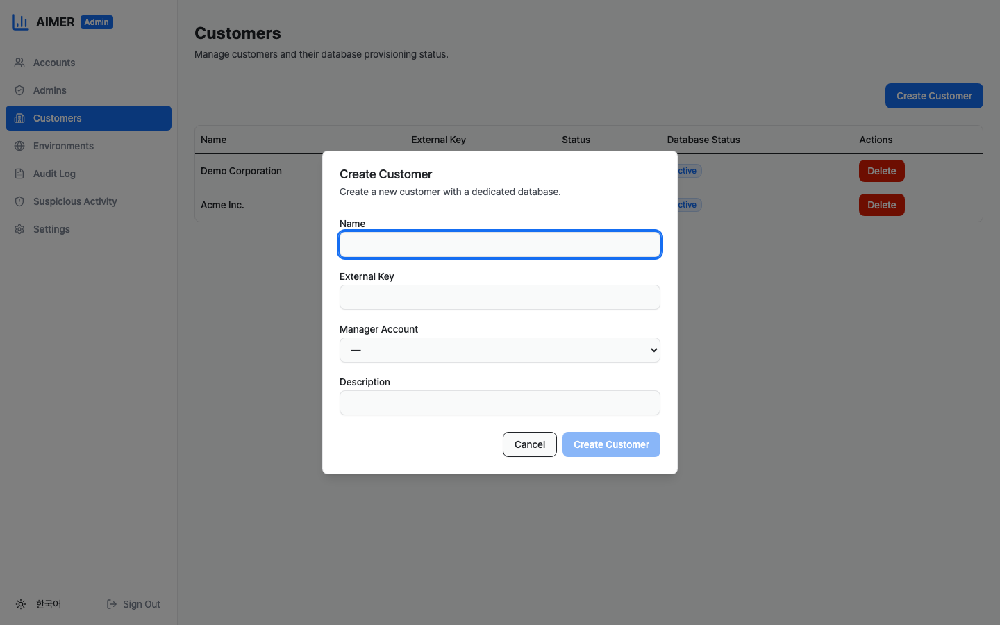
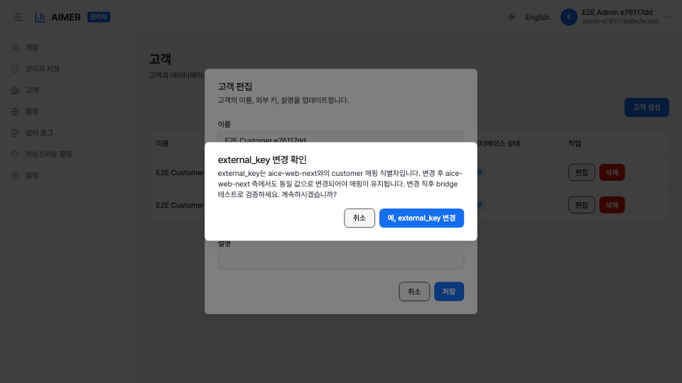
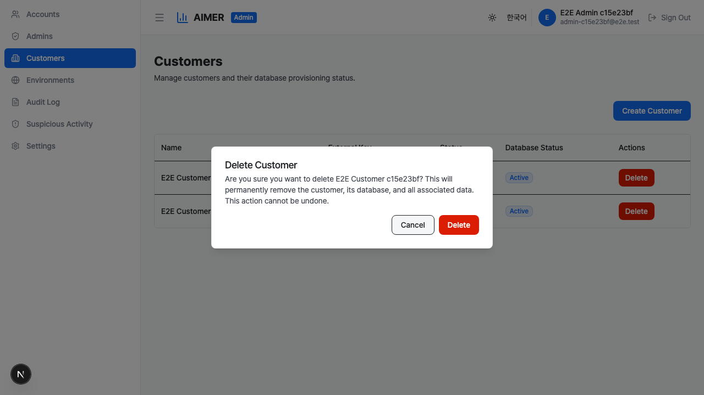

# 고객 관리

고객 페이지에서 시스템 관리자가 고객을 생성, 조회, 삭제하고,
초기 설정에 실패한 고객의 데이터베이스 프로비저닝을 재시도할
수 있습니다. 관리자 사이드바에서 **고객**을 클릭하여 열 수
있습니다.

이 페이지를 조회하려면 `customers:read` 권한이 있는 시스템
관리자여야 합니다. 고객을 생성하거나 삭제하고 프로비저닝을
재시도하려면 `customers:write` 권한이 필요합니다.

## 고객 테이블

테이블에 시스템의 모든 고객이 표시됩니다. 각 행에는 다음 정보가
표시됩니다:

- **이름** — 고객의 표시 이름.
- **외부 키** — 외부 연동에 사용되는 고유 식별자.
- **상태** — 활성, 정지, 비활성 중 하나.
- **데이터베이스 상태** — 활성, 프로비저닝 중, 실패 중 하나.
    고객 전용 데이터베이스의 설정 완료 여부를 나타냅니다.
- **작업** — 삭제 버튼, 데이터베이스 상태가 실패인 경우
    프로비저닝 재시도 버튼.

## 고객 생성

1. 오른쪽 상단의 **고객 생성** 버튼을 클릭합니다.
2. 필수 항목을 입력합니다:
    - **이름** — 고객의 표시 이름.
    - **외부 키** — 외부 시스템용 고유 키.
    - **매니저 계정** — 이 고객의 초기 매니저가 될 계정을
        선택합니다.
    - **설명** — 선택 사항.
3. **고객 생성**을 클릭하여 제출합니다.

생성 후 전용 데이터베이스가 자동으로 프로비저닝됩니다.
데이터베이스 상태 열에 진행 중에는 **프로비저닝 중**이
표시되고, 성공하면 **활성**으로, 오류가 발생하면 **실패**로
변경됩니다.

**외부 키** 항목에는 인라인 도움말과 [시스템 간 고객 식별]
(cross-system-customer-identification.md) 운영 가이드 링크가
함께 표시됩니다. 값을 정하기 전에 해당 페이지를 먼저 읽으세요.
값은 반드시 안전한 별도 채널을 통해 aice-web-next 운영자와
합의해야 합니다.

## 고객 편집

1. 테이블에서 편집할 고객을 찾습니다.
2. 작업 열의 **편집** 버튼을 클릭합니다.
3. 현재 이름, 외부 키, 설명이 미리 채워진 고객 편집 대화
    상자가 열립니다.
4. 수정할 필드를 변경합니다.
5. **저장**을 클릭합니다.

**외부 키**를 다른 값으로 바꾸는 경우, 저장 전에 닫을 수 없는
확인 대화상자가 먼저 나타납니다. external_key는 aice-web-next
와의 customer 매핑 식별자이므로 변경 시 반드시 양쪽이 동일하게
바뀌어야 합니다. 확인 대화상자는 양쪽에서 같이 변경하고 직후
bridge 테스트로 검증할 것을 안내합니다. 변경을 취소하려면
**취소**를, 진행하려면 명시적 확인 버튼을 클릭합니다.

편집은 `customer.updated` 감사 항목으로 기록되며,
`details.changedFields` 배열이 실제 변경된 필드를 표시하고,
`details.previous`, `details.next`에 변경 전후 값이 담깁니다.

## 고객 삭제

1. 테이블에서 삭제할 고객을 찾습니다.
2. 작업 열의 **삭제** 버튼을 클릭합니다.
3. 고객, 데이터베이스, 모든 관련 데이터가 영구적으로 삭제된다는
    경고와 함께 확인 대화상자가 나타납니다.
4. **삭제**를 클릭하여 확인합니다.

삭제하면 고객 레코드가 제거되고, 전용 데이터베이스가 삭제되며,
관련 감사 로그가 익명화되고, 암호화 키가 파기됩니다. 이 작업은
되돌릴 수 없습니다.

## 데이터베이스 프로비저닝 재시도

고객의 데이터베이스 프로비저닝이 실패한 경우(데이터베이스 상태
열에 **실패** 배지로 표시) 재시도할 수 있습니다:

1. 작업 열의 **프로비저닝 재시도** 버튼을 클릭합니다.
2. 확인 대화상자가 나타납니다.
3. **프로비저닝 재시도**를 클릭하여 확인합니다.

시스템이 중단된 지점부터 프로비저닝을 다시 시도합니다. 각
단계는 멱등적입니다 — 데이터베이스가 이미 생성되었으면 다음
단계(권한 부여, 암호화 키 생성, 마이그레이션 실행)로
건너뜁니다. 재시도가 성공하면 상태가 **활성**으로 변경됩니다.
다시 실패하면 상태가 **실패**로 유지되며 필요한 만큼 재시도할
수 있습니다.

## 감사 추적

고객 관리 작업은 감사 로그에 기록됩니다:

- **customer.created** — 고객이 생성된 경우.
- **customer.updated** — 고객의 이름, 설명, 외부 키가 변경된
    경우. `details.changedFields` 배열에 변경된 필드가
    나열되며, `details.previous` / `details.next`에 변경 전후
    값이 담깁니다.
- **customer.deleted** — 고객이 삭제된 경우.
- **customer_db.provisioned** — 첫 시도에서 데이터베이스
    프로비저닝이 성공한 경우.
- **customer_db.provision_retried** — 프로비저닝 재시도가
    시도된 경우.
- **customer_db.provision_failed** — 프로비저닝이 실패한
    경우.

[감사 로그](audit-logs.md) 페이지에서 이 항목들을 확인할 수
있습니다.
