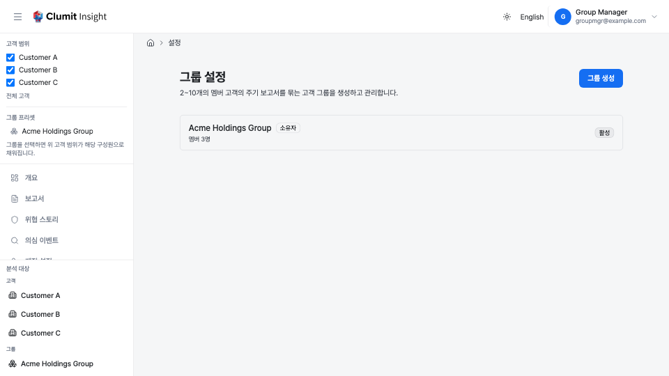
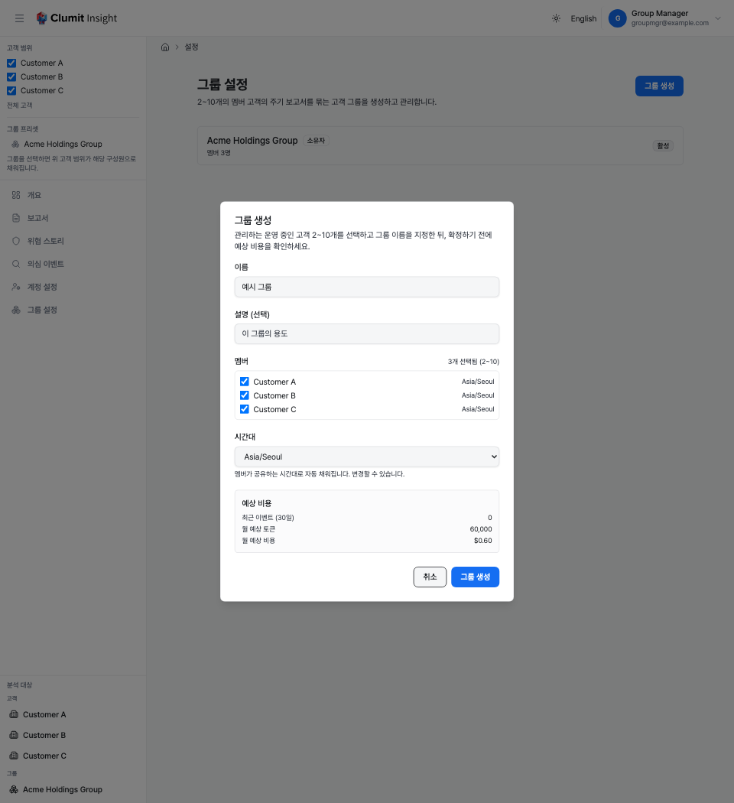
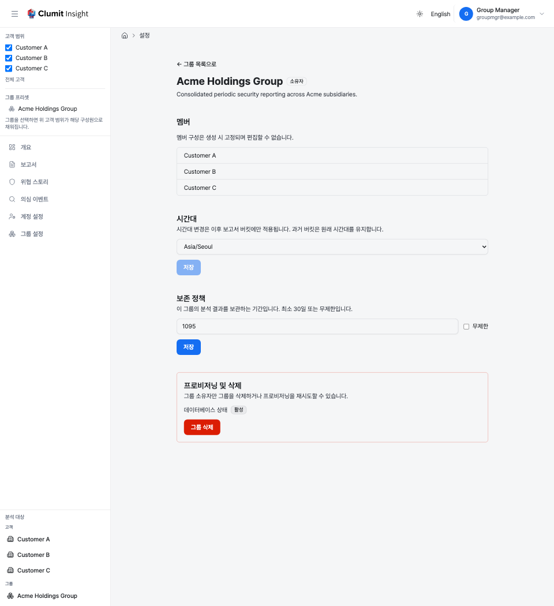

# 그룹 설정

**그룹 설정** 페이지에서 자격을 갖춘 관리자는 **고객 그룹** — 주기 보안
보고서를 함께 생성하고 조회하는 2~10개의 멤버 고객 모음 — 을 정의하고
삭제할 수 있습니다. 사이드바의 **그룹 설정**에서 엽니다.

이 페이지는 *관리* 화면입니다. 고객을 하나 이상 관리하는 계정(**Manager**
멤버십 역할 또는 자격을 갖춘 **Analyst** 배정)에게만 표시됩니다. 그룹의
읽기 전용 탐색은 사이드바와 [그룹 허브](analysis/group-hub.md)에 있으며,
이 페이지는 관리 전용 대응 화면으로 브리지 세션에서는 제공되지 않습니다.

## 관리할 수 있는 항목

- 접근 가능한 운영 중인 고객으로 그룹을 **생성**합니다.
- 관리 자격이 있는 모든 그룹을 프로비저닝 상태 및 소유권과 함께
  **조회**합니다.
- 그룹의 시간대와 보존 정책을 **편집**합니다.
- 소유한 그룹을 **삭제**하고, 데이터베이스 프로비저닝이 실패한 경우
  재시도합니다.

멤버 구성은 **생성 시 고정**되며 멤버 추가/제거 컨트롤이 없습니다. 멤버를
바꾸려면 그룹을 삭제하고 새로 생성하세요.

## 그룹 목록

목록에는 관리 자격이 있는 모든 그룹이 표시됩니다. 즉, 그룹의 **모든**
멤버에 대해 **Manager** 또는 자격을 갖춘 **Analyst** 역할을 보유한
경우입니다. 조회만 가능하고 관리할 수 없는 그룹은 여기에 나타나지
않습니다.

각 행에는 다음이 표시됩니다.

- **이름** — 그룹 이름. 소유한 그룹에는 **소유자** 태그가 붙습니다.
- **멤버 수** — 그룹에 속한 고객 수.
- **데이터베이스 상태** — 그룹 전용 데이터베이스의 프로비저닝 상태:
  **프로비저닝 중**, **활성**, **실패**.

그룹을 선택하면 상세 페이지가 열립니다.

## 그룹 생성

**그룹 생성**을 클릭하면 생성 대화상자가 열립니다.

1. 그룹 **이름**을 지정합니다(설명은 선택).
2. **멤버 선택** — 고객 2~10개. 목록은 **접근 가능하고 운영 중인**
   고객으로 제한됩니다(고객의 상태와 데이터베이스가 모두 활성일 때 운영
   중입니다). 선택 개수는 2~10 범위에 대해 표시되며, 10개를 초과하면
   표시됩니다.
3. **시간대** — 그룹의 보고서 버킷 시간대:
    - 선택한 모든 멤버가 하나의 시간대를 공유하면 **자동으로 채워집니다**.
    - 멤버의 시간대가 다르면 비용 미리보기의 **권장** 시간대가 미리
      선택됩니다.
    - 어느 경우든 확정 전에 변경할 수 있습니다.
4. **예상 비용 확인** — 멤버를 2~10개 선택하면 대화상자에 합산된 최근
   이벤트 볼륨과 월 예상 토큰 및 비용이 표시됩니다. (선택이 10개 한도를
   초과하면 예상치가 표시되지 않습니다.)
5. **그룹 생성**을 클릭하여 확정합니다.

멤버, 한도, 운영 상태, 권한 검사는 서버에서도 적용되므로, 오래된 선택은
잘못된 그룹을 생성하는 대신 명확한 메시지와 함께 거부됩니다.

## 그룹 편집

목록에서 그룹을 열면 상세 페이지로 이동합니다.

- **멤버**는 읽기 전용으로 표시되며 멤버 구성은 편집할 수 없습니다.
- **시간대** — 그룹의 보고서 버킷 시간대를 변경합니다. 변경은 **이후**
  보고서 버킷에만 적용되며, 과거 버킷은 원래 시간대를 유지합니다. 자격을
  갖춘 관리자라면 누구나 편집할 수 있습니다.
- **보존 정책** — 그룹의 분석 결과를 보관하는 기간(일 단위, 최소 30일)
  또는 **무제한**. 자격을 갖춘 관리자라면 누구나 편집할 수 있습니다.

## 그룹 삭제

그룹 **소유자**만 그룹을 삭제할 수 있습니다. 상세 페이지에서 **그룹 삭제**
버튼은 소유자에게만 표시되며, 확인을 요청한 뒤 그룹과 전용 데이터베이스를
영구적으로 제거합니다. 되돌릴 수 없습니다.

소유자는 처음에는 그룹 생성자이며 그룹의 수명 주기에 따라 이전될 수
있습니다.

## 프로비저닝 재시도

그룹의 **데이터베이스 상태**가 **실패**인 경우, 소유자는 상세 페이지에서
**프로비저닝 재시도** 작업을 통해 그룹 전용 데이터베이스의 프로비저닝을
다시 실행할 수 있습니다.

## 수명 주기

위의 수동 작업 외에도 그룹은 자동으로 일관성이 유지됩니다. 그룹에는 항상
**자격을 갖춘 관리자** — 그룹의 *모든* 멤버에 대해 Manager 역할(또는
자격을 갖춘 Analyst 배정)을 보유한 운영 중인 계정 — 가 있어야 합니다.
플랫폼은 멤버나 그 관리자가 바뀔 때마다 각 그룹을 조정합니다.

- **중단 / 재개.** 한 멤버라도 운영 불가능 상태가 되면 — 멤버 고객이
  중단되거나 데이터베이스가 더 이상 활성이 아니면 — 그룹은 자동으로
  **중단**되고 보고서 생성이 일시 중지됩니다. 모든 멤버가 다시 운영
  가능해지면 그룹은 **재개**되고 생성이 계속되며, 해당 기간의 보고서는
  다음 주기에 처리됩니다.
- **소유권 이전.** 다른 자격을 갖춘 관리자가 남아 있는 상태에서 현재
  소유자가 관리자 자격을 잃으면(예: 멤버 중 하나에 대한 필요한 역할 상실),
  소유권이 그들 중 하나로 **자동 이전**되어 그룹에는 항상 관리할 수 있는
  소유자가 있게 됩니다.
- **자동 삭제.** 그룹에 자격을 갖춘 관리자가 더 이상 남아 있지 않으면,
  그룹은 전용 데이터베이스와 함께 **자동으로 영구 삭제**됩니다. 이는 즉시
  이루어지며 되돌릴 수 없습니다.
