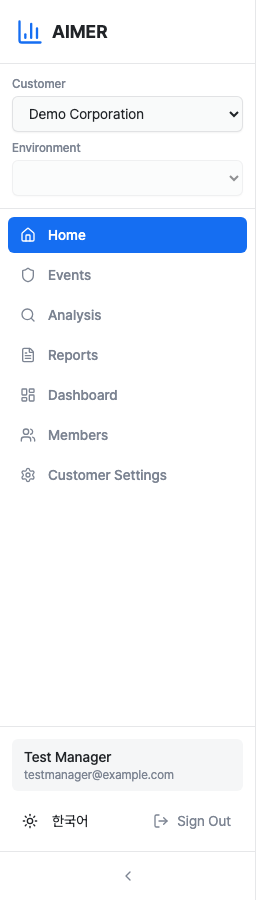

# 내비게이션

Aimer Web 대시보드는 사이드바를 통해 페이지를 이동하고,
고객/환경 선택기를 통해 컨텍스트를 전환하며, 브레드크럼으로
현재 위치를 확인합니다.

## 사이드바

사이드바는 모든 대시보드 페이지의 왼쪽에 표시됩니다. 로고, 고객
선택기, 내비게이션 링크, 사용자 컨트롤이 포함되어 있습니다.

### 내비게이션 항목

사이드바에는 다음 링크가 포함됩니다:

- **홈** — 메인 랜딩 페이지.
- **이벤트** — 이벤트 목록 및 승인 워크플로.
- **분석** — 분석 도구.
- **보고서** — 보고서 생성.
- **대시보드** — 운영 개요.

매니저 역할의 사용자에게는 설정 하위에 두 가지 항목이 추가로
표시됩니다:

- **멤버** — 워크스페이스 멤버 및 초대 관리
    ([멤버](members.md) 참조).
- **고객 설정** — 고객 워크스페이스 구성 (준비 중).

### 축소 모드

사이드바 하단의 축소 토글을 클릭하면 확장(256 px)과 축소(64 px)
보기 사이를 전환할 수 있습니다. 축소 모드에서는 아이콘만
표시되며, 아이콘 위에 마우스를 올리면 라벨이 툴팁으로
나타납니다. 축소 상태는 브라우저에 저장되어 세션 간에
유지됩니다.

## 고객 및 환경 선택기

로고 아래에 두 개의 드롭다운이 있어 활성 고객 워크스페이스와
AICE 환경을 선택할 수 있습니다.

- **고객** — 접근 가능한 모든 고객 워크스페이스를 나열합니다.
    고객을 전환하면 멤버, 이벤트, 설정 등 워크스페이스별 데이터가
    새로 로드됩니다.
- **환경** — 선택한 고객에 연결된 AICE 환경을 나열합니다.
    사용 가능한 환경이 없으면 이 드롭다운은 비활성화됩니다.

### 브릿지 세션

브릿지 세션을 통해 Aimer Web에 접근하면 고객 및 환경 선택기가
잠기며 변경할 수 없습니다. 잠금 아이콘과 "브릿지 세션으로
제한됨" 라벨이 잠금 상태를 나타냅니다.

## 사용자 섹션

사이드바 하단의 사용자 섹션에는 표시 이름과 이메일 주소가
표시됩니다. 추가로 다음 기능을 제공합니다:

- **테마 전환** — 라이트 모드와 다크 모드를 전환합니다.
- **언어 전환** — 한국어와 영어를 전환합니다.
- **로그아웃** — 세션을 종료합니다
    ([인증](authentication.md) 참조).

## 모바일 메뉴

화면 너비가 768 px 미만이면 사이드바가 숨겨지고 헤더 왼쪽 상단에
햄버거 메뉴 버튼이 나타납니다. 버튼을 탭하면 사이드바가
슬라이드 오버 패널로 열립니다. 페이지를 이동하면 패널이 자동으로
닫힙니다.

## 브레드크럼

메인 콘텐츠 영역 상단에 브레드크럼 바가 표시되어 현재 페이지
경로를 보여줍니다. 브레드크럼의 각 구간을 클릭하면 해당 수준으로
이동합니다.
