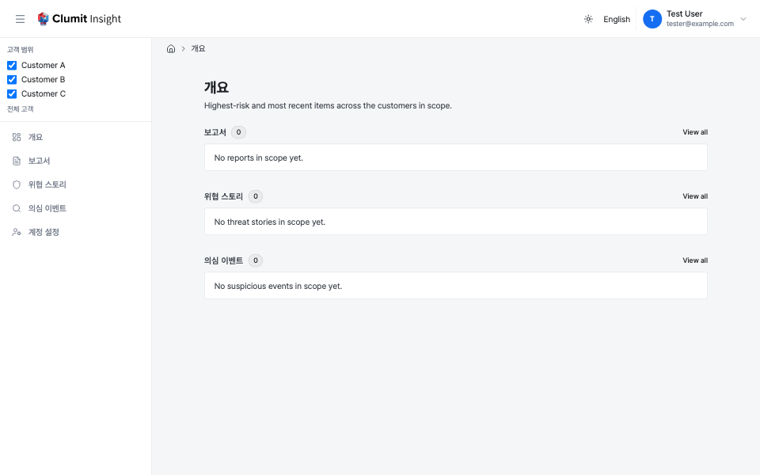

# 내비게이션

Clumit Insight 대시보드는 상단 헤더 바를 통해 브랜딩과 사용자
컨트롤을 제공하고, 사이드바를 통해 페이지를 이동하며,
브레드크럼으로 현재 위치를 확인합니다.

## 헤더 바

모든 인증된 페이지 상단에 전체 너비 헤더 바가 표시됩니다.
포함 항목:

- **왼쪽** — 햄버거 버튼(사이드바 토글), Clumit Insight 로고, 컨텍스트
    라벨(예: 관리자 대시보드에서 "Admin").
- **오른쪽** — 테마 전환, 언어 전환, 사용자 프로필 드롭다운
    (아바타, 표시 이름, 이메일, 셰브론)을 클릭하면 **로그아웃**
    메뉴가 열립니다.

## 사이드바

사이드바는 모든 대시보드 페이지의 왼쪽에 표시됩니다.
고객 범위 선택기와 내비게이션 링크가 포함되어 있습니다.

### 내비게이션 항목

사이드바에는 다음 링크가 포함되며, 각 링크는 최상위 교차 고객
화면을 가리킵니다([교차 고객 개요](cross-customer-overview.md) 참조):

- **개요** — 기존 홈과 대시보드를 통합한 교차 고객 화면이며,
    `/overview`로 이동합니다.
- **보고서** — 보고서 생성.
- **위협 스토리** — 활성 범위 전반에서 우선순위가 가장 높은 위협
    스토리.
- **의심 이벤트** — 활성 범위 전반에서 검토를 기다리는 의심 이벤트.

모든 사용자에게는 개인 설정 항목이 표시됩니다:

- **계정 설정** — 개인 언어 및 시간대 환경설정을 지정합니다
    ([계정 환경설정](account-preferences.md) 참조).

다음 두 항목은 **활성 범위가 단일 고객으로 좁혀졌을 때만** 표시됩니다
(아래 고객 범위 선택기 참조):

- **멤버** — 워크스페이스 멤버 및 초대 관리
    ([멤버](members.md) 참조). 매니저에게 표시됩니다.
- **고객 설정** — 고객 워크스페이스 구성.

이 페이지들은 단일 고객을 대상으로 렌더링되므로 "전체 고객" 또는
다중 고객 범위에서는 링크가 숨겨지며, 직접 방문하면 "단일 고객을
선택하세요" 안내가 표시됩니다.

### 축소 모드

헤더 바의 햄버거 버튼을 클릭하면 확장(256 px)과 축소(64 px)
보기 사이를 전환할 수 있습니다. 축소 모드에서는 아이콘 아래에
작은 텍스트 라벨이 표시되며, 항목 위에 마우스를 올리면 전체
라벨이 툴팁으로 나타납니다. 축소 상태는 브라우저에 저장되어
세션 간에 유지됩니다.

## 고객 범위 선택기

사이드바 상단의 **고객 범위** 선택기는 교차 고객 뷰가 다루는
고객 집합을 제어합니다. 기본 시점은 **접근 가능한 모든 고객**이며,
원하는 고객을 체크하여 부분 집합 또는 단일 고객으로 좁힐 수
있습니다.

- 접근 가능한 모든 고객이 체크박스와 함께 나열됩니다. 모두 체크된
    상태가 기본값인 **전체 고객** 범위입니다.
- 고객 체크를 해제하면 남은 선택으로 범위가 좁혀지며, 요약 줄에
    전체 중 몇 명이 선택되었는지 표시됩니다.
- 활성 범위는 페이지 URL(`?scope=…`)에 인코딩되므로 좁혀진 뷰도
    딥링크하고 공유할 수 있습니다. 범위를 변경해도 URL에 이미 있는
    다른 쿼리 매개변수는 보존됩니다.
- 활성 범위는 사이드바 대상 간을 이동해도 유지되므로, 좁혀진 뷰는
    탐색 중에도 좁혀진 상태로 남습니다.
- 교차 고객 페이지는 범위를 정규화합니다. 정규 형식이 아닌 값
    (정렬되지 않았거나 중복되거나 접근할 수 없는 ID, 깨졌거나 비어
    있는 값, 명시적 전체 집합)이 포함된 공유 또는 직접 입력한 링크는
    정렬·중복 제거된 정규 형식으로 리다이렉트되어 공유 링크가
    안정적으로 유지됩니다. 브릿지 세션은 이러한 교차 고객 화면을 열
    수 없습니다.

이 선택기는 **고객 전용**입니다. 전역 AICE 환경 선택기는 없습니다.
환경(`aiceId`)은 앱 전역 컨트롤이 아니라 특정 고객의 심층 경로
내부에서만 선택됩니다.

### 브릿지 세션

브릿지 세션을 통해 Clumit Insight에 접근하면 범위가 브릿지의 고정
고객 집합으로 고정되며 변경할 수 없습니다. 범위 선택기는 잠금
아이콘과 "브릿지 세션으로 제한됨" 라벨로 대체됩니다.

## 고객 통합 화면

최상위 **개요**, **보고서**, **위협 스토리**, **의심 이벤트** 화면은
활성 고객 범위에 따라 접근 가능한 모든 고객의 항목을 위험도 높은 순으로
병합해 보여 줍니다. 동작 방식은
[고객 통합 개요](cross-customer-overview.md)를 참고하세요. 이전 자리표시자
경로(`/dashboard`, `/analysis`, `/events`)는 활성 범위를 보존하면서 새
화면으로 리디렉션됩니다.

## 사용자 섹션

사용자 섹션은 헤더 바 오른쪽에 위치합니다. 프로필 드롭다운을
클릭하면 이름과 이메일이 표시된 메뉴가 열립니다. 이 메뉴에서:

- **로그아웃** — 세션을 종료합니다
    ([인증](authentication.md) 참조).

헤더 바에는 다음 기능도 제공됩니다:

- **테마 전환** — 라이트 모드와 다크 모드를 전환합니다.
- **언어 전환** — 한국어와 영어를 전환합니다. 로그인한 상태에서는
    선택한 언어가 계정에도 저장되어 여러 기기에서 그대로 따라옵니다
    ([계정 환경설정](account-preferences.md)에서 설정하는 것과
    동일하며, 계정 환경설정 페이지에서는 시간대도 함께 설정할 수
    있습니다). 로그아웃 상태에서는 현재 브라우저에만 적용됩니다.

## 모바일 메뉴

화면 너비가 768 px 미만이면 사이드바가 숨겨지고 헤더 바에
햄버거 메뉴 버튼이 나타납니다. 버튼을 탭하면 사이드바가
슬라이드 오버 패널로 열립니다. 페이지를 이동하면 패널이 자동으로
닫힙니다.

## 브레드크럼

메인 콘텐츠 영역 상단에 브레드크럼 바가 표시되어 현재 페이지
경로를 보여줍니다. 이동할 페이지가 있는 구간은 링크로 표시되며,
클릭하면 해당 수준으로 이동합니다. 자체 페이지가 없는 구조적
구간(예: `고객` 그룹이나 보고서 기간)은 죽은 링크 대신 일반
텍스트로 표시됩니다.

고객 범위 안에서는 원시 식별자 대신 읽기 쉬운 레이블이
표시됩니다. 고객 이름, 보고서 기간과 날짜, 그리고 위협 스토리·
이벤트 분석 페이지의 경우 용어 레이블과 짧은 식별자가 함께
표시됩니다(예: `위협 스토리 · 1f3c9a2b…`).
