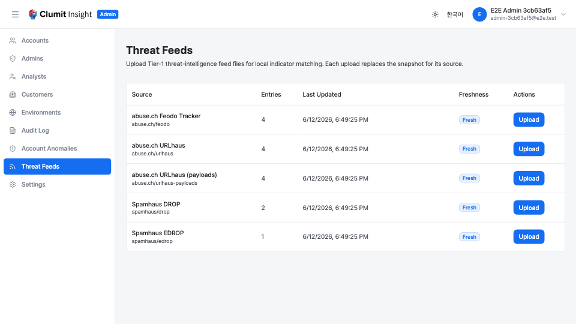
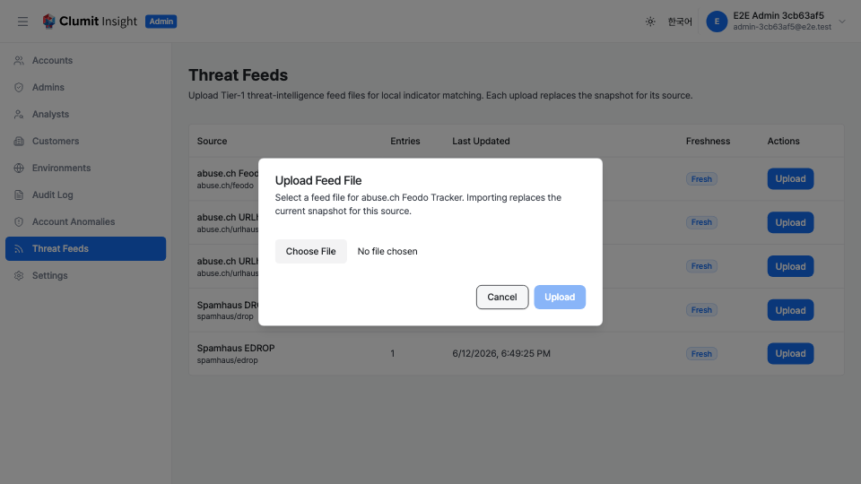

# 위협 피드 (수동 업로드)

위협 피드 페이지에서는 시스템 관리자가 Tier-1 위협 인텔리전스 피드 파일을
업로드하여, 관측된 지표를 알려진 악성 IOC와 로컬에서 매칭할 수 있습니다.
관리자 사이드바에서 **위협 피드**로 이동하여 엽니다.

이것은 **수동 업로드** 공급 모드입니다. 운영자가 각 피드 파일을 별도 경로로
입수하여 aimer-web에 제공합니다. 외부 인터넷 다운로드가 전혀 없으므로, 개발
환경과 망분리 / 폐쇄망 배포에 적합한 공급 모드입니다.

이 페이지(및 해당 API)는 배포가 `TI_FEED_MODE=manual-upload`로 설정된
경우에만 사용할 수 있습니다. 그 외 모드에서는 내비게이션 항목이 숨겨지고
라우트는 404를 반환하므로, 운영자가 제공한 스냅샷이 픽스처 재시드나 이후의
갱신 워커에 의해 조용히 덮어쓰여지지 않습니다.

`ti-feed:write` 권한이 있는 시스템 관리자만 피드를 업로드할 수 있습니다.
상태 표를 보려면 `ti-feed:read` 권한이 필요합니다.

## 피드 상태 표

표에는 알려진 모든 Tier-1 소스가 나열됩니다. 각 행에는 다음이 표시됩니다.

- **소스** — 사람이 읽을 수 있는 소스 이름과 정책 id
    (예: `abuse.ch/feodo`).
- **항목 수** — 해당 소스에 대해 현재 가져온 지표 행 수.
- **마지막 업데이트** — 현재 스냅샷에 기록된 업로드 시각이며, 스냅샷이
    없으면 "없음"으로 표시됩니다.
- **신선도** — 소스의 신선도 기준(`maxAge`)에서 도출된 배지로 **최신**,
    **오래됨**, **업로드 안 됨** 중 하나입니다. 마지막 업데이트 시각이
    기준보다 오래된 스냅샷은 오래됨으로 표시됩니다.
- **작업** — 업로드 버튼.

스냅샷 행이 없는 소스는 항목 수 0과 함께 **업로드 안 됨**으로 표시됩니다.
빈 파일 업로드로 비워진 소스도 동일하게 보입니다. 상태는 전적으로 가져온
행에서 도출되므로, 비워진 소스는 한 번도 업로드되지 않은 소스와 구별되지
않습니다.

## 피드 업로드

1. 업데이트할 소스의 행에서 **업로드** 버튼을 클릭합니다.
2. 파일 선택기가 있는 대화 상자가 나타납니다.
3. 해당 소스의 피드 파일을 선택합니다.
4. **업로드**를 클릭하여 가져옵니다.

파일이 업로드되면 서버는 다음을 수행합니다.

- 소스에 설정된 파서로 파일을 파싱하고,
- 항목을 지표 행으로 정규화하며,
- 단일 트랜잭션에서 소스의 스냅샷을 **교체**(삭제 후 삽입)하고, 각 행에
    업로드 시각을 기록합니다.

응답에는 가져온 행 수가 보고됩니다.

### 업로드 규칙

- 파일 형식은 선택한 소스와 일치해야 합니다(예: `abuse.ch/feodo`의 경우
    abuse.ch Feodo Tracker IP 차단 목록). 어떤 항목으로도 파싱되지 않는
    파일은 오류와 함께 거부됩니다.
- 실제로 비어 있거나 주석만 있는 파일은 허용되며 소스를 **비웁니다**
    (스냅샷이 비워지고) 가져온 행 수는 0으로 보고됩니다.
- 소스를 다시 업로드하면 항상 이전 스냅샷에 추가하지 않고 교체합니다. 동일
    소스의 동시 업로드는 직렬화되어 교체-비추가 보장이 항상 유지됩니다.
- 최대 업로드 크기가 있으며, 초과하는 파일은 거부됩니다.

## 백업

수동으로 업로드된 스냅샷은 커밋된 픽스처에서 다시 도출할 수 없으므로, 피드
데이터베이스는 백업/복원 대상입니다. `feed` 대상(또는 `all` 대상)으로
백업에 포함하세요. [백업 및 복원](backup-restore.md)을 참고하세요.
