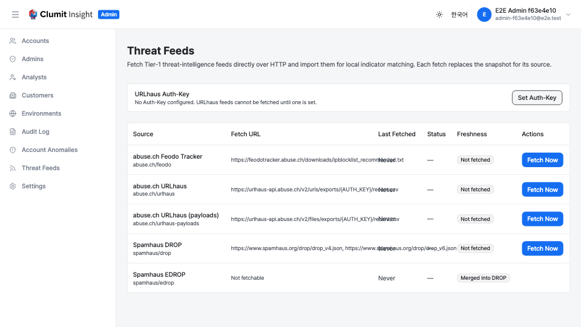
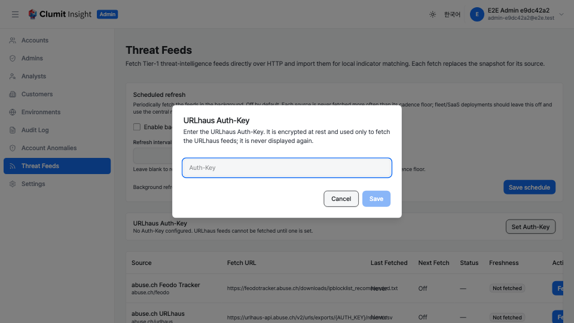
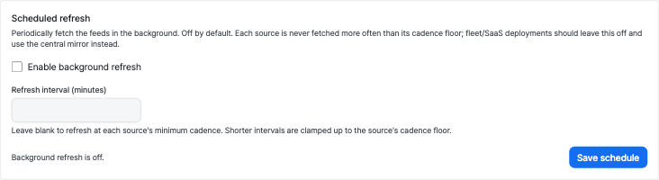

# 위협 피드

위협 피드 페이지에서는 시스템 관리자가 관측된 지표를 로컬에서 매칭하는 데
사용하는 Tier-1 위협 인텔리전스 피드(abuse.ch Feodo / URLhaus, Spamhaus
DROP, Botvrij.eu IP / 도메인 / URL / 해시 목록, Phishing.Database
도메인 / URL / IP 목록, 그리고 CERT Polska Warning List)와 **Palo Alto Unit 42**,
**ESET**, **Volexity**, **PRODAFT**, **Zscaler ThreatLabz**, **Huntress**,
**Meta Threat Research** 벤더 IOC 저장소를 관리할 수 있습니다. 또한
**MISP warninglists** 오탐 억제 계층도 관리합니다([부정 소스 (오탐 억제)](#부정-소스-오탐-억제)
참고). 관리자 사이드바에서 **위협 피드**로 이동하여 엽니다.

평면 Tier-1 피드는 게시된 단일 파일이지만, **벤더 IOC 저장소**(예: Unit 42,
ESET, Volexity, PRODAFT, Zscaler ThreatLabz, Huntress)는 보고서별 파일들로
구성된 전체 Git 저장소이며 하나의 단위로 가져옵니다. 벤더 저장소는 **self-fetch
전용**입니다 —
[벤더 IOC 저장소](#벤더-ioc-저장소)를 참고하세요.

`ti-feed:write` 권한이 있는 시스템 관리자만 피드를 변경(업로드 또는
가져오기)할 수 있으며, 상태 표를 보려면 `ti-feed:read` 권한이 필요합니다.

피드가 aimer-web에 도달하는 방식은 **공급 모드**(`TI_FEED_MODE`)로
제어됩니다. 위협 피드 페이지는 다음 두 모드에서 사용할 수 있으며 내비게이션
항목도 표시됩니다.

- **`manual-upload`** — 운영자가 각 피드 파일을 별도 경로로 입수하여
    업로드합니다. 외부 인터넷 다운로드가 없으며, 개발 환경과 망분리 / 폐쇄망
    배포에 적합한 모드입니다.
- **`self-fetch`** — 인스턴스가 각 피드를 HTTP로 직접 가져와 필요할 때
    반영합니다. 온프레미스 / 독립 / 주권형 배포의 프로덕션 갱신 경로로,
    각 피드의 업스트림에서 직접 가져옵니다(재배포 없는 라이선스 허용 경로).

그 외 모드에서는 내비게이션 항목이 숨겨지고 라우트는 404를 반환하므로,
운영자가 관리하는 스냅샷이 조용히 덮어쓰여지지 않습니다. 페이지는 활성 모드의
컨트롤만 렌더링합니다. `manual-upload`에서는 업로드 대화상자, `self-fetch`
에서는 소스별 **지금 가져오기** 동작과 URLhaus **Auth-Key** 컨트롤입니다.

---

## 소스

알려진 Tier-1 소스, 각 소스가 제공하는 지표 유형, 라이선스는 다음과 같습니다.

| 소스 (정책 id) | 지표 유형 | 라이선스 / 출처 표기 |
| --- | --- | --- |
| abuse.ch Feodo Tracker (`abuse.ch/feodo`) | IP | abuse.ch |
| abuse.ch URLhaus (`abuse.ch/urlhaus`) | URL, 도메인 | abuse.ch |
| abuse.ch URLhaus 페이로드 (`abuse.ch/urlhaus-payloads`) | 파일 해시 | abuse.ch |
| Botvrij.eu (`botvrij/ip`) | IP | Botvrij.eu (재판매 금지) |
| Botvrij.eu (`botvrij/domain`) | 도메인 | Botvrij.eu (재판매 금지) |
| Botvrij.eu (`botvrij/url`) | URL | Botvrij.eu (재판매 금지) |
| Botvrij.eu (`botvrij/hash`) | 파일 해시 | Botvrij.eu (재판매 금지) |
| CERT Polska Warning List (`cert-pl/warninglist`) | 도메인 | CERT Polska (베스트 에포트, SLA 없음) |
| Infoblox Threat Intelligence (`infoblox/threat-intelligence`) | 도메인, IP, URL, 파일 해시 | CC-BY-4.0 — **Infoblox 및 라이선스 출처 표기** |
| Phishing.Database (`phishing-database/domain`) | 도메인 | MIT |
| Phishing.Database (`phishing-database/ip`) | IP | MIT |
| Phishing.Database (`phishing-database/url`) | URL | MIT |
| Spamhaus DROP (`spamhaus/drop`) | IP (CIDR) | Spamhaus |
| Spamhaus EDROP (`spamhaus/edrop`) | IP (CIDR) | Spamhaus (2024년 DROP에 통합) |
| MISP warninglists (`misp/warninglists`) | IP (부정 / 억제) | CC0 (퍼블릭 도메인, 출처 표기 불필요) |

**Infoblox Threat Intelligence**는 도메인 중심의 멤버십 + 분류 피드로, 하나의
혼합 CSV 스키마(`type,indicator,classification,…`)로 게시됩니다. 지표 유형은
행 단위로 표기되며(`domain` / `ip` / `ipv4` / `url` / `sha256` / …) 값은
디팽(defang)되어 있습니다. aimer-web은 분류가 알려진 위협 라벨(예: `malicious`,
`phishing`, `malware`)인 행만 가져옵니다. `legitimate`, `parked` 같은 비위협
라벨은 가져오지 않으며, 로컬에 대응 유형이 없는 지표 유형(`email`, `telfhash`)은
건너뜁니다. **CC-BY-4.0**으로 배포되므로 매칭된 지표가 표시되는 모든 곳에 출처
표기가 필요합니다. 따라서 소스 라벨이 **"Infoblox Threat Intelligence
(CC-BY-4.0)"** 출처 표기를 기본으로 담고 있습니다. 이 소스는 현재 커밋된 픽스처 /
수동 업로드로 공급되며, self-fetch 엔드포인트는 없습니다(콘텐츠가 캠페인별 다수
파일로 흩어져 있어 안정적인 "최신" URL이 없습니다).

**CERT Polska Warning List**는 폴란드 중심의 활성 피싱 도메인 목록으로, "한 줄당
하나의 도메인" 형식의 일반 텍스트 파일로 게시됩니다. 베스트 에포트 피드(SLA
없음)이므로, 오래되었거나 도달할 수 없는 스냅샷은 조용한 정상 판정이 아니라
`unknown` / `stale` 커버리지를 유발합니다. 현재는 커밋된 픽스처 / 수동 업로드로만
공급되며, **self-fetch는 아직 연결되어 있지 않습니다** — 아카이브된 CERT Polska
스펙의 데이터 사용 허가가 현재 v2 엔드포인트에 대해 재확인되지 않았기
때문입니다(라이브 가져오기는 이 재확인을 전제로 게이트됩니다). 따라서 아래
self-fetch 표에는 케이던스 행이 없습니다.

### 부정 소스 (오탐 억제)

대부분의 소스는 **부정이 아닌(positive)** 소스로, 매칭은 해당 지표가 알려진
악성임을 뜻합니다. **부정(negative)** 소스는 그 반대입니다. 알려진 **정상** /
잡음이 많은 인프라(퍼블릭 DNS 리졸버, CDN / 클라우드 IP 대역, 보곤)를 나열하며,
매칭은 해당 지표가 **오탐**일 가능성이 높음을 뜻합니다.

**MISP warninglists**(`misp/warninglists`, `MISP/misp-warninglists` 프로젝트,
**CC0** 퍼블릭 도메인)가 첫 번째 부정 소스입니다. 이는 알려진 악성 피드가
**아니며**, warninglist에 오른 지표는 알려진 IOC 히트를 만들지 않습니다. 대신 해당
지표의 긍정 매칭이 분석 플로어와 증거 표면에 도달하기 전에 가중치를 낮춥니다.

- 결정적(deterministic) 매칭은 **증거로 유지**되지만(여전히 감사 및 설명 가능)
    더 이상 이진 알려진 IOC 플로어를 구동하지 못합니다.
- 소프트 평판(soft-reputation) 매칭은 오탐 가능성이 높으므로 **제거**됩니다.
- 매칭된 warninglist의 이름이 억제 증거에 기록되므로, 분석가는 *어떤*
    warninglist(예: "List of known IPv4 public DNS resolvers")가 지표를
    억제했는지 확인할 수 있습니다.

v1은 **IP 중심** 목록만 가져옵니다 — 퍼블릭 DNS 리졸버(정확한 IP)와 CDN /
클라우드 / 보곤 대역(CIDR)입니다. 도메인 / URL warninglist(인기 사이트 목록)는
현재 범위 밖입니다. CC0는 출처 표기 의무가 없지만, 소스 라벨은 출처 확인을 위해
**"MISP warninglists (CC0)"**를 기록합니다. Spamhaus EDROP과 마찬가지로 이
소스는 현재 커밋된 픽스처 / 수동 업로드로 공급되며 self-fetch 엔드포인트가
없습니다.

---

## 수동 업로드 모드

이것은 **수동 업로드** 공급 모드(`TI_FEED_MODE=manual-upload`)입니다. 운영자가
각 피드 파일을 직접 제공합니다.

### 피드 상태 표

표에는 알려진 모든 Tier-1 소스가 나열됩니다. 각 행에는 다음이 표시됩니다.

- **소스** — 사람이 읽을 수 있는 소스 이름과 정책 id
    (예: `abuse.ch/feodo`).
- **항목 수** — 해당 소스에 현재 반영된 지표 행 수.
- **마지막 업데이트** — 현재 스냅샷에 기록된 업로드 시각, 스냅샷이 없으면
    "없음".
- **신선도** — 소스의 신선도 한계(`maxAge`)에서 도출된 배지: **최신**,
    **오래됨**, **업로드 안 됨**. 마지막 업데이트 시각이 한계보다 오래되면
    오래됨으로 표시됩니다.
- **작업** — 업로드 버튼.

스냅샷 행이 없는 소스는 항목 수 0과 함께 **업로드 안 됨**으로 보고됩니다.
빈 업로드로 비워진 소스도 동일하게 나타납니다. 상태는 순전히 반영된 행에서
도출되므로, 비워진 소스는 한 번도 업로드되지 않은 소스와 동일하게 보입니다.

벤더 IOC 저장소(Unit 42, ESET, Volexity, PRODAFT, Zscaler ThreatLabz, Huntress,
Meta Threat Research)는 여기에 표시되지 **않습니다**. 저장소는 하나의
단위로 가져오는 파일 트리 전체이므로, 업로드된 단일 파일은 부분적이고 맥락이
제거된 스냅샷만 기록할 수 있습니다. 따라서 벤더 저장소의 수동 업로드는
거부되며, 해당 소스는 이 표에서 숨겨집니다. 벤더 저장소는 `self-fetch`
모드에서만 갱신됩니다([벤더 IOC 저장소](#벤더-ioc-저장소) 참고).

### 피드 업로드

1. 업데이트하려는 소스 행의 **업로드** 버튼을 클릭합니다.
2. 파일 선택기가 있는 대화상자가 나타납니다.
3. 해당 소스의 피드 파일을 선택합니다.
4. **업로드**를 클릭하여 가져옵니다.

파일이 업로드되면 서버는 다음을 수행합니다.

- 소스에 구성된 파서로 파일을 파싱하고,
- 항목을 지표 행으로 정규화하며,
- 단일 트랜잭션으로 소스의 스냅샷을 **교체**(삭제 후 삽입)하고 각 행에
    업로드 시각을 기록합니다.

응답에는 가져온 행 수가 보고됩니다.

#### 업로드 규칙

- 파일 형식은 선택한 소스와 일치해야 합니다(예: `abuse.ch/feodo`의 경우
    abuse.ch Feodo Tracker IP 차단 목록). 어떤 항목으로도 파싱되지 않는
    파일은 오류와 함께 거부됩니다.
- 실제로 비어 있거나 주석만 있는 파일은 허용되며 소스를 **비웁니다**
    (스냅샷이 비워지고) 가져온 행 수는 0으로 보고됩니다.
- 소스를 다시 업로드하면 항상 이전 스냅샷에 추가하지 않고 교체합니다. 동일
    소스의 동시 업로드는 직렬화되어 교체-비추가 보장이 항상 유지됩니다.
- 최대 업로드 크기가 있으며, 초과하는 파일은 거부됩니다.

---

## 자체 가져오기 모드

이것은 **자체 가져오기** 공급 모드(`TI_FEED_MODE=self-fetch`)입니다.
인스턴스가 각 피드를 HTTP로 직접 가져와 반영합니다. 새로고침은 **운영자
트리거**(소스별 **지금 가져오기** 동작)로 이루어지며, 선택적으로 **기본값이
꺼짐**인 **백그라운드 예약**으로도 실행할 수 있습니다([예약
새로고침](#예약-새로고침) 참고).

<!-- Screenshot placeholder: 위 캡처는 prodaft/malware-ioc, zscaler/threatlabz,
     meta/threat-research 행과, #650이 URLhaus Auth-Key 옆 시크릿 패널에 추가한
     선택적 GitHub 토큰 항목이 반영되기 전 상태입니다. PRODAFT를 포함하도록
     self-fetch 상태 표를 다시 캡처하는 작업은 #646에서, Zscaler ThreatLabz 행은
     #647에서, Meta 행은 #649에서 추적합니다(하나의 재캡처로 함께 처리 가능하며,
     GitHub 토큰 항목도 함께 표시해야 합니다). -->

### 소스별 가져오기 구성

각 소스에는 내장된 가져오기 URL과 **하드 케이던스 하한**(가져오기 사이 최소
간격, 어떤 것도 이를 무시할 수 없음)이 있습니다. 이 하한은 각 업스트림
제공자에 대한 과도한 가져오기를 방지합니다. abuse.ch / Spamhaus 내보내기는
IP 차단을 막기 위한 것(5분)이고, Botvrij.eu 및 GitHub에 호스팅된
Phishing.Database 목록은 1시간 예의 하한입니다.

| 소스 | 엔드포인트(변형) | Auth-Key | 케이던스 하한 |
| --- | --- | --- | --- |
| `abuse.ch/feodo` | Feodo 권장 일반 텍스트 IP 차단 목록 | — | 5분 |
| `abuse.ch/urlhaus` | URLhaus URL CSV 내보내기 | 필요 | 5분 |
| `abuse.ch/urlhaus-payloads` | URLhaus 페이로드 CSV 내보내기 | 필요 | 5분 |
| `botvrij/ip` | Botvrij `ioclist.ip-dst.raw` + `ioclist.ip-src.raw` | — | 1시간 |
| `botvrij/domain` | Botvrij `ioclist.domain.raw` + `ioclist.hostname.raw` | — | 1시간 |
| `botvrij/url` | Botvrij `ioclist.url.raw` | — | 1시간 |
| `botvrij/hash` | Botvrij `ioclist.md5.raw` + `ioclist.sha1.raw` + `ioclist.sha256.raw` | — | 1시간 |
| `phishing-database/domain` | Phishing.Database 활성 phishing-domains 목록 | — | 1시간 |
| `phishing-database/ip` | Phishing.Database 활성 phishing-IPs 목록 | — | 1시간 |
| `phishing-database/url` | Phishing.Database 활성 phishing-links 목록 | — | 1시간 |
| `spamhaus/drop` | Spamhaus DROP `drop_v4.json` + `drop_v6.json` (NDJSON) | — | 1시간 |

Spamhaus **EDROP는 DROP에 통합**(2024)되어 `spamhaus/edrop`는 더 이상
독립적으로 가져오지 않습니다. **DROP에 통합됨**으로 표시되며 지금 가져오기
버튼이 없습니다. DROP는 `drop_v4.json` + `drop_v6.json` 엔드포인트에서
NDJSON(한 줄당 하나의 JSON 객체)으로 가져옵니다.

Botvrij.eu는 일반 IOC 범위(IP / 도메인 / URL / 해시)를 유형별 일반 텍스트
목록으로 게시합니다. aimer-web은 각 목록의 기본 `ioclist.<type>` 파일이 아니라
**`.raw`** 변형(한 줄당 하나의 지표, 헤더나 인라인 주석 없음)을 가져옵니다.
기본 파일은 데이터 줄마다 후행 주석이 붙어 파싱되지 않기 때문입니다. IP,
도메인, 해시 소스는 각각 여러 `.raw` 파일을 하나의 소스로 이어 붙이며(해시는
MD5 / SHA-1 / SHA-256 목록을 다이제스트 길이로 구분), Botvrij는 비정기적으로
갱신되므로 보수적인 1시간 케이던스 하한을 사용합니다.

### 벤더 IOC 저장소

**벤더 IOC 저장소**는 게시된 단일 피드 파일이 아니라, 보고서별 파일들로 구성된
전체 GitHub 저장소입니다 — 지표가 기사 수준의 보고서 맥락(행위자 / 클러스터 /
악성코드 패밀리 / 보고서 링크)과 함께 묶여 있습니다. aimer-web은 전용 경로로
이를 가져옵니다. 저장소 트리를 열거하고, 허용 목록에 있는 텍스트 파일만(바이너리,
스크립트, 룰 파일은 절대 가져오지 않음) 가져와 각 파일에서 지표를 추출하고,
보고서 맥락을 포착한 뒤, 모든 파일의 행으로 소스 스냅샷을 단일 트랜잭션으로
교체합니다.

| 소스 | 저장소 | 라이선스 | Auth-Key | 케이던스 하한 |
| --- | --- | --- | --- | --- |
| `eset/malware-ioc` | `eset/malware-ioc` | BSD-2-Clause — **ESET 출처 표기 유지** | 선택(공유 GitHub 토큰) | 1시간 |
| `volexity/threat-intel` | `volexity/threat-intel` | BSD-2-Clause (저작자 표시 유지) | 선택(공유 GitHub 토큰) | 1시간 |
| `prodaft/malware-ioc` | `prodaft/malware-ioc` | MIT — **PRODAFT 저작권 고지 유지** | 선택(공유 GitHub 토큰) | 1시간 |
| `zscaler/threatlabz` | `threatlabz/iocs` | MIT — **Zscaler ThreatLabz 출처 표기** | 선택(공유 GitHub 토큰) | 1시간 |
| `huntress/threat-intel` | `huntresslabs/threat-intel` | MIT — **Huntress 출처 표기 유지** | 선택(공유 GitHub 토큰) | 1시간 |
| `meta/threat-research` | `facebook/threat-research` | MIT (Meta Platforms, Inc.) | 선택(공유 GitHub 토큰) | 1시간 |

벤더 저장소 고유 사항:

- **self-fetch 전용.** 저장소는 수동 업로드로 공급할 수 없으며(단일 파일은
    부분적이고 맥락이 제거된 스냅샷만 기록), 따라서 벤더 소스는 `self-fetch`
    모드에서만 나타나고 수동 업로드 표에서는 숨겨집니다.
- **허용 목록 파일만.** Unit 42의 경우 디팡된 `.txt` 지표 목록만
    파싱됩니다(리팡 포함 — `hxxp`/`hXXp` → `http`, `[.]`/`(.)` → `.`). 저장소의
    PDF 보고서, 파이썬 스크립트, 수 메가바이트 CSV, 마크다운 부록은 의도적으로
    가져오거나 파싱하지 **않습니다** — 그 "지표"는 네트워크 IOC가 아니라 호스트
    아티팩트(파일 경로, 레지스트리 키, DLL 이름)이기 때문입니다. ESET의 경우
    패밀리별 정제된 `samples.sha256` 해시 목록만 파싱됩니다(한 줄에 SHA256 하나,
    해시는 디팡되어 있지 않으므로 리팡 없음). AsciiDoc 내러티브(`.adoc`, 각 폴더의
    `README.adoc` 포함), YARA 규칙(`.yar`), MISP 내보내기(`.json`), Sigma
    규칙(`.yml`) 등 나머지 파일은 의도적으로 가져오거나 파싱하지 **않습니다** —
    프로즈에 담긴 네트워크 IOC는 후속 작업으로 미뤄집니다. Volexity의 경우
    보고서별 IOC CSV(`iocs.csv` 또는 `indicators/indicators.csv`, 연도/게시물
    폴더 아래 임의 깊이)만 파싱하며, `attachments/`(라이브 웹셸 소스를 포함할 수
    있음), `scripts/` 도구, `.yar` 룰 파일은 의도적으로 가져오지 **않습니다**.
    PRODAFT의 경우 조사별 `README.md` 보고서만 파싱되며, 지표는 그 마크다운
    표(파일 해시)와 펜스 코드 블록(IP / 도메인 / URL)에서 추출됩니다. 그 PDF
    보고서, 스크립트, 수 메가바이트 CSV, 이미지, 기타 마크다운 부록은 의도적으로
    가져오거나 파싱하지 **않습니다**. Zscaler ThreatLabz의 경우 캠페인별 `.txt`
    목록만 파싱됩니다(동일하게 리팡). Cobalt Strike `.json` 구성, 소스
    템플릿(`.php`/`.hta`), YARA 규칙(`.yara`/`.yar`)은 가져오지 **않으며**, 특히
    피해자 체크인 **`.csv` 텔레메트리**(`Username,Location,Timestamp,IP
    address,Email`)도 가져오지 않습니다 — 이는 지표가 아니라 PII입니다. 알려진
    불량 `.txt` 하나(`qakbot/payload_urls.txt`, 도메인이 이어붙은 데이터 결함)도
    제외되어 이어붙은 도메인이 절대 가져와지지 않습니다.
- **라이브 악성코드는 절대 가져오지 않음.** 허용 목록은 바이트를 검사하지 않고
    파일 경로로 이를 강제합니다. 어떤 규칙과도 일치하지 않는 경로의 blob은 결코
    내려받지 않습니다. 이는 라이브 실행형 `.exe` 복호화 도구를 함께 배포하는
    PRODAFT에서 특히 중요합니다 — 이들은 `README.md` 허용 목록 밖에 있어 절대
    가져오거나 파싱되지 않습니다.
- **값 열 파싱(Volexity).** Volexity CSV는 **열 단위로만** 읽습니다. 첫 번째
    열(`value`)을 추출해 각 셀을 형태로 분류하며(DOMAIN / IP / URL / HASH),
    `hxxp://` 행은 리팡하고 여러 해시가 한 셀에 묶인 `file` 셀은 해시당 한 행으로
    분리합니다. 나머지 열(`description` / `notes`)은 스캔하지 않으므로, 설명에
    언급된 무해한 도메인이나 URL은 지표로 **수집되지 않습니다**.
- **Huntress는 의도적으로 낮은 산출량의 소스입니다.** Huntress 저장소의 약
    90%는 Sigma / YARA 탐지 규칙(`.yml` / `.yar` / `.yara`) — 원자적 지표가
    아니라 탐지 로직 — 이므로, 사건별 `type,data,info` CSV만 파싱합니다. CSV 내에서는
    `type` 열이 원자적 IOC 유형(`sha256` / `sha1` / `md5` / `ip` / `ip:port` /
    `domain` / `url`)인 행만 유지하며, 메타데이터·시그니처 이름·인증서 일련번호·
    호스트 아티팩트 행은 건너뛰어 그 IOC처럼 보이는 셀 값이 지표로 오인되지 않도록
    합니다. CIDR 형태의 `ip` 행(예: `43.173.64.0/18`)도 제외합니다. 이 소스는
    원자적 호스트 지표만 기록하므로, 네트워크 범위를 그 시작 주소의 단일 호스트인
    것처럼 가져오지 않습니다. 지표 수량은 Huntress가 CSV를 추가함에 따라 늘어날
    것으로 예상됩니다.
- **소프트 CIB 맥락 소스(Meta).** Meta Threat Research는 대부분
    **조직적 비진정 행위(CIB) / 영향력 공작** 자료로, 원자적 네트워크 IOC가
    아니라 계정·페이지 수와 자유 텍스트 서술입니다. aimer-web은
    `indicators/csv/` 아래의 CSV만 허용 목록에 두고 자유 텍스트 스캐너로
    파싱하므로, 킬체인 파일의 수치·서술 셀(예: `154 Accounts`, `23 Pages`)은
    어떤 지표 형태와도 일치하지 않아 버려지고, 실제 도메인 / URL과 레거시 멀웨어
    파일의 원자적 IOC만 남습니다. Meta가 기여하는 모든 행은 **소프트 평판**
    신호로 가져오며, 결정적(deterministic) / 플로어 적격 매칭이 될 수 없습니다 —
    CIB 귀속은 확정된 지표 적중이 아니라 시사적 맥락입니다. `.tsv` 미러, 레거시
    `.json` / STIX 내보내기, 마크다운 노트, `signatures/yara/` 규칙 파일은
    제외되며 가져오지 않습니다.
- **선택적 GitHub 토큰.** 토큰 없이도 **키 없이** 가져올 수 있습니다. 토큰이
    없으면 모든 벤더 저장소가 GitHub 비인증 REST 속도 제한인 **시간당 60회(소스
    IP 단위로 공유)** 를 사용하므로, 한 시간 안에 여러 벤더를 새로고침하면 한도를
    소진할 수 있습니다(이후 가져오기는 `HTTP 403` 반환). 단일·선택·공유 GitHub
    토큰을 구성하면 한도가 **시간당 5,000회** 로 올라갑니다. 모든 저장소가 공개라
    토큰 하나로 일곱 벤더를 모두 처리할 수 있으며, **권한 없는(공개 읽기) 개인
    액세스 토큰** 이면 충분합니다(5,000회/시간 한도는 계정 단위로 일일 케이던스보다
    훨씬 큼). 토큰은 **필수가 아니며**, 토큰 설정 여부는 벤더 소스의 신선도에 영향을
    주지 않습니다. 아래 [GitHub 토큰](#github-토큰) 참조.
- **보고서 맥락.** 가져온 각 지표에는 파일별 GitHub blob URL과 저장소가 인코딩한
    보고서 맥락이 포함됩니다. Unit 42는 파일명이 클러스터 id(예: `CL-STA-0910`)를
    담은 경우 그 캠페인 id를, ESET는 상위 폴더 이름에서 추출한 멀웨어
    패밀리(예: `gamaredon`, 또는 대소문자가 섞인 `GhostRedirector`)를, PRODAFT는
    조사 폴더 코드명(예: `RagnarLoader`)을 행위자로 그대로 저장하여(코드명은 공개된
    행위자 이름과 매핑되지 않음), Zscaler ThreatLabz는 캠페인별 폴더 이름(예:
    `qakbot`)을, Huntress는 CSV 파일명의 사건 이름을 지표의 출처로 표시합니다.
    **Meta는 blob URL도 캠페인 id도 제공하지 않습니다**: 경로에 blob URL 템플릿이
    인코딩할 수 없는 공백 / `#` / `&` / 비ASCII 문자가 포함되어 있고, 기간 / 국가 /
    네트워크 레이블은 지원되는 맥락 모델에 속하지 않으므로, Meta 행은 둘 다 없이
    가져옵니다.
- **출처 표기.** ESET는 **BSD-2-Clause**로, PRODAFT와 Zscaler ThreatLabz, Huntress,
    Meta는 **MIT**로 배포되며 둘 다 저작권 고지 유지를 요구하므로, 소스 레이블에
    **"ESET (BSD-2-Clause)"**, **"PRODAFT (MIT)"**, **"Zscaler ThreatLabz (MIT)"**,
    **"Huntress (MIT)"**, **"Meta Threat Research (MIT)"** 출처 표기가 기본적으로
    포함됩니다(매칭된 지표가 소스를 인용하는 모든 위치에 표시).

### URLhaus Auth-Key

URLhaus는 Auth-Key가 필요합니다(abuse.ch에서 무료 발급). aimer-web은 현재
URLhaus 내보내기 API에 따라 다운로드 URL 경로의 일부로 키를 전송합니다.

- 페이지 상단의 **Auth-Key 설정** / **Auth-Key 교체** 컨트롤로 키를
    제출합니다.
- 키는 **저장 시 암호화**(OpenBao Transit 봉투 암호화)되며 **쓰기 전용**
    입니다. 다시 표시되지 않습니다. 패널에는 Auth-Key가 현재 구성되어 있는지
    여부만 표시됩니다.
- Auth-Key를 설정하기 전까지 URLhaus 소스는 가져올 수 없습니다(가져오기 시
    오류가 보고됩니다).

### GitHub 토큰

벤더 IOC 저장소는 GitHub REST API에서 가져오며, 비인증 요청은 **시간당 60회(소스
IP 단위로 공유)** 로 제한됩니다. 일곱 벤더 소스가 이 하나의 한도를 공유하므로, 같은
시간 안에 둘 이상의 벤더를 새로고침하면 한도가 소진될 수 있습니다(이후 가져오기는
`HTTP 403` 반환).

**선택적·공유 GitHub 토큰** 을 구성하면 한도가 **시간당 5,000회** 로 올라가며, 이는
일일 케이던스에 필요한 양보다 훨씬 큽니다.

- 토큰은 **선택 사항** 입니다. 토큰이 없어도 벤더 소스는 더 낮은 키리스 한도로 계속
    가져오며, 토큰 설정 여부는 벤더 소스의 신선도나 커버리지를 바꾸지 않습니다.
- **토큰 하나로 일곱 벤더를 모두 처리합니다.** 모든 저장소가 공개이므로 **권한 없는
    (공개 읽기) 개인 액세스 토큰** 이면 충분합니다 — `repo` 등의 스코프가 필요 없습니다.
    벤더마다 별도의 토큰을 만들지 마세요.
- 페이지 상단의 **토큰 설정** / **토큰 교체** 컨트롤로 토큰을 제출합니다. 토큰은
    **저장 시 암호화**(OpenBao Transit 봉투 암호화)되며 **쓰기 전용** 입니다. 다시
    표시되지 않고 로그에도 남지 않습니다. 패널에는 토큰이 현재 구성되어 있는지 여부만
    표시됩니다.

### 피드 가져오기

새로 고치려는 소스 행의 **지금 가져오기**를 클릭합니다. 서버는 피드를
가져오고(저장된 `ETag` / `Last-Modified`를 사용한 조건부 요청, 타임아웃
포함) 반영한 뒤 결과를 보고합니다.

- **가져옴** — 피드를 가져와 스냅샷을 교체했습니다. 응답에는 가져온 행 수가
    보고되며, 정당하게 비어 있는 피드(예: 조용한 날의 Feodo)의 경우 **0**일
    수 있습니다.
- **변경 없음** — 소스가 `304 Not Modified`를 반환했습니다. 스냅샷은
    그대로 두되 소스는 최신으로 재검증됩니다(신선도 시계가 진행됩니다).
- **너무 이름** — 마지막 가져오기 이후 케이던스 하한이 아직 지나지
    않았습니다. 아무것도 가져오지 않습니다.
- **오류** — 가져오기가 실패했거나(네트워크 / 타임아웃 / HTTP 오류 /
    Auth-Key 누락), **또는** 서버가 `200`을 반환했지만 본문에 데이터가 있는데도
    인식 가능한 항목으로 파싱되지 않은 경우입니다(예: 업스트림 HTML 오류 / 차단
    페이지나 피드 형식 변경). 어느 경우든 기존 스냅샷은 그대로 두고 신선도도
    진행되지 않으므로 자연스럽게 오래됨으로 감쇠합니다 — 잘못된 응답이 정상
    스냅샷을 지우는 일은 없습니다. (실제로 비어 있거나 주석만 있는 피드는 오류가
    아니며, 위와 같이 0개 행으로 가져옵니다.)

각 소스는 단일 실행(single-flight)됩니다. 동일 소스의 다른 가져오기가 이미
진행 중일 때의 지금 가져오기는 중복 실행되지 않고 건너뜁니다.

### 예약 새로고침

기본적으로 인스턴스는 운영자가 **지금 가져오기**를 클릭할 때만 가져옵니다.
페이지 상단의 **예약 새로고침** 패널은 타이머에 따라 피드를 자동으로
새로고침하는 백그라운드 워커를 켭니다.

- **의도적으로 기본값은 꺼짐입니다.** 플릿 / SaaS 배포는 각 인스턴스가
    자체 타이머로 abuse.ch / Spamhaus를 가져오는 대신 중앙 미러를 통해 지표를
    새로고침합니다. 엔진의 단일 실행 잠금은 **피드 데이터베이스별**이므로
    고객별 데이터베이스 사이를 조율하지 않습니다. 즉, 독립적인 일정으로 동작하는
    여러 인스턴스는 아웃바운드 요청 속도를 배가시켜 업스트림 IP 차단 위험을
    높입니다. 따라서 스케줄러는 **꺼진 상태**로 제공되며, 단일 인스턴스를
    운영하고 무인 새로고침을 원하는 **온프레미스 / 독립 / 주권** 운영자를 위한
    옵트인입니다.
- **사용 설정.** **백그라운드 새로고침 사용**을 체크하고 **예약 저장**을
    클릭합니다. 그러면 워커는 가져올 수 있는 각 소스를 만료될 때마다
    가져옵니다.
- **간격.** 선택적인 **새로고침 간격(분)**은 새로고침 사이의 원하는 주기입니다.
    비워 두면 각 소스를 라이선스가 허용하는 한도(케이던스 하한)만큼 자주
    새로고침합니다. 변경되지 않은 피드는 조건부 요청에 저렴한 `304`로 응답하므로
    잦은 폴링도 비용이 적습니다. 소스의 케이던스 하한보다 **짧은** 값은 그
    하한으로 **올림 조정**됩니다 — 소스별 하한(위 표의 5분 / 1시간)이 하드
    최소값이며 어떤 것도 이를 무시할 수 없습니다.

스케줄러는 기존 가져오기 엔진을 타이머로 **구동**할 뿐이며, 모든 가져오기는
**지금 가져오기**와 동일한 단일 실행 잠금, 케이던스 하한, 조건부 GET,
교체 전용 반영을 거칩니다. 스케줄러는 `self-fetch` 모드가 아니거나 꺼져 있으면
동작하지 않습니다.

### 상태 표

자체 가져오기 모드에서 각 행은 **Fetch URL**, **마지막 가져오기** 시각,
**다음 가져오기** 시각(스케줄러가 유효 케이던스로 소스를 다음에 새로고침할
시점, 예약이 꺼져 있으면 **꺼짐**, 한 번도 가져오지 않은 소스는 다음 틱에
새로고침되므로 **지금 예정**), 마지막 가져오기 **상태**(`ok` /
`not-modified` / `error`, 마우스를 올리면 오류 메시지 표시), **신선도** 배지를
표시합니다. 존재 여부와 신선도는 마지막 성공 가져오기 시각에서 도출됩니다.
따라서 성공적으로 가져왔지만 0개 행을 반영한 소스도 존재 + 최신으로 표시되며,
`304`로 재검증된 소스도 최신으로 유지됩니다. 마지막 가져오기 / 다음 가져오기
값은 별도의 스케줄러 기록이 아니라 각 소스 자체의 가져오기 상태에서
도출됩니다.

---

## 백업

피드 스냅샷(및 저장된 Auth-Key)은 커밋된 픽스처에서 다시 도출할 수 없으므로,
피드 데이터베이스는 백업/복원 대상입니다. `feed` 대상(또는 `all` 대상)으로
백업에 포함하세요. [백업 및 복원](backup-restore.md)을 참고하세요.
